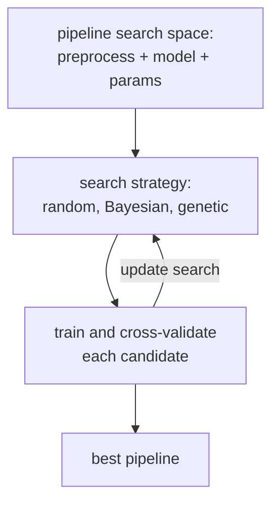

**AutoML** is the family of systems that automate the messy parts of
classical ML: feature engineering, model selection, hyperparameter tuning,
and ensembling. The good ones produce results competitive with expert
hand-tuning on tabular data, with no expert in the loop. The not-so-good
ones over-promise on automation while requiring expert hand-holding anyway.

## The search problem

AutoML systems search a **pipeline space**: combinations of preprocessing
steps (imputation, encoding, scaling), feature engineering (polynomial
features, target encoding, embeddings), model class (linear, tree,
boosting), and per-component hyperparameters. The space is enormous (often
exponential in the number of choices), so search efficiency matters.

Three search strategies dominate:

- **Random search**: surprisingly hard to beat, especially as a baseline.
- **Bayesian optimization (BO)**: model the objective with a Gaussian process
  or tree-based surrogate (TPE), pick promising configurations via expected
  improvement. The A3 lesson on BO is the foundation.
- **Evolutionary / genetic**: TPOT mutates and crossbreeds pipelines.

Successful systems combine these (e.g. BO over the high-level pipeline,
random search over fine hyperparameters), early-stop bad runs (Hyperband),
and meta-learn from previous datasets (warm-start with configurations that
worked on similar tasks).

## Major flavors

- **`auto-sklearn`** (Bayesian + meta-learning + ensembling). Open source,
  scikit-learn ecosystem.
- **TPOT** (genetic programming over scikit-learn pipelines).
- **H2O AutoML** (random forest + GLM + GBM + deep learning stacking).
- **LightAutoML, AutoGluon** (focus on tabular, automatic stacking).
- **Vertex AI AutoML, AWS SageMaker Autopilot, Azure AutoML** (managed
  cloud).
- **Neural Architecture Search (NAS)**: AutoML for deep learning
  architectures. Cost (in compute) limits to specific architecture families
  in practice.

## What AutoML does well

- **Tabular structured data**: AutoGluon, H2O, and others often match or beat
  expert pipelines.
- **Routine baseline jobs**: pick a target, point the AutoML, get a
  reasonable model.
- **Hyperparameter tuning**: BO and Hyperband consistently outperform manual
  grid search.

## What it does poorly

- **Heavy feature engineering** needing domain knowledge. AutoML cannot
  invent the right ratio of two features unless the search space includes
  it explicitly.
- **Distribution shift** and **calibration** in production. AutoML optimizes
  for held-out accuracy on the given data; it does not anticipate
  distribution change.
- **Causal questions** and **interpretability**. AutoML cares about
  predictive accuracy, not why something works.
- **Custom losses, custom constraints**. Off-the-shelf AutoML loss menus are
  narrow.

## Practical guidance

- Run an AutoML system **early** as a baseline to know what is achievable
  with no effort. Beat it later with hand-tuned features.
- Set a time/compute budget. AutoML scales spending with budget; you can
  spend a lot and get little extra accuracy.
- Inspect the resulting pipeline before deploying. AutoML can pick exotic
  preprocessing or ensembles that are hard to maintain.
- Hold out a **separate test set** the AutoML never sees, to estimate
  generalization honestly.



## Check it on arrays

The core of AutoML is BO over configurations. A skeleton, scaled down:

```python
import numpy as np

rng = np.random.default_rng(0)

# Synthetic dataset
n, d = 800, 5
X = rng.normal(size=(n, d))
y = ((X[:, 0] + X[:, 1] > 0) ^ (X[:, 2] > 0.5)).astype(int)

# Validation split
idx = rng.permutation(n); tr, va = idx[:600], idx[600:]
Xtr, ytr = X[tr], y[tr]; Xva, yva = X[va], y[va]

# Search space: 2D configuration of (k for k-NN, C for logistic)
# Objective: validation accuracy of a small ensemble of (k-NN, logistic)

def knn_acc(k):
    d = np.sqrt(((Xva[:, None] - Xtr[None, :])**2).sum(axis=2))
    nn = np.argsort(d, axis=1)[:, :k]
    pred = (ytr[nn].mean(axis=1) > 0.5).astype(int)
    return np.mean(pred == yva)

def logistic_acc(C, n_iter=200):
    X1 = np.column_stack([np.ones(len(Xtr)), Xtr])
    beta = np.zeros(X1.shape[1])
    lam = 1 / C
    for _ in range(n_iter):
        p = 1 / (1 + np.exp(-X1 @ beta))
        beta += 0.1 * (X1.T @ (ytr - p) / len(ytr) - lam * beta)
    Xv1 = np.column_stack([np.ones(len(Xva)), Xva])
    return np.mean((1 / (1 + np.exp(-Xv1 @ beta)) > 0.5) == yva)

def eval_config(k, C):
    return 0.5 * (knn_acc(k) + logistic_acc(C))

# Random search baseline
candidates_k = [3, 5, 7, 11, 15, 21, 31, 51, 71, 101]
candidates_C = [0.01, 0.1, 1.0, 10.0, 100.0]
results = []
for _ in range(15):
    k = int(rng.choice(candidates_k))
    C = float(rng.choice(candidates_C))
    results.append((k, C, eval_config(k, C)))
best = max(results, key=lambda r: r[2])
print(f"random search best: k={best[0]}, C={best[1]}, acc={best[2]:.3f}")

# A tiny "BO": after a few random points, try configurations near the best
random_init = results[:6]
best_idx = int(np.argmax([r[2] for r in random_init]))
k_best, C_best = random_init[best_idx][0], random_init[best_idx][1]
# Explore neighbors
neighbors = [(k, C) for k in [max(1, k_best - 2), k_best, k_best + 2] for C in [C_best * 0.5, C_best, C_best * 2]]
neighbor_results = [(k, C, eval_config(k, C)) for k, C in neighbors]
best_neighbor = max(neighbor_results, key=lambda r: r[2])
print(f"local search around best init: k={best_neighbor[0]}, C={best_neighbor[1]}, "
      f"acc={best_neighbor[2]:.3f}")
```

The random search produces a respectable result; the local search around the
best initial point refines it modestly. Real AutoML systems do this at scale
across pipeline spaces with hundreds of dimensions. This closes the C7
ensembles track; the next subsection turns to recommendation systems.
