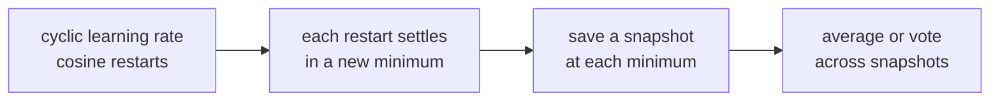

Stacking is powerful but expensive. **Snapshot ensembles** and **voting**
are cheap shortcuts that capture much of the benefit: get multiple models
nearly for free, then combine their predictions with simple averaging or
voting.

## Snapshot ensembles

Train one model but save many checkpoints during training. With a cyclic
learning-rate schedule (cosine annealing with restarts is standard), each
restart converges to a different local minimum. Saving the model at each
minimum produces a sequence of **diverse** snapshots, each one a usable
model. Average their predictions at inference.

The catch versus a true ensemble of independently trained models:
snapshots from one training run are more correlated than fully independent
trainings, so the variance reduction is smaller. But the *cost* is one
training run instead of many.

Used heavily in deep learning competitions where each training run is
expensive.

## Hard voting

For classification, **hard voting** picks the class that the majority of
models predict:

$$
\hat y = \arg\max_c \sum_m \mathbf{1}[\hat y_m = c].
$$

Simple, robust, no probability calibration needed. Tied votes can be broken
randomly or by model rank.

## Soft voting

If each base model produces calibrated probabilities $p_m(y \mid x)$,
average them and take the argmax:

$$
\hat y = \arg\max_c \frac{1}{M}\sum_m p_m(c \mid x).
$$

Soft voting uses more information (the probabilities, not just the argmax)
and usually outperforms hard voting when models are well-calibrated.

**Critical caveat**: averaging miscalibrated probabilities is worse than
hard voting. Calibrate first (Platt or isotonic, covered in C10), then
average.

## Rank averaging

When models output scores on different scales (one returns probabilities,
another returns SVM decision values), direct averaging is meaningless.
**Rank averaging** converts each model's scores to ranks, averages the ranks
across models, and uses the average rank as the final score:

$$
\text{rank-avg}(x_i) = \frac{1}{M}\sum_m \text{rank}_m(x_i).
$$

Scale-invariant and robust to outlier scores. Common in classification and
ranking competitions where leaderboard scores are AUC or NDCG.

## Weighted voting

If you know some models are better than others, weight the votes by
held-out performance:

$$
\hat y = \arg\max_c \sum_m w_m\, p_m(c \mid x), \quad w_m \propto \text{val accuracy}_m.
$$

A poor man's stacking: cheaper, and surprisingly hard to beat with a
trained meta-learner unless you have a lot of validation data.

## When to use each

- **Snapshot ensemble**: one expensive training run, want some ensembling
  benefit. Deep learning training.
- **Hard voting**: classifiers with uncalibrated outputs, or robustness
  matters more than accuracy.
- **Soft voting**: calibrated probabilistic classifiers, want to combine
  multiple uncertainty estimates.
- **Rank averaging**: heterogeneous model outputs on different scales,
  ranking metrics.
- **Stacking (previous lesson)**: have enough validation data and want
  squeeze the last bit of accuracy.



## Check it on arrays

```python
import numpy as np

rng = np.random.default_rng(0)

# Synthetic problem with 3 base models of different qualities
n_test = 500
y_true = rng.integers(0, 2, size=n_test)

# Each base model is the truth corrupted with model-specific noise
def make_model_preds(y_true, accuracy, rng):
    p_correct = accuracy
    p = np.where(y_true == 1,
                 rng.uniform(0.55, 0.95, size=n_test),
                 rng.uniform(0.05, 0.45, size=n_test))
    # Flip some labels
    flip = rng.random(n_test) > p_correct
    pred = (p > 0.5).astype(int)
    p_used = np.where(flip, 1 - p, p)
    return p_used, np.where(flip, 1 - pred, pred)

p1, h1 = make_model_preds(y_true, 0.78, np.random.default_rng(1))
p2, h2 = make_model_preds(y_true, 0.74, np.random.default_rng(2))
p3, h3 = make_model_preds(y_true, 0.70, np.random.default_rng(3))

print(f"single-model accuracies: {np.mean(h1 == y_true):.3f}, "
      f"{np.mean(h2 == y_true):.3f}, {np.mean(h3 == y_true):.3f}")

# Hard voting
hard_vote = (h1 + h2 + h3 >= 2).astype(int)
print(f"hard vote accuracy:  {np.mean(hard_vote == y_true):.3f}")

# Soft voting
soft_vote = ((p1 + p2 + p3) / 3 > 0.5).astype(int)
print(f"soft vote accuracy:  {np.mean(soft_vote == y_true):.3f}")

# Rank averaging
def to_rank(p): return p.argsort().argsort()
rank_avg = (to_rank(p1) + to_rank(p2) + to_rank(p3)) / (3 * n_test)
rank_pred = (rank_avg > 0.5).astype(int)
print(f"rank-average accuracy: {np.mean(rank_pred == y_true):.3f}")

# Weighted voting by individual accuracy
acc = np.array([np.mean(h1 == y_true), np.mean(h2 == y_true), np.mean(h3 == y_true)])
w = acc / acc.sum()
weighted = (w[0] * p1 + w[1] * p2 + w[2] * p3 > 0.5).astype(int)
print(f"weighted soft vote:   {np.mean(weighted == y_true):.3f}")
```

Both hard and soft voting beat the best single model when the models are
roughly independent. Rank averaging gives similar results without needing
calibrated probabilities. The next lesson hands the model search to an
automatic system: AutoML.
