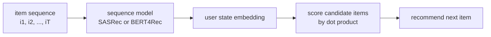

Static MF and two-tower models treat user preferences as essentially
constant. **Sequential recommendation** acknowledges that user interest
evolves: yesterday's clicks tell you more about today's interest than
last year's. Modeling histories as **sequences** and predicting the next
item brings sequence-model architectures (RNNs, Transformers) into
recommendation, and these are the dominant retrieval models in modern
industrial systems.

## The setup

Each user has an interaction sequence $S_u = (i_1, i_2, \dots, i_T)$ in
chronological order. Train a model $f$ that, given the prefix $(i_1, \dots, i_t)$,
predicts the next item $i_{t+1}$. At inference, feed the user's current
history and rank candidates by predicted probability.

The model architecture treats items as tokens, sequences as sentences, and
"next item" as next-token prediction: language modeling with a different
vocabulary.

## SASRec (Self-Attentive Sequential Recommendation)

A Transformer decoder applied to item sequences. Each item is represented by
an embedding (plus a positional embedding). The Transformer's
self-attention learns which previous items in the history are most relevant
for the next prediction.

Training is **next-item prediction**: at each position $t$ in the sequence,
predict $i_{t+1}$ using only $i_1, \dots, i_t$ (causal mask, same as a
language model decoder). Loss is cross-entropy or contrastive with negative
sampling.

SASRec is fast, strong on benchmarks, and remains a standard baseline.

## BERT4Rec

A bidirectional Transformer encoder (like BERT). Training is **masked item
prediction**: randomly mask items in the history and reconstruct them from
both sides. Bidirectional context generally improves representation quality
versus causal SASRec at training, but it loses the streaming-friendly
"next item" objective.

At inference, BERT4Rec usually masks the last position and predicts the
next item from the rest of the sequence.

## Why sequences over static embeddings

- **Trend sensitivity**: a user who watched ten action movies this week is
  in an action mood; static MF averages all watch history equally.
- **Session structure**: clicks within a session share intent; a sequence
  model captures the within-session correlation while a static model does
  not.
- **Cold-start for new users**: even a 5-item history under a sequence
  model gives a richer signal than treating those 5 items as an unordered
  bag.

## Retrieval with sequence models

The sequence model produces a single embedding for the current user state
(the final position's hidden vector). Item embeddings are computed by the
same model or a separate item tower. Retrieval is still dot-product over
the item index, so ANN search is unchanged. The user encoder is just more
sophisticated than a simple lookup.

## Production realities

- **Truncate** the history to recent N items (typically 50-200). Old
  history rarely helps and balloons compute.
- **Pad** short sequences with a special padding token.
- **Position encoding** matters: absolute, relative, and rotary positions
  all see use.
- **Multi-task heads**: predict next click, next dwell, next purchase
  simultaneously, sharing the encoder.
- **Real-time inference** is a constraint: minor architecture changes can
  break latency budgets. SASRec's causal attention is friendlier than
  BERT4Rec for streaming because new items append to the sequence.

## Limits

- **Cold-start items**: a brand-new item has no embedding. Either backfill
  with content features or use a fallback ranker.
- **Long histories**: the attention's quadratic cost in sequence length
  motivates linear-attention variants (Performer, Linformer) for very long
  user histories.
- **Evaluation pitfalls**: leakage from time-randomized splits inflates
  metrics. Always evaluate with **time-respecting splits** (train on past,
  test on future).



## Check it on arrays

A minimal SASRec-like next-item predictor: linear attention over the item
embeddings of the user's history, predict next item.

```python
import numpy as np

rng = np.random.default_rng(0)

n_items, k = 50, 8
n_users, T = 100, 20

# Generate synthetic histories with autoregressive structure
items_emb_true = rng.normal(size=(n_items, k))
def gen_history(rng, T):
    s = [int(rng.integers(0, n_items))]
    for _ in range(T - 1):
        ctx = np.mean([items_emb_true[i] for i in s[-5:]], axis=0)
        logits = items_emb_true @ ctx
        s.append(int(np.argmax(logits + 0.5 * rng.normal(size=n_items))))
    return s

histories = [gen_history(rng, T + 1) for _ in range(n_users)]

# Train a linear next-item predictor: encode history as mean of recent embeddings, predict next
def train_seq_rec(histories, emb_dim=8, lr=0.1, epochs=2000, n_neg=4):
    item_emb = rng.normal(scale=0.1, size=(n_items, emb_dim))
    for _ in range(epochs):
        u = rng.integers(0, len(histories))
        seq = histories[u]
        t = rng.integers(1, len(seq))
        history = seq[max(0, t - 5):t]
        target = seq[t]
        ctx = item_emb[history].mean(axis=0)
        # Sample negatives
        negs = rng.choice(n_items, size=n_neg, replace=False)
        # Softmax loss over (target, negs)
        candidates = [target] + list(negs)
        logits = item_emb[candidates] @ ctx
        logits -= logits.max()
        p = np.exp(logits); p /= p.sum()
        delta = p.copy(); delta[0] -= 1                  # target = 0
        for idx, c in enumerate(candidates):
            item_emb[c] -= lr * delta[idx] * ctx
    return item_emb

item_emb_learned = train_seq_rec(histories, emb_dim=8)

# Evaluate hit@5: for each held-out next-item prediction, is the true item in the top 5?
hits = 0; total = 0
for seq in histories:
    history = seq[-6:-1]                              # use last 5 items
    true_next = seq[-1]
    ctx = item_emb_learned[history].mean(axis=0)
    scores = item_emb_learned @ ctx
    top5 = np.argsort(-scores)[:5]
    if true_next in top5: hits += 1
    total += 1
print(f"hit@5 on next-item prediction: {hits / total:.3f}  (random would be 5/{n_items}={5/n_items:.3f})")
```

The simple sequence-based predictor beats random by a clear margin and
illustrates the pattern: encode the history into a single vector, score
candidates by dot product, train against sampled negatives. This closes the
C8 recommendation track; the next subsection covers the data-structure side:
approximate nearest neighbor search that makes all of this serve at scale.
