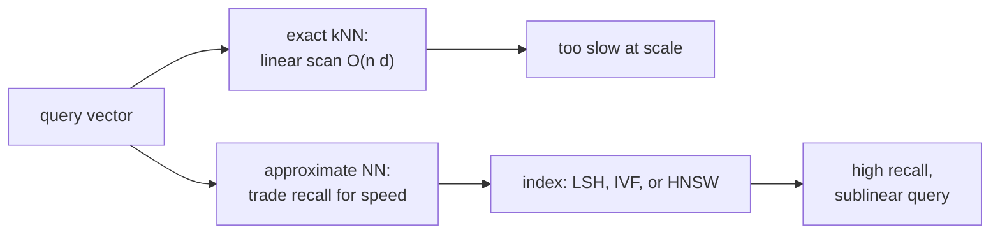

A two-tower retrieval system maps every item in a catalog to a vector
embedding and serves a user query by finding the items whose embeddings
are closest to the user's. With billions of items, this nearest-neighbor
search must be sub-millisecond. Exact nearest-neighbor search is
impossible at that scale; **approximate nearest neighbor (ANN)** is the
art of trading a small amount of recall for orders-of-magnitude speedup<FN n="1" />.

## The exact problem

Given a database of $n$ vectors $\{x_1, \dots, x_n\} \subset \mathbb{R}^d$
and a query $q \in \mathbb{R}^d$, find the $k$ vectors with smallest
$d(q, x_i)$ (typically Euclidean or cosine).

The naive linear scan is $O(nd)$ per query. For $n = 10^9$ and $d = 128$,
each query touches $1.28 \times 10^{11}$ floats. Even at memory bandwidth
of 100 GB/s, that is over a second per query: untenable for any
interactive system.

## Why exact is infeasible at scale

Three obstacles:

- **Linear in $n$**: every query scans every vector. Doubling the catalog
  doubles query latency.
- **High dimensionality**: tree-based exact methods (k-d tree, ball tree)
  degenerate to linear scan beyond ~20 dimensions.
- **Memory bandwidth**: even reading every vector once costs $O(nd)$ memory
  bandwidth, the bottleneck modern CPUs cannot avoid.

The curse of dimensionality (C4) is the root cause: in high dimensions,
the gap between the nearest and farthest neighbors shrinks, so any
partition scheme has to look at most points to confirm the nearest.

## The approximate version

Approximate nearest neighbor relaxes the problem: return $k$ vectors that
are *probably* among the true nearest, possibly missing some.

The standard quality metric is **recall@k**:

$$
\text{recall@}k = \frac{|\text{ANN top-}k \cap \text{true top-}k|}{k}.
$$

Production targets are typically 95-99% recall@10. Going from 99% to
99.9% often costs 10x more compute; the cliff is steep at the high end.

The cost metric is **queries per second (QPS)** at a target recall, often
plotted as a recall-QPS Pareto curve. Different indices dominate at
different points on the curve<FN n="2" />.

## Two algorithmic families

The C9 lessons cover the two dominant families.

**Hashing methods (next lesson)**. Hash points so that similar items
collide in the same bucket. Query: hash the query, return bucket contents.
Memory-light, conceptually simple, but recall lags graph methods at high
accuracy.

**Tree / inverted-index methods**. Partition the space hierarchically
(IVF) or compress vectors (product quantization, PQ) so that distances can
be evaluated cheaply. IVF + PQ scales to billions of vectors at modest
memory cost.

**Graph methods (HNSW)**. Build a navigable graph over the dataset;
greedy search finds nearest neighbors in $O(\log n)$ steps. Best
recall-QPS Pareto curve at moderate scale; memory-heavy.

In practice, libraries (FAISS, ScaNN, hnswlib) implement all of these and
let you pick by workload.

## The dot-product version

Most modern retrieval scores by **maximum inner product** instead of
minimum distance. For unit-norm vectors, the two are equivalent (up to
sign); for non-normalized vectors, they differ. ANN indices designed for
inner-product search (MIPS, **maximum inner product search**) include
direct adaptations of all three families.

The two-tower lesson hinted at this: training with cosine or dot-product
makes the ANN problem at serving time tractable.



## Check it on arrays

This gives a sense of the scale at which exact search breaks down.

```python
import numpy as np
import time

rng = np.random.default_rng(0)

d = 64

def exact_knn(X, q, k=10):
    d = np.sqrt(((X - q)**2).sum(axis=1))
    return np.argsort(d)[:k]

# Time exact search as the database grows. Capped at 10^5 to fit comfortably
# in a Pyodide WebAssembly heap; the linear-in-n trend is already visible at
# this scale and lets you extrapolate to billions.
print(f"{'n':>10}  {'time/query (ms)':>15}")
for n in [10**3, 10**4, 10**5]:
    X = rng.normal(size=(n, d)).astype(np.float32)
    q = rng.normal(size=d).astype(np.float32)
    t = time.perf_counter()
    for _ in range(20):
        exact_knn(X, q, k=10)
    elapsed = (time.perf_counter() - t) / 20 * 1000
    print(f"{n:>10}  {elapsed:>15.2f}")

# Recall@10 of a trivial ANN: hash to 64-bit signature, look up bucket
def hyperplane_hash(X, normals):
    return (X @ normals.T > 0).astype(np.uint8)

n = 100_000
X = rng.normal(size=(n, d))
queries = rng.normal(size=(100, d))

n_hashes = 16
normals = rng.normal(size=(n_hashes, d))
H = hyperplane_hash(X, normals)
Hq = hyperplane_hash(queries, normals)

# For each query, restrict the search to points with matching hash on >= 12 bits
ann_recall_at_10 = []
for i, q in enumerate(queries):
    matches = np.sum(H == Hq[i], axis=1) >= 12
    if matches.sum() < 10: continue
    cand_idx = np.where(matches)[0]
    d2 = ((X[cand_idx] - q)**2).sum(axis=1)
    ann_top10 = cand_idx[np.argsort(d2)[:10]]
    true_top10 = exact_knn(X, q, k=10)
    ann_recall_at_10.append(len(set(ann_top10) & set(true_top10)) / 10)
print(f"\ntrivial-LSH mean recall@10: {np.mean(ann_recall_at_10):.3f}  "
      f"(rough first-try ANN)")
```

Exact search becomes slow even at $n = 10^6$; the trivial random-hyperplane
LSH already gives meaningful recall.

## Exercises

**Exercise 1.** An exact linear scan over $n = 2 \times 10^8$ vectors of
dimension $d = 96$ stored as 4-byte floats reads every vector once per query.
At a memory bandwidth of $80$ GB/s, how long does a single query take, and how
many queries per second can one machine sustain if it is bandwidth-bound?

<details>
<summary>Solution</summary>

**Step 1.** Bytes touched per query is $n \cdot d \cdot 4 = 2 \times 10^8 \cdot
96 \cdot 4 = 7.68 \times 10^{10}$ bytes, about $76.8$ GB.

**Step 2.** Time per query is bytes divided by bandwidth:

$$
t = \frac{7.68 \times 10^{10}}{80 \times 10^{9}} = 0.96 \text{ s}.
$$

**Step 3.** Throughput is the reciprocal: about $1/0.96 \approx 1.04$ queries
per second. Roughly one query per second on a whole machine is why exact scan
is untenable for interactive retrieval, and why ANN trades a little recall for
orders of magnitude more throughput.

</details>

**Exercise 2.** A retrieval system returns recall@10 of $0.9$. A second system
returns the same ten slots but reorders them so the single missed true neighbor
is replaced by a different non-neighbor. What is the new recall@10? Explain why
recall@k is insensitive to the ordering inside the returned set.

<details>
<summary>Solution</summary>

**Step 1.** Recall@10 is the size of the intersection of the returned top-10
with the true top-10, divided by $10$. At $0.9$ the returned set contains $9$ of
the true neighbors.

**Step 2.** Swapping one non-neighbor for a different non-neighbor leaves the
intersection at $9$ true neighbors, so recall@10 stays $9/10 = 0.9$.

**Step 3.** The numerator counts set membership, not rank. Any permutation of
the same ten returned items gives the same intersection, so recall@k measures
which items are retrieved, not how they are ordered. Ranking quality inside the
set needs a rank-aware metric (for example nDCG), not recall.

</details>

**Exercise 3 (code).** Take $n = 50{,}000$ Gaussian vectors in $d = 32$ and a
16-bit random-hyperplane signature. For agreement thresholds $10$, $12$, and
$14$ bits, restrict each query to points whose signature agrees on at least that
many bits, then rank that candidate set by exact distance. Confirm that a
stricter threshold shrinks the candidate fraction (and, with it, recall).

<details>
<summary>Solution</summary>

```python
import numpy as np

rng = np.random.default_rng(0)
n, d = 50_000, 32
X = rng.normal(size=(n, d))
queries = rng.normal(size=(200, d))

def exact_knn(X, q, k=10):
    return np.argsort(((X - q)**2).sum(axis=1))[:k]

def hyperplane_sig(V, normals):
    return (V @ normals.T > 0).astype(np.uint8)

normals = rng.normal(size=(16, d))
H = hyperplane_sig(X, normals)
Hq = hyperplane_sig(queries, normals)

prev_frac = None
for t in [10, 12, 14]:
    recalls, fracs = [], []
    for i, q in enumerate(queries):
        agree = (H == Hq[i]).sum(axis=1)
        cand = np.where(agree >= t)[0]
        fracs.append(len(cand) / n)
        if len(cand) < 10:
            continue
        d2 = ((X[cand] - q)**2).sum(axis=1)
        ann = cand[np.argsort(d2)[:10]]
        truth = exact_knn(X, q, 10)
        recalls.append(len(set(ann.tolist()) & set(truth.tolist())) / 10)
    mf = float(np.mean(fracs))
    print(f"thr>={t}: recall@10={np.mean(recalls):.3f}  cand frac={mf:.4f}")
    if prev_frac is not None:
        assert mf < prev_frac            # stricter threshold => smaller candidate set
    prev_frac = mf
```

Raising the threshold from $10$ to $14$ bits drops the candidate fraction from
about $0.24$ to about $0.004$, and recall@10 falls from about $0.82$ to about
$0.10$. This is the recall-cost trade at the heart of ANN: a smaller candidate
set is cheaper to scan but more likely to miss a true neighbor.

</details>

The next lesson covers LSH carefully.

<Footnotes>
  <FNItem n="1">**Indyk, P., & Motwani, R.** (1998). "Approximate nearest neighbors: towards removing the curse of dimensionality". *STOC*. [doi:10.1145/276698.276876](https://doi.org/10.1145/276698.276876). Formalized the ANN problem and its escape from the curse of dimensionality.</FNItem>
  <FNItem n="2">**Aumüller, M., Bernhardsson, E., & Faithfull, A.** (2020). "ANN-Benchmarks: a benchmarking tool for approximate nearest neighbor algorithms". *Information Systems*, 87, 101374. [doi:10.1016/j.is.2019.02.006](https://doi.org/10.1016/j.is.2019.02.006). The standard recall-QPS Pareto comparison across indices.</FNItem>
</Footnotes>
