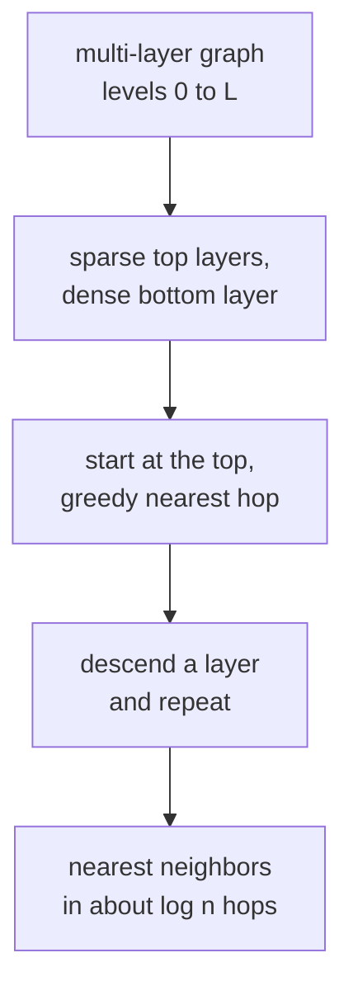

**HNSW** (Hierarchical Navigable Small World, Malkov & Yashunin 2016) is
the graph-based ANN index that dominates the recall-QPS curve at moderate
to large scale. The idea: build a multi-layer graph where each upper layer
is a sparse "express lane" to long-range neighbors, and lower layers
refine. A greedy traversal from the top reaches near-optimal neighbors in
$O(\log n)$ steps<FN n="1" />.

## Small-world graphs

A **small-world graph** combines two kinds of edges:

- **Short-range**: connects each node to its local neighbors. Lots of
  edges, low average degree, no long jumps.
- **Long-range**: a few edges per node to far-away points. Few edges, but
  they make any pair of nodes reachable in a small number of hops.

The combination has the property of social networks: high local
clustering plus six-degrees-of-separation diameter. Greedy navigation
("at each hop, go to the neighbor closest to the target") works well in
these structures.

## Hierarchical layers

HNSW stacks small-world graphs in layers. Each node is assigned a level
$\ell$ drawn from a geometric distribution with parameter $1/\log(M)$ for
some constant $M$. A node lives in every layer from 0 up to $\ell$. Each
layer has fewer nodes than the one below: roughly $n_0 = n$ at the bottom,
$n_1 = n_0/M$, $n_2 = n_1/M$, and so on. The top layer has $O(1)$ nodes.

Each layer is a small-world graph: each node connects to its $M$ nearest
neighbors *at that layer*.

## Search

Start at the entry point in the **top** layer. At each layer:

1. Greedy walk: from the current node, move to the neighbor closest to
   the query; repeat until no neighbor is closer.
2. Drop to the next layer, using the current best as the entry point.

Continue until the bottom layer. Return the top-$k$ neighbors found.

The top-layer walk takes a few hops to reach the right region; each
subsequent layer refines locally. Total search cost is $O(\log n)$
hops, each of which is an $M$-way distance computation.

For higher recall, run the bottom-layer search with a beam: keep a
priority queue of `ef_search` candidates instead of just the best. Larger
`ef_search` boosts recall.

## Construction

To insert a new node $x$:

1. Sample its level $\ell$.
2. Starting from the top, greedy-search down to layer $\ell + 1$ to find
   a good entry point.
3. At each layer from $\ell$ down to 0, run a beam search with
   `ef_construction` candidates; connect $x$ to the $M$ best.
4. If the new connections exceed any existing neighbor's degree budget
   $M$, prune that neighbor's worst edge.

Construction is $O(n \log n)$ in distance evaluations. The result is a
single static index; HNSW supports incremental insert but not delete
(deletes are handled by tombstones with periodic rebuild).

## Trade-offs

| Knob | Effect |
|---|---|
| $M$ (neighbors per node, default 16) | More edges = higher recall and memory |
| `ef_construction` (default 100-200) | More expensive build, higher index quality |
| `ef_search` | Higher recall per query, slower query |

Memory: each node stores up to $M$ edges per layer; total ~$2 M$ pointers
per node. For $M = 16$ and $n = 10^9$, memory budget is $\sim$200 GB,
which is large. Quantized variants (HNSW + PQ) cut this.

## Recall-QPS dominance

HNSW dominates the recall-QPS Pareto curve at moderate to large scale
(typically up to a few hundred million vectors). Above that, memory
constraints make IVF-PQ more practical.

## Limits

- **Memory**: $M$ edges per node × $n$ nodes is heavy.
- **No principled hyperparameter selection**: $M$ and `ef_construction`
  are tuned empirically.
- **No exact recall guarantees**.

In production, FAISS, hnswlib, ScaNN, and managed vector DBs all expose
HNSW or HNSW + quantization. The next lesson surveys what the major
vector DBs do.



## Check it on arrays

A toy HNSW with a single layer (greedy search on a small-world graph). The
hierarchical structure improves logarithmically but is the same idea.

```python
import numpy as np

rng = np.random.default_rng(0)

n, d, M = 5000, 32, 16
X = rng.normal(size=(n, d))
queries = rng.normal(size=(50, d))

# Build a "small-world" graph: connect each node to its M nearest neighbors
def build_graph(X, M):
    n = len(X)
    edges = [[] for _ in range(n)]
    for i in range(n):
        d2 = ((X - X[i])**2).sum(axis=1)
        d2[i] = np.inf
        neighbors = np.argsort(d2)[:M]
        edges[i].extend(neighbors.tolist())
    return edges

edges = build_graph(X, M)

# Greedy beam search: keep the top-`ef` best-so-far candidates; stop when no
# neighbor of any frontier node is closer than the worst kept candidate.
# Crucially, the loop terminates instead of visiting every reachable node.
def greedy_search(query, edges, X, k=10, ef=100, n_starts=5, rng=rng):
    starts = rng.choice(len(X), size=n_starts, replace=False)
    visited = set(int(s) for s in starts)
    # Top-ef best (distance, node) seen so far, ascending by distance
    best = sorted((np.sum((X[s] - query)**2), int(s)) for s in starts)
    # Frontier of nodes whose neighbors are worth expanding
    frontier = list(best)
    while frontier:
        frontier.sort()
        d2_curr, node = frontier.pop(0)
        # Stop expanding if the current frontier node is farther than the worst
        # kept candidate, i.e. no improvement is possible from here.
        if len(best) >= ef and d2_curr > best[-1][0]:
            break
        for nb in edges[node]:
            if nb in visited: continue
            visited.add(nb)
            d2 = np.sum((X[nb] - query)**2)
            # Only push into best (and the frontier) if it improves the top-ef.
            if len(best) < ef or d2 < best[-1][0]:
                best.append((d2, nb)); best.sort(); best = best[:ef]
                frontier.append((d2, nb))
    return [n for _, n in best[:k]]

# Recall@10
def true_knn(q, k=10):
    return np.argsort(((X - q)**2).sum(axis=1))[:k].tolist()

# Measure both recall and how many nodes the search actually visits
# (compared to the brute-force n=5000).
def greedy_search_counted(query, edges, X, k=10, ef=100, n_starts=5, rng=rng):
    starts = rng.choice(len(X), size=n_starts, replace=False)
    visited = set(int(s) for s in starts)
    best = sorted((np.sum((X[s] - query)**2), int(s)) for s in starts)
    frontier = list(best)
    while frontier:
        frontier.sort()
        d2_curr, node = frontier.pop(0)
        if len(best) >= ef and d2_curr > best[-1][0]: break
        for nb in edges[node]:
            if nb in visited: continue
            visited.add(nb)
            d2 = np.sum((X[nb] - query)**2)
            if len(best) < ef or d2 < best[-1][0]:
                best.append((d2, nb)); best.sort(); best = best[:ef]
                frontier.append((d2, nb))
    return [n for _, n in best[:k]], len(visited)

recalls, visits = [], []
for q in queries:
    nn, v = greedy_search_counted(q, edges, X, k=10, ef=100)
    truth = set(true_knn(q, 10))
    recalls.append(len(set(nn) & truth) / 10)
    visits.append(v)
print(f"toy small-world graph recall@10: {np.mean(recalls):.3f}")
print(f"avg nodes visited per query: {np.mean(visits):.0f} / {len(X)} "
      f"(brute force would touch all {len(X)})")
```

The single-layer small-world graph reaches ~88% recall@10 while visiting
roughly 16% of the database, sub-linear in n. HNSW's layered structure
adds logarithmic-time top-down navigation that pushes this further at
scale. The next lesson surveys the production vector databases that wrap
these algorithms.

<Footnotes>
  <FNItem n="1">**Malkov, Y. A., & Yashunin, D. A.** (2018). "Efficient and robust approximate nearest neighbor search using hierarchical navigable small world graphs". *IEEE TPAMI*, 42(4), 824-836. [arXiv:1603.09320](https://arxiv.org/abs/1603.09320). The HNSW index, its layer construction, and greedy search.</FNItem>
</Footnotes>
