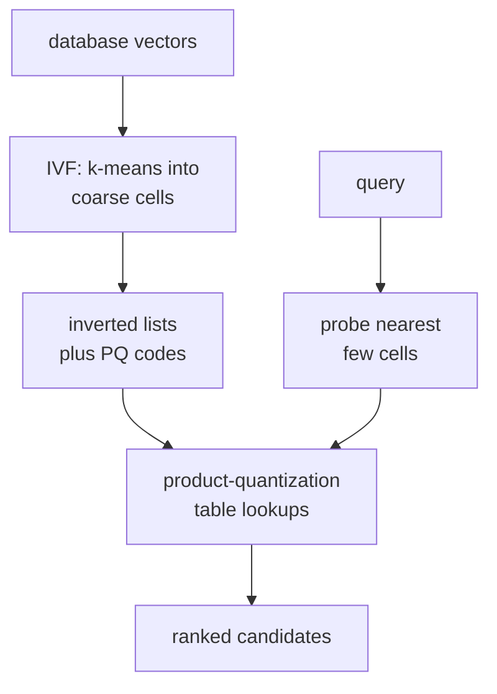

For billion-vector scale, LSH and graph methods get memory-bound. **IVF
(inverted file index)** + **PQ (product quantization)** is the family that
serves the largest real-world ANN indices: Facebook's FAISS production
deployments, Google's ScaNN. The trick is two-stage: first partition the
space into clusters, then compress vectors within each cluster.

## IVF: coarse partition with k-means

Run k-means with $K$ centroids (typically $K = \sqrt n$). Each database
vector is stored in the inverted list of its nearest centroid. At query
time:

1. Find the $\texttt{nprobe}$ centroids nearest to the query (a small
   exact NN search over $K$ centroids).
2. Search exhaustively within the $\texttt{nprobe}$ inverted lists.

If centroids are uniformly distributed and `nprobe` is small, the search
touches only $n \cdot \texttt{nprobe}/K$ vectors instead of $n$. Higher
`nprobe` boosts recall at the cost of more distance computations.

This is the **inverted-index** part: a list per centroid, queried by
proximity to the centroid.

## PQ: product quantization compression

Naive IVF still stores full vectors and computes full distances against
them. **Product quantization** compresses each vector into a short
codebook lookup<FN n="1" />.

Split each $d$-dimensional vector into $m$ sub-vectors of length $d/m$.
Train a separate k-means codebook of $K_s$ centroids ($K_s = 256$ is
standard) on each sub-vector. A vector is represented by $m$ bytes:
the centroid index for each sub-vector.

At query time, precompute the distance from each query sub-vector to all
$K_s$ centroids of that sub-codebook (a $K_s$-entry lookup table per
sub-vector). The distance to a stored vector is the sum of $m$ table
lookups: very fast.

PQ achieves $d/m$ bytes per vector (versus 4 bytes per float for a raw
$d$-dimensional vector). For $d = 128$, $m = 16$ gives 16 bytes per
vector: 8× compression.

## IVF + PQ together

Combine: IVF for coarse partition, PQ for compressed residual within each
list. At each centroid $c_k$, store residuals $x - c_k$ for vectors
assigned there, compressed with PQ. Query:

1. Find `nprobe` nearest centroids.
2. For each inverted list, precompute the residual-PQ lookup tables.
3. Sum table entries to score every PQ code in the list.

Memory: $m$ bytes per vector + $K m K_s d$ bytes of codebooks. At
$n = 10^9$, $m = 16$: 16 GB for vectors, fits in a single machine's RAM.

## Trade-offs

| Knob | Larger → | Smaller → |
|---|---|---|
| $K$ (centroids) | More precise partition, more centroid distances | Cheaper centroid search, coarser partition |
| `nprobe` | Higher recall, slower query | Lower recall, faster query |
| $m$ (PQ subspaces) | Faster query, more memory per vector | Slower query (more compression), less memory |
| $K_s$ (sub-centroids) | Tighter codebook (default 256) | Coarser quantization |

The recall-QPS curve at billion scale is dominated by IVF-PQ variants
(IVFFlat, IVFPQ, OPQ). FAISS's defaults are good starting points.

## OPQ (optimized product quantization)

PQ's sub-vector split assumes the data is independent across sub-vectors,
which is wrong. **OPQ** prepends an orthogonal rotation $R$ to align the
data with the sub-vector axes, then applies PQ. The rotation is learned
to minimize quantization error. OPQ typically beats PQ on real data with
no extra serving cost (the rotation is applied once per query).

## When IVF-PQ vs HNSW

- **Billion scale and memory matters**: IVF-PQ (compressed) wins on
  memory and is competitive on speed.
- **Tens of millions and high recall**: HNSW (next lesson) dominates the
  recall-QPS Pareto curve.
- **Updates / inserts**: HNSW handles online insert; IVF-PQ requires
  periodic retraining of centroids and codebooks for best quality.

Both are first-class citizens of FAISS<FN n="2" />.



## Check it on arrays

```python
import numpy as np

rng = np.random.default_rng(0)

n, d = 20000, 32
X = rng.normal(size=(n, d)).astype(np.float32)
queries = rng.normal(size=(50, d)).astype(np.float32)

def kmeans_simple(X, k, n_iter=30, rng=rng):
    centers = X[rng.choice(len(X), k, replace=False)].copy()
    for _ in range(n_iter):
        d2 = ((X[:, None] - centers[None, :])**2).sum(axis=2)
        z = d2.argmin(axis=1)
        for j in range(k):
            if (z == j).sum() > 0:
                centers[j] = X[z == j].mean(axis=0)
    d2 = ((X[:, None] - centers[None, :])**2).sum(axis=2)
    return z, centers

# IVF: cluster the database
K = 64
ivf_assign, centroids = kmeans_simple(X, K, n_iter=10)
inverted_lists = {k: np.where(ivf_assign == k)[0] for k in range(K)}

def ivf_search(query, nprobe=4, k=10):
    # find the nprobe nearest centroids
    d2_centroids = ((centroids - query)**2).sum(axis=1)
    probes = np.argsort(d2_centroids)[:nprobe]
    # exhaustive search inside the chosen lists
    candidates = np.concatenate([inverted_lists[p] for p in probes])
    d2 = ((X[candidates] - query)**2).sum(axis=1)
    return candidates[np.argsort(d2)[:k]]

# Recall@10 vs nprobe
def true_knn(q, k=10):
    return np.argsort(((X - q)**2).sum(axis=1))[:k]

print(f"{'nprobe':>8}  {'recall@10':>10}  {'fraction of vectors visited':>30}")
for nprobe in [1, 2, 4, 8, 16]:
    recalls = []
    visited_fracs = []
    for q in queries:
        ann = set(ivf_search(q, nprobe=nprobe, k=10).tolist())
        truth = set(true_knn(q, k=10).tolist())
        recalls.append(len(ann & truth) / 10)
        visited_fracs.append(sum(len(inverted_lists[p]) for p in np.argsort(((centroids - q)**2).sum(axis=1))[:nprobe]) / n)
    print(f"{nprobe:>8}  {np.mean(recalls):>10.3f}  {np.mean(visited_fracs):>30.3f}")
```

Increasing `nprobe` raises recall while visiting a small fraction of the
database.

## Exercises

**Exercise 1.** An IVF index holds $n = 10^9$ vectors with $K = \sqrt{n}$
centroids, and the vectors are spread evenly across the inverted lists. With
`nprobe` $= 8$, how many vectors does a query scan, and what fraction of the
database is that? Why does this fraction stay tiny as $n$ grows?

<details>
<summary>Solution</summary>

**Step 1.** With $K = \sqrt{n}$ even lists, each list holds $n/K = \sqrt{n}$
vectors. Here $\sqrt{n} = \sqrt{10^9} \approx 31{,}623$ per list.

**Step 2.** Probing $8$ lists scans about $8 \cdot \sqrt{n} = 8 \cdot 31{,}623
\approx 2.53 \times 10^5$ vectors, plus the $K \approx 31{,}623$ centroid
distances for the coarse search.

**Step 3.** The scanned fraction is $8\sqrt{n}/n = 8/\sqrt{n} \approx 2.5 \times
10^{-4}$, about $0.025\%$. Because the fraction is $\texttt{nprobe}/\sqrt{n}$, it
shrinks as $n$ grows: the same `nprobe` touches a smaller share of a bigger
database, which is how IVF stays sublinear at billion scale.

</details>

**Exercise 2.** A raw vector has $d = 128$ float32 entries. A PQ code uses
$m = 16$ subspaces with $K_s = 256$ centroids each. Give the bytes per code, the
compression ratio versus the raw vector, and the bits per subspace index.

<details>
<summary>Solution</summary>

**Step 1.** Each subspace index selects one of $K_s = 256$ centroids, which needs
$\log_2 256 = 8$ bits, exactly one byte. With $m = 16$ subspaces a code is
$16$ bytes.

**Step 2.** The raw vector is $128 \cdot 4 = 512$ bytes. The compression ratio is
$512 / 16 = 32\times$. (The $8\times$ figure in the lesson used $m = 16$ on a raw
size counted as $d = 128$ bytes; against the full $512$-byte float32 vector the
ratio is $32\times$.)

**Step 3.** The codebooks themselves cost $m \cdot K_s \cdot (d/m) \cdot 4 =
16 \cdot 256 \cdot 8 \cdot 4 = 131{,}072$ bytes, a fixed overhead amortized over
all $n$ codes, so per-vector storage approaches the $16$-byte code as $n$ grows.

</details>

**Exercise 3 (code).** Implement product quantization directly: train one
k-means codebook per subspace, encode the database as subspace indices, and
score queries with the asymmetric distance (ADC) lookup tables. Confirm the
$16$-byte-style codes still recover a meaningful share of the exact top-10 and
that the code is far smaller than the raw vector.

<details>
<summary>Solution</summary>

```python
import numpy as np

rng = np.random.default_rng(0)
n, d = 10_000, 32
m, Ks = 8, 64                 # 8 subspaces, 64 centroids each
sub = d // m
X = rng.normal(size=(n, d)).astype(np.float32)

def kmeans(Xs, k, n_iter=15, rng=rng):
    centers = Xs[rng.choice(len(Xs), k, replace=False)].copy()
    for _ in range(n_iter):
        z = ((Xs[:, None] - centers[None]) ** 2).sum(2).argmin(1)
        for j in range(k):
            if (z == j).any():
                centers[j] = Xs[z == j].mean(0)
    return centers

codebooks, codes = [], np.empty((n, m), dtype=np.int64)
for s in range(m):
    Xs = X[:, s*sub:(s+1)*sub]
    C = kmeans(Xs, Ks)
    codebooks.append(C)
    codes[:, s] = ((Xs[:, None] - C[None]) ** 2).sum(2).argmin(1)

def adc_dist(q):                                  # sum of per-subspace table lookups
    total = np.zeros(n)
    for s in range(m):
        table = ((codebooks[s] - q[s*sub:(s+1)*sub]) ** 2).sum(1)
        total += table[codes[:, s]]
    return total

queries = rng.normal(size=(30, d)).astype(np.float32)
recalls = []
for q in queries:
    pq_top = set(np.argsort(adc_dist(q))[:10].tolist())
    ex_top = set(np.argsort(((X - q) ** 2).sum(1))[:10].tolist())
    recalls.append(len(pq_top & ex_top) / 10)

print("PQ recall@10:", round(float(np.mean(recalls)), 3))
print("bytes/vector:", m, "vs raw float32:", d * 4)
assert np.mean(recalls) > 0.3        # compressed codes still recover top neighbors
assert m < d * 4                     # the code is much smaller than the raw vector
```

The $8$-byte codes recover about $0.41$ recall@10 against the exact ranking while
using $8$ bytes per vector instead of $128$, a $16\times$ shrink. ADC never
decompresses a stored vector: it sums $m$ precomputed table entries, which is why
billion-scale IVF-PQ fits in a single machine's RAM.

</details>

The next lesson covers the graph-based alternative that often
beats IVF at moderate scale: HNSW.

<Footnotes>
  <FNItem n="1">**Jégou, H., Douze, M., & Schmid, C.** (2011). "Product quantization for nearest neighbor search". *IEEE TPAMI*, 33(1), 117-128. [doi:10.1109/TPAMI.2010.57](https://doi.org/10.1109/TPAMI.2010.57). Introduced product quantization and its lookup-table distance estimates.</FNItem>
  <FNItem n="2">**Johnson, J., Douze, M., & Jégou, H.** (2019). "Billion-scale similarity search with GPUs". *IEEE Transactions on Big Data*, 7(3), 535-547. [arXiv:1702.08734](https://arxiv.org/abs/1702.08734). The FAISS system that ships IVF and IVF-PQ at billion scale.</FNItem>
</Footnotes>
