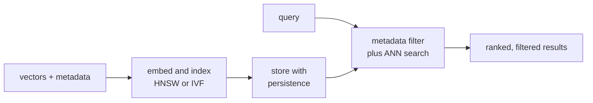

A vector database is the production wrapping of an ANN index: the index
algorithms (HNSW, IVF-PQ) plus persistence, replication, scaling, hybrid
filtering, and integration with the rest of the data stack. Different
products optimize for different points on the cost / recall / latency
curve. The right choice depends on workload, scale, and existing
infrastructure.

## What a vector database adds on top of an ANN library

- **Persistence**: index survives restarts.
- **Replication and sharding**: scale horizontally.
- **Hybrid queries**: combine vector similarity with metadata filters
  ("nearest by embedding, but only among items in category X").
- **Online insert / update / delete**.
- **Operations**: monitoring, backups, multi-tenancy.

A bare ANN library (FAISS, hnswlib) provides only the index core; you
must build the rest yourself.

## FAISS (Facebook AI Similarity Search)

The canonical open-source ANN library. Implements every index family:
flat exhaustive, IVF, IVF-PQ, HNSW, OPQ, IVFADC, etc. Used inside
Facebook's recommendation stack and as the engine behind many vector
DBs<FN n="1" />.

**Strengths**: best-in-class algorithmic coverage, fast, GPU support.
**Limits**: a library, not a service. No persistence, no replication, no
hybrid filtering. You wrap it in your own service layer.

When to use: you have a large team that can build the operational layer
and need the algorithmic flexibility.

## pgvector

A Postgres extension adding a `vector` column type and IVFFlat / HNSW
indices. Embeddings live in the same database as your application data,
so hybrid queries (`SELECT ... WHERE category = 'foo' ORDER BY embedding <-> $query LIMIT 10`)
are trivial SQL. Inherits Postgres replication, transactions, and
operational maturity.

**Strengths**: SQL ergonomics, hybrid queries are first-class,
operational simplicity (it's just Postgres). Excellent default for
small-to-medium catalogs (~1-10M vectors).

**Limits**: scaling above ~100M vectors per shard becomes painful;
specialized vector DBs win at extreme scale.

When to use: you already have Postgres and your vector catalog is in
the millions, not billions.

## Managed vector DBs

Pinecone, Weaviate, Qdrant, Milvus, Vespa, Zilliz Cloud, MongoDB Atlas
Vector Search. Each makes different trade-offs:

- **Pinecone**: serverless, simple API, fully managed. Pricey at scale,
  great for prototypes and small-to-medium production loads.
- **Weaviate**: open source + managed, modules for hybrid search and
  generative integration, schema-driven.
- **Qdrant**: open source, written in Rust, fast, strong payload-
  filtering. Available as managed.
- **Milvus / Zilliz**: high-scale focus, multiple index types per
  collection, distributed by design.
- **Vespa**: hybrid retrieval + ranking system, used at Yahoo / TikTok
  scale. Highest throughput at the cost of operational complexity.

Decision factors: scale, hybrid query requirements, ops budget, latency
target, cost.

## Hybrid retrieval

The "vector + metadata filter" combination matters more than naive ANN.
Two approaches:

- **Pre-filter** then ANN over the filtered subset. Bad for high
  selectivity filters because the index loses most of its efficacy.
- **Post-filter**: ANN over the full set then drop violators. Bad
  recall if the filter is restrictive (most ANN results may be
  filtered out).
- **Integrated**: index structures that incorporate metadata into the
  graph or list traversal (Vespa, Qdrant, Milvus's hybrid). Best
  performance but vendor-specific.

For most workloads, post-filter is fine. For demanding ones, evaluate
the vendor's specific hybrid implementation.

## Throughput vs latency

A single-vector lookup is fast (&lt;10 ms for 100M vectors with HNSW).
Throughput (queries per second per machine) is the operational metric
you measure. Vector DBs usually serve 10^3-10^4 QPS per machine for a
single index. Sharding gets you linear throughput scaling<FN n="2" />.

## Cost model

- **CPU / RAM dominant**: HNSW is memory-bound (~$M$ pointers + vector
  per item). IVF-PQ is compute-bound (table lookups) but lighter on
  RAM.
- **Index build**: HNSW is $O(n \log n)$ to build, expensive for big
  collections. IVF-PQ requires training k-means once, then is fast.
- **Updates**: continuous indexes are HNSW-friendly; daily-batch
  rebuilds are IVF-PQ-friendly.

## Decision tree (rough)

- Tens of thousands of vectors: linear scan or pgvector.
- A few million, mostly read: pgvector with HNSW, or Pinecone for
  managed simplicity.
- Tens to hundreds of millions: Qdrant, Weaviate, Milvus, or
  self-hosted FAISS + HNSW.
- Billions of vectors: FAISS with IVF-PQ on dedicated infra, or
  Vespa-like systems.

The vector DB market is young. Re-evaluate annually.



## Check it on arrays

This is a demo of `pgvector`-style integration: filter first by
metadata, then ANN-rank the survivors. The same pattern is what a vector
DB does internally.

```python
import numpy as np

rng = np.random.default_rng(0)

n, d = 20000, 64
X = rng.normal(size=(n, d))
# Metadata: each item has a category 0-4
categories = rng.integers(0, 5, size=n)

queries = rng.normal(size=(50, d))
query_filter = rng.integers(0, 5, size=50)               # filter each query to one category

# Pre-filter: drop non-matching items, ANN over the rest
def hybrid_search(query, target_category, k=10):
    mask = categories == target_category
    cand_idx = np.where(mask)[0]
    if len(cand_idx) == 0: return np.array([])
    d2 = ((X[cand_idx] - query)**2).sum(axis=1)
    return cand_idx[np.argsort(d2)[:k]]

# Post-filter: do ANN first, then filter
def post_filter_search(query, target_category, k=10, over_fetch=100):
    d2 = ((X - query)**2).sum(axis=1)
    top = np.argsort(d2)[:over_fetch]
    keep = top[categories[top] == target_category]
    return keep[:k]

# Compare: pre-filter is better when category is restrictive; post-filter loses recall
for q_idx in range(5):
    pre = set(hybrid_search(queries[q_idx], query_filter[q_idx], k=10).tolist())
    post = set(post_filter_search(queries[q_idx], query_filter[q_idx], k=10, over_fetch=100).tolist())
    print(f"query {q_idx}: pre-filter found {len(pre)}, post-filter found {len(post)}; "
          f"overlap = {len(pre & post)}")
```

When the filter is selective (here, 1 of 5 categories), pre-filter
recovers more relevant neighbors than post-filter.

## Exercises

**Exercise 1.** A catalog of $5 \times 10^7$ vectors of dimension $d = 768$
(float32) must be served with HNSW at $M = 32$ (store $2M$ 4-byte edge ids per
node). Estimate the total RAM, then argue whether IVF-PQ at $16$ bytes per code
would let the same data fit on a $128$ GB machine.

<details>
<summary>Solution</summary>

**Step 1.** HNSW raw vectors cost $5 \times 10^7 \cdot 768 \cdot 4 = 1.536
\times 10^{11}$ bytes, about $154$ GB. Edges add $5 \times 10^7 \cdot 64 \cdot 4
= 1.28 \times 10^{10}$ bytes, about $13$ GB, for roughly $167$ GB total.

**Step 2.** That exceeds a $128$ GB machine, so plain HNSW does not fit; the
vectors alone overflow it.

**Step 3.** IVF-PQ at $16$ bytes per code costs $5 \times 10^7 \cdot 16 = 8
\times 10^8$ bytes, about $0.8$ GB for codes, plus small codebooks and centroid
lists. That fits with room to spare, which is the standard reason to pick
compressed IVF-PQ over graph indices when RAM is the binding constraint.

</details>

**Exercise 2.** A query applies a metadata filter that keeps only $0.5\%$ of the
catalog. Compare pre-filter and post-filter for this query: which one risks
returning fewer than $k$ results, and what over-fetch factor would post-filter
need to expect $k = 10$ survivors on average?

<details>
<summary>Solution</summary>

**Step 1.** Pre-filter restricts to the $0.5\%$ that pass, then ranks them
exactly, so it always returns the true filtered top-10 (as long as at least $10$
items pass). It does not risk returning too few unless the category itself is
tiny.

**Step 2.** Post-filter ranks the unfiltered top-$F$ by similarity, then drops
the $99.5\%$ that fail. Each fetched item survives with probability $0.005$, so
the expected survivors are $0.005 \cdot F$. With a small $F$ almost all results
are filtered out, leaving fewer than $k$.

**Step 3.** To expect $10$ survivors, set $0.005 \cdot F = 10$, so $F = 2000$.
Post-filter must over-fetch $200\times$ the target, and even then survivors are
the globally nearest items rather than the nearest among the filtered set, so
recall against the true filtered top-10 still lags pre-filter. High selectivity
favors pre-filter or an integrated index.

</details>

**Exercise 3 (code).** Demonstrate why post-filter recall collapses as a filter
gets more selective. Over-fetch a fixed $200$ candidates by similarity, keep
those passing a category filter, and compare recall@10 against the exact
filtered top-10 for a loose filter (half the catalog kept) versus a tight one
(one twentieth kept).

<details>
<summary>Solution</summary>

```python
import numpy as np

n, d = 20_000, 64

def post_filter_recall(n_cat, over_fetch=200, seed=0):
    rng = np.random.default_rng(seed)
    X = rng.normal(size=(n, d))
    queries = rng.normal(size=(50, d))
    cats = rng.integers(0, n_cat, size=n)
    mask = cats == 0                                   # keep one category
    idx = np.where(mask)[0]
    Xf = X[idx]
    recalls = []
    for q in queries:
        cand = np.argsort(((X - q) ** 2).sum(1))[:over_fetch]   # ANN first
        kept = cand[mask[cand]][:10]                            # then drop non-matches
        truth = idx[np.argsort(((Xf - q) ** 2).sum(1))[:10]]    # exact filtered top-10
        recalls.append(len(set(kept.tolist()) & set(truth.tolist())) / 10)
    return float(np.mean(recalls))

loose = post_filter_recall(n_cat=2)      # selectivity 1/2
tight = post_filter_recall(n_cat=20)     # selectivity 1/20
print(f"loose filter (1/2 kept):  post-filter recall@10 = {loose:.3f}")
print(f"tight filter (1/20 kept): post-filter recall@10 = {tight:.3f}")
assert tight < loose                     # restrictive filter starves post-filtering
```

A loose filter keeps enough of the over-fetched candidates to reach recall@10 of
about $1.0$, while a tight filter (one twentieth kept) drops to about $0.83$
because most of the $200$ nearest items are filtered out before the top-10 can
fill. Raising the over-fetch budget recovers some recall, but pre-filter or an
index that traverses only matching items avoids the waste entirely.

</details>

This closes the C9
ANN track; the final C10 lessons cover the evaluation and selection
machinery that ties everything together.

<Footnotes>
  <FNItem n="1">**Johnson, J., Douze, M., & Jégou, H.** (2019). "Billion-scale similarity search with GPUs". *IEEE Transactions on Big Data*, 7(3), 535-547. [arXiv:1702.08734](https://arxiv.org/abs/1702.08734). The FAISS library underlying most production vector databases.</FNItem>
  <FNItem n="2">**Aumüller, M., Bernhardsson, E., & Faithfull, A.** (2020). "ANN-Benchmarks: a benchmarking tool for approximate nearest neighbor algorithms". *Information Systems*, 87, 101374. [doi:10.1016/j.is.2019.02.006](https://doi.org/10.1016/j.is.2019.02.006). The recall-throughput methodology for comparing vector indices and systems.</FNItem>
</Footnotes>
