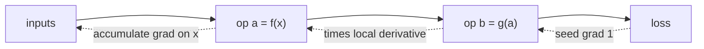

Backpropagation by hand works for one architecture; framework users want
to write any function and get gradients automatically. **Reverse-mode
automatic differentiation** records the operations that produced each
value into a graph at runtime, then walks the graph backward to compute
all gradients<FN n="1" />. Every modern deep-learning framework is a
variation of this pattern.

## The core idea: nodes that remember

Wrap each scalar (later, tensor) in a `Value` object that stores three
things:

- the **forward value** (the number itself),
- a **list of parent `Value` objects** that produced it,
- a **closure that computes the local backward pass** given the upstream
  gradient.

Operations like `+`, `*`, `tanh` return new `Value` objects with their
parents and closures populated. Running the forward pass thus *records*
the graph; running the backward pass walks the recorded graph in
reverse.

## The two phases

**Forward.** Every operation creates a new node and links it to its
inputs. After running the loss, the graph is a DAG whose leaves are the
network's inputs and parameters and whose root is the loss scalar.

**Backward.** From the loss node, accumulate gradients into each parent
using the chain rule. Visit nodes in reverse topological order so a
node's gradient is finalized before its parents read it.

## Toy implementation

A minimal scalar autodiff engine in ~60 lines of Python. This is the
shape every modern framework (PyTorch's `autograd`, JAX's transforms,
TensorFlow's `GradientTape`) wraps in vector/tensor machinery.

The two pieces:

- The `Value` class with `data`, `grad`, `_prev` (parents), and a
  per-op `_backward` closure that knows how to add to its parents'
  `grad` field given the current node's gradient.
- A top-level `backward()` method on the loss that does a topological
  sort of the graph and runs each `_backward` in reverse order.

That is the full pattern. Once it works for `+`, `*`, and `tanh`, every
other smooth scalar function (`exp`, `log`, `**n`) follows the same
template.

## Tensor autodiff

Production frameworks scale this up to **tensor autodiff**: each `Value`
is replaced by a tensor, each operation has a vectorized forward and a
vectorized backward (the **vector-Jacobian product** rather than scalar
multiplication), and the engine batches operations for GPU execution.

The conceptual structure is identical: nodes record operations forward,
the backward pass walks the graph in reverse computing local Jacobian
products.

## Forward-mode vs reverse-mode

Forward mode computes one *column* of the Jacobian per pass (the
sensitivity of every output to one input). Reverse mode computes one
*row* of the Jacobian per pass (the sensitivity of one output to every
input).

- Outputs $\gg$ inputs: forward mode wins.
- Outputs $\ll$ inputs (typical neural networks: scalar loss, millions
  of parameters): reverse mode wins by a factor of (# parameters).

This is why every deep-learning framework defaults to reverse mode<FN n="2" />.

## Limitations and extensions

- **Control flow** (if/else, while loops) is handled naturally because
  the graph is built dynamically by tracing the forward pass.
- **In-place ops** require care: an autodiff engine has to detect when
  a parent tensor is being mutated and either disallow or save a copy.
- **Higher-order derivatives** come from running autodiff on the
  gradient itself.



## Check it on arrays

```python
import numpy as np

class Value:
    def __init__(self, data, _prev=()):
        self.data = data
        self.grad = 0.0
        self._prev = _prev
        self._backward = lambda: None

    def __add__(self, other):
        other = other if isinstance(other, Value) else Value(other)
        out = Value(self.data + other.data, (self, other))
        def _backward():
            self.grad += out.grad
            other.grad += out.grad
        out._backward = _backward
        return out

    def __mul__(self, other):
        other = other if isinstance(other, Value) else Value(other)
        out = Value(self.data * other.data, (self, other))
        def _backward():
            self.grad += other.data * out.grad
            other.grad += self.data * out.grad
        out._backward = _backward
        return out

    def tanh(self):
        t = np.tanh(self.data)
        out = Value(t, (self,))
        def _backward():
            self.grad += (1 - t * t) * out.grad
        out._backward = _backward
        return out

    def backward(self):
        topo, visited = [], set()
        def build(v):
            if v in visited: return
            visited.add(v)
            for p in v._prev: build(p)
            topo.append(v)
        build(self)
        self.grad = 1.0
        for v in reversed(topo): v._backward()

# Test: f = tanh((a + b) * c), compute gradients with respect to a, b, c
a = Value(2.0); b = Value(-1.0); c = Value(3.0)
y = ((a + b) * c).tanh()
y.backward()
print(f"y = {y.data:.4f}, grad a = {a.grad:.4f}, grad b = {b.grad:.4f}, grad c = {c.grad:.4f}")

# Verify against finite differences
def f(av, bv, cv): return np.tanh((av + bv) * cv)
eps = 1e-6
fa = (f(2 + eps, -1, 3) - f(2 - eps, -1, 3)) / (2 * eps)
fb = (f(2, -1 + eps, 3) - f(2, -1 - eps, 3)) / (2 * eps)
fc = (f(2, -1, 3 + eps) - f(2, -1, 3 - eps)) / (2 * eps)
print(f"finite diffs: {fa:.4f}, {fb:.4f}, {fc:.4f}")
```

The autodiff gradients match finite differences. The engine has no
explicit knowledge of the function `f`; it derived everything from the
operations recorded during the forward pass.

## Exercises

**Exercise 1.** Trace the backward pass by hand for $y = (a + b) \cdot c$
with $a = 2$, $b = -1$, $c = 3$. Report $\bar a$, $\bar b$, $\bar c$ using
only the `+` and `*` local rules ($\bar a$ denotes $\partial y / \partial a$,
the accumulated `grad` field).

<details>
<summary>Solution</summary>

**Step 1.** Forward records two nodes: $s = a + b = 1$ and $y = s \cdot c = 3$.
Seed the root gradient $\bar y = 1$.

**Step 2.** The `*` closure for $y = s \cdot c$ adds $c$ times $\bar y$ to $s$
and $s$ times $\bar y$ to $c$: $\bar s = 3 \cdot 1 = 3$ and
$\bar c = 1 \cdot 1 = 1$.

**Step 3.** The `+` closure for $s = a + b$ passes $\bar s$ unchanged to both
parents: $\bar a = 3$ and $\bar b = 3$.

So $\bar a = 3$, $\bar b = 3$, $\bar c = 1$. Check against
$y = (a+b)c$: $\partial y/\partial a = c = 3$ and $\partial y/\partial c = a+b = 1$.

</details>

**Exercise 2.** A node $v$ feeds **two** children, $c_1 = v \cdot v$. Show why
the `_backward` closures must **accumulate** into `grad` (use `+=`, not `=`),
and compute $\bar v$ for $v = 4$, $y = v \cdot v$ with $\bar y = 1$.

<details>
<summary>Solution</summary>

**Step 1.** When $v$ is reused, $y = v \cdot v$ is a single `*` node whose two
parents are the same object. The multiplication law
$\bar v = \sum_i \bar c_i\, \partial c_i / \partial v$ sums contributions over
every edge leaving $v$.

**Step 2.** The `*` closure runs once and adds the gradient through each
operand slot: $\bar v \mathrel{+}= (\text{other}) \cdot \bar y$ for each of the
two slots, both holding $v = 4$. So $\bar v = 4 \cdot 1 + 4 \cdot 1 = 8$.

**Step 3.** With assignment (`=`) the second write would overwrite the first,
giving $\bar v = 4$ and dropping half the gradient. Accumulation is what makes
$\partial(v^2)/\partial v = 2v = 8$ come out right.

</details>

**Exercise 3 (code).** Add an `exp` operation to the `Value` class (local
derivative of $e^x$ is $e^x$) and verify $\partial y / \partial a$ for
$y = \exp(a \cdot b)$ against a finite difference.

<details>
<summary>Solution</summary>

```python
import numpy as np

class Value:
    def __init__(self, data, _prev=()):
        self.data = data; self.grad = 0.0
        self._prev = _prev; self._backward = lambda: None
    def __mul__(self, other):
        other = other if isinstance(other, Value) else Value(other)
        out = Value(self.data * other.data, (self, other))
        def _backward():
            self.grad += other.data * out.grad
            other.grad += self.data * out.grad
        out._backward = _backward
        return out
    def exp(self):
        e = np.exp(self.data)
        out = Value(e, (self,))
        def _backward():
            self.grad += e * out.grad     # d/dx exp(x) = exp(x)
        out._backward = _backward
        return out
    def backward(self):
        topo, visited = [], set()
        def build(v):
            if v in visited: return
            visited.add(v)
            for p in v._prev: build(p)
            topo.append(v)
        build(self)
        self.grad = 1.0
        for v in reversed(topo): v._backward()

a = Value(0.7); b = Value(1.3)
y = (a * b).exp()
y.backward()

f = lambda av: np.exp(av * 1.3)
eps = 1e-6
fd = (f(0.7 + eps) - f(0.7 - eps)) / (2 * eps)
assert np.isclose(a.grad, fd, atol=1e-6)
print(a.grad, fd)
```

</details>

The next lesson zooms out:
*why* can these stacks of affine maps and nonlinearities fit any
function?

<Footnotes>
  <FNItem n="1">**Baydin, A. G., Pearlmutter, B. A., Radul, A. A., & Siskind, J. M.** (2018). "Automatic differentiation in machine learning: a survey". *JMLR*, 18, 1-43. [arXiv:1502.05767](https://arxiv.org/abs/1502.05767). Surveys reverse-mode AD and the operator-overloading / graph-recording implementation used here.</FNItem>
  <FNItem n="2">**Goodfellow, I., Bengio, Y., & Courville, A.** (2016). *Deep Learning*, §6.5.9 (Differentiation outside the Deep Learning Community). MIT Press. Reverse-mode AD for scalar-output networks with many parameters.</FNItem>
</Footnotes>
