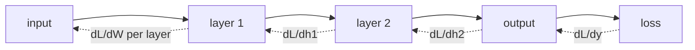

The forward pass computes $\hat y$ from $x$ and the parameters; training
needs the derivative of the loss with respect to every parameter. The
naive approach (finite differences, or one chain-rule application per
parameter) is $O(P)$ forward passes for $P$ parameters: infeasible at
modern scale. **Backpropagation** computes all $P$ gradients with a
single backward pass, by reusing partial derivatives<FN ns="1, 2" />.

## The setup: a computational graph

A neural network is a **directed acyclic graph** of operations. Each node
is a tensor; each edge is a function. For an MLP:

$$
z^{(\ell)} = W^{(\ell)} h^{(\ell-1)} + b^{(\ell)}, \qquad h^{(\ell)} = \sigma(z^{(\ell)}).
$$

The loss $\mathcal{L}$ is a function of the final output. Backprop walks
this graph in reverse, accumulating gradients via the chain rule.

## The chain rule on the graph

Define the **upstream gradient** at any node $v$ as $\bar v = \partial \mathcal{L}/\partial v$.
For a node $v$ that affects $\mathcal{L}$ only through its children $c_1, \dots, c_m$:

$$
\bar v = \sum_i \bar c_i \cdot \frac{\partial c_i}{\partial v}.
$$

This is the single law of backprop. To compute it efficiently, traverse
the graph in **reverse topological order**: a node's gradient is computed
only after all its children's gradients are known.

## Per-layer derivatives

For a linear layer $z = W h + b$ with downstream gradient $\bar z$:

$$
\bar W = \bar z\, h^\top, \qquad \bar b = \bar z, \qquad \bar h = W^\top \bar z.
$$

*Where these come from.* For the matrix entry $W_{ij}$,
$\partial z_i/\partial W_{ij} = h_j$, so $\bar W_{ij} = \bar z_i\, h_j$,
which is the outer product. For the bias, $\partial z_i/\partial b_i = 1$.
For the input, $\partial z_i/\partial h_j = W_{ij}$, summed gives
$W^\top \bar z$.

For an elementwise nonlinearity $h = \sigma(z)$:

$$
\bar z = \bar h \odot \sigma'(z),
$$

where $\odot$ is elementwise multiplication. For ReLU, $\sigma'(z) = \mathbf{1}[z > 0]$;
for sigmoid, $\sigma(z)(1 - \sigma(z))$; for tanh, $1 - \tanh^2(z)$.

For the softmax + cross-entropy loss at the output (with one-hot true
label $y$):

$$
\bar z^{(L)} = \hat y - y,
$$

a famously clean gradient. The exponential / log-of-softmax algebra
collapses into a single residual.

## The full backward pass

For an $L$-layer MLP:

1. **Forward.** Compute $h^{(0)}, z^{(1)}, h^{(1)}, \dots, z^{(L)}, \hat y, \mathcal{L}$.
2. **Backward.** Start with $\bar z^{(L)} = \hat y - y$. For $\ell = L, L-1, \dots, 1$:
   - $\bar W^{(\ell)} = \bar z^{(\ell)}\, h^{(\ell-1)\top}$
   - $\bar b^{(\ell)} = \bar z^{(\ell)}$
   - $\bar h^{(\ell-1)} = W^{(\ell)\top}\, \bar z^{(\ell)}$
   - $\bar z^{(\ell-1)} = \bar h^{(\ell-1)} \odot \sigma'(z^{(\ell-1)})$

Both passes have the same asymptotic cost (linear in parameter count).
This is the **fundamental fact** of backprop: gradients cost no more than
the forward pass, up to a constant factor.

## Why it works

The chain rule alone gives the answer in any order. The reverse traversal
is the key efficiency: each partial derivative $\partial c/\partial v$ is
computed exactly once, then multiplied by the already-computed $\bar c$.
A forward traversal (forward-mode autodiff) would compute one column of
the Jacobian per pass, costing $O(P)$ passes total; reverse mode
computes one row (the gradient of the scalar loss) in one pass.

For scalar-output networks, reverse mode is the right choice. For
networks with many outputs and few inputs (rare in deep learning),
forward mode wins.

The magnitude of what reverse mode buys is the whole reason deep learning
is tractable. The tiny MLP in the code below has $P = 26$ parameters, so a
naive finite-difference gradient costs about $2 \times 26 = 52$ extra
forward passes (two per parameter for a central difference). Backprop gets
the same gradient in one backward pass. The gap is linear in $P$, so it
explodes with scale: a $1$-million-parameter network would need on the
order of $10^6$ forward passes per gradient by finite differences against
the single backward pass of backprop, and GPT-3, at $1.75 \times 10^{11}$
parameters, would need on the order of $10^{11}$. That factor of $P$ is the
difference between "train in a backward pass" and "never finish one
gradient step."



## Check it on arrays

```python
import numpy as np

rng = np.random.default_rng(0)

# Tiny 2-layer MLP: 3 -> 4 -> 2, softmax + cross-entropy loss
N, d, h_dim, K = 20, 3, 4, 2
X = rng.normal(size=(N, d))
y = rng.integers(0, K, size=N)
Y = np.eye(K)[y]                                  # one-hot

W1 = rng.normal(scale=0.3, size=(d, h_dim))
b1 = np.zeros(h_dim)
W2 = rng.normal(scale=0.3, size=(h_dim, K))
b2 = np.zeros(K)

def relu(z):       return np.maximum(0.0, z)
def relu_grad(z):  return (z > 0).astype(float)
def softmax(z):
    z = z - z.max(axis=1, keepdims=True)
    e = np.exp(z); return e / e.sum(axis=1, keepdims=True)

# Forward
z1 = X @ W1 + b1
h1 = relu(z1)
z2 = h1 @ W2 + b2
p  = softmax(z2)
loss = -np.mean(np.log(p[np.arange(N), y] + 1e-12))

# Backward
dz2 = (p - Y) / N                                  # softmax + CE collapse
dW2 = h1.T @ dz2
db2 = dz2.sum(axis=0)
dh1 = dz2 @ W2.T
dz1 = dh1 * relu_grad(z1)
dW1 = X.T @ dz1
db1 = dz1.sum(axis=0)

# Verify each analytic gradient against finite differences
def loss_for(params):
    W1_, b1_, W2_, b2_ = params
    z1 = X @ W1_ + b1_; h1 = relu(z1)
    z2 = h1 @ W2_ + b2_; p = softmax(z2)
    return -np.mean(np.log(p[np.arange(N), y] + 1e-12))

def finite_diff(arr, name):
    fd = np.zeros_like(arr); eps = 1e-5
    flat = arr.ravel()
    for i in range(flat.size):
        delta = np.zeros_like(flat); delta[i] = eps
        arr_p = (flat + delta).reshape(arr.shape)
        arr_m = (flat - delta).reshape(arr.shape)
        params_plus  = [arr_p if n == name else p for n, p in zip(["W1","b1","W2","b2"], [W1, b1, W2, b2])]
        params_minus = [arr_m if n == name else p for n, p in zip(["W1","b1","W2","b2"], [W1, b1, W2, b2])]
        fd.ravel()[i] = (loss_for(params_plus) - loss_for(params_minus)) / (2 * eps)
    return fd

fd_W1 = finite_diff(W1, "W1")
print(f"max |analytic - finite diff| for W1: {np.max(np.abs(dW1 - fd_W1)):.2e}")
fd_W2 = finite_diff(W2, "W2")
print(f"max |analytic - finite diff| for W2: {np.max(np.abs(dW2 - fd_W2)):.2e}")
```

The analytic gradients match finite differences to floating-point
precision, confirming the backward pass.

## Exercises

**Exercise 1.** A single linear layer maps $z = W h + b$ with
$W = \left(\begin{smallmatrix} 2 & 0 \\ -1 & 3 \end{smallmatrix}\right)$,
$h = (1, 2)^\top$, and downstream gradient $\bar z = (1, -1)^\top$. Compute
$\bar W$, $\bar b$, and $\bar h$ by hand using the per-layer rules.

<details>
<summary>Solution</summary>

**Step 1.** Bias: $\bar b = \bar z = (1, -1)^\top$, since
$\partial z_i / \partial b_i = 1$.

**Step 2.** Weight: $\bar W = \bar z\, h^\top$ is the outer product of a
$2\times 1$ and a $1\times 2$:

$$
\bar W = \begin{pmatrix} 1 \\ -1 \end{pmatrix}\begin{pmatrix} 1 & 2 \end{pmatrix}
       = \begin{pmatrix} 1 & 2 \\ -1 & -2 \end{pmatrix}.
$$

**Step 3.** Input: $\bar h = W^\top \bar z$. With
$W^\top = \left(\begin{smallmatrix} 2 & -1 \\ 0 & 3 \end{smallmatrix}\right)$,

$$
\bar h = \begin{pmatrix} 2 & -1 \\ 0 & 3 \end{pmatrix}\begin{pmatrix} 1 \\ -1 \end{pmatrix}
       = \begin{pmatrix} 3 \\ -3 \end{pmatrix}.
$$

</details>

**Exercise 2.** Backprop a two-layer scalar network by hand. With scalars
$x = 2$, $w_1 = 1$, $w_2 = -1$, define $a = w_1 x$, $h = \operatorname{ReLU}(a)$,
$o = w_2 h$, and loss $\mathcal{L} = \tfrac12 o^2$. Compute
$\partial \mathcal{L}/\partial w_1$ and $\partial \mathcal{L}/\partial w_2$.

<details>
<summary>Solution</summary>

**Step 1.** Forward: $a = 1 \cdot 2 = 2$, $h = \operatorname{ReLU}(2) = 2$,
$o = -1 \cdot 2 = -2$, $\mathcal{L} = \tfrac12(-2)^2 = 2$.

**Step 2.** Seed the output gradient: $\bar o = \partial \mathcal{L}/\partial o = o = -2$.

**Step 3.** Through $o = w_2 h$: $\partial \mathcal{L}/\partial w_2 = \bar o\, h = -2 \cdot 2 = -4$,
and $\bar h = \bar o\, w_2 = -2 \cdot (-1) = 2$.

**Step 4.** Through the ReLU at $a = 2 > 0$, the local derivative is $1$, so
$\bar a = \bar h \cdot 1 = 2$. Through $a = w_1 x$:
$\partial \mathcal{L}/\partial w_1 = \bar a\, x = 2 \cdot 2 = 4$.

</details>

**Exercise 3 (code).** Extend the lesson's MLP to **three** layers
($d \to h_1 \to h_2 \to K$ with ReLU) and verify every analytic gradient
against central finite differences to within $10^{-6}$.

<details>
<summary>Solution</summary>

```python
import numpy as np

rng = np.random.default_rng(1)
N, d, h1, h2, K = 16, 3, 5, 4, 2
X = rng.normal(size=(N, d))
y = rng.integers(0, K, size=N)
Y = np.eye(K)[y]

params = {
    "W1": rng.normal(scale=0.3, size=(d, h1)), "b1": np.zeros(h1),
    "W2": rng.normal(scale=0.3, size=(h1, h2)), "b2": np.zeros(h2),
    "W3": rng.normal(scale=0.3, size=(h2, K)), "b3": np.zeros(K),
}

def relu(z): return np.maximum(0.0, z)
def softmax(z):
    z = z - z.max(axis=1, keepdims=True)
    e = np.exp(z); return e / e.sum(axis=1, keepdims=True)

def forward(p):
    z1 = X @ p["W1"] + p["b1"]; a1 = relu(z1)
    z2 = a1 @ p["W2"] + p["b2"]; a2 = relu(z2)
    z3 = a2 @ p["W3"] + p["b3"]; prob = softmax(z3)
    loss = -np.mean(np.log(prob[np.arange(N), y] + 1e-12))
    return loss, (z1, a1, z2, a2, z3, prob)

loss, (z1, a1, z2, a2, z3, prob) = forward(params)

# Backward
dz3 = (prob - Y) / N
g = {"W3": a2.T @ dz3, "b3": dz3.sum(axis=0)}
da2 = dz3 @ params["W3"].T; dz2 = da2 * (z2 > 0)
g["W2"] = a1.T @ dz2; g["b2"] = dz2.sum(axis=0)
da1 = dz2 @ params["W2"].T; dz1 = da1 * (z1 > 0)
g["W1"] = X.T @ dz1; g["b1"] = dz1.sum(axis=0)

# Central finite differences on every parameter entry
eps = 1e-5
for name in params:
    arr = params[name]; fd = np.zeros_like(arr)
    for idx in np.ndindex(arr.shape):
        arr[idx] += eps; lp, _ = forward(params)
        arr[idx] -= 2 * eps; lm, _ = forward(params)
        arr[idx] += eps
        fd[idx] = (lp - lm) / (2 * eps)
    assert np.max(np.abs(g[name] - fd)) < 1e-6
print("all gradients match finite differences")
```

</details>

The next lesson generalizes this
hand-derived routine into an automatic differentiation engine.

<Footnotes>
  <FNItem n="1">**Rumelhart, D. E., Hinton, G. E., & Williams, R. J.** (1986). "Learning representations by back-propagating errors". *Nature*, 323, 533-536. [doi:10.1038/323533a0](https://doi.org/10.1038/323533a0). The paper that popularized backpropagation for neural networks.</FNItem>
  <FNItem n="2">**Goodfellow, I., Bengio, Y., & Courville, A.** (2016). *Deep Learning*, §6.5 (Back-Propagation and Other Differentiation Algorithms). MIT Press. Backprop as reverse-mode differentiation on the computational graph.</FNItem>
</Footnotes>
