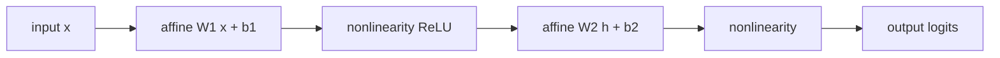

A **multi-layer perceptron** (MLP) alternates two operations, an affine
map and a pointwise nonlinearity, $L$ times. Each affine map is a linear
algebra problem; each nonlinearity is a scalar function. The composition
turns the linear-classifier story from pillar C into a function class
that can fit any continuous target<FN n="1" />. This lesson sets up the
forward pass so the next lesson can derive backprop on it.

## The single layer

A linear layer with input $x \in \mathbb{R}^d$ and output $h \in \mathbb{R}^k$
applies an **affine map** plus a **nonlinearity**:

$$
h = \sigma(W x + b), \qquad W \in \mathbb{R}^{k \times d},\ \ b \in \mathbb{R}^k.
$$

The matrix $W$ rotates and scales; the bias $b$ shifts; the elementwise
$\sigma$ bends. Without $\sigma$ the layer is just a linear map, and the
whole network would collapse to one large linear map regardless of depth.
The nonlinearity is what makes stacking useful<FN n="2" />.

## Stacking layers

An $L$-layer MLP composes $L$ such blocks:

$$
h^{(0)} = x, \qquad h^{(\ell)} = \sigma\!\left(W^{(\ell)} h^{(\ell-1)} + b^{(\ell)}\right), \qquad \hat y = h^{(L)}.
$$

The **width** of layer $\ell$ is the number of rows of $W^{(\ell)}$; the
**depth** is $L$. The final activation is task-specific: identity for
regression, softmax for classification.

The parameter count is $\sum_\ell (d_\ell \cdot d_{\ell-1} + d_\ell)$:
matrices dominate, biases are a small surcharge.

## Batched forward pass

In practice $N$ examples flow through at once. Stack inputs into
$X \in \mathbb{R}^{N \times d}$ and rewrite:

$$
H^{(\ell)} = \sigma\!\left(H^{(\ell-1)} W^{(\ell)\top} + b^{(\ell)\top}\right).
$$

The bias broadcasts across the batch axis. Modern frameworks store weights
in `(in, out)` order and apply `X @ W + b`, which is the same operation
written with the transpose absorbed. Either convention is fine; pick one
and stick with it.

## Output activations

For **regression** the output is the raw $h^{(L)}$ (identity activation),
trained with squared error.

For **binary classification** the output is a single logit; apply sigmoid
at prediction time and train with binary cross-entropy on the logit
directly.

For **multi-class classification** with $K$ classes, the output is a
length-$K$ logit vector; apply softmax at prediction time and train with
cross-entropy. Skip the explicit softmax in training and use the fused
log-softmax + NLL form from the log-sum-exp lesson.

## What the forward pass costs

For a batch of $N$ examples and a layer mapping $d_\ell \to d_{\ell+1}$,
the cost is $O(N\, d_\ell\, d_{\ell+1})$ multiply-adds. The total forward
cost scales linearly in batch size and quadratically (roughly) in width.
Depth multiplies cost by a constant; the doubling of layers does not
square the cost.



## Check it on arrays

```python
import numpy as np

rng = np.random.default_rng(0)

def init_layer(in_dim, out_dim, rng):
    # Simple Gaussian init; the initialization lesson refines this.
    W = rng.normal(scale=0.1, size=(in_dim, out_dim))
    b = np.zeros(out_dim)
    return W, b

def relu(x): return np.maximum(0.0, x)

def softmax(z):
    z = z - z.max(axis=1, keepdims=True)
    e = np.exp(z)
    return e / e.sum(axis=1, keepdims=True)

# 4-layer MLP for 3-class classification on 8-dim inputs
N, d_in, d_hid, K = 16, 8, 32, 3
X = rng.normal(size=(N, d_in))

W1, b1 = init_layer(d_in,  d_hid, rng)
W2, b2 = init_layer(d_hid, d_hid, rng)
W3, b3 = init_layer(d_hid, d_hid, rng)
W4, b4 = init_layer(d_hid, K,     rng)

# Forward pass
h1 = relu(X  @ W1 + b1)
h2 = relu(h1 @ W2 + b2)
h3 = relu(h2 @ W3 + b3)
logits = h3 @ W4 + b4
probs = softmax(logits)

print(f"shapes: X {X.shape}, h1 {h1.shape}, logits {logits.shape}, probs {probs.shape}")
print(f"row sums of probs (should be 1): {probs.sum(axis=1)[:3]}")
print(f"argmax classes for the first 5 rows: {probs.argmax(axis=1)[:5]}")

# Parameter count
n_params = sum(p.size for p in [W1, b1, W2, b2, W3, b3, W4, b4])
print(f"total parameters: {n_params}")

# Forward cost (multiply-adds) for one batch
flops = N * (d_in * d_hid + d_hid * d_hid * 2 + d_hid * K)
print(f"~{flops:,} multiply-adds for one forward pass")
```

The shapes flow consistently through the layers, the softmax rows sum to
one, and the parameter count matches the matrix-plus-bias formula.

## Exercises

**Exercise 1.** A 3-layer MLP maps inputs of dimension $d_0 = 10$ through
hidden widths $d_1 = 20$ and $d_2 = 15$ to an output of size $d_3 = 4$.
Each layer is an affine map with a weight matrix and a bias. Count the
total number of parameters by hand.

<details>
<summary>Solution</summary>

**Step 1.** Layer $\ell$ has weight matrix $W^{(\ell)} \in \mathbb{R}^{d_\ell \times d_{\ell-1}}$
and bias $b^{(\ell)} \in \mathbb{R}^{d_\ell}$, so it contributes
$d_\ell d_{\ell-1} + d_\ell$ parameters.

**Step 2.** Sum over the three layers:

$$
\underbrace{(20 \cdot 10 + 20)}_{220} + \underbrace{(15 \cdot 20 + 15)}_{315} + \underbrace{(4 \cdot 15 + 4)}_{64} = 599.
$$

The matrices ($200 + 300 + 60 = 560$) dominate; the biases ($20 + 15 + 4 = 39$)
are a small surcharge, as the parameter-count formula predicts.

</details>

**Exercise 2.** Show that without a nonlinearity an $L$-layer network
collapses to a single affine map. Take $h^{(\ell)} = W^{(\ell)} h^{(\ell-1)} + b^{(\ell)}$
with no $\sigma$, and find the single $(W_{\text{eff}}, b_{\text{eff}})$
such that $\hat y = W_{\text{eff}}\, x + b_{\text{eff}}$ for $L = 2$.

<details>
<summary>Solution</summary>

**Step 1.** Write the first layer: $h^{(1)} = W^{(1)} x + b^{(1)}$.

**Step 2.** Feed it into the second:

$$
\hat y = W^{(2)} h^{(1)} + b^{(2)} = W^{(2)}\left(W^{(1)} x + b^{(1)}\right) + b^{(2)}.
$$

**Step 3.** Distribute and group the terms by whether they multiply $x$:

$$
\hat y = \underbrace{W^{(2)} W^{(1)}}_{W_{\text{eff}}}\, x + \underbrace{W^{(2)} b^{(1)} + b^{(2)}}_{b_{\text{eff}}}.
$$

The composition is one affine map with $W_{\text{eff}} = W^{(2)} W^{(1)}$
and $b_{\text{eff}} = W^{(2)} b^{(1)} + b^{(2)}$. Induction extends this to
any $L$, so depth buys nothing without a nonlinearity between the maps.

</details>

**Exercise 3 (code).** Build the same 2-layer linear network from
Exercise 2 in numpy with random weights, then construct the single
collapsed affine map $(W_{\text{eff}}, b_{\text{eff}})$ and verify it
produces identical outputs on a batch of inputs.

<details>
<summary>Solution</summary>

```python
import numpy as np

rng = np.random.default_rng(0)

d0, d1, d2, N = 6, 8, 3, 16
W1 = rng.normal(size=(d1, d0)); b1 = rng.normal(size=d1)
W2 = rng.normal(size=(d2, d1)); b2 = rng.normal(size=d2)
X = rng.normal(size=(N, d0))

# Two-layer linear network (no nonlinearity), row-vector convention
H1 = X @ W1.T + b1
Y_deep = H1 @ W2.T + b2

# Collapsed single affine map
W_eff = W2 @ W1
b_eff = W2 @ b1 + b2
Y_flat = X @ W_eff.T + b_eff

assert np.allclose(Y_deep, Y_flat)
print("max abs difference:", np.abs(Y_deep - Y_flat).max())
```

The two outputs agree to floating-point precision: stacking linear layers
without a nonlinearity is a single linear layer in disguise, which is why
$\sigma$ has to sit between them.

</details>

The next lesson computes derivatives of this same forward pass:
backpropagation.

<Footnotes>
  <FNItem n="1">**Goodfellow, I., Bengio, Y., & Courville, A.** (2016). *Deep Learning*, §6.1-6.4 (Deep Feedforward Networks). MIT Press. The feedforward network as composed affine maps and nonlinearities.</FNItem>
  <FNItem n="2">**Goodfellow, I., Bengio, Y., & Courville, A.** (2016). *Deep Learning*, §6.3 (Hidden Units). MIT Press. Why a nonlinearity between affine maps is what gives depth its expressive power.</FNItem>
</Footnotes>
