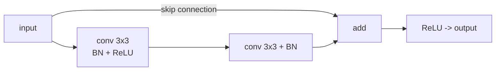

ResNet pinned the basic residual recipe<FN n="1" />; the architectures that followed
refined it along different axes. **DenseNet** maximized feature reuse;
**EfficientNet** found that scaling depth, width, and resolution
together beats scaling one at a time; **ConvNeXt** showed that, with
the right modernizations, a pure CNN can match Transformers. The trade-
offs they expose are useful well beyond vision.

## DenseNet (2017)

A residual block's output is the sum of the input and the learned $F(x)$.
**DenseNet** concatenates instead of summing, and connects every layer
to every previous layer:

$$
x_\ell = H_\ell([x_0,\, x_1,\, \dots,\, x_{\ell-1}]).
$$

Each layer receives a concatenation of all earlier feature maps. The
network feature dimension grows by a fixed **growth rate** $k$ per
layer (a small number like 12 or 32).

**Why it works**:

- **Maximum feature reuse**: every layer has direct access to every
  earlier feature.
- **Implicit deep supervision**: gradients from the loss reach every
  layer through short paths.
- **Parameter efficiency**: a DenseNet-201 has 20M parameters versus a
  ResNet-152's 60M for comparable accuracy.

The cost is memory: storing all intermediate activations for the dense
connectivity is expensive. Production-favored architectures tend to be
ResNet variants rather than DenseNet for this reason.

## EfficientNet (2019)

Tan and Le observed: papers improve accuracy by scaling either *depth*,
*width* (channels), or *resolution* (input size). **EfficientNet** found
that you should scale all three together with a single scaling
coefficient<FN n="2" />:

$$
\text{depth} = \alpha^\phi, \quad \text{width} = \beta^\phi, \quad \text{resolution} = \gamma^\phi,
$$

with the constraint $\alpha \cdot \beta^2 \cdot \gamma^2 \approx 2$
(FLOPs roughly double for $\phi \to \phi + 1$).

The base architecture EfficientNet-B0 was found by **neural
architecture search (NAS)** using mobile-inverted bottleneck blocks
(from MobileNet). B0 through B7 are increasingly compute-heavy versions
scaled per the formula above.

EfficientNet-B7 matched the accuracy of ResNet-152 with 4-10x fewer
parameters and FLOPs. The compound-scaling principle generalized
beyond CNNs to language models and is now the default scaling
philosophy.

## MobileNet and depthwise separable convolutions

EfficientNet's building block comes from MobileNet's **depthwise
separable convolution**, which factorizes a normal $k \times k \times C_{\text{in}} \times C_{\text{out}}$
filter into two cheap operations:

- **Depthwise convolution**: a single $k \times k$ filter per input
  channel (no channel mixing). $k^2 C_{\text{in}}$ multiplies per output
  position.
- **Pointwise convolution**: a $1 \times 1$ convolution mixing channels.
  $C_{\text{in}} C_{\text{out}}$ multiplies per output position.

Total cost: $k^2 C_{\text{in}} + C_{\text{in}} C_{\text{out}}$ versus
$k^2 C_{\text{in}} C_{\text{out}}$ for a full conv. For $k = 3$ and
$C \sim 100$, that is a 9x compute reduction at a small accuracy cost.
The default building block for mobile and edge CNNs.

## ConvNeXt (2022)

Liu et al. asked: with Transformer-style training and architectural
modernizations, can a pure CNN match a Vision Transformer? Answer: yes<FN n="3" />.

**ConvNeXt** retrofits ResNet with:

- **Larger kernels** (7x7 depthwise instead of 3x3): mimics the global
  receptive field of attention.
- **Inverted bottleneck blocks**: expand then compress channel
  dimension within each block.
- **GELU** instead of ReLU.
- **LayerNorm** instead of BatchNorm.
- **Fewer activations**: only one nonlinearity per block.
- **Patchify stem**: an initial $4 \times 4$ stride-4 conv (like ViT's
  patch embedding) instead of the classical 7x7-stride-2.

Each change buys a small accuracy gain, and the sum matches or beats
ViT-B on ImageNet. The takeaway: **the architecture was not the
bottleneck**; modern training tricks and small design choices were.

## What about pure efficiency

A few architectures optimize compute or memory specifically:

- **MobileNet v1/v2/v3**: mobile-targeted, depthwise separable + inverted
  residuals.
- **ShuffleNet**: channel shuffling for cheap channel mixing.
- **EfficientNet-Lite**, **TinyNet**: smaller scaled variants.

These dominate the mobile / edge regime; ResNet and ConvNeXt dominate
the server / cloud regime.

## When you would still use a CNN over a Transformer

ViT (next lesson) eventually replaced CNNs at the high end, but CNNs
remain better when:

- **Small data** (CNNs have a stronger image-specific prior).
- **High-resolution inputs** with limited compute (CNN's local
  operations scale better than $O(n^2)$ attention).
- **Hardware** has efficient convolution support (mobile NPUs).

In practice the choice is dominated by what your team is already good
at and what pretrained checkpoints are available.

## The state of CNNs at a glance

| Architecture | Year | Notable trick | Notes |
|---|---|---|---|
| ResNet | 2015 | Skip connections | Default baseline |
| DenseNet | 2017 | Dense connectivity | Memory-heavy |
| MobileNet v2 | 2018 | Inverted bottlenecks | Mobile default |
| EfficientNet | 2019 | Compound scaling | Pareto-optimal accuracy/FLOPs |
| ConvNeXt | 2022 | ResNet + modernizations | Matches ViT |

## Exercises

**Exercise 1.** A depthwise separable convolution factorizes a
$k \times k$ convolution from $C_{\text{in}}$ to $C_{\text{out}}$ channels
into a depthwise step ($k^2 C_{\text{in}}$ multiplies per output position)
and a pointwise step ($C_{\text{in}} C_{\text{out}}$ multiplies). For
$k = 3$ and $C_{\text{in}} = C_{\text{out}} = 256$, compute the ratio of
separable to full-convolution multiply count.

Solution

**Step 1.** A full $3 \times 3$ convolution costs
$k^2 C_{\text{in}} C_{\text{out}} = 9 \cdot 256 \cdot 256 = 589{,}824$
multiplies per output position.

**Step 2.** The separable version costs
$k^2 C_{\text{in}} + C_{\text{in}} C_{\text{out}} = 9 \cdot 256 + 256 \cdot 256 = 2{,}304 + 65{,}536 = 67{,}840$.

**Step 3.** The ratio is
$\frac{67{,}840}{589{,}824} \approx 0.115$, about an $8.7\times$ reduction.
The closed form $\frac{1}{C_{\text{out}}} + \frac{1}{k^2}$ approaches
$\frac{1}{9} \approx 0.111$ as $C_{\text{out}}$ grows, matching the
roughly $9\times$ saving quoted for $3 \times 3$ kernels.

**Exercise 2.** EfficientNet's compound scaling sets
$\text{depth} = \alpha^\phi$, $\text{width} = \beta^\phi$,
$\text{resolution} = \gamma^\phi$ under the constraint
$\alpha \cdot \beta^2 \cdot \gamma^2 \approx 2$. FLOPs are linear in
depth, quadratic in width (each layer's cost is quadratic in channels),
and quadratic in resolution (pixel count). Show that incrementing $\phi$
by $1$ roughly doubles FLOPs.

Solution

**Step 1.** Write the FLOP count as proportional to
$\text{depth} \cdot \text{width}^2 \cdot \text{resolution}^2$, since cost
is linear in depth and quadratic in both width (channels) and resolution
(pixels per axis squared, the pixel count).

**Step 2.** Substitute the scaling laws:

$$
\text{FLOPs} \propto \alpha^\phi \cdot (\beta^\phi)^2 \cdot (\gamma^\phi)^2 = (\alpha \cdot \beta^2 \cdot \gamma^2)^\phi.
$$

**Step 3.** With the constraint $\alpha \cdot \beta^2 \cdot \gamma^2 \approx 2$,
this is $2^\phi$. Going from $\phi$ to $\phi + 1$ multiplies FLOPs by
$2^{\phi+1} / 2^\phi = 2$, a doubling, which is why each EfficientNet step
(B0 to B1 to and so on) roughly doubles compute.

**Exercise 3.** DenseNet and ResNet both shorten gradient paths through a
deep stack, yet production pipelines usually pick ResNet. Identify the
mechanism each uses to connect layers and explain the trade-off that
favors ResNet in deployment.

Solution

**Step 1.** ResNet connects layers by **summing**: a block computes
$y = F(x) + x$, so the shortcut adds the input to the learned residual
without growing the channel dimension. DenseNet connects by
**concatenating**: layer $\ell$ receives $[x_0, x_1, \dots, x_{\ell-1}]$,
so the feature dimension grows by the growth rate $k$ at every layer.

**Step 2.** Both give every layer a short path to the loss, so both train
deep stacks without the gradient collapse plain nets suffer. DenseNet is
more parameter-efficient at a given accuracy (a DenseNet-201 has 20M
parameters versus a ResNet-152's 60M).

**Step 3.** The trade-off is memory and bandwidth: concatenation forces
every intermediate feature map to stay alive and be re-read by all later
layers, so activation memory grows with depth and the access pattern is
hardware-unfriendly. ResNet's additive shortcut keeps the channel count
bounded and the memory footprint flat, which is why it remains the
deployment default despite DenseNet's parameter edge.

The next lesson moves entirely to a different architecture family:
Vision Transformers.

<Footnotes>
  <FNItem n="1">**He, K., Zhang, X., Ren, S., & Sun, J.** (2016). "Deep residual learning for image recognition (ResNet)". *CVPR*. [arXiv:1512.03385](https://arxiv.org/abs/1512.03385). The residual baseline the later families refine.</FNItem>
  <FNItem n="2">**Tan, M., & Le, Q.** (2019). "EfficientNet: rethinking model scaling for convolutional neural networks". *ICML*. [arXiv:1905.11946](https://arxiv.org/abs/1905.11946). Compound scaling of depth, width, and resolution.</FNItem>
  <FNItem n="3">**Liu, Z., Mao, H., Wu, C.-Y., Feichtenhofer, C., Darrell, T., & Xie, S.** (2022). "A ConvNet for the 2020s (ConvNeXt)". *CVPR*. [arXiv:2201.03545](https://arxiv.org/abs/2201.03545). A modernized pure CNN matching Vision Transformers.</FNItem>
</Footnotes>
