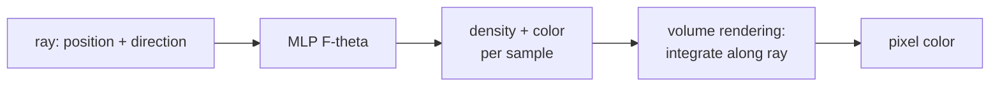

Given a handful of photographs of a scene from different viewpoints, can
a model reconstruct the underlying 3D geometry and let you render the
scene from new viewpoints? Two methods made this practical:
**NeRF** (2020) trains a neural network to represent the scene as a
continuous radiance field; **Gaussian Splatting** (2023) replaces the
network with millions of 3D Gaussians and achieves real-time rendering
with higher quality.

## The novel-view synthesis task

Inputs: $N$ posed images (each with its camera intrinsics and
extrinsics). Output: a representation that lets you render the scene
from any new camera pose. The representation is the model.

Quality metrics: PSNR, SSIM, LPIPS computed on held-out test views.

## NeRF: neural radiance fields

Mildenhall et al. (2020): represent a scene with a small MLP that maps a
3D position and viewing direction to a color and density<FN n="1" />:

$$
F_\theta: (\mathbf{x}, \mathbf{d}) \mapsto (\mathbf{c}, \sigma).
$$

Here $\mathbf{x} \in \mathbb{R}^3$ is a 3D point, $\mathbf{d} \in S^2$ is
a unit viewing direction, $\mathbf{c} \in [0, 1]^3$ is RGB color, and
$\sigma \in \mathbb{R}_{\ge 0}$ is volumetric density.

**Volume rendering**: to render the color of a pixel along its ray, sample
points along the ray, query the MLP at each, and integrate:

$$
C = \int_0^\infty T(t)\, \sigma(t)\, c(t)\, dt, \qquad T(t) = \exp\!\left(-\int_0^t \sigma(s)\, ds\right).
$$

In practice this is discretized: sample $N$ points along the ray,
compute densities and colors, and use a weighted alpha-composite.

**Training**: render every pixel of every training image, compare to the
true pixel color, backprop through the volume rendering. The MLP's
parameters are the scene representation. After training, render new
views by simply running the same volume integration along new rays.

## Positional encoding (NeRF version)

A vanilla MLP cannot represent high-frequency detail. NeRF prepends a
**Fourier feature** positional encoding to the input:

$$
\gamma(\mathbf{x}) = (\sin(2^0 \pi \mathbf{x}), \cos(2^0 \pi \mathbf{x}), \dots, \sin(2^L \pi \mathbf{x}), \cos(2^L \pi \mathbf{x})).
$$

Without this, NeRF produces a blurry blob; with it, the same network
captures fine geometric detail. The same encoding underlies many
implicit neural representations.

## NeRF's limitations and successors

Vanilla NeRF:

- **Slow training**: hours to days per scene.
- **Slow rendering**: minutes per frame on a GPU.
- **No editability**: the scene is a black-box MLP.

Successors:

- **Instant NGP** (NVIDIA, 2022): hash-grid encoding instead of pure
  MLP. Trains in seconds, renders at interactive frame rates.
- **Mip-NeRF**, **Mip-NeRF 360**: handle anti-aliasing and unbounded
  scenes.
- **NeRF in the Wild**: handles photo collections with varying lighting.
- **Dynamic NeRFs**: 4D extensions for moving scenes.

## Gaussian Splatting

Kerbl et al. (2023) replaced the MLP entirely with a **discrete set of
3D Gaussians**<FN n="2" />:

$$
G_i(\mathbf{x}) = \exp\!\left(-\tfrac{1}{2}(\mathbf{x} - \boldsymbol\mu_i)^\top \boldsymbol\Sigma_i^{-1} (\mathbf{x} - \boldsymbol\mu_i)\right).
$$

Each Gaussian has a center $\boldsymbol\mu_i$, anisotropic covariance
$\boldsymbol\Sigma_i$ (parameterized by quaternion + scale for
differentiability), color $\mathbf{c}_i$ (modeled with spherical
harmonics for view-dependent appearance), and opacity $\alpha_i$.

**Rendering**: project each 3D Gaussian to the image plane (a 2D
Gaussian), composite back-to-front with alpha blending.

**Training**: gradient descent on the same photometric loss as NeRF,
plus **densification** (split and clone Gaussians where reconstruction
error is high) and **pruning** (remove low-opacity Gaussians).

The whole pipeline is differentiable end-to-end and uses no neural
network. A typical scene has 1-5 million Gaussians.

Quality is comparable to or better than NeRF, training is 1-10 minutes,
rendering is real-time (100+ FPS on a single GPU). Used in production
for 3D capture and rendering pipelines.

## Why Gaussian Splatting won (for now)

- **No MLP queries during rendering**: every pixel is a sum of cheap 2D
  Gaussian rasterizations. Real-time inference.
- **No volumetric integration**: the explicit geometry skips the costly
  ray marching.
- **Easier to edit**: each Gaussian has a position, scale, and color
  you can manipulate directly.
- **Better quality** on most benchmarks.

NeRFs are still preferred when you need:

- A continuous representation (e.g. for downstream physics simulation).
- A compact model (a single MLP vs millions of Gaussians).
- Editability through latent codes (some NeRF variants).

## The broader story

NeRF and Gaussian Splatting are **differentiable rendering** methods:
the rendering operation has analytic gradients with respect to scene
parameters, so gradient descent can recover the scene from images.

This pattern is broader than 3D reconstruction: differentiable
rendering is used in inverse graphics (recover materials, lighting,
geometry from images), robotics simulation, and even physics-informed
training of vision models. Pillar D's other tracks (generative models,
GNNs) intersect with this idea via diffusion-based 3D generators and
mesh-based GNN methods.

## Exercises

**Exercise 1.** Discretized volume rendering composites $N$ samples along
a ray front-to-back. With per-sample opacities $\alpha_i$ and colors
$c_i$, the transmittance reaching sample $i$ is
$T_i = \prod_{j < i}(1 - \alpha_j)$, the weight is $w_i = T_i \alpha_i$,
and $C = \sum_i w_i c_i$. For three samples with
$\alpha = (0.5, 0.5, 1.0)$ and grayscale colors $c = (1.0, 0.5, 0.0)$,
compute the weights and the final pixel color by hand.

Solution

**Step 1.** Sample $1$: $T_1 = 1$ (nothing in front), so
$w_1 = 1 \cdot 0.5 = 0.5$.

**Step 2.** Sample $2$: $T_2 = (1 - 0.5) = 0.5$, so
$w_2 = 0.5 \cdot 0.5 = 0.25$. Sample $3$:
$T_3 = (1 - 0.5)(1 - 0.5) = 0.25$, so $w_3 = 0.25 \cdot 1.0 = 0.25$.

**Step 3.** The weights $0.5 + 0.25 + 0.25 = 1.0$ sum to one (the third
sample is fully opaque, so no light passes beyond it). The color is

$$
C = 0.5 \cdot 1.0 + 0.25 \cdot 0.5 + 0.25 \cdot 0.0 = 0.5 + 0.125 = 0.625.
$$

**Exercise 2.** NeRF feeds positions through a Fourier-feature encoding
$\gamma(\mathbf{x})$ before the MLP, and the paper reports a blurry blob
without it. Explain why a plain coordinate MLP struggles to represent
high-frequency detail and how the encoding fixes it.

Solution

**Step 1.** A standard MLP applied directly to raw coordinates
$\mathbf{x}$ is biased toward low-frequency functions: nearby inputs map
to nearby outputs, and the network must spend large weights to make its
output change rapidly over small spatial distances. Sharp geometry and
texture are exactly such rapid changes, so the MLP smooths them into a
blob.

**Step 2.** The encoding
$\gamma(\mathbf{x}) = (\sin(2^0 \pi \mathbf{x}), \cos(2^0 \pi \mathbf{x}), \dots, \sin(2^L \pi \mathbf{x}), \cos(2^L \pi \mathbf{x}))$
maps each coordinate to a bank of sinusoids at geometrically increasing
frequencies. Two nearby points now differ substantially in the
high-frequency channels.

**Step 3.** The MLP can then express rapid spatial variation as a simple
combination of these high-frequency features, instead of having to
synthesize them from raw coordinates. Fine geometric detail becomes
representable, which is why the same network goes from a blob to sharp
reconstruction once the encoding is prepended.

**Exercise 3.** A real-time application (interactive walkthrough, 100+ FPS)
must pick between a vanilla NeRF and Gaussian Splatting. Argue which to
choose from the rendering cost of each representation, then name one
situation that would flip the choice back to NeRF.

Solution

**Step 1.** Vanilla NeRF renders a pixel by marching a ray, sampling many
points, and querying a multilayer MLP at every sample, then integrating.
The per-pixel MLP evaluations and volumetric integration cost minutes per
frame, far from real time.

**Step 2.** Gaussian Splatting represents the scene as explicit 3D
Gaussians. Rendering projects each Gaussian to a 2D splat and alpha-blends
them, with no neural-network query and no ray marching. This rasterization
runs at 100+ FPS on a single GPU, so it is the right choice for the
real-time walkthrough.

**Step 3.** The choice flips back to NeRF when a **continuous** or compact
representation is required: for example feeding the scene into a downstream
physics simulation that needs a continuous density field, or shipping a
single small MLP rather than millions of Gaussians. There NeRF's
continuity and compactness outweigh its rendering cost.

## What's next in 3D vision

- **4D Gaussian Splatting** for dynamic scenes.
- **Generative 3D**: combine NeRF/Gaussian Splatting with diffusion to
  go from text to 3D scenes.
- **3D foundation models** that generalize across scenes without
  per-scene retraining (LRM, TripoSR).

This closes the D2 computer-vision track. The next subsection moves to
sequence modeling, the foundation that powers language models and
beyond.

<Footnotes>
  <FNItem n="1">**Mildenhall, B., et al.** (2020). "NeRF: representing scenes as neural radiance fields for view synthesis". *ECCV*. [arXiv:2003.08934](https://arxiv.org/abs/2003.08934). The MLP radiance field and volume-rendering training.</FNItem>
  <FNItem n="2">**Kerbl, B., Kopanas, G., Leimkühler, T., & Drettakis, G.** (2023). "3D Gaussian splatting for real-time radiance field rendering". *ACM Transactions on Graphics*, 42(4). [arXiv:2308.04079](https://arxiv.org/abs/2308.04079). The explicit anisotropic-Gaussian representation with real-time rasterization.</FNItem>
</Footnotes>
