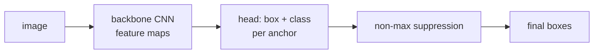

Classification asks "what is in the image?" **Object detection** asks
"what, and where, and how many?" The output is a set of bounding boxes,
each labeled with a class. Three architectural families have dominated
in succession: two-stage proposal networks (R-CNN), one-stage grid
predictors (YOLO/SSD), and end-to-end set predictors (DETR).

## The detection task

Given an image, output a set $\{(\text{class}_i, \text{box}_i)\}_{i=1}^N$
where each box is $(x, y, w, h)$ or $(x_1, y_1, x_2, y_2)$. The number
$N$ varies per image. Standard benchmarks: COCO (80 classes, ~120K
images), Open Images, LVIS (long-tail vocabulary).

Evaluation is by **mean average precision (mAP)** computed over
intersection-over-union (IoU) thresholds: a detection counts as correct
if its predicted box overlaps a ground-truth box by at least an IoU
threshold (typically 0.5 or averaged over 0.5-0.95).

## R-CNN family (two-stage)

The original deep-learning detector. Three steps:

1. **Region proposal**: generate ~2000 candidate regions per image with
   a class-agnostic method (selective search in original R-CNN; a
   learned **Region Proposal Network (RPN)** in Faster R-CNN).
2. **Feature extraction**: run each proposal through a CNN to get a
   feature vector.
3. **Classification and refinement**: per-proposal classifier plus a
   bounding-box regressor.

**Faster R-CNN** (2015) made this end-to-end by sharing the backbone
between the RPN and the head, training both jointly<FN n="1" />. State-of-the-art
accuracy for years and still common when speed is not the priority.

Cost: two-stage means slow. ~5-10 frames per second on a GPU.

## YOLO family (one-stage)

Redmon's **YOLO (You Only Look Once)** treats detection as a single
regression problem<FN n="2" />:

- Divide the image into a coarse $S \times S$ grid (e.g. 13x13).
- Each grid cell predicts a small number of **anchor boxes**, each with
  its own class probabilities, objectness score, and bounding-box
  offsets.
- One forward pass produces all predictions.

YOLOv1 (2016) sacrificed accuracy for speed; YOLOv3/v4/v5/v8 have
caught up. Modern YOLOs are competitive with two-stage detectors and
run at 30-100+ FPS, making them the default for real-time applications
(autonomous driving, video, robotics).

**Anchor boxes**: predefined box shapes (e.g. tall-thin, wide-flat,
square) that the network's offset regressions are relative to.
Anchor-free YOLOs (YOLOv8+) drop them in favor of direct corner
regression, simplifying the head.

## SSD and RetinaNet

**SSD (Single Shot Detector)**: similar one-stage idea but with multi-
scale feature maps, so different layers predict objects at different
sizes.

**RetinaNet**: introduced **focal loss** to address class imbalance
(most of the $S \times S \times A$ predicted boxes have no object). The
focal loss downweights easy examples so the network focuses on the few
hard ones:

$$
\text{FL}(p_t) = -(1 - p_t)^\gamma \log p_t.
$$

Standard for one-stage detection.

## DETR (Detection Transformer)

Carion et al. (2020) reframed detection as **set prediction with a
Transformer**:

1. A CNN backbone extracts features.
2. A Transformer encoder mixes features globally.
3. A Transformer decoder takes $N$ learned **object queries** and
   produces $N$ class+box predictions in parallel.
4. **Bipartite matching loss**: at training time, the Hungarian
   algorithm matches predicted boxes to ground-truth boxes one-to-one,
   then computes a per-pair classification + box-regression loss.

The crucial innovation: **no anchors, no non-maximum suppression**, no
hand-tuned post-processing. Detection becomes end-to-end neural
inference.

The original DETR was slow to train (needed long schedules) but
inspired faster variants:

- **Deformable DETR**: sparse attention, much faster.
- **DINO** (the detector, not the SSL method): improved query design.
- **RT-DETR**, **YOLO-NAS**: real-time end-to-end detectors.

DETR-family detectors now match or beat YOLOs at the high end.

## Non-maximum suppression (NMS)

Two-stage and most one-stage detectors output multiple overlapping
predictions for each true object. **NMS** post-processes the output:

1. Sort predictions by confidence.
2. Keep the highest-confidence one; remove every other prediction with
   IoU > 0.5 to it.
3. Repeat until all predictions are processed.

DETR sidesteps NMS through bipartite matching at training time, but
most production pipelines still include some form of NMS for safety.

## Common pitfalls

- **Small objects**: standard architectures struggle with tiny boxes.
  Multi-scale feature pyramids (FPN) and high-resolution inputs help.
- **Overlapping objects**: NMS can suppress legitimate close
  detections. Soft-NMS and learned NMS variants help.
- **Class imbalance**: a few common classes dominate gradients.
  Focal loss is the standard fix.
- **Long-tail vocabulary**: rare classes get few training examples.
  Federated heads, balanced sampling, and large-scale pretraining help.

## When to use each

- **Two-stage** (Faster R-CNN, Cascade R-CNN): highest accuracy on
  small datasets, slower.
- **One-stage anchor-based** (YOLO, SSD, RetinaNet): real-time,
  moderate accuracy.
- **One-stage end-to-end** (DETR family): cleanest, increasingly fast,
  no NMS.

For new projects in 2024+, an RT-DETR or YOLOv8 is the sensible default.

## Exercises

**Exercise 1.** A predicted box has corners $(1, 1, 5, 4)$ in
$(x_1, y_1, x_2, y_2)$ format; the ground-truth box is $(3, 2, 7, 6)$.
Compute the intersection-over-union (IoU) by hand and decide whether this
detection counts as correct at the standard $0.5$ threshold.

Solution

**Step 1.** The intersection rectangle spans
$x \in [\max(1, 3), \min(5, 7)] = [3, 5]$ (width $2$) and
$y \in [\max(1, 2), \min(4, 6)] = [2, 4]$ (height $2$), so its area is
$2 \cdot 2 = 4$.

**Step 2.** The predicted box has area $(5 - 1)(4 - 1) = 12$; the
ground-truth box has area $(7 - 3)(6 - 2) = 16$. The union is
$12 + 16 - 4 = 24$.

**Step 3.** $\text{IoU} = \frac{4}{24} = \frac{1}{6} \approx 0.167$. This
is below $0.5$, so the detection does not count as a true positive at the
standard threshold.

**Exercise 2.** RetinaNet's focal loss is
$\text{FL}(p_t) = -(1 - p_t)^\gamma \log p_t$, where $p_t$ is the model's
probability on the true class. Compare the loss an easy example
($p_t = 0.9$) and a hard example ($p_t = 0.1$) contribute under standard
cross-entropy ($\gamma = 0$) versus focal loss with $\gamma = 2$, and
explain how this addresses class imbalance.

Solution

**Step 1.** With $\gamma = 0$ focal loss reduces to cross-entropy
$-\log p_t$. The easy example contributes $-\log 0.9 \approx 0.105$; the
hard one contributes $-\log 0.1 \approx 2.303$. The ratio is about $22$.

**Step 2.** With $\gamma = 2$ the modulating factor $(1 - p_t)^2$ scales
each term. Easy: $(1 - 0.9)^2 \cdot 0.105 = 0.01 \cdot 0.105 \approx 0.00105$.
Hard: $(1 - 0.1)^2 \cdot 2.303 = 0.81 \cdot 2.303 \approx 1.865$.

**Step 3.** The easy example's loss drops by a factor of $100$ while the
hard example's drops by only about $1.24$. The new ratio is roughly
$1.865 / 0.00105 \approx 1780$. Detection produces tens of thousands of
mostly-background (easy, well-classified) boxes, so summed over the image
their gradient would swamp the few hard foreground boxes. The
$(1 - p_t)^\gamma$ factor suppresses the easy majority so the gradient is
dominated by the hard cases.

**Exercise 3.** Non-maximum suppression and DETR's bipartite matching
both ensure one prediction per object, but at different stages. Contrast
where each acts and explain why DETR can drop NMS while a YOLO cannot.

Solution

**Step 1.** A YOLO or Faster R-CNN head emits many overlapping boxes for
one object (multiple anchors and grid cells fire on the same thing).
Nothing in training forces these to specialize, so at **inference** NMS
sorts by confidence and greedily deletes lower-confidence boxes that
overlap a kept box above an IoU threshold.

**Step 2.** DETR instead applies a **Hungarian bipartite matching** at
**training time**: each of the $N$ object queries is matched one-to-one
with a ground-truth box, and unmatched queries are trained to predict
"no object". The loss directly penalizes duplicate predictions of the
same object.

**Step 3.** Because DETR's queries are trained to divide the objects
among themselves, at inference each object is claimed by a single query,
so no overlap-removal post-processing is needed. A YOLO's anchors have no
such one-to-one training signal, so duplicates survive to inference and
NMS is required to remove them.

The next lesson tackles pixel-level prediction: segmentation.

<Footnotes>
  <FNItem n="1">**Ren, S., He, K., Girshick, R., & Sun, J.** (2015). "Faster R-CNN: towards real-time object detection with region proposal networks". *NeurIPS*. [arXiv:1506.01497](https://arxiv.org/abs/1506.01497). The learned RPN sharing a backbone with the detection head.</FNItem>
  <FNItem n="2">**Redmon, J., Divvala, S., Girshick, R., & Farhadi, A.** (2016). "You only look once: unified, real-time object detection (YOLO)". *CVPR*. [arXiv:1506.02640](https://arxiv.org/abs/1506.02640). Single-shot grid detection in one forward pass.</FNItem>
</Footnotes>
