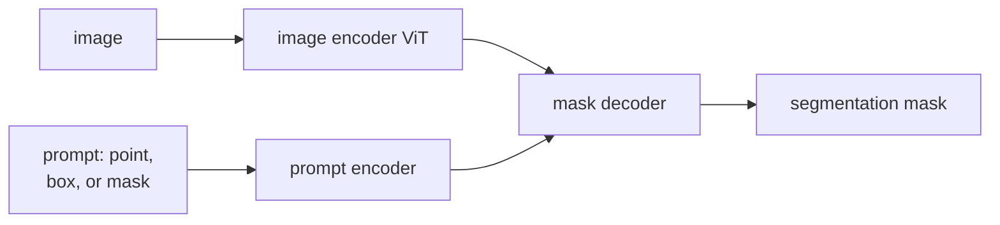

Meta AI's **Segment Anything Model (SAM)** is the closest thing vision
has to a foundation model: one model that produces high-quality masks
for any object the user points at, without per-task fine-tuning<FN n="1" />. The
recipe is interesting beyond segmentation: pretrain a promptable model
at scale on a synthetic-then-real data flywheel, and downstream task
specialization becomes prompt engineering.

## What SAM does

Input: an image + a **prompt** (a point, a box, a rough mask, or a text
in some variants).
Output: a high-quality binary mask of the object the prompt refers to.

The promptable interface is the key innovation. Instead of "predict
masks for all objects of class X", SAM answers "predict the mask of the
object that contains *this point* (or fits in *this box*)". This
generalizes far better because the task is image-specific rather than
class-specific.

## Architecture (SAM 1)

Three components:

1. **Image encoder**: a ViT-H (Huge)<FN n="2" /> trained to produce a dense feature
   embedding of the image, $\sim 64 \times 64 \times 256$. Heavy ($\sim$600M
   parameters) but run only once per image; cached for repeated prompts.
2. **Prompt encoder**: tokenizes the prompt. Points and boxes become
   spatial embeddings; rough masks are downsampled and concatenated.
3. **Mask decoder**: a lightweight Transformer that takes the image
   embedding and prompt tokens and produces a small set of candidate
   masks plus quality scores. Predicts 3 masks per prompt to handle
   ambiguity (you point at a person: do you mean the head, the upper
   body, or the whole person?).

The image encoder is the cost; the decoder is cheap (~4M parameters),
so generating masks for many prompts on the same image is fast after the
one-time encoder pass.

## The data flywheel

Training a foundation model needs a foundation-scale dataset. SAM's team
built one with a **three-stage data engine**:

1. **Assisted-manual**: human annotators labeled masks with help from a
   weak initial model. Produced ~4M masks across ~100K images.
2. **Semi-automatic**: the strengthened model auto-generated obvious
   masks; humans filled in the rest. ~5M masks.
3. **Fully automatic**: a grid of points was used as automated prompts;
   high-confidence outputs were kept. ~1B masks across 11M images.

The released **SA-1B dataset** has more than 1 billion masks. SAM is
trained on this data with a combination of focal loss, dice loss, and
IoU prediction loss.

This **annotation flywheel** is now a standard recipe: bootstrap a model
on a small human-labeled set, use it to scale up the data, retrain.
Used in DALL-E 2 (CLIP-filtered data), GPT-4 (RLHF), and many other
foundation models.

## SAM 2 (video)

The 2024 successor extends SAM to video:

- The same image encoder + prompt encoder + mask decoder.
- An additional **memory module**: features from past frames are
  attended to when masking the current frame.
- Trained on a video-mask dataset built with the same flywheel.

Result: prompt once with a point or box, get masks tracking the same
object across the entire video.

## What SAM is good at and not

**Strengths**:

- Zero-shot transfer to almost any object class.
- Pixel-precise masks even for thin or fragmented objects.
- Composes naturally with detection (use a detector's box as the SAM
  prompt to get a precise mask).
- Interactive workflows: point, point, point, refine.

**Limitations**:

- No semantic labels: SAM gives you a mask, not a class name. Pair with
  CLIP or a classifier for "what is the masked object".
- Heavy: the ViT-H encoder is expensive, especially for high
  resolutions. Smaller SAM variants (FastSAM, MobileSAM, EfficientSAM)
  trade accuracy for speed.
- Medical / specialized imaging: works less well out of the box; needs
  fine-tuning.

## Downstream uses

- **Annotation accelerators**: human labels a box, SAM produces the
  mask. 10-100x speedup over manual masking.
- **Image editing**: pair with inpainting models (e.g. Stable Diffusion)
  for "click and edit this object".
- **Video object tracking**: prompt once, track across frames with SAM 2.
- **3D extension**: SAM + multi-view + NeRF for 3D segmentation.

## Exercises

**Exercise 1.** SAM's image encoder ($\sim$600M parameters) runs once per
image; the mask decoder ($\sim$4M parameters) runs once per prompt.
Suppose an interactive session issues $50$ prompts on one image. Treating
per-call cost as proportional to parameter count, compare the total cost
of caching the image embedding against re-encoding the image for every
prompt.

Solution

**Step 1.** With caching, the encoder runs once and the decoder runs $50$
times: total $\propto 600 + 50 \cdot 4 = 600 + 200 = 800$ (in millions of
parameter-calls).

**Step 2.** Without caching, both run on every prompt: total
$\propto 50 \cdot (600 + 4) = 50 \cdot 604 = 30{,}200$.

**Step 3.** The ratio is $\frac{30{,}200}{800} \approx 37.75$, so caching
the one-time encoder pass is about $38\times$ cheaper. This is the design
reason for splitting the heavy encoder from the light decoder: the cost
that dominates is amortized across all prompts on the same image.

**Exercise 2.** SAM's mask decoder predicts $3$ candidate masks per prompt
rather than one. Explain the failure this addresses, using the example of
a single point placed on a person's shirt, and how the model picks among
the three at inference.

Solution

**Step 1.** A point prompt is inherently ambiguous: a point on a person's
shirt is consistent with masking the shirt, the upper body, or the whole
person. A model forced to emit one mask must average over these
incompatible interpretations, producing a mask that fits none of them
well.

**Step 2.** Predicting $3$ masks lets the decoder commit to distinct
hypotheses (the part, a larger sub-object, the whole object) instead of
blending them. Each candidate is internally coherent.

**Step 3.** The decoder also predicts an estimated IoU (quality) score per
candidate. At inference the highest-scoring mask is returned, or all three
are surfaced for an interactive user to choose, so ambiguity is resolved
by selection rather than by averaging.

**Exercise 3.** SAM's three-stage data engine produced roughly $4$M masks
(assisted-manual), a further $\sim$5M (semi-automatic), then $\sim$1B
(fully automatic). Explain why the stages must run in this order and what
the model contributes at each stage that makes the next one possible.

Solution

**Step 1.** Stage one needs a model good enough to assist, but none exists
yet, so annotators label masks with only weak model help. This small,
high-quality set ($\sim$4M masks) is what a first capable model is trained
on.

**Step 2.** That trained model is now good enough to auto-generate the
obvious masks in stage two, leaving humans to fill in only the cases the
model misses. Human effort per image drops, so coverage grows by another
$\sim$5M masks at similar labeling cost.

**Step 3.** The further-strengthened model is finally reliable enough to
run fully automatically: a grid of point prompts is applied and only
high-confidence outputs are kept, with no human in the loop. That removes
the human bottleneck entirely and scales to $\sim$1B masks. Each stage
depends on the model quality the previous stage's data bought, so the
order cannot be permuted: automation at scale is only safe once the model
is accurate, and accuracy requires the earlier human-curated data.

## The promptable-foundation pattern

The SAM recipe has broader resonance beyond segmentation:

1. Identify a **promptable** task (output controlled by a flexible
   user-specified prompt).
2. Build a model that can take the prompt as input.
3. Pretrain at scale via a data flywheel.
4. Downstream specialization becomes prompt engineering, not
   fine-tuning.

This pattern is now being applied to many vision tasks (depth, normal
estimation, etc.), and it is essentially how LLMs work too. The next
lesson covers a different scaling story: pretraining vision models
without labels.

<Footnotes>
  <FNItem n="1">**Kirillov, A., et al.** (2023). "Segment Anything (SAM)". *ICCV*. [arXiv:2304.02643](https://arxiv.org/abs/2304.02643). The promptable image/prompt/mask pipeline and the SA-1B data flywheel.</FNItem>
  <FNItem n="2">**Dosovitskiy, A., et al.** (2021). "An image is worth 16x16 words: transformers for image recognition at scale (ViT)". *ICLR*. [arXiv:2010.11929](https://arxiv.org/abs/2010.11929). The ViT backbone SAM uses as its image encoder.</FNItem>
</Footnotes>
