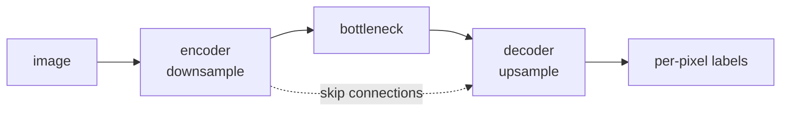

Detection puts boxes around objects; **segmentation** assigns a class to
every pixel. Two flavors: **semantic** (what class is this pixel?) and
**instance** (which object does it belong to?). The dominant
architectures are **U-Net** (semantic) and **Mask R-CNN** (instance),
both of which combine an encoder with a decoder via skip connections.

## Semantic vs instance vs panoptic

- **Semantic segmentation**: each pixel gets a class label. Two cats in
  the image both have the label "cat"; the network does not distinguish
  them.
- **Instance segmentation**: each pixel gets a class label *and* an
  instance ID. Cat 1 is separated from cat 2.
- **Panoptic segmentation**: union of the two. Stuff classes (sky,
  grass: uncountable, no instances) labeled semantically; thing classes
  (cat, person: countable) labeled per-instance.

Each task uses a different output head on top of a similar encoder.

## U-Net

Ronneberger et al. (2015), originally for biomedical imaging<FN n="1" />:

```
encoder: downsample with conv + pool
  64 -> 128 -> 256 -> 512 -> 1024 channels
  resolution: H -> H/2 -> H/4 -> H/8 -> H/16
decoder: upsample with transposed conv or interpolation
  1024 -> 512 -> 256 -> 128 -> 64
  resolution: H/16 -> H/8 -> H/4 -> H/2 -> H
  At each level, concatenate the encoder's feature map of the same resolution.
```

The **U-shape** comes from the resolution profile. The skip connections
(encoder-to-decoder concatenation at matching resolutions) carry
**fine spatial detail** that the bottleneck cannot represent. Without
skips, the upsampled output is blurry; with them, it can be pixel-precise.

Output: per-pixel class logits. Train with per-pixel cross-entropy.

U-Net's lasting impact: encoder-decoder with skip connections is now
the default for dense prediction (segmentation, depth, normal
estimation), monocular depth, and the noise-prediction backbone of
diffusion models.

## DeepLab, SegFormer, and Transformer alternatives

Successors to U-Net for semantic segmentation:

- **DeepLab v3+**: encoder is a pretrained CNN, decoder uses **atrous
  (dilated) convolutions** to expand the receptive field without
  downsampling, plus a small upsampling decoder.
- **Swin / SegFormer**: Transformer backbone with a lightweight decoder.
  Often matches or beats CNN encoder-decoders on benchmarks.
- **Mask2Former**, **OneFormer**: unified mask-based formulation for
  semantic, instance, and panoptic in one architecture.

## Mask R-CNN (instance segmentation)

Faster R-CNN's two-stage detector with a **mask head** appended:

1. Region proposal network (same as Faster R-CNN).
2. Per-proposal features extracted with **RoI Align** (a precise
   spatial extraction that fixes RoI Pooling's quantization).
3. Three parallel heads: classification, bounding-box regression, and a
   per-class mask prediction (a small fully convolutional network that
   outputs a $28 \times 28$ binary mask per proposal).
4. Per-mask binary cross-entropy loss.

Mask R-CNN is the standard instance-segmentation baseline. SOLOv2 and
QueryInst are newer alternatives.

## Panoptic segmentation

Two approaches:

- **Stuff branch + thing branch**: run semantic segmentation for stuff,
  instance segmentation for things, merge with conflict resolution.
- **Mask-based unified models**: predict a set of "masks" each labeled
  as stuff or thing (Mask2Former). Cleaner; dominant in recent work.

## Evaluation

- **Semantic**: mean IoU across classes, pixel accuracy.
- **Instance**: average precision over IoU thresholds at the **mask**
  level (mask AP).
- **Panoptic**: Panoptic Quality (PQ) = (true positives) / (true
  positives + 0.5*(false positives + false negatives)), weighted by IoU.

## Common challenges

- **Class imbalance**: foreground pixels are rare. Class-weighted loss,
  Dice loss (a per-class differentiable IoU), and focal loss help.
- **Boundary precision**: U-Net's skip connections help, but boundary
  IoU is still the main error mode. Boundary-aware losses help.
- **Small instances**: high-resolution backbones, multi-scale training.
- **Overlap and occlusion**: amodal segmentation predicts the full
  shape including occluded parts; specialized methods needed.



## Exercises

**Exercise 1.** For a single class, a predicted mask and the ground-truth
mask overlap in $30$ pixels. The prediction covers $50$ pixels and the
ground truth covers $40$. Compute the mask IoU and the Dice coefficient
$\frac{2|A \cap B|}{|A| + |B|}$, and note which is larger.

<details>
<summary>Solution</summary>

**Step 1.** The intersection is $|A \cap B| = 30$. The union is
$|A| + |B| - |A \cap B| = 50 + 40 - 30 = 60$, so
$\text{IoU} = \frac{30}{60} = 0.5$.

**Step 2.** Dice is
$\frac{2 \cdot 30}{50 + 40} = \frac{60}{90} = 0.667$.

**Step 3.** Dice exceeds IoU here, which holds in general for any
imperfect overlap: with $i = |A \cap B|$ and $u$ the union,
$\text{Dice} = \frac{2i}{u + i} \ge \frac{i}{u} = \text{IoU}$ since
$u \ge i$. The two agree only at $0$ and at a perfect match.

</details>

**Exercise 2.** Panoptic Quality is
$\text{PQ} = \frac{\sum_{\text{TP}} \text{IoU}}{\text{TP} + 0.5(\text{FP} + \text{FN})}$.
A scene has $4$ true-positive matched segments with IoUs
$0.9, 0.8, 0.7, 0.6$, plus $1$ false positive and $1$ false negative.
Compute PQ.

<details>
<summary>Solution</summary>

**Step 1.** Sum the matched IoUs: $0.9 + 0.8 + 0.7 + 0.6 = 3.0$.

**Step 2.** The denominator is
$\text{TP} + 0.5(\text{FP} + \text{FN}) = 4 + 0.5(1 + 1) = 4 + 1 = 5$.

**Step 3.** $\text{PQ} = \frac{3.0}{5} = 0.6$. PQ factors as segmentation
quality (mean matched IoU $= 3.0 / 4 = 0.75$) times recognition quality
($\text{TP} / (\text{TP} + 0.5(\text{FP} + \text{FN})) = 4 / 5 = 0.8$),
and $0.75 \cdot 0.8 = 0.6$ confirms the result.

</details>

**Exercise 3.** Removing U-Net's encoder-to-decoder skip connections
leaves only the bottleneck path. Explain in terms of spatial resolution
why the output becomes blurry, and why the skip connections fix it.

<details>
<summary>Solution</summary>

**Step 1.** The encoder downsamples the image from $H$ to $H/16$ across
its stages. The bottleneck feature map is low-resolution: each of its
cells summarizes a large input region, so fine spatial information (exact
boundary locations, thin structures) has been pooled away and cannot be
recovered by upsampling alone.

**Step 2.** Without skips, the decoder must reconstruct the full-resolution
mask from only this coarse bottleneck. Upsampling spreads each coarse cell
over many output pixels, so boundaries land roughly where the coarse cell
sat: the mask is blurry at object edges.

**Step 3.** Skip connections concatenate the encoder's high-resolution
feature maps into the decoder at each matching scale. Those maps still
carry the fine spatial detail that the bottleneck discarded, so the
decoder can place boundaries precisely instead of interpolating them from
the coarse path.

</details>

## What changed with foundation models

The next lesson covers **Segment Anything (SAM)**, which trained a
single promptable segmentation model on 1B masks and changed the
practical defaults for segmentation<FN n="2" />. For most projects today, the right
move is not to train a segmenter from scratch but to prompt SAM or
fine-tune it.

<Footnotes>
  <FNItem n="1">**Ronneberger, O., Fischer, P., & Brox, T.** (2015). "U-Net: convolutional networks for biomedical image segmentation". *MICCAI*. [arXiv:1505.04597](https://arxiv.org/abs/1505.04597). The encoder-decoder with skip connections for dense prediction.</FNItem>
  <FNItem n="2">**Kirillov, A., et al.** (2023). "Segment Anything (SAM)". *ICCV*. [arXiv:2304.02643](https://arxiv.org/abs/2304.02643). A promptable segmentation model trained on 1B masks.</FNItem>
</Footnotes>
