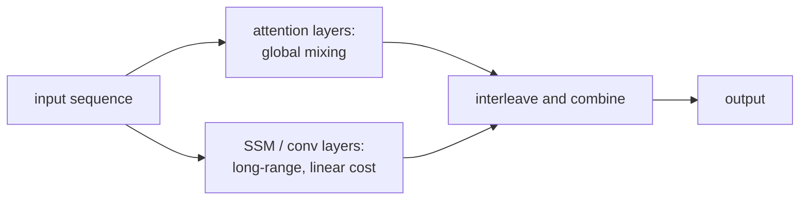

Pure attention is quadratic but precise; pure recurrence (SSM, linear
attention) is linear but loses some quality on local lookup. The
pragmatic answer is to combine them. **Hybrid architectures** interleave
attention and recurrent blocks so the model gets attention's exactness
where it helps most and recurrence's efficiency where it suffices. As of
2024, hybrids are state-of-the-art for long-context language modeling.

## The motivation

Tasks like "find the named entity from three pages ago and reuse it" are
attention's natural home: a content-based lookup against arbitrary
positions. Tasks like "compose the next token from the local context" are
where SSMs and linear attention excel: cheap, sequential, hardware-friendly.

A long-context language model needs both. Hybrid architectures use:

- **Attention** for occasional global content-based mixing.
- **SSM or linear attention** for everything else (local processing,
  bulk sequence mixing)<FN n="1" />.

The savings are large: most layers being O(N) and only a few being
O(N²) puts the overall cost solidly sub-quadratic.

## RWKV

Bo Peng et al. (2023). A pure linear-attention architecture with
**no quadratic attention at all**, but trained to behave like a
Transformer.

Recipe:

- Replace QKV softmax attention with a parametric recurrent kernel
  that combines token and channel mixing.
- Channel-wise time decay parameters give the recurrent kernel a
  data-independent "forgetting" behavior.
- Trained to match Transformer language modeling on standard
  benchmarks.

RWKV runs at constant time per token (RNN-style inference) and trains
in parallel (kernel as convolution). Earlier versions trailed pure
Transformers; RWKV-5/6 closed the gap.

Less attention to global structure than Mamba, but very fast.

## Hyena

Poli et al. (2023). Replace attention with **long convolutions** that
have learned implicit kernels:

- A kernel network produces a per-position multiplicative scaling.
- The result is convolved with the input via FFT for O(N log N) cost.
- Gated and interleaved with MLPs.

Hyena was an early signal that pure-attention was not the only viable
sequence mixer. Variants (Hyena Hierarchy, MultiHyena) are used in some
production architectures.

## Jamba

AI21 Labs (2024). Mixture of attention and Mamba blocks in a single
backbone, the Mamba block being the selective SSM of the previous lesson<FN n="2" />:

- Mostly Mamba blocks for cheap sequence mixing.
- Every $K$-th block (e.g. one in every 8) is a standard Transformer
  attention block, giving the model exact attention checkpoints.
- Mixture-of-experts FFN sublayers for high effective parameter count
  at lower inference cost.

Jamba-1.5 supports 256K context window with throughput far exceeding
pure-attention models of similar quality.

## Griffin and RecurrentGemma

DeepMind (2024). The Griffin architecture mixes a **recurrent block**
(a gated linear recurrence) and a **local attention block** with
windowed attention:

- Most blocks are recurrent.
- A few are local-attention only (no global attention).
- No quadratic global attention at any layer.

Griffin matches Llama-style Transformer quality at 7B-14B parameters
while running much faster on long contexts.

**RecurrentGemma** (Google, 2024) is a production-ready Griffin variant
released as part of the Gemma family.

## When hybrids win

For long-context inference workloads:

- **Recurrent components**: constant per-token cost (no growing KV
  cache), low memory.
- **Attention components**: where exact lookup is needed.

The combination often achieves 10x+ throughput at long context vs pure
attention, with comparable or better quality.

For short contexts (typical sub-2K-token inputs), pure attention is
fine; hybrids don't help much.

## The bigger picture

The Transformer's dominance from 2017-2022 was largely an absence of
serious competitors. From 2023 onwards, the landscape diversified:

- **Pure attention**: still the highest quality at short contexts.
- **SSMs (Mamba family)**: competitive on long context, hardware-friendly.
- **Linear attention (RWKV, others)**: simple, fast.
- **Hybrids (Jamba, Griffin)**: practical defaults for long-context.

The winning architecture for any given task as of 2024 is more
likely to be a hybrid than a pure Transformer. The pure Transformer
remains the default starting point and the most-studied baseline, but
it is no longer the only game in town.

## What about training cost

Most of the hybrid architectures train comparably to pure attention
when adjusted for parameter count. The savings come at **inference
time**, especially for long-context inference:

- Pure attention: O(N) per token (against KV cache).
- Hybrid: O(constant) per token for recurrent layers, O(local window)
  for local attention layers.

For applications like long-document summarization, RAG-with-retrieval,
or code generation with large context, hybrids dominate.

## Exercises

**Exercise 1.** Jamba interleaves blocks: one in every $K = 8$ is a
quadratic attention block and the other 7 are linear-cost Mamba blocks.
For a sequence of length $N$, write the per-token inference cost of a
single Jamba layer-group of 8 blocks (attention is $O(N)$ per token
against its KV cache, each Mamba block is $O(1)$ per token), and compare
the group's total against 8 pure-attention blocks. State how the ratio
behaves as $N$ grows.

Solution

**Step 1.** Per generated token, the group of 8 blocks costs: 1
attention block at $O(N)$ plus 7 Mamba blocks at $O(1)$ each, for a group
cost of $O(N) + 7 \cdot O(1) = O(N + 7)$, which is $O(N)$ but with a
single $N$-scaling term.

**Step 2.** Eight pure-attention blocks cost $8 \cdot O(N) = O(8N)$ per
token: every block scales with the cache length.

**Step 3.** The ratio of pure-attention cost to Jamba cost is roughly
$\frac{8N}{N + 7}$. For large $N$ this approaches 8: the hybrid does the
$N$-scaling work in only 1 of 8 blocks, so it spends about one eighth of
the context-dependent attention compute, while the 7 recurrent blocks
contribute a constant that becomes negligible as $N$ grows. The hybrid is
still $O(N)$ asymptotically (the attention checkpoints keep an exact
global lookup), but with an eighth of the constant.

**Exercise 2.** The lesson splits tasks into two kinds: "retrieve the
named entity from three pages ago" versus "compose the next token from
local context". Explain, in terms of the mechanisms from the previous two
lessons, why exact attention is the right tool for the first and a
recurrent block (SSM or linear attention) suffices for the second. Use
this to justify the hybrid design choice of placing only a few attention
layers.

Solution

**Step 1.** The retrieval task needs content-based addressing against an
arbitrary past position: the query must score against every key and pull
the matching value regardless of distance. Softmax attention does exactly
this, with each query comparing to all keys and a sharp softmax selecting
the match. A fixed-kernel recurrence compresses the past into a
bounded state, so a specific entity from far back can be overwritten or
blurred and is not guaranteed recoverable.

**Step 2.** The local-composition task needs only nearby context, which a
recurrent block carries in its running state cheaply: $O(1)$ per token
with no growing cache. Paying attention's $O(N)$ per-token cost here buys
nothing, since the needed information is already in the recent state.

**Step 3.** Most positions in a long sequence are local-composition work,
and only occasionally does the model need a long-range exact lookup. So a
hybrid spends the cheap recurrent mechanism on the bulk and reserves a
few expensive attention layers as global "checkpoints", matching each
mechanism to the task it is best at while keeping the overall cost
sub-quadratic.

**Exercise 3.** Rank these four families by per-token inference cost
against a length-$N$ context, from cheapest to most expensive, and name
the quality trade-off each accepts: (a) pure softmax-attention
Transformer, (b) pure SSM (Mamba), (c) Griffin (gated recurrence plus
windowed local attention of window $w$), (d) Jamba (mostly Mamba, one
attention block per 8). Justify any ties or near-ties.

Solution

**Step 1.** Costs per token. (a) Every layer attends against the full
cache: $O(N)$ per layer, no constant savings. (b) Mamba keeps a
fixed-size state: $O(1)$ per token, constant regardless of $N$. (c)
Griffin uses recurrent blocks at $O(1)$ plus local-attention blocks
limited to a window $w$, at $O(w)$: total $O(w)$, constant in $N$ since
$w$ is fixed. (d) Jamba is $O(N)$ from its one-in-eight global attention
block, but with an eighth of the constant of pure attention.

**Step 2.** Ranking cheapest to most expensive: pure Mamba ($O(1)$) and
Griffin ($O(w)$, constant in $N$) are the cheapest, effectively tied as
context-independent; Mamba edges Griffin because $w > 1$. Then Jamba
($O(N)$ with a small constant). Then the pure Transformer ($O(N)$ with
the full constant). Jamba and the Transformer share the asymptotic order
but Jamba's constant is roughly $8\times$ smaller.

**Step 3.** Trade-offs. Pure Mamba is cheapest but weakest on
arbitrary-distance exact lookup. Griffin keeps only local attention, so
it also lacks unbounded-range exact retrieval but adds a short exact
window. Jamba reintroduces full exact global attention in a few layers,
recovering retrieval at the price of an $O(N)$ term. The pure Transformer
has the strongest exact lookup at every layer and pays the full $O(N)$
per layer for it. Cost and exact-retrieval quality trade against each
other along this ranking.

## This closes the D3 sequence-modeling track

Pillar D's sequence track ran from word embeddings through RNNs and
LSTMs to the Transformer, then beyond it to SSMs and hybrid
architectures. The next subsection (D4) covers a different problem
entirely: generating *new* data, not predicting from existing data.

<Footnotes>
  <FNItem n="1">**Katharopoulos, A., Vyas, A., Pappas, N., & Fleuret, F.** (2020). "Transformers are RNNs: fast autoregressive transformers with linear attention". *ICML*. [arXiv:2006.16236](https://arxiv.org/abs/2006.16236). The linear-attention recurrence that pure-recurrent hybrids build on.</FNItem>
  <FNItem n="2">**Gu, A., & Dao, T.** (2023). "Mamba: linear-time sequence modeling with selective state spaces". [arXiv:2312.00752](https://arxiv.org/abs/2312.00752). The selective SSM block that Jamba and other hybrids interleave with attention.</FNItem>
</Footnotes>
