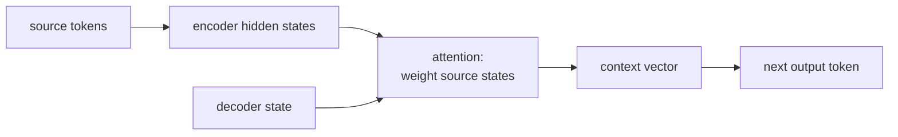

For tasks where input and output sequences have different lengths
(translation, summarization, question answering), the **encoder-decoder**
pattern is the right shape: one network reads the input, another writes
the output. **Attention** lets the decoder look back at every encoder
state at each output step, which fixed the bottleneck that limited
early seq2seq models and seeded everything Transformer-based that
followed.

## The vanilla encoder-decoder

Sutskever, Vinyals, Le (2014)<FN n="1" />.

- **Encoder**: an LSTM that reads the input sequence $x_1, \dots, x_S$
  and produces a final hidden state $h_S$ (and cell state $c_S$).
- **Decoder**: another LSTM initialized with the encoder's final state.
  At each step $t$ it consumes the previous output token (and possibly
  the previous hidden state) and predicts the next.

A single vector $h_S$ has to encode the entire input<FN n="2" />. For short
sentences this is fine; for long ones, $h_S$ becomes a bottleneck and
translation quality drops with sentence length.

## The attention fix

Bahdanau et al. (2015), Luong et al. (2015)<FN n="3" />.

Instead of compressing the input into one vector, keep **all** encoder
hidden states $\{h_1^{\text{enc}}, \dots, h_S^{\text{enc}}\}$ and let
the decoder attend to them at each output step.

At decoder step $t$:

1. Compute an **attention score** between the current decoder hidden
   state $h_t^{\text{dec}}$ and each encoder hidden state:
   $$
   e_{t, s} = \text{score}(h_t^{\text{dec}}, h_s^{\text{enc}}).
   $$
2. Softmax-normalize the scores into **attention weights**:
   $\alpha_{t, s} = \text{softmax}_s(e_{t, s})$.
3. Compute a **context vector** as the weighted sum:
   $c_t = \sum_s \alpha_{t, s}\, h_s^{\text{enc}}$.
4. Use the context vector alongside the decoder hidden state to predict
   the next output: $y_t = \text{output}(h_t^{\text{dec}}, c_t)$.

The attention weights are learned alongside the rest of the model. They
let the decoder dynamically focus on different parts of the input at
each step.

## Bahdanau vs Luong attention

**Bahdanau (additive)**:
$$
e_{t, s} = v^\top \tanh(W_h h_t^{\text{dec}} + W_e h_s^{\text{enc}}).
$$

A small feed-forward network parameterizes the scoring function.

**Luong (multiplicative)**:
$$
e_{t, s} = h_t^{\text{dec}\top} W h_s^{\text{enc}}.
$$

A simple bilinear product, cheaper to compute. In practice both work
similarly.

**Dot product** (no parameters):
$$
e_{t, s} = h_t^{\text{dec}\top} h_s^{\text{enc}}.
$$

When the encoder and decoder hidden dimensions match, this is the
simplest possible attention. It is also what the Transformer uses (with
the scaling and learned projections of the next lesson).

## What attention gave NLP

Three immediate wins, all in 2015:

- **Long-sentence translation**: attention removed the encoder
  bottleneck, so a 50-word input could be translated as well as a
  10-word one.
- **Alignment visualization**: the attention weights $\alpha_{t, s}$
  give a soft alignment between input and output tokens. For
  translation, you can plot the weights and see word-level alignments
  emerge.
- **Inductive bias for variable-length input**: a single attention
  module handles sequences of any length without architectural change.

These properties carried over to the Transformer, which dropped the
encoder LSTM entirely and used **self-attention** as the main
representation-mixing operation.

## From seq2seq+attention to the Transformer

The seq2seq+attention pattern has two recurrent networks (encoder and
decoder LSTMs) connected by an attention bridge. The Transformer:

1. Replaces the recurrent encoder with a stack of **self-attention**
   layers.
2. Replaces the recurrent decoder with a stack of self-attention plus
   the encoder-decoder cross-attention from this lesson.
3. Drops recurrence entirely.

The result is faster (parallelizable across positions) and more
expressive. The next lessons walk through self-attention and the full
Transformer.



## Check it on arrays

```python
import numpy as np

rng = np.random.default_rng(0)

# Encoder produces hidden states for a length-S source sequence
S, d_h = 8, 16
H_enc = rng.normal(scale=0.5, size=(S, d_h))

# Decoder hidden state at one step
h_dec = rng.normal(size=d_h)

def dot_attention(h_dec, H_enc):
    scores = H_enc @ h_dec                           # (S,)
    alpha = np.exp(scores - scores.max())
    alpha = alpha / alpha.sum()
    context = (alpha[:, None] * H_enc).sum(axis=0)   # (d_h,)
    return alpha, context

alpha, c = dot_attention(h_dec, H_enc)
print(f"attention weights sum to: {alpha.sum():.4f}")
print(f"attention concentrates at source position(s): {alpha.argmax()} (max alpha = {alpha.max():.2f})")
print(f"context vector shape: {c.shape}")

# Attention weights are differentiable: visualize how they shift when h_dec changes
def softmax(z):
    z = z - z.max()
    e = np.exp(z); return e / e.sum()

for shift in [0.0, 0.5, 1.0]:
    h2 = h_dec + shift * H_enc[5]                    # move toward source position 5
    a = softmax(H_enc @ h2)
    print(f"shift toward source 5 by {shift}: argmax = {a.argmax()}, top weight = {a.max():.2f}")
```

The attention distribution sums to 1 and concentrates on whichever
encoder state best aligns with the decoder query; shifting the decoder
state toward a specific source position pulls the attention to that
position.

## Exercises

**Exercise 1.** A decoder attends over $S = 3$ encoder states with raw
scores $e = (2, 0, 1)$. Compute the attention weights $\alpha =
\operatorname{softmax}(e)$ by hand (use $e^2 \approx 7.389$, $e^1 \approx
2.718$, $e^0 = 1$), and state which source position the context vector
is most aligned with.

<details>
<summary>Solution</summary>

**Step 1.** Exponentiate each score: $e^2 \approx 7.389$, $e^0 = 1$,
$e^1 \approx 2.718$.

**Step 2.** Sum them: $Z = 7.389 + 1 + 2.718 = 11.107$.

**Step 3.** Divide each by $Z$:

$$
\alpha = \left(\tfrac{7.389}{11.107}, \tfrac{1}{11.107}, \tfrac{2.718}{11.107}\right)
\approx (0.665, 0.090, 0.245).
$$

The weights sum to 1 and the largest, $0.665$, falls on source position
0, so the context vector $c = \sum_s \alpha_s h_s^{\text{enc}}$ is pulled
mostly toward $h_0^{\text{enc}}$.

</details>

**Exercise 2.** Bahdanau scoring is $e_{t,s} = v^\top \tanh(W_h
h_t^{\text{dec}} + W_e h_s^{\text{enc}})$ and Luong (dot) scoring is
$e_{t,s} = h_t^{\text{dec}\top} h_s^{\text{enc}}$. Suppose the decoder
hidden size is $d_d$ and the encoder hidden size is $d_e$. State the
shape each scoring function requires for its parameters, and explain why
the bare dot product cannot be used when $d_d \neq d_e$.

<details>
<summary>Solution</summary>

**Step 1.** Bahdanau projects both states into a shared space of size
$d_a$: $W_h \in \mathbb{R}^{d_a \times d_d}$ and $W_e \in \mathbb{R}^{d_a
\times d_e}$, summed inside the $\tanh$, then scored by $v \in
\mathbb{R}^{d_a}$. The two projections absorb any mismatch between $d_d$
and $d_e$, so additive attention works for unequal sizes.

**Step 2.** The dot product $h_t^{\text{dec}\top} h_s^{\text{enc}}$ is a
sum over a single shared index, so it requires $d_d = d_e$. When the
sizes differ the two vectors live in spaces of different dimension and
the inner product is undefined.

**Step 3.** Luong's general (multiplicative) form $h_t^{\text{dec}\top} W
h_s^{\text{enc}}$ repairs this with $W \in \mathbb{R}^{d_d \times d_e}$,
which maps the encoder state into the decoder space before the product.
The bare dot product is the special case $W = I$, valid only when the
dimensions match.

</details>

**Exercise 3 (code).** Implement dot-product attention over a batch of
$S = 4$ encoder states, then verify two properties on a fixed seed: the
weights form a valid distribution (nonnegative, sum to 1), and the
context vector equals $h_s^{\text{enc}}$ exactly in the limit where one
score dominates (scale the scores up by a large factor so softmax becomes
a hard argmax).

<details>
<summary>Solution</summary>

```python
import numpy as np

rng = np.random.default_rng(0)
S, d_h = 4, 8
H_enc = rng.normal(size=(S, d_h))
h_dec = rng.normal(size=d_h)

def softmax(z):
    z = z - z.max()
    e = np.exp(z)
    return e / e.sum()

scores = H_enc @ h_dec
alpha = softmax(scores)

# Property 1: valid distribution
assert np.all(alpha >= 0)
assert np.isclose(alpha.sum(), 1.0)

# Property 2: large temperature -> hard argmax -> context = winning state
hard = softmax(1e4 * scores)
context = (hard[:, None] * H_enc).sum(axis=0)
winner = scores.argmax()
assert np.allclose(context, H_enc[winner], atol=1e-6)
print("argmax source:", winner, " top weight:", round(alpha.max(), 3))
```

Sharpening the scores drives all the attention mass onto the
highest-scoring source state, and the context vector collapses to that
encoder hidden state, which is the hard-alignment limit of soft
attention.

</details>

The next lesson generalizes this to **self-attention**, where
queries, keys, and values all come from the same sequence.

<Footnotes>
  <FNItem n="1">**Sutskever, I., Vinyals, O., & Le, Q. V.** (2014). "Sequence to sequence learning with neural networks". *NeurIPS*. [arXiv:1409.3215](https://arxiv.org/abs/1409.3215). The LSTM encoder-decoder for machine translation.</FNItem>
  <FNItem n="2">**Cho, K., et al.** (2014). "Learning phrase representations using RNN encoder-decoder (GRU)". *EMNLP*. [arXiv:1406.1078](https://arxiv.org/abs/1406.1078). The RNN encoder-decoder whose single fixed-length code motivated attention.</FNItem>
  <FNItem n="3">**Bahdanau, D., Cho, K., & Bengio, Y.** (2015). "Neural machine translation by jointly learning to align and translate". *ICLR*. [arXiv:1409.0473](https://arxiv.org/abs/1409.0473). Introduces additive attention over encoder states.</FNItem>
</Footnotes>
