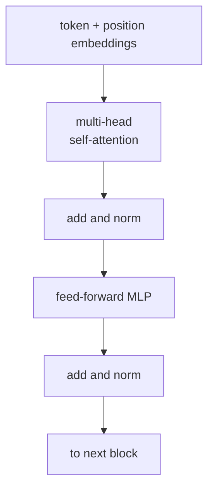

Self-attention is a single operation; the **Transformer** is the
architecture that turns it into a full sequence model. Each block
alternates self-attention with a position-wise feed-forward network,
wraps both in residual connections and LayerNorm, and stacks $L$ of
these blocks. The encoder-decoder variant adds cross-attention for
seq2seq tasks<FN n="1" />. Every modern LLM, vision Transformer, and multimodal
model is a variation of this template.

## The encoder block

For a sequence $X \in \mathbb{R}^{N \times d}$, one encoder block
computes:

$$
X' = X + \text{MultiHeadAttention}(\text{LN}(X))
$$

$$
X'' = X' + \text{FFN}(\text{LN}(X'))
$$

with **pre-norm** placement (LayerNorm before each sublayer), which is
the modern default. Original Transformer used post-norm (LayerNorm
after); pre-norm is more stable for deep stacks.

Two sublayers:

- **Multi-head self-attention** (previous lesson) mixes information
  across positions.
- **Position-wise FFN** processes each position independently with a
  two-layer MLP:
  $$
  \text{FFN}(x) = W_2\, \sigma(W_1 x + b_1) + b_2,
  $$
  with hidden dimension $d_{\text{ff}}$, typically $4d$. The activation
  $\sigma$ is GELU (or SwiGLU in modern LLMs).

The residual connections let gradients flow directly through the depth
of the stack; LayerNorm keeps the activation scale stable<FN n="2" />.

## Why "attention mixes, FFN processes"

A common reading of the Transformer block:

- Attention is the only operation that **mixes information between
  positions**. Without it, the network is a stack of independent
  per-token MLPs.
- The FFN processes each position **independently** but with a much
  larger hidden dimension than the attention. It is where most of the
  parameters live (about 2/3 of a Transformer's parameters are in
  FFNs).

Attention + FFN is the minimal architecture that has both global
mixing and per-token processing.

## The encoder-decoder Transformer

For seq2seq tasks (translation, summarization), the architecture has
two stacks:

**Encoder** ($L$ blocks): each block is self-attention + FFN as above,
applied to the source sequence.

**Decoder** ($L$ blocks): each block has three sublayers:

1. **Masked self-attention** over the target sequence (causal mask
   prevents the decoder from seeing future tokens).
2. **Cross-attention**: queries come from the decoder, keys and values
   come from the encoder. The decoder reads the encoder's
   representation.
3. **FFN**.

Each sublayer is wrapped in a residual connection and LayerNorm. The
decoder's final output is projected through a linear layer to vocabulary
logits and softmaxed to predict the next token.

## Decoder-only Transformers (GPT-style)

For autoregressive language modeling, no encoder is needed: the model
takes a prefix and predicts the next token. The architecture is just the
**decoder stack** without cross-attention:

$$
\text{Block}: x \mapsto x + \text{Attention}(\text{LN}(x)) \mapsto x + \text{FFN}(\text{LN}(x)),
$$

with a causal mask in attention. GPT, LLaMA, Claude, Gemini: all
decoder-only.

Training: feed the model a sequence, predict every next token in
parallel using teacher forcing. Loss is the cross-entropy averaged
across positions. Inference: generate one token at a time, append it to
the prefix, repeat.

## Encoder-only Transformers (BERT-style)

For tasks where the model only needs to read (classification, named
entity recognition, span extraction), use just the encoder stack with no
causal mask. BERT, RoBERTa, DeBERTa: encoder-only.

Training: masked language modeling (mask 15% of tokens, predict them
from the surrounding bidirectional context). Inference: take a final
hidden state for the [CLS] token or for span positions, feed into a
task-specific head.

## Hyperparameter dimensions

A modern decoder-only Transformer has:

- **Number of layers** $L$ (depth): 6 (small), 32 (medium), 80+ (large).
- **Model dimension** $d$ (hidden size): 512, 1024, 2048, 4096, 8192.
- **Number of heads** $H$: $d / 64$ typically, so 8, 16, 32, 64.
- **FFN expansion**: 4× or 8/3× (the latter for SwiGLU).
- **Vocabulary size** $V$: 30K-200K for subword tokenizers.

Total parameters scale roughly as $L \cdot d^2 \cdot 12$ (the leading
constant comes from 4 projections in attention + 2 in FFN at expansion
4, ignoring biases and norms).

## The training-inference asymmetry

- **Training** is parallel over positions: predict all next tokens
  simultaneously with teacher forcing. GPU-friendly.
- **Inference** is sequential: each token depends on all previous, so
  generation is one-token-at-a-time. **KV caching** stores attention
  keys and values across steps to avoid recomputing them.

Each generated token costs one forward pass. Long-context generation is
dominated by the per-step compute, which is mostly attention against the
KV cache. This is what motivates the linear-attention and SSM
alternatives later.



## Check it on arrays

```python
import numpy as np

rng = np.random.default_rng(0)

def softmax(z, axis):
    z = z - z.max(axis=axis, keepdims=True)
    e = np.exp(z); return e / e.sum(axis=axis, keepdims=True)

def gelu(x):
    return 0.5 * x * (1 + np.tanh(np.sqrt(2 / np.pi) * (x + 0.044715 * x**3)))

def layer_norm(x, eps=1e-5):
    mu = x.mean(axis=-1, keepdims=True)
    var = x.var(axis=-1, keepdims=True)
    return (x - mu) / np.sqrt(var + eps)

def multihead_attention(X, Wq, Wk, Wv, Wo, H, causal=True):
    N, d = X.shape
    d_k = d // H
    Q = X @ Wq; K = X @ Wk; V = X @ Wv
    # split into heads
    Q = Q.reshape(N, H, d_k).transpose(1, 0, 2)        # (H, N, d_k)
    K = K.reshape(N, H, d_k).transpose(1, 0, 2)
    V = V.reshape(N, H, d_k).transpose(1, 0, 2)
    scores = Q @ K.transpose(0, 2, 1) / np.sqrt(d_k)    # (H, N, N)
    if causal:
        mask = np.triu(np.ones((N, N)), k=1).astype(bool)
        scores = np.where(mask, -np.inf, scores)
    A = softmax(scores, axis=-1)
    out = A @ V                                        # (H, N, d_k)
    out = out.transpose(1, 0, 2).reshape(N, H * d_k)
    return out @ Wo

def ffn(x, W1, W2, b1, b2):
    return gelu(x @ W1 + b1) @ W2 + b2

def transformer_block(X, Wq, Wk, Wv, Wo, W1, W2, b1, b2, H):
    X = X + multihead_attention(layer_norm(X), Wq, Wk, Wv, Wo, H)
    X = X + ffn(layer_norm(X), W1, W2, b1, b2)
    return X

# Tiny decoder-only Transformer
N, d, H, d_ff = 8, 16, 4, 64
X = rng.normal(size=(N, d))

# Initialize parameters
Wq = rng.normal(scale=0.1, size=(d, d))
Wk = rng.normal(scale=0.1, size=(d, d))
Wv = rng.normal(scale=0.1, size=(d, d))
Wo = rng.normal(scale=0.1, size=(d, d))
W1 = rng.normal(scale=0.1, size=(d, d_ff))
W2 = rng.normal(scale=0.1, size=(d_ff, d))
b1 = np.zeros(d_ff); b2 = np.zeros(d)

# Stack 4 blocks
for _ in range(4):
    X = transformer_block(X, Wq, Wk, Wv, Wo, W1, W2, b1, b2, H)
print(f"output shape after 4 blocks: {X.shape}")
print(f"output norm per position: {[round(np.linalg.norm(X[i]), 2) for i in range(N)]}")

# Parameter count for this tiny model
n_params = sum(p.size for p in [Wq, Wk, Wv, Wo, W1, W2, b1, b2])
total_per_block = n_params
print(f"parameters per block: {total_per_block:,}  "
      f"(FFN: {W1.size + W2.size + b1.size + b2.size:,}, attention: {Wq.size * 4:,})")
```

The 4-block Transformer processes an 8-token sequence; FFN parameters
already dominate attention parameters at this small scale, and the
ratio only grows in real models.

## Exercises

**Exercise 1.** Using the leading-order estimate $L \cdot d^2 \cdot 12$
for the parameter count of a decoder-only Transformer, compute the
parameter count for $L = 32$ layers and model dimension $d = 4096$. Then
explain why the count is independent of sequence length $N$ but the
inference *compute* per token is not.

<details>
<summary>Solution</summary>

**Step 1.** Substitute into $L \cdot d^2 \cdot 12$:

$$
32 \cdot 4096^2 \cdot 12 = 32 \cdot 16{,}777{,}216 \cdot 12
= 6{,}442{,}450{,}944 \approx 6.4 \text{ billion}.
$$

**Step 2.** The parameters are the projection matrices $W_q, W_k, W_v,
W_o, W_1, W_2$, whose shapes depend only on $d$ and $d_{\text{ff}} = 4d$,
not on how many tokens pass through them. Sequence length never enters
the weight shapes.

**Step 3.** Inference compute does depend on $N$: the attention sublayer
scores every new query against all $N$ cached keys, an $O(N)$ cost per
generated token (the KV cache grows with context). So a fixed-size model
spends more compute per token as the context lengthens, even though its
parameter count is fixed.

</details>

**Exercise 2.** The encoder block applies pre-norm:
$X' = X + \operatorname{MHA}(\operatorname{LN}(X))$. Argue why the
residual path (the bare $+X$ that skips the sublayer) is what lets a deep
stack train, by tracing how a gradient reaches an early layer. Contrast
with a hypothetical stack that drops the residual.

<details>
<summary>Solution</summary>

**Step 1.** With the residual, the block output is $X' = X + F(X)$ where
$F = \operatorname{MHA} \circ \operatorname{LN}$. Its Jacobian is
$\partial X' / \partial X = I + \partial F / \partial X$. The identity
term guarantees the Jacobian is close to $I$ even when $\partial F /
\partial X$ is small.

**Step 2.** Backpropagating through $L$ stacked blocks multiplies these
Jacobians. With the identity present, the product keeps an $I + (\text{small})$
form, so the gradient that reaches layer 1 retains an undamped path: the
chain of identity terms passes the gradient straight through.

**Step 3.** Without the residual, the block is $X' = F(X)$ with Jacobian
$\partial F / \partial X$. The product of $L$ such Jacobians is a product
of $L$ matrices with no identity floor; if their singular values sit
below 1 the gradient shrinks geometrically with depth and early layers
stop learning (the vanishing-gradient failure the residual was designed
to remove).

</details>

**Exercise 3 (code).** A residual sublayer with pre-norm should leave the
output a stable scale regardless of depth, while a no-residual stack of
the same sublayer should let the scale drift. On a fixed seed, run a
small linear sublayer 20 times with and without the residual and confirm
that the residual version keeps the per-position norm bounded while the
plain composition collapses or explodes.

<details>
<summary>Solution</summary>

```python
import numpy as np

rng = np.random.default_rng(0)
N, d = 6, 16

def layer_norm(x, eps=1e-5):
    mu = x.mean(axis=-1, keepdims=True)
    var = x.var(axis=-1, keepdims=True)
    return (x - mu) / np.sqrt(var + eps)

# A contractive sublayer (small weights) stands in for MHA/FFN
W = rng.normal(scale=0.3, size=(d, d))
def sublayer(x):
    return layer_norm(x) @ W

X0 = rng.normal(size=(N, d))

# With residual: X = X + sublayer(X)
Xr = X0.copy()
for _ in range(20):
    Xr = Xr + sublayer(Xr)

# Without residual: X = sublayer(X)
Xp = X0.copy()
for _ in range(20):
    Xp = sublayer(Xp)

norm_res = np.linalg.norm(Xr, axis=-1).mean()
norm_plain = np.linalg.norm(Xp, axis=-1).mean()

# Residual path stays comparable to the input scale
assert 0.5 * np.linalg.norm(X0, axis=-1).mean() < norm_res
# Plain composition contracts far below the input scale
assert norm_plain < 0.1 * norm_res
print("mean norm  residual:", round(norm_res, 3), " plain:", round(norm_plain, 4))
```

The residual stack carries the input scale through all 20 applications,
while the plain composition of the same contractive sublayer drives the
signal toward zero, the depth-instability the residual connection is
there to prevent.

</details>

The next lesson covers how positional
information is injected into the otherwise position-blind self-attention.

<Footnotes>
  <FNItem n="1">**Vaswani, A., et al.** (2017). "Attention is all you need". *NeurIPS*. [arXiv:1706.03762](https://arxiv.org/abs/1706.03762). The encoder-decoder Transformer: stacked self-attention, position-wise FFNs, residuals, and LayerNorm.</FNItem>
  <FNItem n="2">**Goodfellow, I., Bengio, Y., & Courville, A.** (2016). *Deep Learning*, §8.7.5 (residual connections) and §6.3 (feed-forward units). MIT Press. The residual and FFN building blocks the Transformer block reuses.</FNItem>
</Footnotes>
