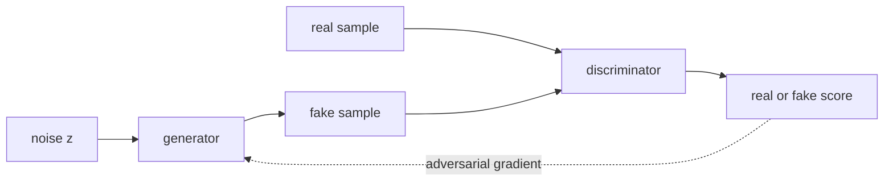

Two GAN architectures became reference points for high-quality image
generation: **StyleGAN** (faces, fine control over generated attributes)
and **BigGAN** (class-conditional ImageNet generation at scale). They
were the high-water mark of GAN-based image generation before diffusion
took over, and their architectural ideas live on in modern hybrid
generators.

## StyleGAN

Karras et al. (2019). The defining GAN for photorealistic faces.

Key innovations:

- **Mapping network**: a learned MLP transforms the input noise $z$
  into an intermediate latent $w$ before generation. $w$-space turns
  out to be much more linear and editable than $z$-space.
- **Style injection at every layer**: instead of $z$ feeding only the
  first layer, $w$ is broadcast to **AdaIN (Adaptive Instance Normalization)**
  layers at every spatial resolution. Each layer's "style" is set by $w$.
- **Noise injection**: per-pixel Gaussian noise added at every layer
  controls fine stochastic detail (skin texture, individual hairs)
  separately from the high-level style.

**Coarse-to-fine control**: the early layers control pose and global
shape; middle layers control facial features; late layers control fine
details. By interpolating $w$ at specific layer ranges, you can
selectively mix attributes from different sources.

**StyleGAN2 and StyleGAN3** refined the architecture:

- StyleGAN2 fixed a checkerboard artifact in the original.
- StyleGAN3 made the network truly translation- and rotation-equivariant
  (eliminating subtle texture sticking).

These produce the famous "this person does not exist" faces and remain
the standard for high-quality face generation when speed matters more
than diversity.

## BigGAN

Brock et al. (2019). Class-conditional generation on ImageNet at 256×256
and 512×512.

Key innovations:

- **Class-conditioned BatchNorm**: the BN scale and shift parameters
  are functions of the class label, so different classes have different
  feature statistics throughout the network.
- **Self-attention layers** inside the generator and discriminator at
  middle resolutions. Lets the model coordinate features across spatial
  positions (e.g., a dog's two ears).
- **Large batches** (2048+): much bigger than typical GAN training.
- **Hierarchical latent**: $z$ is split across layers (similar in
  spirit to StyleGAN's $w$).
- **Truncation trick**: at inference, sample $z$ from a truncated
  Gaussian. Smaller truncation gives more "average" but higher-quality
  samples; larger truncation gives more diversity at the cost of
  quality. Trades off quality vs diversity smoothly.

BigGAN achieved state-of-the-art Inception Score and FID on ImageNet at
the time, and the truncation trick became standard practice.

## Other notable architectures

- **Progressive GAN** (Karras et al., 2018): train at low resolution
  first, then progressively add layers for higher resolution. Stabilized
  high-resolution GAN training.
- **CycleGAN** (Zhu et al., 2017): unpaired image-to-image translation
  (horses to zebras, summer to winter). Uses **cycle consistency**:
  translate one way then back should give the original.
- **Pix2Pix** (Isola et al., 2017): paired image-to-image. Uses
  **conditional GAN** with $L_1$ reconstruction loss.
- **GauGAN/SPADE**: semantic map to photorealistic image. Used as
  paintbrush in NVIDIA's Canvas tool.

## What GANs gave the field

Lasting contributions beyond image generation:

- **Adversarial training as a general technique**: applied to
  domain adaptation, robustness, denoising, etc.
- **Perceptual quality losses**: discriminators (or pretrained
  feature extractors) as differentiable quality metrics, used in
  super-resolution, image compression, and audio coding.
- **Latent-space editing**: StyleGAN's $w$-space inspired latent
  diffusion's editable latents.
- **Sample-efficient generation**: GANs sample in one forward pass;
  diffusion needs many. Modern systems often distill diffusion models
  into GAN-like one-pass generators using techniques borrowed from
  adversarial training.

## Why diffusion took over

By 2022, diffusion models had surpassed GANs on most image-generation
benchmarks:

- **Easier training**: no adversarial saddle point, no mode collapse.
- **Better likelihood**: diffusion models have tractable log-likelihood
  bounds.
- **Better diversity**: diffusion captures the full data distribution
  more reliably.
- **Compositionality**: text conditioning via cross-attention works
  cleanly.

But GAN-style ideas survive: adversarial losses are still used as
auxiliary losses (in VQ-GAN, in consistency models), and StyleGAN-like
generators are sometimes distilled from diffusion models for fast
inference.

## The next lesson

The next lesson moves to a different kind of generative model:
**normalizing flows**, which have an exact tractable likelihood and an
invertible architecture. They feed directly into the modern continuous-
flow models like rectified flow.
