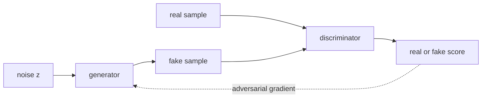

Two GAN architectures became reference points for high-quality image
generation: **StyleGAN** (faces, fine control over generated attributes)
and **BigGAN** (class-conditional ImageNet generation at scale). They
were the high-water mark of GAN-based image generation before diffusion
took over, and their architectural ideas live on in modern hybrid
generators. The stable convolutional recipe these built on came from
DCGAN<FN n="1" />.

## StyleGAN

Karras et al. (2019). The defining GAN for photorealistic faces<FN n="2" />.

Key innovations:

- **Mapping network**: a learned MLP transforms the input noise $z$
  into an intermediate latent $w$ before generation. $w$-space turns
  out to be much more linear and editable than $z$-space.
- **Style injection at every layer**: instead of $z$ feeding only the
  first layer, $w$ is broadcast to **AdaIN (Adaptive Instance Normalization)**
  layers at every spatial resolution. Each layer's "style" is set by $w$.
- **Noise injection**: per-pixel Gaussian noise added at every layer
  controls fine stochastic detail (skin texture, individual hairs)
  separately from the high-level style.

**Coarse-to-fine control**: the early layers control pose and global
shape; middle layers control facial features; late layers control fine
details. By interpolating $w$ at specific layer ranges, you can
selectively mix attributes from different sources.

**StyleGAN2 and StyleGAN3** refined the architecture:

- StyleGAN2 fixed a checkerboard artifact in the original.
- StyleGAN3 made the network truly translation- and rotation-equivariant
  (eliminating subtle texture sticking).

These produce the famous "this person does not exist" faces and remain
the standard for high-quality face generation when speed matters more
than diversity.

## BigGAN

Brock et al. (2019). Class-conditional generation on ImageNet at 256×256
and 512×512.

Key innovations:

- **Class-conditioned BatchNorm**: the BN scale and shift parameters
  are functions of the class label, so different classes have different
  feature statistics throughout the network.
- **Self-attention layers** inside the generator and discriminator at
  middle resolutions. Lets the model coordinate features across spatial
  positions (e.g., a dog's two ears).
- **Large batches** (2048+): much bigger than typical GAN training.
- **Hierarchical latent**: $z$ is split across layers (similar in
  spirit to StyleGAN's $w$).
- **Truncation trick**: at inference, sample $z$ from a truncated
  Gaussian. Smaller truncation gives more "average" but higher-quality
  samples; larger truncation gives more diversity at the cost of
  quality. Trades off quality vs diversity smoothly.

BigGAN achieved state-of-the-art Inception Score and FID on ImageNet at
the time, and the truncation trick became standard practice.

## Other notable architectures

- **Progressive GAN** (Karras et al., 2018): train at low resolution
  first, then progressively add layers for higher resolution. Stabilized
  high-resolution GAN training.
- **CycleGAN** (Zhu et al., 2017): unpaired image-to-image translation
  (horses to zebras, summer to winter). Uses **cycle consistency**:
  translate one way then back should give the original.
- **Pix2Pix** (Isola et al., 2017): paired image-to-image. Uses
  **conditional GAN** with $L_1$ reconstruction loss.
- **GauGAN/SPADE**: semantic map to photorealistic image. Used as
  paintbrush in NVIDIA's Canvas tool.

## What GANs gave the field

Lasting contributions beyond image generation:

- **Adversarial training as a general technique**: applied to
  domain adaptation, robustness, denoising, etc.
- **Perceptual quality losses**: discriminators (or pretrained
  feature extractors) as differentiable quality metrics, used in
  super-resolution, image compression, and audio coding.
- **Latent-space editing**: StyleGAN's $w$-space inspired latent
  diffusion's editable latents.
- **Sample-efficient generation**: GANs sample in one forward pass;
  diffusion needs many. Modern systems often distill diffusion models
  into GAN-like one-pass generators using techniques borrowed from
  adversarial training.

## Why diffusion took over

By 2022, diffusion models had surpassed GANs on most image-generation
benchmarks:

- **Easier training**: no adversarial saddle point, no mode collapse.
- **Better likelihood**: diffusion models have tractable log-likelihood
  bounds.
- **Better diversity**: diffusion captures the full data distribution
  more reliably.
- **Compositionality**: text conditioning via cross-attention works
  cleanly.

But GAN-style ideas survive: adversarial losses are still used as
auxiliary losses (in VQ-GAN, in consistency models), and StyleGAN-like
generators are sometimes distilled from diffusion models for fast
inference.

## Exercises

**Exercise 1.** StyleGAN injects the intermediate latent $w$ through AdaIN at
every spatial resolution rather than feeding $z$ only to the first layer. Explain
how this enables coarse-to-fine control, and what mixing $w$ from two sources at
different layer ranges does to the generated image.

Solution

**Step 1.** In a convolutional generator, early layers operate at low spatial
resolution and set global structure (pose, overall shape); later layers operate at
high resolution and set fine detail (texture, color nuance). Feeding the style $w$
into every layer's AdaIN means $w$ controls the feature statistics separately at
each scale.

**Step 2.** Because each resolution's normalization is driven by $w$, the latent
exerts coarse control at early layers and fine control at late layers. Editing $w$
and observing which scale of layer it feeds isolates which attributes it governs:
the same $w$ change at an early layer moves pose, at a late layer moves texture.

**Step 3.** Mixing means using $w_1$ for the early layer range and $w_2$ for the
late range. The image then takes coarse attributes (pose, face shape) from source
$1$ and fine attributes (skin texture, hair detail, color) from source $2$. Style
mixing is the direct consequence of injecting style per resolution rather than once
at the input.

**Exercise 2.** BigGAN's truncation trick samples the input $z$ from a Gaussian
truncated to $\lVert z \rVert$ below a threshold at inference time. Explain why a
smaller truncation threshold raises sample quality but lowers diversity, in terms of
where the generator was well trained.

Solution

**Step 1.** During training, $z$ is drawn from the full Gaussian, but the density
concentrates near the mode (small $\lVert z \rVert$); extreme-norm draws are rare,
so the generator sees few of them and is trained least well in the tails. Points
near the center of $z$-space map to the generator's most reliable, high-quality
outputs.

**Step 2.** A small truncation threshold rejects large-norm $z$ and resamples,
keeping only central codes. These decode to the high-quality, near-average samples
the generator handles best, so average fidelity rises. The cost is that the
rejected tail carried the unusual, atypical samples, so the output set loses
variety: many draws look similar.

**Step 3.** A large threshold admits more of the tail, recovering diversity but
including the poorly-trained regions where the generator produces artifacts. The
threshold thus slides smoothly between high-quality-low-diversity and
low-quality-high-diversity, a quality/diversity dial set at inference without
retraining.

**Exercise 3.** CycleGAN learns unpaired image-to-image translation between domains
$X$ and $Y$ using two generators $G: X \to Y$, $F: Y \to X$ and a cycle-consistency
loss $\lVert F(G(x)) - x\rVert$. Explain what failure the cycle loss prevents that
the adversarial losses alone would allow.

Solution

**Step 1.** The adversarial loss on $G$ only requires that $G(x)$ look like a
sample from domain $Y$; it says nothing about which $y$ a given $x$ maps to. A
generator could map every input to one convincing $Y$ image, or permute content
arbitrarily, and still fool the discriminator. Without paired supervision, nothing
ties the output's content to the input's content.

**Step 2.** The cycle loss requires $F(G(x)) \approx x$: translating to $Y$ and
back must recover the original. To satisfy it, $G$ must preserve enough of $x$'s
content that $F$ can invert it, which rules out collapsing many inputs to one
output (that would be non-invertible) and rules out discarding the input's
structure.

**Step 3.** So the cycle loss supplies the content-preservation constraint that
unpaired data lacks. The adversarial losses make outputs look like the target
domain; the cycle loss makes the mapping a content-preserving bijection rather than
an arbitrary one that merely matches the domain's statistics.

## The next lesson

The next lesson moves to a different kind of generative model:
**normalizing flows**, which have an exact tractable likelihood and an
invertible architecture. They feed directly into the modern continuous-
flow models like rectified flow.

<Footnotes>
  <FNItem n="1">**Radford, A., Metz, L., & Chintala, S.** (2016). "Unsupervised representation learning with deep convolutional GANs (DCGAN)". *ICLR*. [arXiv:1511.06434](https://arxiv.org/abs/1511.06434). The first stable convolutional GAN recipe.</FNItem>
  <FNItem n="2">**Karras, T., Laine, S., & Aila, T.** (2019). "A style-based generator architecture for generative adversarial networks (StyleGAN)". *CVPR*. [arXiv:1812.04948](https://arxiv.org/abs/1812.04948). The mapping network, style injection, and coarse-to-fine control.</FNItem>
</Footnotes>
