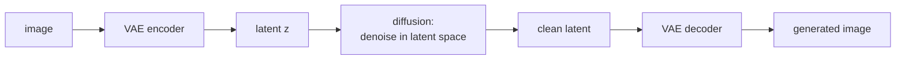

Pixel-space diffusion is expensive: 1000 steps × a forward pass on a
$512 \times 512$ image is not feasible at scale. **Latent diffusion**
(Rombach et al., 2022) runs the diffusion process in the lower-dimensional
latent space of a pretrained autoencoder, then decodes the final latent
to pixels<FN n="1" />. Stable Diffusion is the canonical example; the same recipe
underlies every modern open-source text-to-image system.

## The two-stage architecture

**Stage 1: train an autoencoder.**

- Encoder $E$ maps $x \in \mathbb{R}^{3 \times 512 \times 512}$ to a
  latent $z \in \mathbb{R}^{4 \times 64 \times 64}$ (64× spatial
  compression in pixel count, 192× in floats).
- Decoder $D$ maps $z$ back to pixels.
- Trained with VAE + perceptual + adversarial losses for high
  reconstruction fidelity.
- The autoencoder is frozen for stage 2.

**Stage 2: train a diffusion model in latent space.**

- Forward process: add noise to $z_0 = E(x_0)$ to get $z_t$.
- Denoiser $\epsilon_\theta(z_t, t, c)$ predicts the noise, conditioned
  on text $c$.
- Loss: $\lVert \epsilon - \epsilon_\theta(z_t, t, c)\rVert^2$.
- Sampling: start from $z_T \sim \mathcal{N}(0, I)$, denoise to $z_0$,
  decode with $D$.

The diffusion runs at $64 \times 64$ resolution instead of $512 \times 512$:
**64× cheaper per step**.

## Text conditioning

Use a frozen text encoder (CLIP or T5) to embed the prompt into a
sequence of token vectors. Inside the denoiser U-Net, add
**cross-attention** layers where queries come from the image latent
and keys/values come from the text embeddings:

$$
\text{CrossAttn}(z, c) = \operatorname{softmax}\!\left(\frac{(zW_Q)(cW_K)^\top}{\sqrt{d}}\right) cW_V.
$$

The denoiser learns to produce noise predictions that move the latent
toward "image matches the text prompt".

## Classifier-free guidance for text

At training time, randomly drop the text condition (replace $c$ with
an empty embedding) for ~10% of examples. At sampling time:

$$
\tilde \epsilon = (1 + w)\, \epsilon_\theta(z_t, t, c) - w\, \epsilon_\theta(z_t, t, \emptyset).
$$

Higher guidance scale $w$ sharpens the prompt adherence at the cost
of variety. Typical $w \in [5, 12]$.

## The denoiser U-Net

The architecture used inside latent diffusion is a U-Net (D2 lesson):

- Encoder downsamples in latent space.
- Decoder upsamples with skip connections.
- **Cross-attention** at each resolution mixes in text features.
- **Self-attention** at low resolutions for long-range coherence.
- **Time embedding** (sinusoidal + MLP) added to every feature map.

Newer models (SD 3, SDXL, FLUX) use **Diffusion Transformers (DiT)**
that replace the U-Net with a Transformer over latent patches, mirroring
the ViT-vs-CNN trajectory.

## Stable Diffusion model family

- **SD 1.x**: U-Net, ~860M parameters in the U-Net, CLIP text encoder.
  The reference open-source text-to-image model.
- **SD 2.x**: switches to OpenCLIP and a v-parameterization for the
  loss.
- **SDXL**: larger U-Net + dual text encoders + refinement model.
- **SD 3**: Diffusion Transformer + flow matching (next lesson) +
  multimodal text encoder.
- **FLUX, Imagen, DALL-E 3**: closed-source competitors with similar
  recipes.

## Image-to-image and inpainting

Latent diffusion easily supports edits:

- **Image-to-image**: start from $z_0 = E(x_{\text{prompt-image}})$,
  add noise to a controlled timestep $t$, denoise from there. Smaller
  $t$ preserves more of the prompt image.
- **Inpainting**: mask part of the latent and replace with noise; the
  denoiser fills in the masked region while respecting the unmasked
  context.
- **ControlNet** (Zhang et al., 2023): condition diffusion on auxiliary
  signals (depth maps, edge maps, pose skeletons) via a sidecar
  network<FN n="2" />.

These compose with the same underlying diffusion model, so a single
trained checkpoint serves many generation tasks.

## What latent diffusion gave us

Open-source, high-quality text-to-image generation at consumer
hardware speeds. The Stable Diffusion 1.x release (August 2022)
democratized image generation: anyone with a midrange GPU could
generate, fine-tune, and remix. The downstream ecosystem (LoRA fine-
tunes, ControlNets, custom checkpoints) is enormous.

The same recipe powers latent **video** diffusion (Sora, Veo) and
latent **audio** diffusion (AudioLDM).

## Limits and current research

- **Sampling speed**: still 20-50 steps in practice. Distillation
  (consistency models, next lesson) brings this to 1-4 steps.
- **Fine control**: prompt engineering is still finicky; reliable text
  rendering, complex compositions, and precise control are open
  problems.
- **Long-form video**: temporal consistency over minutes is hard.

## Exercises

**Exercise 1.** The lesson states the autoencoder compresses a
$3 \times 512 \times 512$ image to a $4 \times 64 \times 64$ latent, and that this
makes diffusion "64× cheaper per step". Verify the $64\times$ spatial-pixel
compression and explain why the per-step diffusion cost scales with the spatial
resolution rather than the channel count.

Solution

**Step 1.** Spatial pixel count of the image is $512 \times 512 = 262144$; of the
latent it is $64 \times 64 = 4096$. The ratio is $262144 / 4096 = 64$, the quoted
spatial compression.

**Step 2.** The denoiser is a convolutional or attention network applied over the
spatial grid. Convolution cost is linear in the number of spatial positions, and
self-attention cost is quadratic in it, so shrinking the grid from $512^2$ to
$64^2$ positions is what cuts the per-step compute. The channel count (3 vs 4) is a
small constant factor on top.

**Step 3.** Hence running diffusion at $64 \times 64$ instead of $512 \times 512$
saves the $64\times$ spatial factor per step (more for the attention layers, where
the saving is quadratic in positions). The autoencoder pays a one-time encode and
decode; the many diffusion steps run entirely in the small latent grid.

**Exercise 2.** In classifier-free guidance, the guided prediction is $\tilde
\epsilon = (1 + w)\,\epsilon_\theta(z_t, t, c) - w\,\epsilon_\theta(z_t, t,
\emptyset)$. Rewrite it as the unconditional prediction plus a scaled difference,
and explain what $w = 0$ and large $w$ do to prompt adherence and diversity.

Solution

**Step 1.** Group the two terms by factoring out the conditional and
unconditional predictions:

$$
\tilde\epsilon = \epsilon_\theta(z_t, t, \emptyset) + (1 + w)\,\epsilon_\theta(z_t, t, c) - (1 + w)\,\epsilon_\theta(z_t, t, \emptyset) + w\,\epsilon_\theta(z_t,t,\emptyset) - w\,\epsilon_\theta(z_t,t,\emptyset).
$$

Collecting gives the clean form

$$
\tilde\epsilon = \epsilon_\theta(z_t, t, \emptyset) + (1 + w)\big[\epsilon_\theta(z_t, t, c) - \epsilon_\theta(z_t, t, \emptyset)\big].
$$

The difference $\epsilon_\theta(\cdots c) - \epsilon_\theta(\cdots \emptyset)$ is
the direction that conditioning on $c$ adds to the noise prediction.

**Step 2.** At $w = 0$, $\tilde\epsilon = \epsilon_\theta(z_t, t, c)$, the ordinary
conditional model. Conditioning is present but not amplified, so prompt adherence is
moderate and diversity is high.

**Step 3.** As $w$ grows, the conditioning direction is scaled by $(1 + w)$,
pushing each step harder toward "matches the prompt". Prompt adherence sharpens, but
over-amplifying the conditional direction collapses the output toward the few modes
most consistent with $c$, reducing diversity (and at very high $w$, introducing
artifacts). The guidance scale is the adherence-versus-variety dial, typically
$w \in [5, 12]$.

**Exercise 3.** Latent diffusion supports image-to-image editing by encoding a
prompt image to $z_0 = E(x)$, adding noise up to a chosen timestep $t$, and
denoising from there. Explain why a smaller $t$ preserves more of the prompt image,
and what the limiting cases $t \to 0$ and $t \to T$ produce.

Solution

**Step 1.** The noised latent at step $t$ is $z_t = \sqrt{\bar\alpha_t}\,z_0 +
\sqrt{1 - \bar\alpha_t}\,\epsilon$. Smaller $t$ means $\bar\alpha_t$ is close to
$1$, so $z_t$ retains most of $z_0$ with only a little noise. The denoiser then
starts from a latent that still carries the prompt image's structure.

**Step 2.** Because the reverse process only has to undo a small amount of noise,
it preserves the encoded content and makes minor edits guided by the text. The
prompt image dominates the result.

**Step 3.** In the limit $t \to 0$, almost no noise is added and denoising returns
essentially $z_0$, so the output is the prompt image unchanged. In the limit
$t \to T$, $z_t$ is nearly pure noise with $z_0$ washed out, so the result is a
fresh sample from the text prompt with no trace of the prompt image, i.e.
text-to-image generation. The chosen $t$ slides between faithful editing and free
generation.

The next lesson covers the continuous-time framework that's overtaking
DDPM-style discrete diffusion: flow matching and rectified flow.

<Footnotes>
  <FNItem n="1">**Rombach, R., Blattmann, A., Lorenz, D., Esser, P., & Ommer, B.** (2022). "High-resolution image synthesis with latent diffusion models". *CVPR*. [arXiv:2112.10752](https://arxiv.org/abs/2112.10752). Diffusion in the latent space of a pretrained autoencoder, with cross-attention text conditioning.</FNItem>
  <FNItem n="2">**Zhang, L., Rao, A., & Agrawala, M.** (2023). "Adding conditional control to text-to-image diffusion models (ControlNet)". *ICCV*. [arXiv:2302.05543](https://arxiv.org/abs/2302.05543). The sidecar network for spatial conditioning signals.</FNItem>
</Footnotes>
