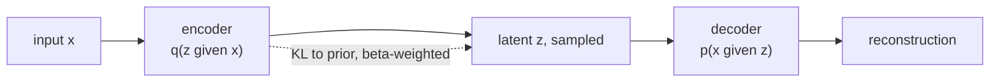

Two important VAE descendants extend the standard formulation in
opposite directions: **β-VAE** dials up the KL weight to encourage
disentangled latent factors; **VQ-VAE** replaces the continuous latent
with a learned discrete codebook, enabling powerful downstream
autoregressive generation. Both are widely used as building blocks in
modern multimodal systems.

## β-VAE

Higgins et al. (2017). Modify the ELBO by adding a hyperparameter $\beta$
to the KL term:

$$
\mathcal{L} = -\mathbb{E}_{q_\phi(z \mid x)}[\log p_\theta(x \mid z)] + \beta\, D_{\text{KL}}(q_\phi(z \mid x)\,\|\,p(z)).
$$

When $\beta = 1$ this is the standard VAE. When $\beta > 1$ (typically
4-200), the model is penalized more heavily for using latent capacity,
forcing the latent dimensions to encode **disentangled factors of
variation**: one dimension might learn rotation, another scale, another
color, etc.

Trade-off: higher $\beta$ gives more disentanglement but worse
reconstruction quality. Sweet spot depends on the dataset.

## What disentanglement buys

A disentangled latent supports:

- **Interpretable manipulation**: vary one latent and see one
  semantically meaningful change in the output.
- **Compositionality**: combine attribute values from different inputs.
- **Downstream learning efficiency**: a downstream task that depends
  on one factor can learn from a few examples once that factor is
  isolated.

The downside is loss of expressiveness. Real images have entangled
factors (lighting affects color, pose affects shape), and forcing them
apart sacrifices reconstruction.

## VQ-VAE

van den Oord et al. (2017). Replace the continuous latent with a
**discrete codebook**:

- Encoder maps input to a continuous feature vector.
- A **vector quantization** step snaps the feature to the nearest
  vector in a learned codebook of $K$ vectors.
- Decoder reconstructs from the quantized code.

Three loss terms:

1. **Reconstruction**: standard $\lVert x - \hat x\rVert^2$.
2. **Codebook loss**: encourage the codebook entries to move toward the
   encoder outputs (stop-gradient on encoder).
3. **Commitment loss**: encourage encoder outputs to stay near the
   codebook (stop-gradient on codebook).

The codebook gives the model a discrete latent representation: each
image (or image patch) is summarized by a sequence of integer indices.

**Why discrete latents matter**: discrete tokens enable powerful
autoregressive priors. After training a VQ-VAE, you can train a
Transformer to predict the next token in the VQ code sequence, exactly
like a language model. This gives you a generative model with a strong
prior.

## VQ-VAE-2 and successors

- **VQ-VAE-2** (van den Oord et al., 2019): hierarchical codebook (one
  for global structure, one for fine detail), enabling high-resolution
  image generation.
- **VQ-GAN** (Esser et al., 2021): VQ-VAE plus adversarial loss for
  perceptual quality. Powers many text-to-image systems.
- **DALL-E (v1)**: VQ-VAE codebook for images, Transformer generates
  code sequences from text.
- **Audio**: SoundStream, EnCodec use VQ-VAE for neural audio codecs.

## Where VAE variants appear today

- **Latent diffusion (D4 lesson later)** uses a standard or VQ-VAE
  autoencoder as the perceptual compressor.
- **Tokenizers for multimodal models** rely on VQ-VAE for image, audio,
  and video token spaces.
- **Disentanglement research** uses β-VAE family as benchmarks.

Less common in the limelight than diffusion or GANs as of 2024, but
ubiquitous as backend components.

## The bigger picture

The β-VAE trades expressiveness for interpretability; the VQ-VAE
trades continuous latents for discrete tokens that downstream
autoregressive models can consume. Both are case studies in modifying
the ELBO to fit a specific goal beyond pure likelihood.

The next lesson moves to a completely different generative family:
GANs.
