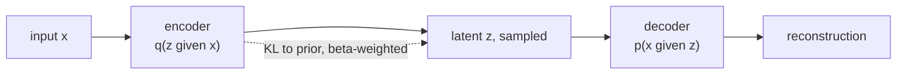

Two important VAE descendants extend the standard formulation in
opposite directions: **β-VAE** dials up the KL weight to encourage
disentangled latent factors; **VQ-VAE** replaces the continuous latent
with a learned discrete codebook, enabling powerful downstream
autoregressive generation. Both are widely used as building blocks in
modern multimodal systems.

## β-VAE

Higgins et al. (2017). Modify the ELBO by adding a hyperparameter $\beta$
to the KL term<FN n="1" />:

$$
\mathcal{L} = -\mathbb{E}_{q_\phi(z \mid x)}[\log p_\theta(x \mid z)] + \beta\, D_{\text{KL}}(q_\phi(z \mid x)\,\|\,p(z)).
$$

When $\beta = 1$ this is the standard VAE. When $\beta > 1$ (typically
4-200), the model is penalized more heavily for using latent capacity,
forcing the latent dimensions to encode **disentangled factors of
variation**: one dimension might learn rotation, another scale, another
color, etc.

Trade-off: higher $\beta$ gives more disentanglement but worse
reconstruction quality. Sweet spot depends on the dataset.

## What disentanglement buys

A disentangled latent supports:

- **Interpretable manipulation**: vary one latent and see one
  semantically meaningful change in the output.
- **Compositionality**: combine attribute values from different inputs.
- **Downstream learning efficiency**: a downstream task that depends
  on one factor can learn from a few examples once that factor is
  isolated.

The downside is loss of expressiveness. Real images have entangled
factors (lighting affects color, pose affects shape), and forcing them
apart sacrifices reconstruction.

## VQ-VAE

van den Oord et al. (2017). Replace the continuous latent with a
**discrete codebook**<FN n="2" />:

- Encoder maps input to a continuous feature vector.
- A **vector quantization** step snaps the feature to the nearest
  vector in a learned codebook of $K$ vectors.
- Decoder reconstructs from the quantized code.

Three loss terms:

1. **Reconstruction**: standard $\lVert x - \hat x\rVert^2$.
2. **Codebook loss**: encourage the codebook entries to move toward the
   encoder outputs (stop-gradient on encoder).
3. **Commitment loss**: encourage encoder outputs to stay near the
   codebook (stop-gradient on codebook).

The codebook gives the model a discrete latent representation: each
image (or image patch) is summarized by a sequence of integer indices.

**Why discrete latents matter**: discrete tokens enable powerful
autoregressive priors. After training a VQ-VAE, you can train a
Transformer to predict the next token in the VQ code sequence, exactly
like a language model. This gives you a generative model with a strong
prior.

## VQ-VAE-2 and successors

- **VQ-VAE-2** (van den Oord et al., 2019): hierarchical codebook (one
  for global structure, one for fine detail), enabling high-resolution
  image generation.
- **VQ-GAN** (Esser et al., 2021): VQ-VAE plus adversarial loss for
  perceptual quality. Powers many text-to-image systems.
- **DALL-E (v1)**: VQ-VAE codebook for images, Transformer generates
  code sequences from text.
- **Audio**: SoundStream, EnCodec use VQ-VAE for neural audio codecs.

## Where VAE variants appear today

- **Latent diffusion (D4 lesson later)** uses a standard or VQ-VAE
  autoencoder as the perceptual compressor.
- **Tokenizers for multimodal models** rely on VQ-VAE for image, audio,
  and video token spaces.
- **Disentanglement research** uses β-VAE family as benchmarks.

Less common in the limelight than diffusion or GANs as of 2024, but
ubiquitous as backend components.

## The bigger picture

The β-VAE trades expressiveness for interpretability; the VQ-VAE
trades continuous latents for discrete tokens that downstream
autoregressive models can consume. Both are case studies in modifying
the ELBO to fit a specific goal beyond pure likelihood.

## Exercises

**Exercise 1.** Write the $\beta$-VAE objective term by term and explain what
happens to the latent code in the two limits $\beta \to 0$ and $\beta \to \infty$,
in terms of reconstruction and prior matching.

Solution

**Step 1.** The objective is $\mathcal{L} = -\mathbb{E}_{q_\phi(z\mid x)}[\log p_\theta(x \mid z)] + \beta\, D_{\text{KL}}(q_\phi(z\mid x)\,\|\,p(z))$. The first term rewards reconstructing $x$ from a sampled code; the second penalizes the encoder posterior for straying from the prior, scaled by $\beta$.

**Step 2.** As $\beta \to 0$, the KL term vanishes from the loss. Only
reconstruction is optimized, so the encoder is free to use the full latent
capacity and pin codes wherever helps reconstruction. The latent space becomes
unstructured (like a plain autoencoder), and sampling the prior decodes to
garbage, because nothing forced $q_\phi$ toward $p(z)$.

**Step 3.** As $\beta \to \infty$, the KL term dominates. The cheapest way to make
KL small is to set $q_\phi(z \mid x) = p(z)$ for every input, ignoring $x$. That is
posterior collapse: the latent encodes nothing and reconstructions degrade to the
data mean. Useful disentanglement lives between these extremes, where the model is
forced to spend limited latent capacity on the few axes that most reduce
reconstruction error.

**Exercise 2.** VQ-VAE snaps a continuous encoder output $z_e$ to its nearest
codebook vector $z_q$, then decodes from $z_q$. The nearest-neighbor lookup
$z_q = e_{k^\star}$ with $k^\star = \arg\min_k \lVert z_e - e_k\rVert$ has zero
gradient almost everywhere. Explain why the encoder cannot be trained by ordinary
backprop through this step, and describe the straight-through estimator that VQ-VAE
uses instead.

Solution

**Step 1.** The map $z_e \mapsto z_q$ is piecewise constant: inside each Voronoi
cell of the codebook, the chosen index $k^\star$ does not change, so $z_q$ is
constant and $\partial z_q / \partial z_e = 0$. On cell boundaries the map jumps
and the derivative is undefined. A gradient of the decoder loss with respect to
$z_e$ computed through this step is zero everywhere it exists, so the encoder
receives no learning signal.

**Step 2.** The straight-through estimator copies the decoder's gradient at $z_q$
back to $z_e$ as if the quantization were the identity: on the backward pass it
sets $\partial z_q / \partial z_e \approx I$. In the forward pass the decoder still
sees the true quantized $z_q$; only the gradient is rerouted past the
non-differentiable lookup.

**Step 3.** Because the straight-through gradient ignores how moving $z_e$ would
change which code is selected, two auxiliary terms align the two sides: the
codebook loss pulls $e_{k^\star}$ toward $z_e$ (stop-gradient on the encoder), and
the commitment loss pulls $z_e$ toward $e_{k^\star}$ (stop-gradient on the
codebook). Together they keep encoder outputs and codebook entries close enough
that the straight-through approximation stays accurate.

**Exercise 3.** A team wants a generative model whose latent can be consumed by an
autoregressive Transformer prior to sample new images. Argue why a VQ-VAE fits this
goal better than a standard continuous-latent VAE or a $\beta$-VAE, and state the
cost of the discrete choice.

Solution

**Step 1.** An autoregressive Transformer prior models a sequence by predicting
the next token from a finite vocabulary with a softmax. It needs discrete tokens
to predict. A standard VAE and a $\beta$-VAE both produce continuous latent
vectors, which have no finite vocabulary, so a categorical next-token model does
not apply directly to their latents.

**Step 2.** VQ-VAE encodes each image as a grid of integer codebook indices: a
sequence of tokens over a vocabulary of size $K$. This is exactly the input an
autoregressive Transformer expects. After training the VQ-VAE, the prior is a
language-model-style Transformer over the index sequence, and sampling an image
means sampling a token sequence then decoding it, which is how DALL-E v1 and VQ-GAN
based systems generate.

**Step 3.** The cost is quantization error: snapping each continuous feature to the
nearest of $K$ codebook vectors discards the within-cell variation, so
reconstruction fidelity is bounded by the codebook resolution. A larger codebook or
a hierarchy (VQ-VAE-2) buys back fidelity at the price of a longer or
multi-level token sequence the prior must model. The discrete latent trades some
reconstruction accuracy for a representation an autoregressive prior can consume.

The next lesson moves to a completely different generative family:
GANs.

<Footnotes>
  <FNItem n="1">**Higgins, I., et al.** (2017). "beta-VAE: learning basic visual concepts with a constrained variational framework". *ICLR*. The KL-weighted ELBO that trades reconstruction for disentanglement.</FNItem>
  <FNItem n="2">**van den Oord, A., Vinyals, O., & Kavukcuoglu, K.** (2017). "Neural discrete representation learning (VQ-VAE)". *NeurIPS*. [arXiv:1711.00937](https://arxiv.org/abs/1711.00937). The discrete codebook and the commitment loss.</FNItem>
</Footnotes>
