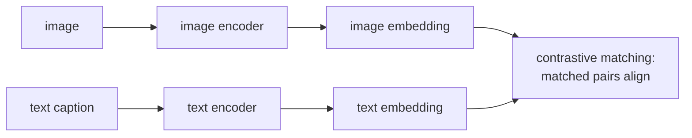

**CLIP** (Contrastive Language-Image Pretraining) is the bridge between
vision and language: train an image encoder and a text encoder
simultaneously so that paired images and captions live close together
in a shared embedding space. The trained model enables **zero-shot
classification**, powers all major text-to-image models, and is the
template for every modern image-text-audio-video joint embedding system.

## The training setup

Radford et al. (2021)<FN n="1" />. Collect a huge dataset of (image, text) pairs
from the web. The original CLIP used 400M pairs scraped from public
internet sources (image with alt-text or surrounding text).

Two encoders:

- **Image encoder** $f_I$: ResNet or ViT producing a $d$-dimensional
  embedding.
- **Text encoder** $f_T$: small Transformer producing the same $d$-
  dimensional embedding.

For each batch of $N$ (image, text) pairs:

1. Compute $\{z^I_i = f_I(x_i)\}$ and $\{z^T_i = f_T(t_i)\}$.
2. L2-normalize each embedding to unit length.
3. Compute the $N \times N$ similarity matrix $S_{ij} = z^I_i \cdot z^T_j / \tau$.
4. The diagonal $(i, i)$ entries are the true positive pairs; off-
   diagonal are negatives.
5. Symmetric cross-entropy loss: for each row, identify the matching
   text; for each column, identify the matching image.

The temperature $\tau$ is learnable, typically initialized to $\log(1/0.07)$.

## Zero-shot classification

The trained CLIP enables classification without per-task training:

1. Take a new classification task with class names "cat", "dog", ...
2. Embed each class name (e.g., "a photo of a cat") with the text
   encoder.
3. For a test image, embed it with the image encoder.
4. Find the closest class embedding by cosine similarity.

This works *zero-shot* (no training on the target dataset) and matches
or beats specialized supervised classifiers on many benchmarks. The
text encoder turns class names into a flexible classification head.

A practical recipe: **prompt templates**. "a photo of a \{class\}",
"a satellite photo of \{class\}", "a hand-drawn sketch of \{class\}",
ensembled together for robustness.

## What CLIP gets you (besides classification)

- **Image retrieval**: given a text query, find images close to its
  embedding.
- **Caption retrieval**: given an image, find similar captions.
- **Image-text matching for generative model conditioning**: latent
  diffusion uses CLIP text embeddings to guide image generation.
- **Visual question answering, RAG over images, multimodal LLMs**: CLIP
  features are the default visual input.
- **Robustness**: CLIP features transfer to unusual distributions
  (sketches, paintings, weather degradations) better than ImageNet-
  pretrained features.

## CLIP-as-a-toolkit

After release, CLIP became infrastructure:

- **Open CLIP**: open-source reproduction, scaled to billions of
  pairs. State-of-the-art reproductions of the OpenAI checkpoints.
- **EVA, SigLIP**: improved training recipes with better data and
  losses.
- **LAION-5B**: the open-source equivalent of CLIP's training data.

The OpenAI CLIP weights and Open CLIP weights are used in nearly every
text-to-image, vision-language, and multimodal embedding system in
production.

## Variants

- **ALIGN** (Google, 2021): contemporaneous with CLIP, larger scale,
  noisier data.
- **SigLIP** (2023): replaces the InfoNCE objective<FN n="2" /> with a sigmoid loss per
  (image, text) pair. Better scaling at large batch sizes.
- **EVA-CLIP** (2023): improves data and architecture for new
  state-of-the-art.
- **LiT** (2022): freeze a pretrained image encoder, only train the
  text encoder. Faster, can leverage pretrained ViTs.

## Limitations

- **Compositional understanding**: CLIP often fails to distinguish
  "a red cube on a blue sphere" from "a blue cube on a red sphere".
  The embedding represents the *set of concepts* well but not the
  *structure*.
- **Fine-grained recognition**: works less well for species-level
  distinctions (bird breeds) than dedicated classifiers.
- **Bias from web data**: CLIP inherits biases of the data it was
  trained on.
- **Limited resolution**: typical CLIP runs at 224×224 or 336×336.
  High-resolution variants exist but are more expensive.

## What this enabled

CLIP made text-conditioned image generation feasible (latent
diffusion's text encoder is a CLIP variant), enabled the multimodal
LLM era (LLaVA, GPT-4V), and is the default cross-modal embedding for
retrieval. Its influence on the field is hard to overstate.

The next lesson covers SSL methods that get strong features *without*
contrastive negatives at all.

<Footnotes>
  <FNItem n="1">**Radford, A., et al.** (2021). "Learning transferable visual models from natural language supervision (CLIP)". *ICML*. [arXiv:2103.00020](https://arxiv.org/abs/2103.00020). Symmetric image-text contrastive training and zero-shot classification.</FNItem>
  <FNItem n="2">**Oord, A. van den, Li, Y., & Vinyals, O.** (2018). "Representation learning with contrastive predictive coding (InfoNCE)". [arXiv:1807.03748](https://arxiv.org/abs/1807.03748). The InfoNCE loss CLIP applies across the image-text modality pair.</FNItem>
</Footnotes>
