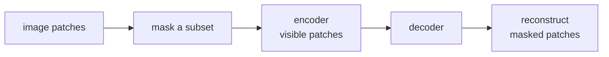

**Masked image modeling (MIM)** is BERT's recipe<FN n="2" /> ported to vision: chop
an image into patches, mask most of them, and train the network to
reconstruct or predict the masked content. MAE was the breakthrough
paper; it produces vision backbones that match or beat contrastive
methods at the same scale and trains much faster.

## The setup

He et al. (2022). MAE<FN n="1" />:

1. Patchify the image into non-overlapping patches (same as ViT, e.g.
   16×16 patches for 224×224 images → 196 patches).
2. Randomly mask **75%** of patches.
3. **Asymmetric architecture**:
   - **Encoder** is a standard ViT but only processes the 25% of patches
     that are NOT masked. Much cheaper than processing all patches.
   - **Decoder** is a smaller ViT (about 8 layers, 512-dim) that
     receives the encoded visible patches plus learned mask tokens at
     the masked positions, and predicts the original pixel values.
4. **Loss**: mean squared error on pixel values of the masked patches.

After pretraining, **discard the decoder** and use the encoder as a
vision backbone for downstream tasks.

## Why 75% mask rate

Counterintuitively high. For language, BERT masks only 15%. For images:

- Images have **high redundancy**: nearby pixels are highly correlated.
  At low mask rates, the network can reconstruct masked patches by
  copying neighbors, learning nothing.
- 75% forces the model to learn **high-level semantic features**,
  because low-level texture is not sufficient to fill in 75% of an
  image.

The high mask rate also makes the encoder much cheaper (processes only
25% of patches), enabling efficient training of huge ViTs.

## BEiT

Bao et al. (2022). Earlier work that inspired MAE:

- Uses a **discrete tokenizer** (a VQ-VAE) to tokenize image patches
  into a finite vocabulary.
- Predicts the **discrete tokens** of masked patches, not pixel values.
- Loss is cross-entropy over the codebook.

BEiT predicts a categorical distribution at each masked position
(like BERT) instead of a continuous regression (like MAE).

MAE later showed that the discrete tokenizer was unnecessary; direct
pixel reconstruction works fine. BEiT is still used in some pipelines,
particularly BEiTv2 with semantic tokens.

## Pixel target vs feature target

A design question: what should the decoder predict?

- **Pixels** (MAE): direct, no extra training of a tokenizer. Slightly
  noisier targets.
- **Discrete tokens** (BEiT): cleaner classification target, but
  requires training a separate tokenizer.
- **Features from a teacher** (MaskFeat, EVA, I-JEPA): a pretrained
  network's features are the target. Tends to give higher-quality
  representations.

The active research direction is feature targets from strong teachers,
because they encode high-level semantics directly.

## MAE vs contrastive vs DINO

For vision Transformer pretraining:

- **Contrastive (SimCLR, MoCo)**: requires augmentations and large
  batches. Strong linear probes.
- **DINO**: student-teacher EMA, multi-crop augmentations. Strong
  k-NN and linear probes, emergent object attention.
- **MAE**: very simple loss, no augmentations needed beyond the mask,
  strong fine-tuning performance.

Each has strengths:

- For **linear probing** (frozen features) and **k-NN classification**:
  DINO often wins.
- For **fine-tuning** the whole backbone: MAE often wins.
- For **scaling**: MAE's asymmetric encoder makes it cheap to scale.

In practice, modern recipes often combine ideas: I-JEPA mixes
predictive feature targets with masking; DINOv2 incorporates iBOT-style
MIM into the distillation objective.

## What MIM did for the field

- **Cheap pretraining**: MAE made it affordable to pretrain ViTs at
  large scale on academic budgets.
- **Strong fine-tuning performance**: pretrained MAE backbones became
  the default initialization for downstream vision tasks.
- **Inspired the broader denoising-SSL line**: I-JEPA, EVA, and others
  all build on MIM ideas.
- **Cross-modal masking**: the same recipe extends to video (V-JEPA),
  audio, point clouds, etc.

## Practical recipe

For a vision project:

1. **Use a pretrained MAE or DINOv2 backbone**.
2. **Fine-tune** for your task.
3. Only train MIM from scratch if you have a custom domain (medical,
   satellite) with millions of unlabeled images.

## Exercises

**Exercise 1.** MAE masks 75% of patches and runs the encoder on only
the visible 25%. For a $224 \times 224$ image with $16 \times 16$
patches, count the patches the encoder processes under MAE versus a
dense ViT that processes all of them. If encoder cost scales with the
square of the token count (attention is quadratic), what is MAE's
encoder speedup over the dense ViT?

Solution

**Step 1.** Count patches. A $224 \times 224$ image with $16 \times 16$
patches has $(224 / 16)^2 = 14^2 = 196$ patches. MAE keeps 25%, so the
encoder sees $0.25 \times 196 = 49$ patches; the dense ViT sees all 196.

**Step 2.** Apply the quadratic cost. With cost proportional to the
square of the token count, the ratio is

$$
\frac{196^2}{49^2} = \left(\frac{196}{49}\right)^2 = 4^2 = 16.
$$

**Step 3.** Read it off. MAE's encoder is about $16\times$ cheaper than
the dense ViT on the attention term, because dropping to a quarter of
the tokens cuts a quadratic cost by $4^2$. This is why the high mask
rate is not only a learning-difficulty knob but also the lever that
makes scaling MAE encoders affordable.

**Exercise 2.** The lesson says low mask rates let the network
reconstruct masked patches by copying neighbors, "learning nothing,"
while 75% forces high-level features. Frame this as a signal-redundancy
argument and explain why the analogous BERT mask rate (15%) is so much
lower for text.

Solution

**Step 1.** State the redundancy. Adjacent image pixels (and adjacent
patches) are strongly correlated: a patch is largely predictable from
its immediate neighbors by local interpolation. At a low mask rate, most
masked patches still have several visible neighbors, so the decoder can
fill them with low-level texture continuation and never needs object- or
scene-level understanding.

**Step 2.** Why 75% breaks the shortcut. Masking three patches in four
removes the local neighborhood for most masked positions, so
interpolation has nothing nearby to copy. The only way to predict a
large contiguous hole is to infer what object or structure occupies it,
which requires the high-level semantic features the pretraining is meant
to produce.

**Step 3.** Contrast with text. Tokens carry far less local redundancy:
a word is rarely recoverable by copying its neighbor, and each token is a
discrete, information-dense symbol. So even at a 15% mask rate, BERT's
masked positions are genuinely hard and force contextual prediction.
Raising text masking toward 75% would instead destroy too much context,
leaving too little signal to predict from. The right mask rate tracks the
redundancy of the modality: high for pixels, low for tokens.

**Exercise 3.** MAE regresses raw pixels (MSE), BEiT predicts discrete
codebook tokens (cross-entropy), and MaskFeat/I-JEPA predict a teacher
network's features. Lay out the trade-offs of these three target choices
along two axes: target quality (semantic content of the supervision) and
training cost/complexity. Which would you pick to pretrain a backbone on
a niche domain with no good pretrained teacher available?

Solution

**Step 1.** Pixel targets (MAE). Cost and complexity are lowest: the
target is the input itself, no auxiliary model to train or run. Target
quality is the weakest, because pixel MSE rewards reconstructing
low-level texture and is noisy with respect to semantics; the model
still learns good features at 75% masking, but the supervision signal
itself is not semantic.

**Step 2.** Discrete-token targets (BEiT). Quality is intermediate:
predicting a VQ codebook index is a cleaner classification target than
raw pixels and abstracts away some pixel noise. The cost is higher
because a separate tokenizer (a VQ-VAE) must be trained first, adding a
stage and a dependency.

**Step 3.** Feature targets (MaskFeat, I-JEPA). Quality is highest:
predicting a strong teacher's features supervises directly in a semantic
embedding space, which empirically yields the best representations. The
cost is highest and the complexity sharpest, since it needs a good
pretrained teacher and risks inheriting the teacher's blind spots.

**Step 4.** Pick for a niche domain with no teacher. Feature targets are
out, because there is no strong teacher to distill from, and training one
is the very problem being solved. Between pixels and discrete tokens,
pixel MAE is the safe default: it needs no auxiliary model, scales
cheaply, and is known to give strong fine-tuning performance, so it is
the right starting point; a domain tokenizer for BEiT is worth the extra
stage only if pixel MAE underperforms.

This closes the D5 self-supervision track. Pillar D's other tracks
(D6 GNNs, D7 training systems) cover narrower but still important
material before we move to the next pillar.

<Footnotes>
  <FNItem n="1">**He, K., Chen, X., Xie, S., Li, Y., Dollár, P., & Girshick, R.** (2022). "Masked autoencoders are scalable vision learners (MAE)". *CVPR*. [arXiv:2111.06377](https://arxiv.org/abs/2111.06377). The 75% mask rate and asymmetric encoder-decoder for pixel reconstruction.</FNItem>
  <FNItem n="2">**Devlin, J., Chang, M.-W., Lee, K., & Toutanova, K.** (2019). "BERT: pre-training of deep bidirectional transformers for language understanding". *NAACL*. [arXiv:1810.04805](https://arxiv.org/abs/1810.04805). The masked-token denoising objective that MIM ports to image patches.</FNItem>
</Footnotes>
