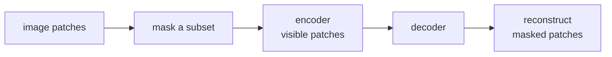

**Masked image modeling (MIM)** is BERT's recipe ported to vision: chop
an image into patches, mask most of them, and train the network to
reconstruct or predict the masked content. MAE was the breakthrough
paper; it produces vision backbones that match or beat contrastive
methods at the same scale and trains much faster.

## The setup

He et al. (2022). MAE:

1. Patchify the image into non-overlapping patches (same as ViT, e.g.
   16×16 patches for 224×224 images → 196 patches).
2. Randomly mask **75%** of patches.
3. **Asymmetric architecture**:
   - **Encoder** is a standard ViT but only processes the 25% of patches
     that are NOT masked. Much cheaper than processing all patches.
   - **Decoder** is a smaller ViT (about 8 layers, 512-dim) that
     receives the encoded visible patches plus learned mask tokens at
     the masked positions, and predicts the original pixel values.
4. **Loss**: mean squared error on pixel values of the masked patches.

After pretraining, **discard the decoder** and use the encoder as a
vision backbone for downstream tasks.

## Why 75% mask rate

Counterintuitively high. For language, BERT masks only 15%. For images:

- Images have **high redundancy**: nearby pixels are highly correlated.
  At low mask rates, the network can reconstruct masked patches by
  copying neighbors, learning nothing.
- 75% forces the model to learn **high-level semantic features**,
  because low-level texture is not sufficient to fill in 75% of an
  image.

The high mask rate also makes the encoder much cheaper (processes only
25% of patches), enabling efficient training of huge ViTs.

## BEiT

Bao et al. (2022). Earlier work that inspired MAE:

- Uses a **discrete tokenizer** (a VQ-VAE) to tokenize image patches
  into a finite vocabulary.
- Predicts the **discrete tokens** of masked patches, not pixel values.
- Loss is cross-entropy over the codebook.

BEiT predicts a categorical distribution at each masked position
(like BERT) instead of a continuous regression (like MAE).

MAE later showed that the discrete tokenizer was unnecessary; direct
pixel reconstruction works fine. BEiT is still used in some pipelines,
particularly BEiTv2 with semantic tokens.

## Pixel target vs feature target

A design question: what should the decoder predict?

- **Pixels** (MAE): direct, no extra training of a tokenizer. Slightly
  noisier targets.
- **Discrete tokens** (BEiT): cleaner classification target, but
  requires training a separate tokenizer.
- **Features from a teacher** (MaskFeat, EVA, I-JEPA): a pretrained
  network's features are the target. Tends to give higher-quality
  representations.

The active research direction is feature targets from strong teachers,
because they encode high-level semantics directly.

## MAE vs contrastive vs DINO

For vision Transformer pretraining:

- **Contrastive (SimCLR, MoCo)**: requires augmentations and large
  batches. Strong linear probes.
- **DINO**: student-teacher EMA, multi-crop augmentations. Strong
  k-NN and linear probes, emergent object attention.
- **MAE**: very simple loss, no augmentations needed beyond the mask,
  strong fine-tuning performance.

Each has strengths:

- For **linear probing** (frozen features) and **k-NN classification**:
  DINO often wins.
- For **fine-tuning** the whole backbone: MAE often wins.
- For **scaling**: MAE's asymmetric encoder makes it cheap to scale.

In practice, modern recipes often combine ideas: I-JEPA mixes
predictive feature targets with masking; DINOv2 incorporates iBOT-style
MIM into the distillation objective.

## What MIM did for the field

- **Cheap pretraining**: MAE made it affordable to pretrain ViTs at
  large scale on academic budgets.
- **Strong fine-tuning performance**: pretrained MAE backbones became
  the default initialization for downstream vision tasks.
- **Inspired the broader denoising-SSL line**: I-JEPA, EVA, and others
  all build on MIM ideas.
- **Cross-modal masking**: the same recipe extends to video (V-JEPA),
  audio, point clouds, etc.

## Practical recipe

For a vision project:

1. **Use a pretrained MAE or DINOv2 backbone**.
2. **Fine-tune** for your task.
3. Only train MIM from scratch if you have a custom domain (medical,
   satellite) with millions of unlabeled images.

This closes the D5 self-supervision track. Pillar D's other tracks
(D6 GNNs, D7 training systems) cover narrower but still important
material before we move to the next pillar.
