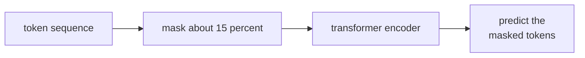

**Masked language modeling** (MLM) is the SSL pretraining objective
behind BERT and most encoder-only Transformers. The recipe: corrupt the
input by masking some tokens, train the model to predict them from
bidirectional context. Simple, scalable, and the most-used pretraining
objective in NLP after autoregressive language modeling.

## The MLM task

Devlin et al. (2019), BERT<FN n="1" />.

Given a token sequence $t_1, t_2, \dots, t_N$:

1. Randomly select 15% of token positions.
2. For each selected position $i$:
   - 80% of the time, replace $t_i$ with a special **[MASK]** token.
   - 10% of the time, replace with a random vocabulary token.
   - 10% of the time, leave $t_i$ unchanged.
3. Feed the corrupted sequence into a bidirectional Transformer encoder.
4. Predict the original $t_i$ at each masked position via cross-entropy.

The 80/10/10 split balances two pressures:

- Pure [MASK] (100%) would teach the model only to predict [MASK]
  tokens, since at inference there are no masks.
- Mixing in unchanged and random tokens forces the model to compute
  meaningful representations at *every* position, not just at masked
  positions.

## Why bidirectional context

The masked token can use information from both the left and right
context. An autoregressive language model only sees the left context.
For tasks like classification, named entity recognition, and
question-answering (where the model can read the whole input before
predicting), bidirectional context is strictly more informative.

The tradeoff: BERT-style models cannot generate text efficiently; they
need a separate decoder for that. GPT-style autoregressive models are
worse at understanding but excellent at generating.

Modern decoder-only LLMs (GPT, LLaMA) have replaced BERT for most tasks
through prompting; but BERT-style encoders are still the default for
classification, retrieval embeddings, and span extraction.

## BERT-family models

- **BERT** (Devlin et al., 2019): the original. ~110M-340M parameters.
  Trained on BookCorpus and English Wikipedia.
- **RoBERTa** (Liu et al., 2019): same architecture, better training
  (more data, more steps, no next-sentence-prediction).
- **DeBERTa** (He et al., 2021): disentangled position and content
  embeddings, plus enhanced mask decoder.
- **mBERT, XLM-R**: multilingual variants.
- **DistilBERT, TinyBERT**: smaller distilled versions for deployment.

## Beyond MLM: span / replaced-token / next-token

Several BERT successors modified the objective:

- **SpanBERT**: mask contiguous spans of tokens, predict the whole
  span. Better for span-based tasks.
- **ELECTRA** (Clark et al., 2020): use a small generator network to
  produce plausible replacement tokens, then train the main model to
  classify each token as "original" or "replaced". More training-
  efficient than MLM.
- **T5** (Raffel et al., 2020): encoder-decoder; the encoder sees the
  input with spans masked, the decoder generates the masked content.
  Reframes every NLP task as text-to-text.

ELECTRA and T5 both demonstrate that the MLM template is one point in a
larger space of denoising-autoencoding objectives.

## Tokenization

BERT uses **WordPiece** subword tokenization, splitting words into
common pieces ("playing" → "play" + "##ing"). Subword tokenization
handles out-of-vocabulary words and reduces vocabulary size to ~30K.
Modern LLMs use **Byte-Pair Encoding (BPE)** or **SentencePiece**.

The tokenizer is fixed before pretraining and shared across all
downstream uses.

## Downstream usage

After MLM pretraining, BERT is fine-tuned per task:

- **Classification**: feed the [CLS] token's final hidden state into
  a linear classifier.
- **Token classification** (NER, POS): per-token linear head.
- **Span extraction** (QA): per-token start/end position heads.
- **Sentence-pair tasks** (NLI, similarity): feed two sentences
  separated by [SEP]; use [CLS] features.

Each task adds a small task-specific head; the BERT body is fine-tuned
with a small learning rate.

## Why MLM dominated NLP (and then didn't)

2018-2022: BERT-style MLM was the dominant NLP pretraining recipe.
Nearly every paper started with "we fine-tune BERT-base on...".

2022-present: prompting large autoregressive LLMs (GPT-3, GPT-4,
Claude) replaced BERT for many tasks. The same model, prompted
differently, handles classification, span extraction, NER, translation,
etc. Fine-tuning a separate small model per task is being replaced by
prompting one big LLM.

BERT-style models remain dominant where the model output is an
**embedding** (retrieval, search) and where small, fast inference is
needed (mobile, edge). They also live on inside multimodal systems as
text encoders for CLIP-like models.

## The bigger picture

MLM is one instance of the **denoising autoencoder** family from D4:
corrupt the input, predict the original. BERT's specific recipe
(mask 15%, bidirectional encoder) is one design point.

## Exercises

**Exercise 1.** BERT masks 15% of token positions, and within those uses
the 80/10/10 split (80% replaced with [MASK], 10% random token, 10%
unchanged). For a sequence of 200 tokens, compute the expected number of
positions in each of the four categories: [MASK], random, unchanged-
but-selected, and not selected at all.

Solution

**Step 1.** Selected positions. With 15% of 200 selected,
$0.15 \times 200 = 30$ positions enter the prediction task; the
remaining $170$ are not selected.

**Step 2.** Split the 30 selected by 80/10/10:

$$
\text{[MASK]} = 0.80 \times 30 = 24,\quad
\text{random} = 0.10 \times 30 = 3,\quad
\text{unchanged} = 0.10 \times 30 = 3.
$$

**Step 3.** Tally all four categories: 24 [MASK], 3 random, 3
unchanged-but-predicted, and 170 not selected. The categories sum to
$24 + 3 + 3 + 170 = 200$. Note the loss is still computed on all 30
selected positions, including the 3 unchanged ones, which is what forces
the encoder to build a real representation even where the input looks
untouched.

**Exercise 2.** The lesson states that masking 100% with [MASK] would
"teach the model only to predict [MASK] tokens, since at inference there
are no masks." Make this train/inference mismatch precise, and explain
how each of the random-token and unchanged-token cases in the 80/10/10
split counteracts it.

Solution

**Step 1.** Name the mismatch. At pretraining, a predicted position
carries the special [MASK] embedding as its input. At fine-tuning and
inference, [MASK] never appears: every position carries a real token
embedding. If the model only ever predicted positions holding [MASK], it
could couple "this slot holds [MASK]" with "produce a content
prediction," a feature absent downstream. The input distribution at the
predicted positions differs between train and test, a covariate shift.

**Step 2.** The unchanged case. Leaving 10% of selected positions as the
true token, while still asking the model to predict them, means some
prediction targets sit on ordinary token embeddings, exactly the
condition seen at inference. The model cannot rely on "[MASK] present" as
the cue to compute a careful contextual representation, because it must
also do so on real tokens.

**Step 3.** The random case. Replacing 10% with a random vocabulary
token means the model cannot trust the input token at a selected position
to be correct; it must use the surrounding context to decide whether and
how to revise it. This pushes the encoder to represent every position
from context rather than copying its own input, again reducing reliance
on the [MASK] marker. Together the two cases spread the prediction task
across [MASK], wrong, and correct inputs, shrinking the train/inference
gap.

**Exercise 3.** ELECTRA replaces MLM with replaced-token detection: a
small generator fills masked positions with plausible tokens, and the
main model classifies every position as original or replaced. Argue why
ELECTRA extracts more training signal per sequence than MLM, and name the
cost this introduces.

Solution

**Step 1.** Count the supervised positions. MLM computes a loss only at
the selected positions, about 15% of the sequence; the other 85%
contribute no prediction target. ELECTRA's detection loss is binary and
applied at **every** position, so 100% of tokens carry a learning signal
each step.

**Step 2.** Why that raises efficiency. The main model sees a gradient
from far more positions per sequence, so it extracts more information per
token of compute, which is why ELECTRA reaches comparable quality with
fewer pretraining steps or less data than MLM. The task is also better
matched to inference: every position holds a real (possibly replaced)
token, with no [MASK] symbol, avoiding the train/inference mismatch of
Exercise 2.

**Step 3.** The cost. ELECTRA must train and run a separate generator
network alongside the main discriminator, adding a model, a coupled
training dynamic (the generator and discriminator co-evolve), and the
risk that a too-strong or too-weak generator degrades the signal. The
extra signal per sequence is bought with extra architectural and tuning
complexity.

The next lesson applies the same recipe to images: masked image
modeling.

<Footnotes>
  <FNItem n="1">**Devlin, J., Chang, M.-W., Lee, K., & Toutanova, K.** (2019). "BERT: pre-training of deep bidirectional transformers for language understanding". *NAACL*. [arXiv:1810.04805](https://arxiv.org/abs/1810.04805). The masked-language-modeling objective and the 80/10/10 corruption split.</FNItem>
</Footnotes>
