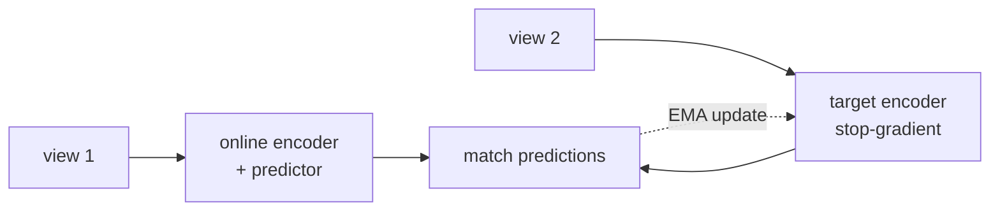

Contrastive methods need lots of negatives, which forces large batches
or queues. **Non-contrastive methods** prove this requirement is
optional: with the right architectural tricks (a target network with
stop-gradient, a predictor head), you can train great representations
*without ever using negatives*. **BYOL** and **DINO** are the canonical
methods.

## The negatives problem

InfoNCE-style contrastive learning needs negatives to prevent
representation collapse: without something to push apart, the encoder
can map every input to the same vector. The trivial fix (collect many
negatives, use a big batch) is expensive.

Non-contrastive methods solve collapse architecturally.

## BYOL (Bootstrap Your Own Latent)

Grill et al. (2020)<FN n="1" />.

Two networks:

- **Online network** $f_\theta$ with a projection head $g_\theta$ and
  an extra **predictor** $q_\theta$ (a small MLP).
- **Target network** $f_\xi$ with projection head $g_\xi$ (no predictor).
  The target's parameters are an exponential moving average of the
  online network: $\xi \leftarrow \tau \xi + (1 - \tau) \theta$.

For each input image, make two augmented views $v_1, v_2$. Compute:

- Online: $z_1 = g_\theta(f_\theta(v_1))$, predictor $p_1 = q_\theta(z_1)$.
- Target: $z_2 = g_\xi(f_\xi(v_2))$, with **stop-gradient** (no
  gradient flows through the target).

Loss: cosine distance between $p_1$ and $\text{sg}(z_2)$,
symmetrized over the two views.

Three architectural pieces prevent collapse:

1. **Predictor on the online side**: an asymmetric architecture.
2. **Stop-gradient on the target side**: the target acts as a fixed
   moving target for the online network to chase, not a co-learner.
3. **Moving-average target update**: target features are slow-moving
   compared to online features.

Without any of the three, BYOL collapses to constant features. SimSiam
later showed the stop-gradient alone is the critical ingredient, even
without a moving-average target<FN n="2" />.

Why it works precisely is still partly mysterious; empirically, the
trio is sufficient.

## DINO (Distillation with No Labels)

Caron et al. (2021)<FN n="3" />. The Transformer-friendly variant.

Same two-network setup (student + teacher with EMA), but:

- **Centering**: subtract a running mean from the teacher's outputs
  before softmax. Prevents one dimension from dominating.
- **Sharpening**: low temperature in the teacher's softmax. Sharpens
  the target distribution.
- **Cross-entropy loss** between student and teacher's softmax
  distributions (instead of cosine distance).
- **Multi-crop training**: multiple crops of different sizes per image,
  with global crops fed to the teacher and all crops fed to the
  student. The student learns to predict the global teacher view from
  local crops.

DINO produces remarkable emergent properties for ViTs:

- **Object-aware attention**: the [CLS] token's attention map highlights
  the main object without any localization supervision.
- **k-NN classification** on frozen features hits 78% on ImageNet
  without any labels.
- **Linear probes** approach fully supervised accuracy.

**DINOv2** (2023) scaled this to 142M curated images and 1B+ parameters,
producing the best general-purpose vision backbone available open-source.

## I-JEPA and related architectures

**I-JEPA** (Image Joint-Embedding Predictive Architecture, LeCun et al.,
2023). A predictor learns to predict the embeddings of masked image
regions from context embeddings. Closer in spirit to masked language
modeling but with predictions in embedding space, not pixel space.

I-JEPA shows competitive performance with simpler training and faster
convergence than masked image modeling (MAE, next lesson). Part of a
broader research direction (V-JEPA for video) pushing predictive SSL.

## Why non-contrastive is increasingly preferred

- **No negatives required**: simpler infrastructure, smaller batches.
- **Better scaling**: DINOv2 produces state-of-the-art features at the
  scale where contrastive methods were saturating.
- **Emergent semantic structure**: DINO's attention maps "discover"
  objects without any object labels.

The negative-free recipe (student-teacher EMA + asymmetric architecture
+ multi-crop) is now standard in vision SSL.

## Practical recipe

For a typical vision project:

1. **Pretrained features**: start with DINOv2 or OpenCLIP weights.
   Excellent out-of-the-box.
2. **Linear probe** for a quick baseline.
3. **Fine-tune** the backbone for the last few percentage points if
   needed.
4. **Train SSL from scratch** only if your domain is genuinely far
   from natural images and you have millions of training images.

Steps 1-3 cover the vast majority of vision projects.

## Exercises

**Exercise 1.** Contrastive InfoNCE prevents collapse with an explicit
negative-pulling term. BYOL has no negatives. State precisely what the
collapsed solution is for a non-contrastive method, why the objective
alone does not forbid it, and which of BYOL's three pieces (predictor,
stop-gradient, EMA target) directly addresses that the loss would
otherwise reward it.

Solution

**Step 1.** Name the collapse. The trivial solution is a constant
encoder: every input maps to the same fixed vector $c$. Then for any two
views the online and target outputs are both $c$, so the cosine distance
between the prediction and the target is zero, the global minimum of the
loss.

**Step 2.** Why the loss alone permits it. BYOL's objective only asks the
online prediction to match the (stop-gradient) target embedding. A
constant map satisfies "the two views agree" perfectly, with no term that
grows when representations stop being distinct. Unlike InfoNCE, nothing
in the loss penalizes mapping different images together, so the constant
solution is not merely allowed, it is optimal for the loss as written.

**Step 3.** What blocks it. The collapse is prevented by the
architecture, not the loss. The stop-gradient on the target is the key
piece: it makes the target a fixed objective the online network chases
rather than a co-learner, so the system cannot jointly slide both sides
to a shared constant in one gradient step. The online-side predictor and
the slow EMA target shape the dynamics so the chased target keeps moving
informatively. SimSiam isolates the stop-gradient as the necessary
ingredient, showing the EMA target can be dropped but the stop-gradient
cannot.

**Exercise 2.** DINO's teacher applies centering (subtract a running
mean from the logits) and sharpening (a low softmax temperature) before
forming the target distribution. These push in opposite directions.
Explain the failure each one prevents, and why both are needed together.

Solution

**Step 1.** The failure centering prevents. Without centering, one output
dimension can grow to dominate the teacher's softmax for every image, so
the teacher always outputs nearly the same one-hot distribution. The
student then learns to predict a single constant class, a collapse onto
one dimension. Subtracting the running mean removes any constant bias
that lets one coordinate run away, keeping the teacher's outputs spread
across dimensions.

**Step 2.** The failure sharpening prevents. Centering alone pushes the
teacher toward a near-uniform output (no dimension allowed to dominate),
and a uniform target carries no information: the student would be trained
to predict the uniform distribution for everything, a second, flat kind
of collapse. A low teacher temperature sharpens the softmax so the target
is peaked and image-specific, giving the student a real signal.

**Step 3.** Why both. Centering counteracts collapse-to-one-dimension but
risks collapse-to-uniform; sharpening counteracts collapse-to-uniform but
alone risks one dimension dominating. Applied together they balance:
centering keeps the output from concentrating on a fixed dimension while
sharpening keeps it from flattening, so the teacher targets stay both
spread across the batch and peaked per image. Tuning the two against each
other is what keeps DINO off both collapse modes.

**Exercise 3.** A team wants vision features for a domain (industrial
defect images) that is far from natural photos, and they have a few
hundred thousand unlabeled images but no labels. Using this lesson's
practical recipe and the contrastive-vs-non-contrastive trade-offs, lay
out a decision: start from DINOv2/OpenCLIP weights, or train SSL from
scratch, and if training from scratch, why a non-contrastive method over
a contrastive one here.

Solution

**Step 1.** Default to pretrained. The recipe says start from DINOv2 or
OpenCLIP weights and linear-probe, then fine-tune for the last
percentage points, and reserve from-scratch SSL for domains genuinely far
from natural images with millions of unlabeled images. Industrial defect
images are far from natural photos, but a few hundred thousand images is
below the "millions" bar, and the domain gap does not by itself justify
discarding strong general features.

**Step 2.** The recommended path. Begin with a DINOv2 backbone, linear-
probe for a quick baseline, then fine-tune the backbone on the unlabeled
set with the SSL objective (continued pretraining) before adapting to the
defect task. This adapts general features to the domain without paying
the from-scratch data cost, which is the right move at this data scale.

**Step 3.** If forced to train from scratch, prefer non-contrastive.
Contrastive learning needs many negatives, hence large batches or queues,
which strains a modest compute budget and a few-hundred-thousand-image
set. Non-contrastive methods (DINO-style student-teacher EMA with
multi-crop) need no negatives, work with smaller batches, and scale to
state-of-the-art where contrastive methods saturate, so for a limited
domain dataset they are the cheaper and stronger choice. The risk to
manage is collapse, controlled by the stop-gradient, centering, and
sharpening from Exercises 1 and 2.

## The next lesson

The next lesson covers the masked-modeling SSL approach, originally
from BERT but now also dominant in vision (MAE).

<Footnotes>
  <FNItem n="1">**Grill, J.-B., et al.** (2020). "Bootstrap your own latent (BYOL)". *NeurIPS*. [arXiv:2006.07733](https://arxiv.org/abs/2006.07733). Negative-free SSL via an online predictor and an EMA target.</FNItem>
  <FNItem n="2">**Chen, X., & He, K.** (2021). "Exploring simple siamese representation learning (SimSiam)". *CVPR*. [arXiv:2011.10566](https://arxiv.org/abs/2011.10566). Isolates stop-gradient as the key mechanism preventing collapse.</FNItem>
  <FNItem n="3">**Caron, M., et al.** (2021). "Emerging properties in self-supervised vision transformers (DINO)". *ICCV*. [arXiv:2104.14294](https://arxiv.org/abs/2104.14294). Student-teacher distillation with centering, sharpening, and multi-crop.</FNItem>
</Footnotes>
