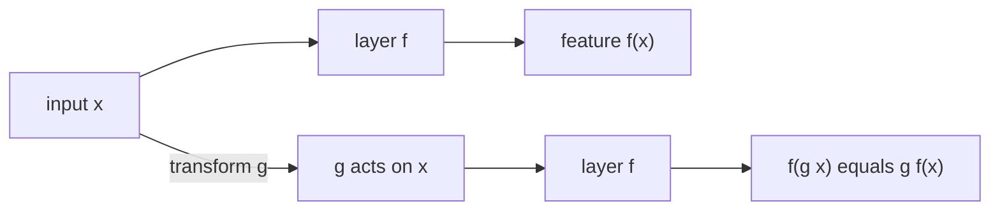

When data has a symmetry (a molecule looks the same after rotation; a
prediction should not depend on the choice of coordinate frame), the
network should *respect* that symmetry by construction. **Equivariant
neural networks** are architectures whose outputs transform predictably
under symmetry group actions. For physical sciences (chemistry,
materials, physics, robotics) they are now state-of-the-art<FN n="1" />.

## Equivariance and invariance

For a group $G$ acting on inputs and outputs:

- $f$ is **invariant** if $f(g \cdot x) = f(x)$ for all $g \in G$.
- $f$ is **equivariant** if $f(g \cdot x) = g \cdot f(x)$.

For molecule property prediction (a single scalar output), the task is
invariant under E(3) = rotations + translations + reflections of the
input coordinates. For force prediction (output is a vector), the task
is equivariant: rotating the molecule rotates the forces.

A standard MLP applied to raw coordinates is neither invariant nor
equivariant. You can attempt to learn the symmetry from data, but that
wastes capacity and generalizes poorly.

## Why equivariance helps

Three reasons:

- **Sample efficiency**: the model doesn't need to see every rotation
  of every molecule to predict on rotated molecules.
- **Generalization**: predictions on novel rotations are exact, not
  approximate.
- **Inductive bias**: the architecture encodes a physical truth about
  the data.

For molecules, equivariant networks beat non-equivariant ones at the
same parameter count, often by orders of magnitude in data efficiency.

## Simple invariant features

The easiest way to get invariance: feed the network only **invariant
features** of the input.

For 3D points $\{r_i\}$:

- Pairwise distances $\lVert r_i - r_j\rVert$ (translation- and
  rotation-invariant).
- Angles formed by triples of points.
- Dihedral angles formed by quadruples.

A GNN where messages depend only on these invariant features is
invariant by construction. **SchNet** (Schütt et al., 2018) does this:
the message function uses radial-basis-expanded distances.

This works well for small molecules and properties that depend on
internal structure. It loses information when global orientation
matters.

## Equivariant networks: E(3)-equivariant message passing

**E(3)** = rotations + translations + reflections in 3D.

Make the messages and updates respect the group action:

- Node features are split into **invariant scalars** and **equivariant
  vectors** (or higher-order tensors).
- Messages are constructed so vector outputs rotate when inputs rotate.
- Updates respect this decomposition.

Several architectures:

- **EGNN** (Satorras et al., 2021): simple equivariant message passing
  with explicit position updates. Easy to implement.
- **NequIP** (Batzner et al., 2022): higher-order spherical-harmonic
  features for force-field prediction. State of the art for molecular
  dynamics.
- **MACE** (Batatia et al., 2022): high-body-order equivariant
  features for chemistry.
- **eSCN, EquiFormer**: equivariant Transformers with attention
  generalized to the equivariant setting.

## What this enables

**Molecular property prediction**: equivariant GNNs are state of the
art on QM9, Open Catalyst, OC20, and other chemistry benchmarks.

**Molecular dynamics with learned force fields**: equivariant nets can
replace expensive DFT calculations for predicting forces in simulations
of materials and molecules. This is a huge deal for chemistry and
materials science.

**Protein structure prediction**: AlphaFold 2's architecture, while not
strictly E(3)-equivariant, takes inspiration from equivariant ideas
(its invariant point attention layer).

**Particle physics, astrophysics**: rotationally-invariant tasks
benefit similarly.

## Steerable equivariance

The mathematically richest approach (Cohen & Welling, 2016; Weiler et
al., 2018): use **steerable features** that decompose into irreducible
representations of the group<FN n="2" />.

For SO(3) (rotations), irreducible representations are indexed by
order $\ell$ (the same $\ell$ as in spherical harmonics). Features of
order 0 are scalars (invariant); features of order 1 are vectors;
features of order 2 are second-order tensors; etc.

Equivariant tensor operations (tensor products with Clebsch-Gordan
coefficients) combine features of different orders in a way that
respects rotation. This gives architectures with strong mathematical
guarantees and impressive empirical performance.

The downside: implementation is more complex than EGNN-style
"equivariant message passing" with just vectors.

## Beyond physics: equivariance in other domains

- **Sets and permutations**: any set-input task should be permutation-
  equivariant. DeepSets and most GNNs are built this way.
- **Lattice symmetries**: for crystals and physics simulations, lattice
  groups (cubic, hexagonal) drive equivariant networks.
- **Lie group equivariance**: G-CNNs generalize 2D translation
  equivariance (from CNNs) to arbitrary Lie group actions on images.

## Practical recipe

For a chemistry / 3D-data project:

1. **Start with EGNN or NequIP** as a baseline. Simple, strong.
2. **Use steerable architectures (MACE, Equiformer)** if you have
   compute and need the last few percent.
3. **Use specialized libraries** (e3nn, EquiformerV2) for steerable
   features.

For non-physics graphs without 3D coordinates, equivariance is less
relevant and standard GNNs (GCN, GAT, Graph Transformers) win.

## The bigger picture

Equivariant networks formalize the idea that **architectures should
respect the symmetries of the problem**. CNNs respect translation
symmetry; GNNs respect permutation symmetry; E(3)-equivariant nets
respect 3D rotation+translation+reflection.

This thread (geometric deep learning) is a unifying view of deep
learning architectures, and it has become a research field of its own.

## Exercises

**Exercise 1.** Show that a function built by composing an invariant feature map
with an arbitrary network is invariant. Concretely, let $\rho(x)$ be invariant
($\rho(g \cdot x) = \rho(x)$ for all $g \in G$) and let $h$ be any function. Prove
$f = h \circ \rho$ is invariant. Use this to explain why a GNN whose messages
depend only on pairwise distances $\lVert r_i - r_j\rVert$ is E(3)-invariant.

Solution

**Step 1.** Apply the group action to the input of $f$ and push it through the
composition: $f(g \cdot x) = h(\rho(g \cdot x))$.

**Step 2.** Use invariance of $\rho$ to drop the action:
$\rho(g \cdot x) = \rho(x)$, so $f(g \cdot x) = h(\rho(x)) = f(x)$. The
composition is invariant for any $h$.

**Step 3.** For the distance-based GNN, the input map is
$\rho(\{r_i\}) = \{\lVert r_i - r_j\rVert\}$. A rigid motion $g \in E(3)$ sends
$r_i \mapsto R r_i + t$ with $R$ orthogonal, so
$\lVert (R r_i + t) - (R r_j + t)\rVert = \lVert R(r_i - r_j)\rVert = \lVert r_i - r_j\rVert$
because $R$ preserves norms. The distances are invariant, hence by Steps 1 to 2
the whole network is E(3)-invariant regardless of the message and update MLPs.

**Exercise 2.** A composition of two equivariant maps is equivariant. Let $f$ and
$h$ both satisfy the equivariance relation $f(g \cdot x) = g \cdot f(x)$. Prove
$h \circ f$ is equivariant, and state why this matters when stacking many
equivariant message-passing layers.

Solution

**Step 1.** Evaluate the composition on a transformed input:
$(h \circ f)(g \cdot x) = h(f(g \cdot x))$.

**Step 2.** Use equivariance of $f$ to move the action outside:
$f(g \cdot x) = g \cdot f(x)$, giving $h(g \cdot f(x))$.

**Step 3.** Use equivariance of $h$ on the argument $f(x)$:
$h(g \cdot f(x)) = g \cdot h(f(x)) = g \cdot (h \circ f)(x)$. The composition is
equivariant.

**Step 4.** Stacking equivariant layers therefore yields a network that is
equivariant end to end, with no per-layer proof needed. This is why an
equivariant force predictor can be many layers deep and still rotate its vector
outputs exactly with the input, the property a plain MLP would only approximate.

**Exercise 3.** A team must predict (a) a molecule's total energy, a single
scalar, and (b) the per-atom force vectors. For each, state whether the target
is E(3)-invariant or E(3)-equivariant, and explain why a network using only
invariant features (pairwise distances and angles) suffices for one but fails
for the other.

Solution

**Step 1.** Energy is a scalar property of the configuration; rotating,
translating, or reflecting the molecule leaves the energy unchanged. The target
is invariant: $E(g \cdot x) = E(x)$.

**Step 2.** Force on an atom is a vector. Rotating the molecule rotates every
force vector by the same rotation: $F(g \cdot x) = g \cdot F(x)$. The target is
equivariant, not invariant.

**Step 3.** An invariant-feature network outputs quantities that do not change
under $g$, which matches the energy task exactly. So distances-and-angles models
(SchNet-style) predict energy well.

**Step 4.** For forces, an invariant network can only emit direction-free
numbers; it has no mechanism to rotate an output vector when the input rotates,
so it cannot represent an equivariant target without breaking the symmetry. The
fix is to carry equivariant vector features (EGNN, NequIP) whose outputs rotate
with the input by construction. One can recover forces as the negative gradient
of an invariant energy, which is automatically equivariant, but a directly
invariant vector head cannot.

This closes the D6 GNN track. The final D7 subsection covers the
training-systems infrastructure that makes large deep learning possible.

<Footnotes>
  <FNItem n="1">**Bronstein, M. M., Bruna, J., Cohen, T., & Veličković, P.** (2021). "Geometric deep learning: grids, groups, graphs, geodesics, and gauges". [arXiv:2104.13478](https://arxiv.org/abs/2104.13478). The unifying symmetry-based view of equivariant architectures.</FNItem>
  <FNItem n="2">**Cohen, T., & Welling, M.** (2016). "Group equivariant convolutional networks". *ICML*. [arXiv:1602.07576](https://arxiv.org/abs/1602.07576). Steerable, group-equivariant features built from irreducible representations.</FNItem>
</Footnotes>
