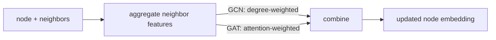

Three GNN architectures cover the practical spectrum: **GCN** is the
spectrally-motivated default; **GraphSAGE** scales to large graphs by
sampling neighborhoods; **GAT** weights neighbors with learned
attention. Each is a specific choice of message function, aggregation,
and update in the message-passing framework.

## GCN (Graph Convolutional Network)

Kipf & Welling (2017). The simplest popular GNN<FN n="1" />.

The layer update:

$$
H^{(\ell + 1)} = \sigma\!\left(\tilde D^{-1/2}\, \tilde A\, \tilde D^{-1/2}\, H^{(\ell)} W^{(\ell)}\right),
$$

where $\tilde A = A + I$ adds self-loops and $\tilde D$ is the
corresponding degree matrix.

Reading the components:

- $\tilde A H$: sum messages from neighbors (including self).
- $\tilde D^{-1/2} \cdots \tilde D^{-1/2}$: symmetric normalization
  that prevents nodes with high degree from dominating the
  aggregation.
- $H W$: linear feature transformation.
- $\sigma$: ReLU.

Motivation: GCN derives from a first-order approximation of spectral
graph convolutions. The normalization $\tilde D^{-1/2} \tilde A \tilde D^{-1/2}$
is the symmetrically-normalized graph Laplacian.

Strengths: simple, fast, the standard baseline.
Weaknesses: transductive in the original form, fixed neighborhood
aggregation, struggles on heterophilic graphs (where neighbors are
*dis*-similar).

## GraphSAGE (Sample and Aggregate)

Hamilton et al. (2017). Inductive: produces embeddings for nodes never
seen at training time<FN n="2" />.

Per layer, per node:

1. **Sample** a fixed number of neighbors (say 25). For large graphs,
   the full neighborhood is too expensive.
2. **Aggregate** the sampled neighbors' features with a learned
   aggregator (mean, max, or LSTM).
3. **Update** by concatenating the node's own feature with the
   aggregate and passing through an MLP.

$$
h_i^{(\ell + 1)} = \sigma\!\left(W^{(\ell)} \cdot [h_i^{(\ell)};\ \text{Agg}(\{h_j^{(\ell)} : j \in \mathcal{N}_s(i)\})]\right).
$$

The sampling makes minibatch training tractable: instead of
materializing the whole graph in memory, sample subgraphs around
batches of target nodes.

GraphSAGE is the default for large transductive graphs and the
standard for inductive deployment.

## GAT (Graph Attention Network)

Veličković et al. (2018). Weight each neighbor's contribution with a
learned attention coefficient<FN n="3" />.

For each edge $(i, j)$:

$$
e_{ij} = \text{LeakyReLU}\!\left(a^\top [W h_i^{(\ell)};\ W h_j^{(\ell)}]\right),
\qquad \alpha_{ij} = \operatorname{softmax}_j(e_{ij}).
$$

Then the message passing is:

$$
h_i^{(\ell + 1)} = \sigma\!\left(\sum_{j \in \mathcal{N}(i) \cup \{i\}} \alpha_{ij}\, W h_j^{(\ell)}\right).
$$

The softmax is over the neighbors of $i$ together with $i$ itself
(self-loop, as in the original GAT paper), so each $\alpha_{ij}$ is the
fraction of attention $i$ pays to $j$.

**Multi-head attention**: run $K$ parallel attention heads and
concatenate (or average) their outputs, exactly as in Transformers.

GAT's advantages: it can downweight noisy or irrelevant neighbors and
upweight informative ones, all while keeping permutation invariance.

## GCN weights vs GAT weights on one node

Both GCN and GAT collapse to "weighted average of neighbors", so it is worth
seeing the weights they actually assign diverge. Take node 2 in the toy graph
of the code block: after adding self-loops it has degree 4, with neighbors 0
and 1 (each degree 3), neighbor 3 (degree 4), and itself (degree 4). The GCN
weight node 2 pays neighbor $j$ is $1/\sqrt{\tilde d_2\, \tilde d_j}$, fixed
entirely by degrees:

- to neighbors 0 and 1: $1/\sqrt{4 \cdot 3} \approx 0.289$ each.
- to neighbor 3 and to itself: $1/\sqrt{4 \cdot 4} = 0.25$ each.

Swap any two neighbors' feature vectors and these weights do not move: GCN is
blind to what a neighbor *says*, it only sees how connected the neighbor is.
GAT's $\alpha_{2j}$ over the same four neighbors is a softmax of learned
similarity scores, so it can put $0.7$ of node 2's attention on the one
neighbor whose features match its task and $0.1$ on each of the rest, the
opposite ordering from GCN if the high-degree neighbor happens to be the
uninformative one. The named confusion to avoid: both produce a convex
combination summing to 1 over the same neighborhood, but GCN's coefficients are
a fixed property of the graph topology while GAT's are a learned function of the
features, recomputed per layer.

## Heterogeneous graphs

Many real graphs have **multiple node and edge types**: in a knowledge
graph, "person", "company", "city" are different types; "works at",
"lives in" are different edge types.

**Relational GCN (R-GCN)**: separate weight matrix per edge type.
**HGT (Heterogeneous Graph Transformer)**: attention with type-specific
projections. These extend the homogeneous GNN flavors above to
heterogeneous data.

## Practical guide

For a typical project:

- **Small homogeneous graph** (Cora-scale): GCN as a baseline.
- **Large graph with sampling**: GraphSAGE with neighbor sampling.
- **Heterophilic graphs** (where neighbors aren't similar): GAT or
  Graph Transformer.
- **Molecule property prediction**: MPNN, DimeNet, or specialized
  models with chemistry priors.

The choice often matters less than the depth, regularization, and
training recipe. Modern GNN libraries (PyG, DGL) make it trivial to
swap layer types.



## Check it on arrays

```python
import numpy as np

rng = np.random.default_rng(0)

# Small graph
N = 6
edges = [(0, 1), (1, 2), (2, 0), (3, 4), (4, 5), (5, 3), (2, 3)]
edges += [(j, i) for (i, j) in edges]
A = np.zeros((N, N))
for i, j in edges: A[i, j] = 1

d = 4
H = rng.normal(size=(N, d))

# GCN layer
def gcn(H, A, W):
    A_tilde = A + np.eye(len(A))
    deg = A_tilde.sum(axis=1)
    D_inv_sqrt = np.diag(1 / np.sqrt(deg))
    A_norm = D_inv_sqrt @ A_tilde @ D_inv_sqrt
    return np.maximum(0, A_norm @ H @ W)

W = rng.normal(scale=0.5, size=(d, d))
H_gcn = gcn(H, A, W)
print(f"GCN output norm per node: {np.linalg.norm(H_gcn, axis=1).round(2)}")

# GraphSAGE mean-aggregator layer (no sampling for the demo)
def sage(H, A, W_self, W_neigh):
    deg = A.sum(axis=1)[:, None] + 1e-8
    neigh_mean = (A @ H) / deg
    out = np.concatenate([H @ W_self, neigh_mean @ W_neigh], axis=1)
    return np.maximum(0, out)

W_self = rng.normal(scale=0.5, size=(d, d))
W_neigh = rng.normal(scale=0.5, size=(d, d))
H_sage = sage(H, A, W_self, W_neigh)
print(f"GraphSAGE output shape: {H_sage.shape}  (cat of self + neighbor halves)")

# GAT layer (single head)
def gat(H, A, W, a):
    Wh = H @ W                                            # (N, d_out)
    # Attention coefficients e_ij = LeakyReLU(a^T [Wh_i; Wh_j])
    e = np.zeros_like(A)
    for i in range(N):
        for j in range(N):
            if A[i, j] == 0 and i != j: continue
            e[i, j] = np.maximum(0.2 * (a @ np.concatenate([Wh[i], Wh[j]])),
                                  a @ np.concatenate([Wh[i], Wh[j]]))
    # Softmax over each row's neighbors (mask non-neighbors to -inf)
    mask = (A + np.eye(N)).astype(bool)
    e_masked = np.where(mask, e, -np.inf)
    e_shifted = e_masked - e_masked.max(axis=1, keepdims=True)
    alpha = np.exp(e_shifted)
    alpha = alpha / alpha.sum(axis=1, keepdims=True)
    return np.maximum(0, alpha @ Wh)

W_gat = rng.normal(scale=0.5, size=(d, d))
a_gat = rng.normal(scale=0.5, size=(2 * d,))
H_gat = gat(H, A, W_gat, a_gat)
print(f"GAT output norm per node: {np.linalg.norm(H_gat, axis=1).round(2)}")
```

Each of the three layers produces per-node embeddings of the same
shape but with different mixing rules.

## Exercises

**Exercise 1.** In the two-triangle bridge graph, node 2 has self-inclusive
neighbors $0, 1, 3$ (and itself), with self-loop degrees $\tilde d_2 = 4$,
$\tilde d_0 = \tilde d_1 = 3$, $\tilde d_3 = 4$. Compute the GCN symmetric-
normalization weight $1/\sqrt{\tilde d_2\, \tilde d_j}$ that node 2 assigns each
of these four neighbors by hand.

<details>
<summary>Solution</summary>

**Step 1.** The weight to neighbor $j$ is $(\tilde D^{-1/2} \tilde A \tilde D^{-1/2})_{2j} = 1/\sqrt{\tilde d_2\, \tilde d_j}$ for an edge present in $\tilde A$.

**Step 2.** To neighbors 0 and 1 (degree 3): $1/\sqrt{4 \cdot 3} = 1/\sqrt{12} \approx 0.289$ each.

**Step 3.** To neighbor 3 and to itself (degree 4): $1/\sqrt{4 \cdot 4} = 1/4 = 0.25$ each.

The high-degree neighbor 3 and the self-loop are downweighted relative to the
lower-degree neighbors 0 and 1, which is the degree normalization preventing
hubs from dominating.

</details>

**Exercise 2.** A GAT node $i$ attends over its self-inclusive neighborhood
$\{i, a, b\}$ with pre-softmax LeakyReLU scores $e_{ii} = 1$, $e_{ia} = 1$,
$e_{ib} = 2$. Compute the attention coefficients $\alpha_{ij}$ by hand and
confirm they sum to 1.

<details>
<summary>Solution</summary>

**Step 1.** GAT normalizes scores with a softmax over the neighborhood:
$\alpha_{ij} = e^{e_{ij}} / \sum_k e^{e_{ik}}$.

**Step 2.** The exponentials are $e^1 \approx 2.718$, $e^1 \approx 2.718$, and
$e^2 \approx 7.389$, summing to $\approx 12.826$.

**Step 3.** Divide each through:

$$
\alpha_{ii} = \alpha_{ia} = \frac{2.718}{12.826} \approx 0.212, \qquad \alpha_{ib} = \frac{7.389}{12.826} \approx 0.576.
$$

They sum to $0.212 + 0.212 + 0.576 = 1.0$. The neighbor with the higher score
$b$ captures most of the attention, the data-dependent weighting GCN cannot do.

</details>

**Exercise 3 (code).** Implement the GCN symmetric normalization
$\tilde D^{-1/2} \tilde A \tilde D^{-1/2}$ directly in numpy on the two-triangle
bridge graph. Assert that the normalized matrix is symmetric and that node 2's
weights to neighbors 0 and 1 are $1/\sqrt{12}$ and to neighbor 3 and itself are
$1/4$, matching Exercise 1.

<details>
<summary>Solution</summary>

```python
import numpy as np

N = 6
edges = [(0, 1), (1, 2), (2, 0), (3, 4), (4, 5), (5, 3), (2, 3)]
edges += [(j, i) for (i, j) in edges]
A = np.zeros((N, N))
for i, j in edges: A[i, j] = 1

def gcn_norm(A):
    A_tilde = A + np.eye(len(A))
    deg = A_tilde.sum(axis=1)
    D_inv_sqrt = np.diag(1 / np.sqrt(deg))
    return D_inv_sqrt @ A_tilde @ D_inv_sqrt

A_norm = gcn_norm(A)

assert np.allclose(A_norm, A_norm.T)               # symmetric normalization
assert np.isclose(A_norm[2, 0], 1 / np.sqrt(12))   # to degree-3 neighbor
assert np.isclose(A_norm[2, 2], 0.25)              # to self (degree 4)
print("node 2 weights:", A_norm[2].round(4))
```

The normalized adjacency is symmetric and its node-2 row reproduces the
by-hand weights $0.289, 0.289, 0.25, 0.25$, fixed entirely by degrees.

</details>

The next lesson generalizes GAT's attention to global attention over the whole
graph: Graph Transformers.

<Footnotes>
  <FNItem n="1">**Kipf, T. N., & Welling, M.** (2017). "Semi-supervised classification with graph convolutional networks (GCN)". *ICLR*. [arXiv:1609.02907](https://arxiv.org/abs/1609.02907). The symmetric-normalization layer derived from spectral graph convolutions.</FNItem>
  <FNItem n="2">**Hamilton, W. L., Ying, R., & Leskovec, J.** (2017). "Inductive representation learning on large graphs (GraphSAGE)". *NeurIPS*. [arXiv:1706.02216](https://arxiv.org/abs/1706.02216). Sample-and-aggregate for inductive embeddings.</FNItem>
  <FNItem n="3">**Veličković, P., Cucurull, G., Casanova, A., Romero, A., Liò, P., & Bengio, Y.** (2018). "Graph attention networks (GAT)". *ICLR*. [arXiv:1710.10903](https://arxiv.org/abs/1710.10903). Learned attention coefficients over neighborhoods.</FNItem>
</Footnotes>
