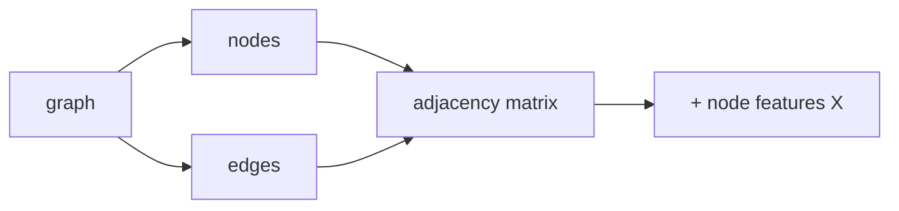

Many domains have data that is naturally a **graph**: social networks,
molecules, knowledge bases, road networks, code, scenes. **Graph neural
networks (GNNs)** are deep learning models specialized to these
structures. This lesson sets up the basics: how to encode a graph for a
neural network, and what the standard learning tasks look like<FN ns="1, 2" />.

## What a graph is

A graph $G = (V, E)$ has:

- A set of **nodes** (or vertices) $V$ with $|V| = N$.
- A set of **edges** $E \subseteq V \times V$, possibly directed or
  weighted.

In learning, nodes and edges carry **features**:

- $X \in \mathbb{R}^{N \times d}$: node feature matrix, one row per
  node, $d$-dim features.
- $E_{ij} \in \mathbb{R}^{d_e}$: per-edge features (sometimes).

## Representing the graph

Three standard representations:

- **Adjacency matrix** $A \in \{0, 1\}^{N \times N}$: $A_{ij} = 1$ if
  $(i, j) \in E$. Dense; $O(N^2)$ memory. Used for dense graphs and
  spectral methods.
- **Edge list**: list of $(i, j)$ tuples. $O(|E|)$ memory. Used for
  sparse graphs.
- **Adjacency list**: dictionary mapping each node to its list of
  neighbors. $O(|E|)$ memory; cheap neighborhood lookup. Used by GNN
  libraries.

PyTorch Geometric, DGL, and other GNN libraries use sparse
representations internally.

## The three learning tasks

GNNs solve three task families:

- **Node-level**: classify or regress on individual nodes.
  Examples: paper classification in a citation network, fraud
  detection on a transaction graph.
- **Edge-level**: predict edges (link prediction) or score edge
  attributes. Examples: predict friendships in a social network,
  predict drug-drug interactions.
- **Graph-level**: predict a single property of the whole graph.
  Examples: molecule toxicity, scene classification.

The same backbone architecture handles all three; only the readout
head differs. For graph-level prediction, **graph pooling** (mean, max,
sum, or learned attention pool over nodes) collapses the per-node
features into one vector.

## Why standard MLPs and CNNs are not enough

MLPs need fixed-size inputs; graphs have variable node counts.
CNNs assume a regular grid; graphs have irregular neighborhoods of
varying sizes.

Two needs that distinguish GNNs:

- **Permutation invariance**: relabeling the nodes should not change
  predictions. The architecture must be invariant (for graph-level) or
  equivariant (for node-level) to node ordering.
- **Local processing on neighborhoods**: each node's representation
  should depend on its neighbors' features, not on global position.

These two needs are the central inductive biases of the geometric deep
learning program<FN n="3" />. The next lesson formalizes both with the
message-passing framework.

## The Weisfeiler-Leman test

A theoretical anchor: the **1-WL test** is a classical algorithm for
distinguishing non-isomorphic graphs by iteratively refining node
labels based on neighborhood multisets. Most standard GNNs (GCN, GAT,
GraphSAGE) are at most as powerful as 1-WL: graphs that 1-WL cannot
distinguish, these GNNs cannot either.

This is the GNN equivalent of saying "MLPs can approximate any
continuous function in principle, but the architecture limits what
they can practically learn". More powerful architectures (Graph
Transformers, higher-order GNNs) lift this ceiling at the cost of
compute.

## Datasets and benchmarks

- **Citation networks**: Cora, Citeseer, Pubmed. Node classification.
- **Molecules**: QM9, MoleculeNet, OGB. Property prediction.
- **Social networks**: Reddit, Flickr. Node classification.
- **Knowledge graphs**: WordNet, Freebase. Link prediction.
- **OGB (Open Graph Benchmark)**: standardized large-scale benchmarks.

Modern GNN papers usually report on OGB; earlier ones reported on
Cora/Citeseer.



## Check it on arrays

```python
import numpy as np

rng = np.random.default_rng(0)

# Small graph: 6 nodes, edges forming two triangles connected by one edge
edges = [(0, 1), (1, 2), (2, 0), (3, 4), (4, 5), (5, 3), (2, 3)]
N = 6
edges += [(j, i) for (i, j) in edges]                     # undirected

# Adjacency matrix
A = np.zeros((N, N))
for i, j in edges: A[i, j] = 1
print(f"adjacency matrix:")
print(A.astype(int))
print(f"node degrees: {A.sum(axis=1).astype(int)}")

# Node features: random 4-dim vectors
d = 4
X = rng.normal(size=(N, d))

# A simple "local average" features: average features of neighbors
def neighbor_mean(A, X):
    deg = A.sum(axis=1)[:, None] + 1e-8
    return A @ X / deg

X_smoothed = neighbor_mean(A, X)
print(f"\nfirst node original features: {X[0].round(2)}")
print(f"first node neighbor-averaged: {X_smoothed[0].round(2)}")

# Three task heads conceptually:
# Node task: per-node linear classifier head
W_node = rng.normal(size=(d, 3))                          # 3-way classification
node_logits = X_smoothed @ W_node
print(f"node-level logits shape: {node_logits.shape}")

# Edge task: dot product of endpoint embeddings as a score
def edge_score(X, i, j): return float(X[i] @ X[j])
print(f"edge score (0, 1): {edge_score(X_smoothed, 0, 1):.2f}")

# Graph task: mean-pool node features then classify
graph_emb = X_smoothed.mean(axis=0)
W_graph = rng.normal(size=(d, 2))
print(f"graph-level logits: {(graph_emb @ W_graph).round(2)}")
```

The three task heads consume the same node embeddings differently.

## Exercises

**Exercise 1.** Take the undirected path graph on 4 nodes with edges
$\{(0,1), (1,2), (2,3)\}$. Write its adjacency matrix $A$ and the degree of
each node by hand.

<details>
<summary>Solution</summary>

**Step 1.** Each undirected edge $(i, j)$ sets both $A_{ij} = 1$ and
$A_{ji} = 1$. The three edges give six nonzero entries:

$$
A = \begin{pmatrix} 0 & 1 & 0 & 0 \\ 1 & 0 & 1 & 0 \\ 0 & 1 & 0 & 1 \\ 0 & 0 & 1 & 0 \end{pmatrix}.
$$

**Step 2.** The degree of node $i$ is the row sum $\sum_j A_{ij}$. Reading off
the rows: $\deg = (1, 2, 2, 1)$. The two endpoints have one neighbor each, the
two interior nodes have two.

</details>

**Exercise 2.** For the same path graph, the entry $(A^2)_{ij}$ counts walks of
length 2 from $i$ to $j$. Compute $(A^2)_{02}$ and $(A^2)_{00}$ by hand and say
what each counts.

<details>
<summary>Solution</summary>

**Step 1.** By the definition of matrix multiplication,
$(A^2)_{ij} = \sum_k A_{ik} A_{kj}$, which adds one for every intermediate node
$k$ adjacent to both $i$ and $j$.

**Step 2.** For $(A^2)_{02}$: the only $k$ with $A_{0k} = 1$ is $k = 1$, and
$A_{12} = 1$, so the sum is $1$. There is exactly one length-2 walk $0 \to 1 \to 2$.

**Step 3.** For $(A^2)_{00}$: again only $k = 1$ has $A_{0k} = 1$, and $A_{10} = 1$,
so $(A^2)_{00} = 1$. The single closed walk is $0 \to 1 \to 0$. A diagonal entry
of $A^2$ equals the node's degree, consistent with $\deg(0) = 1$.

</details>

**Exercise 3 (code).** On the 5-cycle (nodes $0..4$, each joined to its two
neighbors), build the adjacency matrix from an edge list, smooth random node
features by the neighbor-mean from the lesson, then mean-pool to a graph
embedding. Verify the graph embedding is unchanged when the nodes are relabeled
by a random permutation (permutation invariance of the readout).

<details>
<summary>Solution</summary>

```python
import numpy as np

rng = np.random.default_rng(0)
N = 5
edges = [(0, 1), (1, 2), (2, 3), (3, 4), (4, 0)]   # 5-cycle
edges += [(j, i) for (i, j) in edges]              # undirected

A = np.zeros((N, N))
for i, j in edges: A[i, j] = 1

d = 3
X = rng.normal(size=(N, d))

def neighbor_mean(A, X):
    deg = A.sum(axis=1)[:, None]
    return (A @ X) / deg

graph_emb = neighbor_mean(A, X).mean(axis=0)

# Relabel nodes by a random permutation P, then redo the pipeline.
perm = rng.permutation(N)
P = np.eye(N)[perm]
A_p, X_p = P @ A @ P.T, P @ X
graph_emb_p = neighbor_mean(A_p, X_p).mean(axis=0)

assert np.allclose(graph_emb, graph_emb_p)
print("graph emb:", graph_emb.round(4))
```

The mean-pool readout depends only on the multiset of node features, so
relabeling the nodes leaves the graph-level vector fixed.

</details>

The next lesson formalizes how those node embeddings are produced through the
message-passing framework.

<Footnotes>
  <FNItem n="1">**Hamilton, W. L., Ying, R., & Leskovec, J.** (2017). "Inductive representation learning on large graphs (GraphSAGE)". *NeurIPS*. [arXiv:1706.02216](https://arxiv.org/abs/1706.02216). Sets up node/edge/graph-level learning over node feature matrices.</FNItem>
  <FNItem n="2">**Battaglia, P. W., et al.** (2018). "Relational inductive biases, deep learning, and graph networks". [arXiv:1806.01261](https://arxiv.org/abs/1806.01261). A unifying formalization of graph-structured learning tasks.</FNItem>
  <FNItem n="3">**Bronstein, M. M., Bruna, J., Cohen, T., & Veličković, P.** (2021). "Geometric deep learning: grids, groups, graphs, geodesics, and gauges". [arXiv:2104.13478](https://arxiv.org/abs/2104.13478). Frames permutation invariance and local processing as the design principles for graphs.</FNItem>
</Footnotes>
