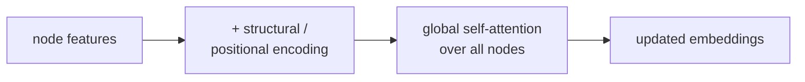

Standard GNNs aggregate over local neighborhoods; **Graph Transformers**
let every node attend to every other node. This sidesteps over-smoothing
and limited receptive field but loses the graph structure unless
explicitly added back through positional or structural encodings. As of
2024 they are state-of-the-art on most graph-level benchmarks<FN n="1" />.

## The basic idea

Apply a standard Transformer encoder to the set of nodes:

$$
H^{(\ell + 1)} = \text{LayerNorm}(H^{(\ell)} + \text{MultiHeadAttention}(H^{(\ell)})) \to \text{LayerNorm}(\cdot + \text{FFN}(\cdot)).
$$

Without modification, this ignores the graph structure entirely:
attention is computed between all node pairs regardless of edges.

The trick is to **inject structural information** through positional
encodings, attention biases, or both.

## Adding structure back

Several ways to give the Transformer access to the graph:

**Graph positional encodings**: per-node embeddings that depend on the
node's structural role.

- **Laplacian eigenvectors**: take the eigendecomposition of the
  Laplacian; use the top-$k$ eigenvectors as positional features.
  Captures global structural position.
- **Random-walk encodings**: for each node, count the diagonal of the
  $k$-step random-walk matrix.
- **Spectral encodings**: any feature derived from the Laplacian's
  spectrum.

**Attention biases**: modify the attention scores based on edge
structure:

$$
\text{score}(i, j) = \frac{Q_i K_j^\top}{\sqrt{d}} + b(i, j),
$$

where $b(i, j)$ encodes graph-structural information. Examples:

- **Graphormer's biases**: shortest-path distance + edge type +
  per-edge learned bias.
- **GraphGPS-style biases**: combine multiple bias types.

## Graphormer

Ying et al. (2021). One of the first widely-used Graph Transformers<FN n="2" />.

Three biases added to the attention:

1. **Centrality encoding**: per-node degree-based feature added to
   input embeddings.
2. **Spatial encoding**: shortest-path-distance bias added to attention
   scores.
3. **Edge encoding**: per-edge features along the shortest path
   between $i$ and $j$.

Graphormer won the OGB Large Scale Challenge for graph regression and
established Graph Transformers as a viable architecture.

## GraphGPS

Rampášek et al. (2022). A general framework that combines:

- A local message-passing layer (any GNN).
- A global self-attention layer.

Each block does both: message passing for local detail, attention for
global structure. The combination beats either alone on most
benchmarks.

GraphGPS is the rare "trick all of them" combination that actually
works.

## When Graph Transformers win

- **Long-range dependencies**: tasks where information must travel
  across many hops. Local GNNs need many layers (over-smoothing risk);
  attention handles it in one.
- **Graph-level tasks**: molecule property prediction, where the whole
  graph matters.
- **Heterophilic graphs**: where neighbors are dissimilar, so local
  aggregation hurts.

## When they don't

- **Very large graphs** (10K+ nodes): quadratic attention cost is
  prohibitive. Local GNNs (GraphSAGE with sampling) are the only
  scalable option.
- **Sparse, locally-informative graphs**: local methods are simpler
  and just as good (small molecules with strong chemistry priors).

## The current landscape

The state of GNN architectures as of 2024:

- **Local GNNs** (GCN, GraphSAGE, GAT): default for large graphs and
  node-level tasks.
- **Graph Transformers** (Graphormer, GraphGPS): default for
  graph-level tasks at small-to-medium scale.
- **Hybrid models**: combine local message passing with global
  attention (GraphGPS pattern).
- **Equivariant GNNs** (next lesson): for tasks with symmetry (3D
  point clouds, molecules in 3D space).

The next lesson covers the equivariant family that respects symmetries
like rotation and reflection.

<Footnotes>
  <FNItem n="1">**Veličković, P., Cucurull, G., Casanova, A., Romero, A., Liò, P., & Bengio, Y.** (2018). "Graph attention networks (GAT)". *ICLR*. [arXiv:1710.10903](https://arxiv.org/abs/1710.10903). The local attention these models globalize to all node pairs.</FNItem>
  <FNItem n="2">**Ying, C., et al.** (2021). "Do transformers really perform bad for graph representation? (Graphormer)". *NeurIPS*. [arXiv:2106.05234](https://arxiv.org/abs/2106.05234). Centrality, spatial, and edge biases that inject graph structure into attention.</FNItem>
</Footnotes>
