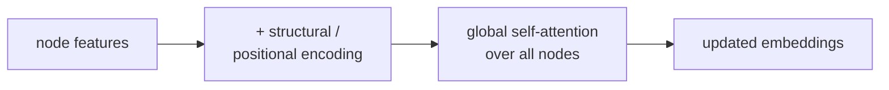

Standard GNNs aggregate over local neighborhoods; **Graph Transformers**
let every node attend to every other node. This sidesteps over-smoothing
and limited receptive field but loses the graph structure unless
explicitly added back through positional or structural encodings. As of
2024 they are state-of-the-art on most graph-level benchmarks<FN n="1" />.

## The basic idea

Apply a standard Transformer encoder to the set of nodes:

$$
H^{(\ell + 1)} = \text{LayerNorm}(H^{(\ell)} + \text{MultiHeadAttention}(H^{(\ell)})) \to \text{LayerNorm}(\cdot + \text{FFN}(\cdot)).
$$

Without modification, this ignores the graph structure entirely:
attention is computed between all node pairs regardless of edges.

The trick is to **inject structural information** through positional
encodings, attention biases, or both.

## Adding structure back

Several ways to give the Transformer access to the graph:

**Graph positional encodings**: per-node embeddings that depend on the
node's structural role.

- **Laplacian eigenvectors**: take the eigendecomposition of the
  Laplacian; use the top-$k$ eigenvectors as positional features.
  Captures global structural position.
- **Random-walk encodings**: for each node, count the diagonal of the
  $k$-step random-walk matrix.
- **Spectral encodings**: any feature derived from the Laplacian's
  spectrum.

**Attention biases**: modify the attention scores based on edge
structure:

$$
\text{score}(i, j) = \frac{Q_i K_j^\top}{\sqrt{d}} + b(i, j),
$$

where $b(i, j)$ encodes graph-structural information. Examples:

- **Graphormer's biases**: shortest-path distance + edge type +
  per-edge learned bias.
- **GraphGPS-style biases**: combine multiple bias types.

## Graphormer

Ying et al. (2021). One of the first widely-used Graph Transformers<FN n="2" />.

Three biases added to the attention:

1. **Centrality encoding**: per-node degree-based feature added to
   input embeddings.
2. **Spatial encoding**: shortest-path-distance bias added to attention
   scores.
3. **Edge encoding**: per-edge features along the shortest path
   between $i$ and $j$.

Graphormer won the OGB Large Scale Challenge for graph regression and
established Graph Transformers as a viable architecture.

## GraphGPS

Rampášek et al. (2022). A general framework that combines:

- A local message-passing layer (any GNN).
- A global self-attention layer.

Each block does both: message passing for local detail, attention for
global structure. The combination beats either alone on most
benchmarks.

GraphGPS is the rare "trick all of them" combination that actually
works.

## When Graph Transformers win

- **Long-range dependencies**: tasks where information must travel
  across many hops. Local GNNs need many layers (over-smoothing risk);
  attention handles it in one.
- **Graph-level tasks**: molecule property prediction, where the whole
  graph matters.
- **Heterophilic graphs**: where neighbors are dissimilar, so local
  aggregation hurts.

## When they don't

- **Very large graphs** (10K+ nodes): quadratic attention cost is
  prohibitive. Local GNNs (GraphSAGE with sampling) are the only
  scalable option.
- **Sparse, locally-informative graphs**: local methods are simpler
  and just as good (small molecules with strong chemistry priors).

## The current landscape

The state of GNN architectures as of 2024:

- **Local GNNs** (GCN, GraphSAGE, GAT): default for large graphs and
  node-level tasks.
- **Graph Transformers** (Graphormer, GraphGPS): default for
  graph-level tasks at small-to-medium scale.
- **Hybrid models**: combine local message passing with global
  attention (GraphGPS pattern).
- **Equivariant GNNs** (next lesson): for tasks with symmetry (3D
  point clouds, molecules in 3D space).

## Exercises

**Exercise 1.** A Graph Transformer scores a query node $i$ against three
candidate nodes with equal content scores $Q_i K_j^\top / \sqrt{d} = 2$ for all
three, but Graphormer-style spatial biases $b(i, j) = (0, -1, -2)$ (penalizing
larger shortest-path distance). Compute the attention weights and explain what
the bias accomplishes when content scores are tied.

Solution

**Step 1.** The biased score is $\text{score}(i, j) = Q_i K_j^\top/\sqrt{d} + b(i, j)$,
giving $(2 + 0, 2 - 1, 2 - 2) = (2, 1, 0)$.

**Step 2.** Softmax over the three: exponentials $e^2 \approx 7.389$,
$e^1 \approx 2.718$, $e^0 = 1$, summing to $\approx 11.107$. The weights are

$$
\alpha = \left(\tfrac{7.389}{11.107}, \tfrac{2.718}{11.107}, \tfrac{1}{11.107}\right) \approx (0.665, 0.245, 0.090).
$$

**Step 3.** With content scores tied, the structural bias alone breaks the
symmetry: the nearest node (smallest shortest-path distance, zero penalty) gets
two-thirds of the attention and the farthest gets under a tenth. The bias
reinjects graph distance that the all-pairs attention would otherwise ignore.

**Exercise 2.** Plain self-attention over the node set is permutation-
equivariant but blind to edges: it gives the same output for two graphs with
identical node features but different connectivity. Explain why this is a problem
for graph tasks, and show how an additive attention bias $b(i, j)$ that depends
on the edge or shortest-path between $i$ and $j$ restores sensitivity to
structure.

Solution

**Step 1.** Self-attention computes $\text{softmax}(Q K^\top/\sqrt{d}) V$ from
node features alone. If two graphs share the node feature matrix $H$ but differ
in their edges, $Q$, $K$, $V$ are identical, so the outputs are identical. The
edges never enter the computation.

**Step 2.** Graph tasks depend on connectivity: a benzene ring and a chain of the
same six atoms have different properties. A structure-blind encoder cannot tell
them apart, so it cannot predict properties that hinge on the difference.

**Step 3.** Adding $b(i, j)$ to the pre-softmax score makes the attention a
function of the pair's structural relation (edge type, shortest-path distance).
Now two graphs with different edges produce different bias matrices, hence
different attention weights and different outputs. The bias is the channel
through which discrete graph structure modulates the otherwise fully-connected
attention.

**Exercise 3.** A practitioner has two datasets: (a) social graphs with
50,000 nodes each, and (b) small molecules with about 30 atoms each, where the
target depends on long-range atom interactions. For each, recommend a local GNN
(GraphSAGE with sampling) or a Graph Transformer, and justify the choice from the
cost and receptive-field trade-offs.

Solution

**Step 1.** Graph Transformer attention is all-pairs, costing order $n^2$ in
nodes per layer. For (a) with $n = 50{,}000$, that is $2.5 \times 10^9$ pairs
per graph per layer, prohibitive in memory and time.

**Step 2.** For (a), a local GNN with neighbor sampling (GraphSAGE) keeps the per
node cost bounded by the sample size, independent of total graph size, which is
the only scalable option at this node count. Node-level social tasks are usually
locally informative, so bounded receptive fields are acceptable.

**Step 3.** For (b), $n \approx 30$ makes $n^2 \approx 900$ pairs, negligible.
The target needs long-range interactions, which a local GNN reaches only by
stacking many layers, risking over-smoothing. A Graph Transformer connects every
atom pair in a single attention layer, handling the long-range dependency
directly.

**Step 4.** Recommendation: GraphSAGE-with-sampling for the large social graphs,
Graph Transformer for the small long-range molecules. The deciding factors are
node count (sets the quadratic cost) and interaction range (sets whether global
attention is worth it).

The next lesson covers the equivariant family that respects symmetries
like rotation and reflection.

<Footnotes>
  <FNItem n="1">**Veličković, P., Cucurull, G., Casanova, A., Romero, A., Liò, P., & Bengio, Y.** (2018). "Graph attention networks (GAT)". *ICLR*. [arXiv:1710.10903](https://arxiv.org/abs/1710.10903). The local attention these models globalize to all node pairs.</FNItem>
  <FNItem n="2">**Ying, C., et al.** (2021). "Do transformers really perform bad for graph representation? (Graphormer)". *NeurIPS*. [arXiv:2106.05234](https://arxiv.org/abs/2106.05234). Centrality, spatial, and edge biases that inject graph structure into attention.</FNItem>
</Footnotes>
