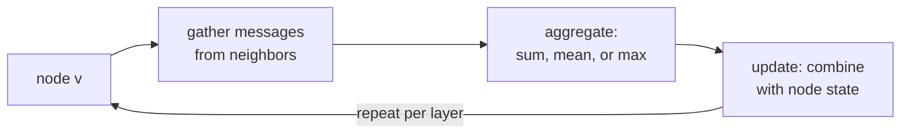

**Message passing** is the unifying recipe behind nearly every graph
neural network. At each layer, every node receives "messages" from its
neighbors, aggregates them, and uses the aggregate to update its own
representation. Stacking $L$ message-passing layers gives each node
information from its $L$-hop neighborhood. The specific choice of
message function, aggregation, and update determines the GNN flavor<FN ns="1, 2" />.

## The three-step framework

For each node $i$ at layer $\ell + 1$:

**1. Message** from each neighbor:
$$
m_{j \to i}^{(\ell)} = \phi(h_i^{(\ell)},\ h_j^{(\ell)},\ e_{ji}).
$$

The message function $\phi$ combines the source node's features,
the destination node's features, and any edge features.

**2. Aggregation** over the neighborhood:
$$
a_i^{(\ell)} = \bigoplus_{j \in \mathcal{N}(i)} m_{j \to i}^{(\ell)}.
$$

The aggregator $\bigoplus$ is **permutation-invariant**: sum, mean,
max, or a learned attention-weighted sum. Permutation invariance is
required because the neighborhood is a set, not a sequence.

**3. Update** the node representation:
$$
h_i^{(\ell + 1)} = \psi(h_i^{(\ell)},\ a_i^{(\ell)}).
$$

The update function $\psi$ is typically an MLP (with residual or gating
in deeper networks).

Stack $L$ layers. Each layer extends the receptive field by one hop. A
node's representation at layer $L$ summarizes its $L$-hop neighborhood.

## Common instantiations

- **GCN (Graph Convolutional Network)**: message = $W h_j^{(\ell)}$ (no
  source-target mixing), aggregate = degree-normalized sum, update =
  ReLU. Spectrally motivated<FN n="3" />.
- **GraphSAGE**: message = $h_j^{(\ell)}$, aggregate = mean / max /
  LSTM, update = concatenate with self then MLP. Inductive
  (handles unseen nodes)<FN n="4" />.
- **GAT (Graph Attention Network)**: message = $h_j^{(\ell)}$ weighted
  by a learned attention coefficient depending on $h_i, h_j$.
- **MPNN**: explicit edge features and learned message functions.
- **Graph Transformer**: every node "attends" to every other node, with
  edges providing structural bias.

The next lesson covers GCN, GraphSAGE, and GAT specifically.

## Receptive field and over-smoothing

After $L$ message-passing layers, each node's representation depends on
its $L$-hop neighborhood. Increasing $L$ should help: nodes see more
context.

But empirically, deep GNNs (10+ layers) **over-smooth**: every node's
representation converges to the same vector (the global average over
the graph). Discriminative information is lost.

The closing code makes the collapse concrete on a 6-node graph (two
triangles joined by one bridge edge). Take nodes 0 and 5, sitting in
opposite triangles:

- **At layer 0**, their feature vectors are far apart: Euclidean
  distance $\approx 2.02$. They are distinct nodes with distinct
  features.
- **After 50 mean-aggregate passes**, the same two nodes sit at distance
  $\approx 0.0008$, three orders of magnitude smaller. Both have
  drifted to the connected component's average vector.

This is the receptive-field promise turned against itself: one or two
hops mixes in useful neighborhood context, but iterating the same
contractive averaging washes out the per-node signal that made the nodes
separable in the first place.

Causes:

- The aggregation is contractive (especially mean and sum-with-
  normalization).
- Repeated smoothing flattens features.

Mitigations:

- **Skip connections** (residual links between layers).
- **Initial residuals** (GCNII): every layer mixes in the layer-0
  features.
- **Edge dropout / random walks**.

Most GNN architectures stop at 2-6 layers for this reason. Graph
Transformers (D6 lesson) sidestep over-smoothing by using global
attention.

## Inductive vs transductive

Two modes of GNN deployment:

- **Transductive**: the model is trained on a specific graph and
  applied to nodes in the same graph. Examples: classifying papers in
  a fixed citation network.
- **Inductive**: the model is trained on one set of graphs (or one
  graph) and applied to **new** graphs or new nodes never seen at
  training time. Examples: molecule property prediction, social
  networks with new users.

GCN's original form is transductive (needs the full Laplacian);
GraphSAGE is explicitly inductive (samples neighbors, uses local
features). Modern GNNs are usually inductive.

## Batching graphs

Graphs in a batch can have different sizes. Standard pattern:
**disjoint union**: stack multiple graphs into one big disconnected
graph, with a per-node "graph index" telling which original graph each
node came from.

Message-passing operations naturally handle this because they only
look at within-graph neighborhoods. Graph-level readouts (mean / sum
pooling) use the graph index to pool per-graph.



## Check it on arrays

```python
import numpy as np

rng = np.random.default_rng(0)

# Small graph: same as before, 6 nodes, two triangles + one bridge
N = 6
edges = [(0, 1), (1, 2), (2, 0), (3, 4), (4, 5), (5, 3), (2, 3)]
edges += [(j, i) for (i, j) in edges]
A = np.zeros((N, N))
for i, j in edges: A[i, j] = 1

# Add self-loops (so each node also sees itself in the aggregate)
A_self = A + np.eye(N)
deg = A_self.sum(axis=1)

# Generic message passing: message m_ij = h_j (no transformation)
# Aggregation: mean over neighbors
# Update: GCN-style: h_new = relu(W (mean-aggregate))
d = 4
H = rng.normal(size=(N, d))

def relu(x): return np.maximum(0, x)

def mp_layer(H, A_self, W):
    deg = A_self.sum(axis=1)
    msg = A_self @ H                                     # sum over neighbors
    agg = msg / deg[:, None]                             # mean
    return relu(agg @ W)

W1 = rng.normal(scale=0.5, size=(d, d))
W2 = rng.normal(scale=0.5, size=(d, d))
W3 = rng.normal(scale=0.5, size=(d, d))

print(f"Layer 0 node 0 features: {H[0].round(2)}")
H1 = mp_layer(H, A_self, W1)
print(f"Layer 1 node 0 features (1-hop): {H1[0].round(2)}")
H2 = mp_layer(H1, A_self, W2)
print(f"Layer 2 node 0 features (2-hop): {H2[0].round(2)}")
H3 = mp_layer(H2, A_self, W3)
print(f"Layer 3 node 0 features (3-hop): {H3[0].round(2)}")

# After many layers, features should converge across nodes (over-smoothing)
H_smooth = H
W_id = np.eye(d)
for _ in range(50):
    H_smooth = (A_self @ H_smooth) / deg[:, None]
print(f"\nafter 50 mean-aggregate passes (over-smoothing):")
print(f"  node 0: {H_smooth[0].round(3)}")
print(f"  node 5: {H_smooth[5].round(3)}  (should match node 0 in connected component)")
```

After many message-passing rounds, features within a connected
component converge to the same vector, demonstrating over-smoothing.
The next lesson covers the three standard GNN flavors: GCN, GraphSAGE,
GAT.

<Footnotes>
  <FNItem n="1">**Gilmer, J., Schoenholz, S. S., Riley, P. F., Vinyals, O., & Dahl, G. E.** (2017). "Neural message passing for quantum chemistry". *ICML*. [arXiv:1704.01212](https://arxiv.org/abs/1704.01212). Introduces the message/aggregate/update framework that unifies GNN variants.</FNItem>
  <FNItem n="2">**Battaglia, P. W., et al.** (2018). "Relational inductive biases, deep learning, and graph networks". [arXiv:1806.01261](https://arxiv.org/abs/1806.01261). The graph-network formalism generalizing message passing.</FNItem>
  <FNItem n="3">**Kipf, T. N., & Welling, M.** (2017). "Semi-supervised classification with graph convolutional networks (GCN)". *ICLR*. [arXiv:1609.02907](https://arxiv.org/abs/1609.02907). Degree-normalized sum aggregation.</FNItem>
  <FNItem n="4">**Hamilton, W. L., Ying, R., & Leskovec, J.** (2017). "Inductive representation learning on large graphs (GraphSAGE)". *NeurIPS*. [arXiv:1706.02216](https://arxiv.org/abs/1706.02216). Sampled-neighbor mean/max/LSTM aggregation for unseen nodes.</FNItem>
</Footnotes>
