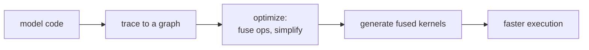

A naive PyTorch training loop runs each operation as a separate kernel
launch, then reads / writes intermediate tensors to GPU memory between
them. **Compilation** fuses sequences of operations into single
kernels, removing the launch overhead and the intermediate memory
traffic. The result is 1.3-2x speedups on most workloads, and
sometimes much more on memory-bound operations.

## Why compilation helps

Three sources of inefficiency in eager-mode execution:

- **Kernel launch overhead**: each op launches a CUDA kernel with
  some fixed cost. Small ops are dominated by launch overhead.
- **Memory traffic**: each op writes its output to HBM (slow GPU
  memory); the next op reads it back. Memory bandwidth, not compute,
  is the bottleneck for many ops.
- **No global optimization**: each op is independently optimal but the
  pipeline isn't.

A compiler can:

- **Fuse ops**: combine multiple element-wise operations into one
  kernel.
- **Layout optimization**: choose memory layouts and tile sizes.
- **Algebraic simplification**: eliminate redundant computations.
- **Operator selection**: pick the best implementation (e.g.,
  different matmul kernels for different shapes).

## torch.compile

PyTorch 2.0's compiler.

```python-static
model = MyModel()
compiled = torch.compile(model)
output = compiled(input)              # first call: trace + compile
output = compiled(input)              # subsequent calls: fast
```

Under the hood:

1. **TorchDynamo**: a Python frame evaluator that traces the model into
   a graph by intercepting Python bytecode. Handles dynamic control
   flow (if/else, while) by recompiling for different paths.
2. **AOTAutograd**: produces both the forward and backward graphs.
3. **Inductor**: the default backend. Lowers the graph to Triton (for
   GPU) or C++ (for CPU), generates kernels.

First call has a compilation overhead (seconds to minutes); subsequent
calls reuse the compiled kernels. For training, the overhead is paid
once.

Compilation is **opt-in** in PyTorch; the eager mode is still default.

## Triton

OpenAI's GPU programming language. A Python DSL for writing
high-performance CUDA-like kernels with much less code than CUDA C++.

Triton kernels are the building blocks of:

- **torch.compile**'s Inductor backend (most generated kernels are
  Triton).
- **FlashAttention** (next lesson).
- Custom kernels for specific architectures (Mamba, mixture-of-experts
  routing, etc.).

A typical Triton kernel is 50-100 lines of Python with explicit memory
tiling, block sizing, and program-id-based work distribution.

## XLA

Google's compiler for ML, used by JAX, TensorFlow, and PyTorch (via
torch_xla).

Two compilation modes:

- **JIT** (just-in-time, in JAX via `jax.jit`): compile a Python
  function the first time it's called with a particular input shape.
- **AOT** (ahead-of-time): compile to a serialized binary for
  deployment.

XLA's compilation passes are similar in spirit to torch.compile but
have decades more maturity on the TPU side. XLA-compiled code
typically achieves higher performance on TPUs and competitive
performance on GPUs.

For JAX, compilation is free and ubiquitous: just put `@jit` on your
function. The integration is much tighter than torch.compile.

## CUDA Graphs

A complementary technique: **CUDA Graphs** record a fixed sequence of
GPU operations once, then replay the recorded graph for subsequent
invocations. Skips kernel launch overhead even without compilation.

Useful when the model has a fixed graph structure (e.g., a Transformer
block with fixed shapes). Combined with torch.compile or used standalone.

## When compilation helps and doesn't

**Helps a lot**:

- Many small element-wise ops in sequence (RMSNorm + SiLU + multiply
  in a SwiGLU FFN).
- Custom kernels for fused attention.
- Repeated forward passes with the same shape.

**Doesn't help much**:

- Single big matmul; the cuBLAS kernel is already optimized.
- Eager-mode debugging (you want to see each op).
- Highly dynamic models with constantly changing shapes (recompilation
  storm).

For most production training, compilation gives a 30-50% speedup with
minimal code changes. The savings compound over thousands of GPU-hours.

## What compilation isn't

- Not a way to fit a larger model in memory (use mixed precision +
  FSDP + checkpointing).
- Not a way to make a bad architecture good (it can't change the
  algorithm).
- Not free debugging (compiled code is harder to step through).



## Practical recipe

For a typical PyTorch training pipeline:

1. Get correct eager-mode training first.
2. Wrap the forward call in `torch.compile(model)`.
3. Profile and decide if specific layers need custom Triton kernels.

For JAX, compilation is the default; eager-mode is rare.

The next lesson covers the canonical example of a custom kernel that
beat the default implementation by an order of magnitude:
FlashAttention.
