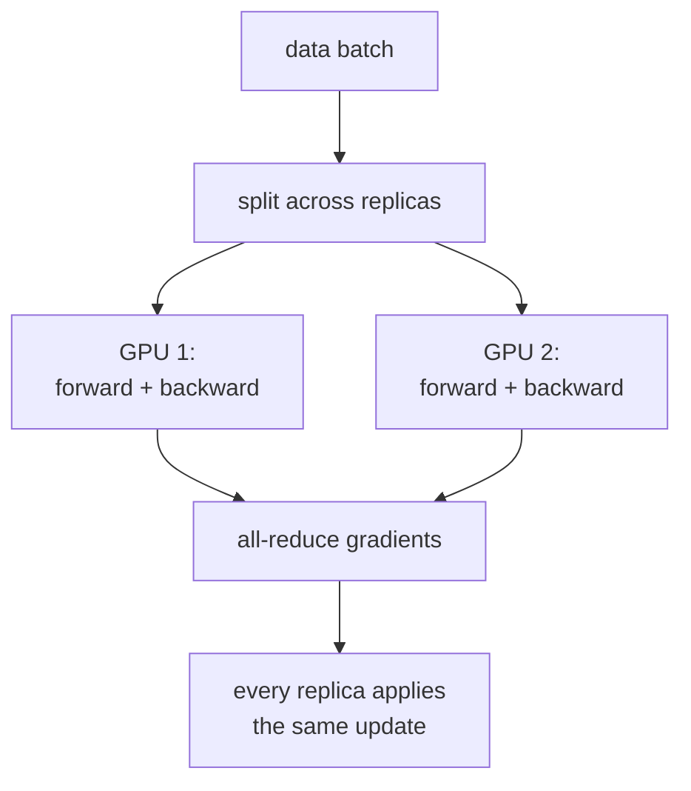

The simplest way to use many GPUs: each one holds a copy of the model,
each one processes part of a global batch, gradients are synchronized
across GPUs. This is **data parallelism (DDP)**. When the model itself
no longer fits on a single GPU, **FSDP** and **ZeRO** shard the
parameters across devices while keeping data parallelism's batch
splitting. These are the standard scaling tools for training models
from millions to trillions of parameters.

## Distributed Data Parallel (DDP)

The classic recipe.

Per GPU $i$ in a cluster of $G$ GPUs:

1. Hold a **full copy** of the model parameters $\theta$ and optimizer
   state.
2. Process a **local batch** of $B$ examples (so the global batch is
   $G \cdot B$).
3. Compute the local gradient $g_i$.
4. **All-reduce** the gradients across all GPUs:
   $$
   g = \frac{1}{G}\sum_i g_i.
   $$
5. Apply the optimizer step using $g$. All GPUs apply identical updates,
   so the parameters stay in sync.

The all-reduce is the key communication primitive: efficiently
combining (sum) and distributing the result to all participants.
NCCL (NVIDIA Collective Communications Library) provides
hardware-optimized implementations for GPU clusters.

DDP scales linearly in number of GPUs for the throughput, modulo the
all-reduce overhead. Standard for models that fit on a single GPU:
ResNet-50 training, BERT, smaller LLMs.

## Limitations of DDP

- **Memory replication**: each GPU stores the full model parameters,
  gradients, and optimizer state. Per-GPU memory is the bottleneck.
- **Optimizer state inflation**: Adam stores two moments per
  parameter at fp32, even with bf16 weights. Per-GPU optimizer state
  is 2-3x the model size.

For a 7B model, each GPU needs ~140 GB (7B × 20 bytes for Adam fp32
states + activations + grads). Beyond most consumer GPUs.

The next sections solve this with sharding.

## FSDP (Fully Sharded Data Parallel)

PyTorch's FSDP, inspired by FairScale and DeepSpeed ZeRO.

**Shard everything across the GPU cluster**:

- Parameters: each GPU stores 1/G of the parameters.
- Gradients: same.
- Optimizer state: same.

For the forward and backward passes:

1. **All-gather** the full parameters of one layer from all GPUs.
2. Compute forward/backward for that layer.
3. **Free** the gathered parameters, freeing memory.
4. Repeat per layer.

Each GPU's working memory is bounded by the max layer size, not the
full model size. Communication is higher (an all-gather per layer per
direction) but throughput is dominated by the matmul cost in practice.

A 7B model that needs 140 GB per GPU with DDP needs only ~140 / G GB
per GPU with FSDP across G GPUs, plus a small constant for the largest
layer being processed.

## ZeRO

Microsoft's framework, predecessor of FSDP. Three "stages":

- **ZeRO-1**: shard optimizer state only. Saves 4-8x optimizer memory.
- **ZeRO-2**: shard optimizer state + gradients.
- **ZeRO-3**: shard everything (the same as FSDP).

Each stage adds memory savings at the cost of more communication.
ZeRO-3 / FSDP is the gold standard for memory-limited regimes.

ZeRO-Infinity adds CPU and NVMe offload, letting you train models that
don't fit in GPU memory by paging through host memory.

## Gradient accumulation

A complement to data parallelism: simulate a larger global batch by
accumulating gradients across multiple forward/backward passes before
calling optimizer.step().

```
for micro_batch in batch.split(K):
    loss = model(micro_batch) / K
    loss.backward()                       # accumulates gradients
optimizer.step()                          # one update over K micro-batches
optimizer.zero_grad()
```

Effective batch size = micro_batch_size × accumulation_steps ×
number_of_GPUs.

Useful when you want a large batch but per-GPU memory limits the
micro-batch.

## Synchronous vs asynchronous

- **Synchronous** (the standard): all GPUs participate in every step;
  the all-reduce blocks until everyone is ready. Deterministic.
- **Asynchronous**: stale gradient methods, parameter servers. Faster
  per-second but harder to reason about and rarely used today.

Synchronous SGD dominates in 2024 because the all-reduce overhead is
small compared to the compute, and the convergence guarantees are
stronger.



## In practice

- Models up to ~7B on 80GB GPUs: DDP is fine.
- Models 7-70B: FSDP or ZeRO-3 needed.
- Models 100B+: FSDP + pipeline parallelism + tensor parallelism (next
  lesson).

The major frameworks (PyTorch FSDP, DeepSpeed, Megatron-DeepSpeed) all
support these patterns. Choosing the right combination is the central
infrastructure decision in large-scale training.

The next lesson covers the orthogonal scaling axis: splitting a single
model across devices via pipeline and tensor parallelism.
