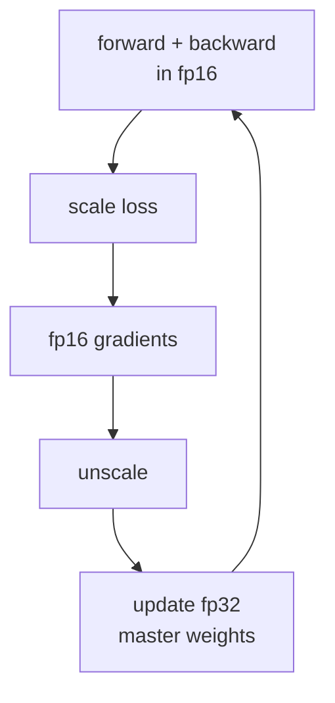

GPUs and TPUs are 2-8x faster on 16-bit floats than 32-bit. **Mixed-
precision training** uses 16-bit storage and compute where possible and
falls back to 32-bit where stability demands it. The recipe is now
standard across deep learning frameworks<FN n="1" />; this lesson covers the
practical deployment for neural network training.

## Why mixed precision

Modern accelerators have dedicated tensor cores for 16-bit math:

- **NVIDIA A100/H100**: 5-8x throughput in fp16/bf16 vs fp32.
- **TPU v4/v5**: native bf16 throughout.
- **Apple Silicon**, **AMD Instinct**: similar story.

Going from fp32 to bf16 training is often **2-4x faster end-to-end**,
with no accuracy loss when done correctly. The savings are too large to
ignore at scale.

## The forward pass

Cast weights and activations to the low-precision format (typically
bf16 for training, sometimes fp16):

```
x_fp16 = x_fp32.to(fp16)
W_fp16 = W_fp32.to(fp16)
y_fp16 = x_fp16 @ W_fp16
```

The hardware tensor cores then do 16-bit matmul accumulating into
32-bit registers (the **accumulator** is fp32 even when inputs are
fp16). This preserves precision in the dot-product sums.

## The backward pass

Same: gradients are computed in 16-bit. The 32-bit accumulation
inside tensor cores limits noise.

## Master weights in fp32

The critical detail: **keep a master copy of the weights in fp32** and
update it with the optimizer step. Then re-cast to fp16/bf16 for the
next forward pass.

Why: the gradient update $W \leftarrow W - \eta g$ may have $\eta g$
much smaller than $W$. In fp16, the smaller value is lost during the
update (underflow), and training stalls.

Master fp32 weights:

```
W_master = fp32(W)
W_fp16 = W_master.to(fp16)            # for forward / backward
g_fp16 = ... (from backward)
g_fp32 = fp32(g_fp16)
W_master = W_master - eta * g_fp32    # update in fp32
```

The forward and backward passes do the heavy lifting in fp16 (most of
the compute and memory); the update is in fp32 (a small fraction of
the cost).

## Loss scaling (for fp16 only)

Gradients in fp16 frequently underflow because the dynamic range is
small (smallest representable normal: ~6×10⁻⁸; gradients in the
~10⁻¹⁰ range vanish).

**Loss scaling**: multiply the loss by a large factor $S$ before
backward, divide gradients by $S$ before the optimizer step<FN n="1" />:

```
scaled_loss = loss * S
scaled_loss.backward()                  # backward produces S * g
g = g / S                               # rescale before optimizer
```

The intermediate fp16 gradients are amplified by $S$, lifting them out
of the underflow zone. The final unscaled gradient is recovered modulo
rounding.

**Dynamic loss scaling**: start with $S = 65536$. If a forward/backward
pass produces NaN or Inf in any gradient, halve $S$ and skip the
step. After $N$ steps without overflow, double $S$. The system auto-
tunes to the largest safe scale.

## bf16 vs fp16

| Format | Exponent bits | Mantissa bits | Range | Loss scaling needed? |
|--------|---------------|---------------|-------|----------------------|
| fp16 | 5 | 10 | ±65504 | Yes |
| bf16 | 8 | 7 | ±10³⁸ | No |

bf16 has fp32's exponent range, so no overflow / underflow at
typical training magnitudes. Loss scaling is unnecessary. The
mantissa is coarser, but with the 32-bit accumulator in tensor cores,
this rarely matters for training.

bf16 is the default for most modern Transformer training. fp16 is
still used on older NVIDIA hardware that doesn't support bf16 well.

## Layers that stay in fp32

Some operations are too numerically sensitive for low precision:

- **LayerNorm / BatchNorm**: mean and variance computations accumulate;
  do them in fp32.
- **Softmax**: the exp can overflow at low precision; compute in fp32.
- **Loss computation**: especially log-softmax + NLL.
- **Optimizer state**: Adam's $m, v$ moments stay in fp32.

These are small compared to the matrix multiplications, so promoting
them to fp32 costs little.

## fp8 and beyond

Newer formats appear at the bleeding edge:

- **fp8** (H100+): 5-bit exponent + 2-bit mantissa, or 4+3. Used for
  forward and backward in a few production systems. Needs careful
  per-tensor scaling.
- **fp4** (Blackwell): experimental.
- **int8 quantization** for inference, distinct from training.

Mixed precision below bf16 is much more delicate and is research-area
work as of 2024.

## What you do in practice

Modern PyTorch<FN n="2" />:

```python-static
from torch.amp import autocast, GradScaler

scaler = GradScaler()
for batch in loader:
    optimizer.zero_grad()
    with autocast(dtype=torch.bfloat16):
        loss = model(batch)
    scaler.scale(loss).backward()         # loss scaling (no-op for bf16)
    scaler.step(optimizer)
    scaler.update()
```

That's the whole recipe. The framework handles all the casts.



## Check it on arrays

```python
import numpy as np

rng = np.random.default_rng(0)

# Simulate fp32 vs fp16 / bf16 precision impact on a layer
def emulate_fp16(x): return x.astype(np.float16).astype(np.float32)
def emulate_bf16(x):
    # bf16 = fp32 with mantissa truncated to 7 bits
    bytes_ = x.astype(np.float32).view(np.uint32)
    bytes_ = bytes_ & 0xFFFF0000
    return bytes_.view(np.float32)

# Large random matmul
X = rng.normal(size=(64, 128)).astype(np.float32)
W = rng.normal(size=(128, 64)).astype(np.float32)

y_fp32 = X @ W
y_fp16 = emulate_fp16(X) @ emulate_fp16(W)
y_bf16 = emulate_bf16(X) @ emulate_bf16(W)

print(f"||y_fp32 - y_fp16|| / ||y_fp32|| = {np.linalg.norm(y_fp32 - y_fp16) / np.linalg.norm(y_fp32):.2e}")
print(f"||y_fp32 - y_bf16|| / ||y_fp32|| = {np.linalg.norm(y_fp32 - y_bf16) / np.linalg.norm(y_fp32):.2e}")

# Demonstrate fp16 vanishing-gradient: a tiny gradient cast to fp16 becomes zero
g_small = np.float32(1e-7)
print(f"\ngradient {g_small} in fp16 = {emulate_fp16(np.array([g_small]))[0]}")
print(f"gradient {g_small} after loss scaling (x 1024) and unscaling: "
      f"{emulate_fp16(np.array([g_small * 1024]))[0] / 1024}")
```

fp16 has noticeable error on the matrix multiply but loss scaling
rescues underflowing gradients; bf16 has somewhat larger per-element
approximation error (7-bit vs fp16's 10-bit mantissa) but its much wider
exponent range removes the need for loss scaling entirely.

## Exercises

**Exercise 1.** A 7B-parameter model is trained with bf16 weights and an
Adam optimizer. The optimizer keeps an fp32 master copy of the weights plus
two fp32 moment buffers ($m$ and $v$), and the bf16 working weights are kept
for the forward/backward pass. Count the bytes per parameter and the total
memory just for weights and optimizer state.

<details>
<summary>Solution</summary>

**Step 1.** List each stored quantity and its width. bf16 working weights:
2 bytes. fp32 master weights: 4 bytes. fp32 first moment $m$: 4 bytes. fp32
second moment $v$: 4 bytes.

**Step 2.** Sum the per-parameter cost: $2 + 4 + 4 + 4 = 14$ bytes per
parameter.

**Step 3.** Scale to 7B parameters:

$$
14 \text{ bytes} \times 7 \times 10^9 = 98 \times 10^9 \text{ bytes} \approx 98 \text{ GB}.
$$

This is the weight-plus-optimizer footprint alone, before activations and
gradients, which is why a 7B model does not train on a single 80 GB GPU
without sharding.

</details>

**Exercise 2.** fp16 has a 5-bit exponent with a smallest positive normal
value near $6.1 \times 10^{-5}$. A gradient element has magnitude
$1 \times 10^{-8}$, which underflows to zero in fp16. Find the smallest
power-of-two loss scale $S$ that lifts the scaled gradient above the normal
threshold, and confirm the recovered value after dividing by $S$.

<details>
<summary>Solution</summary>

**Step 1.** Require $S \cdot 1 \times 10^{-8} \ge 6.1 \times 10^{-5}$, so
$S \ge 6.1 \times 10^{-5} / 1 \times 10^{-8} = 6100$.

**Step 2.** Round up to the next power of two: $2^{12} = 4096$ is too small
(below 6100), so $2^{13} = 8192$ is the smallest power-of-two scale that
clears the threshold.

**Step 3.** The scaled gradient is $8192 \cdot 1 \times 10^{-8} \approx
8.19 \times 10^{-5}$, above the normal threshold, so it survives in fp16.
Dividing by $S$ after backward recovers $8.19 \times 10^{-5} / 8192 = 1
\times 10^{-8}$, the original magnitude modulo rounding. This is why dynamic
loss scaling searches over powers of two.

</details>

**Exercise 3 (code).** bf16 keeps fp32's 8-bit exponent but truncates the
mantissa to 7 bits, so it never underflows at training magnitudes but is
coarse. Emulate bf16 by zeroing the low 16 bits of the fp32 representation.
Verify that a gradient of $1 \times 10^{-8}$ survives in bf16 (does not become
zero), while the same value becomes zero in fp16, and that bf16's relative
rounding error on a generic value stays under $2^{-7}$.

<details>
<summary>Solution</summary>

```python
import numpy as np

def emulate_fp16(x):
    return x.astype(np.float16).astype(np.float32)

def emulate_bf16(x):
    bits = np.asarray(x, np.float32).view(np.uint32)
    bits = bits & np.uint32(0xFFFF0000)        # truncate mantissa to 7 bits
    return bits.view(np.float32)

g = np.float32(1e-8)

# fp16 underflows this gradient to zero; bf16 keeps it.
assert emulate_fp16(np.array([g]))[0] == 0.0
assert emulate_bf16(np.array([g]))[0] != 0.0

# bf16 relative rounding error is bounded by 2^-7 (7 mantissa bits).
rng = np.random.default_rng(0)
x = rng.normal(size=10_000).astype(np.float32)
x = x[x != 0]
rel = np.abs(emulate_bf16(x) - x) / np.abs(x)
assert rel.max() < 2.0 ** -7
print("fp16 underflows:", emulate_fp16(np.array([g]))[0])
print("bf16 keeps:", emulate_bf16(np.array([g]))[0])
print("max bf16 relative error:", round(float(rel.max()), 5))
```

The bf16 result keeps the tiny gradient because the exponent range is
unchanged; the relative error stays below $2^{-7} = 0.0078$ because only the
mantissa was truncated. This is exactly the tradeoff that lets bf16 skip loss
scaling at the cost of a coarser mantissa.

</details>

The next lesson handles a different memory tradeoff: gradient checkpointing.

<Footnotes>
  <FNItem n="1">**Micikevicius, P., et al.** (2018). "Mixed precision training". *ICLR*. [arXiv:1710.03740](https://arxiv.org/abs/1710.03740). Master fp32 weights plus dynamic loss scaling, the recipe used here.</FNItem>
  <FNItem n="2">**Paszke, A., et al.** (2019). "PyTorch: an imperative style, high-performance deep learning library". *NeurIPS*. [arXiv:1912.01703](https://arxiv.org/abs/1912.01703). The framework whose `autocast` / `GradScaler` automate the casts.</FNItem>
</Footnotes>
