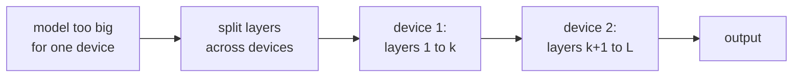

Data parallelism replicates the model across GPUs; **model parallelism**
splits the model itself. The two main flavors: **pipeline parallelism**
splits the model by layer (GPU 1 holds layers 1-12, GPU 2 holds layers
13-24, etc.); **tensor parallelism** splits individual layer
computations across GPUs. Both are essential for training models too
large for any single GPU even after FSDP sharding.

## Pipeline parallelism

The intuitive split: assign different layers to different GPUs.

For a 24-layer Transformer on 4 GPUs:

- GPU 0: layers 0-5.
- GPU 1: layers 6-11.
- GPU 2: layers 12-17.
- GPU 3: layers 18-23.

Forward: GPU 0 processes the input, sends its output to GPU 1, etc.
Backward: in reverse.

### The bubble problem

If you naively run one batch at a time, only one GPU is active at any
moment. The other three are idle waiting for activations / gradients.

A 4-GPU pipeline could achieve 25% utilization at most.

### GPipe

Huang et al. (2019)<FN n="1" />. Split the batch into smaller **microbatches**.
Pipeline them: GPU 0 starts microbatch 2 once it's done with
microbatch 1, while GPU 1 starts microbatch 1.

With M microbatches and N pipeline stages, the throughput is
M / (M + N - 1) of peak. Setting M = 4N gives ~80% utilization.

### 1F1B (one forward one backward)

Narayanan et al. (2019). PipeDream's interleaved schedule:

- Each GPU alternates forward passes (for new microbatches) and
  backward passes (for completed forward passes).
- Reduces activation memory because forward activations are released
  as soon as backward completes.

The current state of the art. Megatron-LM uses a variant of 1F1B.

### Pipeline downsides

- **Bubble overhead**: utilization is never 100%.
- **Memory imbalance**: the first pipeline stage holds activations for
  the longest (more outstanding forward passes than backward).
- **Sequential dependency**: GPU 3 can't start until GPU 0 is done.

In practice, pipeline parallelism is used at moderate depth (4-8
stages) combined with other parallelism axes.

## Tensor parallelism

A finer split: divide the computation **inside** a single layer
across GPUs.

For a linear layer $Y = X W$ with $W$ of shape (d_in, d_out):

- Split $W$ along the **output** dimension: each GPU holds a slice
  $W_i$ of shape (d_in, d_out / G).
- Each GPU computes $Y_i = X W_i$.
- Concatenate the outputs along the channel axis.

The matmul is split; the input $X$ must be available on all GPUs
(it's small relative to $W$).

### For Transformers

Megatron-LM (Shoeybi et al., 2019)<FN n="2" />. Combine column-split (output
dimension) and row-split (input dimension) cleverly:

- **Attention's QKV projection**: column-split (each GPU produces
  Q, K, V slices).
- **Attention's output projection**: row-split (each GPU's input is the
  same slice it produced).
- **FFN first linear**: column-split.
- **FFN second linear**: row-split.

The two-step pattern (column then row) means the all-reduce happens
only twice per Transformer block: once at the end of attention, once at
the end of FFN. The communication cost is bounded.

Tensor parallelism shines on intra-node setups (8 GPUs in one
server connected by NVLink), where the all-reduce is fast.

## 3D parallelism

Combine three axes:

- **Data parallelism**: across nodes (sharded with ZeRO / FSDP)<FN n="3" />.
- **Pipeline parallelism**: across nodes within a data-parallel
  replica.
- **Tensor parallelism**: across GPUs within a node.

For GPT-3 (175B) on hundreds of nodes:

- ~64 nodes × 8 GPUs/node = 512 GPUs total.
- Tensor parallelism: split each layer across 8 GPUs in a node.
- Pipeline parallelism: split layers across some subset of nodes.
- Data parallelism: replicate the pipeline across the rest.

The exact mix depends on the model architecture and cluster topology.

## Expert parallelism (Mixture of Experts)

For **Mixture of Experts (MoE)** layers, where each token activates
only a few "expert" sub-networks out of many:

- **Expert parallelism**: place different experts on different GPUs.
  Tokens route to the GPU holding their expert.
- Independent of data/pipeline/tensor parallelism along the other
  axes.

DeepSeek-V3, Mixtral, GLaM, GShard use this pattern. Highly efficient
because each token only uses a fraction of total parameters.

## Sequence parallelism

For very long contexts, even **single sequences** don't fit per GPU:

- **Sequence parallelism**: split the sequence dimension across GPUs.
- Attention requires all-to-all communication so each GPU's attention
  query can see the full sequence.
- Ring attention, Megatron's sequence parallelism implement this.

Critical for long-context training (100K+ tokens).

## Practical recommendations

For a typical training setup:

- **Single GPU**: just train normally.
- **Single node, multiple GPUs**: tensor parallelism for the model +
  data parallelism for batch.
- **Multi-node**: 3D parallelism (data + pipeline + tensor).
- **MoE models**: add expert parallelism.
- **Long context**: add sequence parallelism.

Megatron-DeepSpeed and Megatron-LM are the reference open-source
implementations. JAX with `jit` and `shard_map` is the cleaner
alternative for greenfield projects.

The next lesson covers a different scaling dimension: making the
training compute itself faster via compilation.

<Footnotes>
  <FNItem n="1">**Huang, Y., et al.** (2019). "GPipe: efficient training of giant neural networks using pipeline parallelism". *NeurIPS*. [arXiv:1811.06965](https://arxiv.org/abs/1811.06965). Microbatched pipeline parallelism and the bubble-fraction analysis.</FNItem>
  <FNItem n="2">**Shoeybi, M., et al.** (2019). "Megatron-LM: training multi-billion parameter language models using model parallelism". [arXiv:1909.08053](https://arxiv.org/abs/1909.08053). The column/row tensor-parallel split for attention and FFN.</FNItem>
  <FNItem n="3">**Rajbhandari, S., Rasley, J., Ruwase, O., & He, Y.** (2020). "ZeRO: memory optimizations toward training trillion parameter models". *SC*. [arXiv:1910.02054](https://arxiv.org/abs/1910.02054). Sharded data parallelism, the third axis of 3D parallelism.</FNItem>
</Footnotes>
