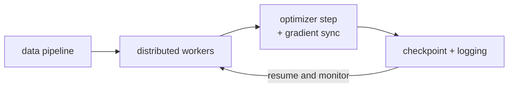

Training a frontier model is half algorithm and half infrastructure.
The optimizer, the model code, and the data pipeline only work if the
underlying cluster of thousands of GPUs cooperates: high-bandwidth
interconnect, fast storage, robust schedulers, instant failure
detection. This lesson surveys the parts of training infrastructure
that algorithms papers usually take for granted.

## The components

A modern training cluster has roughly seven parts:

1. **Compute**: GPUs / TPUs / specialized accelerators.
2. **Interconnect**: NVLink within nodes, InfiniBand / Ethernet
   between nodes.
3. **Storage**: shared filesystems for datasets and checkpoints.
4. **Collective communications**: libraries (NCCL, RCCL, XLA) that
   coordinate across devices.
5. **Schedulers**: SLURM, Kubernetes, custom systems that allocate
   jobs to hardware.
6. **Observability**: monitoring, logging, alerting on training health.
7. **Fault tolerance**: checkpointing, retry / resume.

Each one can break a training run. The job of an ML platform team is
to make all of them invisible to the model developer.

## Interconnect

The performance of distributed training depends on **how fast
gradients can move**.

- **NVLink** (within a node, 8 GPUs sharing a high-bandwidth fabric):
  ~600 GB/s per GPU. Fast enough that tensor parallelism within a node
  is cheap.
- **InfiniBand** (between nodes, 200-400 Gbit/s typical, up to 800
  Gbit/s on recent setups): much slower than NVLink. Communication
  here is often the bottleneck.
- **Ethernet RoCE** (RDMA over Converged Ethernet): cheaper alternative
  to InfiniBand. Used by some clouds.

The **all-reduce bandwidth** across the cluster sets the maximum
useful batch size: above that, communication time exceeds compute
time.

## Storage

Datasets are huge (LAION-5B is 240 TB; The Pile is 800 GB; Common
Crawl is petabytes). Training reads through them many times.

Patterns:

- **Sharded files** (WebDataset format): each shard is a tar with a
  few thousand examples. Streamable, parallel-readable.
- **Object stores** (S3, GCS): for the largest datasets. With careful
  prefetching, throughput can match local SSDs.
- **Local NVMe scratch**: each node has fast local storage for the
  current chunk of data and recent checkpoints.

Checkpoints are also gigantic: a 7B model's checkpoint is 28 GB at
fp32, but with optimizer state and shards from FSDP, the per-step
checkpoint can be 100 GB+. Saving every $K$ steps to remote storage
takes time; staggered saves and async I/O are standard.

## NCCL and collective communications

**NCCL** (NVIDIA Collective Communications Library) provides
implementations of:

- **All-reduce**: combine values from every GPU and distribute the
  result back. The workhorse of data parallelism.
- **All-gather**: collect values from every GPU into a single
  concatenated tensor. Used by FSDP.
- **Reduce-scatter**: sum and shard. Used by FSDP backward.
- **All-to-all**: every GPU sends a portion of its data to every other
  GPU. Used by expert parallelism and sequence parallelism.

NCCL chooses algorithms based on topology: ring all-reduce on NVLink,
tree reductions across nodes, hierarchical algorithms for cluster-wide
operations.

PyTorch, JAX, TensorFlow all wrap NCCL transparently<FN n="1" />.

## Schedulers

Cluster management:

- **SLURM**: the standard for academic supercomputers. Mature, batch-
  oriented.
- **Kubernetes** (with Kubeflow, Volcano): general-purpose container
  orchestration. Used at many companies.
- **Custom systems**: every hyperscaler has their own (Borg at Google,
  Tupperware at Meta, etc.). Closer integration with quotas and
  priority.

The scheduler decides which job runs where, when to preempt, how to
restart. For long training runs (weeks), preemptions are inevitable
and the system must resume from the last checkpoint.

## Observability

A training job at scale produces:

- **Per-step loss and metrics** (logged to TensorBoard, WandB, or a
  custom dashboard).
- **System metrics**: GPU utilization, memory, network throughput,
  storage I/O.
- **Anomaly detection**: NaN losses, gradient norm spikes, loss
  plateaus.
- **Profiles**: occasional snapshots of where time is spent.

Frontier teams have dedicated dashboards and on-call rotations for
training jobs. A training run that wastes 10% of compute by going
unnoticed is millions of dollars in wasted compute.

## Fault tolerance

Hardware fails:

- **GPU memory errors**: silent or noisy.
- **Node failures**: power, networking, kernel panics.
- **Storage hiccups**: file system stalls, S3 errors.

The training pipeline must detect failures and resume from the most
recent checkpoint without losing too much work. Standard checkpoint
cadence: every 100-1000 steps (a few minutes of compute), depending on
the failure rate of the cluster.

**Elastic training** (PyTorch, JAX): jobs can scale up or down at
runtime as nodes come and go<FN n="1" />.

## Cost considerations

Modern training is expensive:

- A 7B model: ~$10K-100K on cloud.
- A 70B model: ~$1M-10M.
- Frontier models (GPT-4-class): tens to hundreds of millions of
  dollars per training run.

Most of the cost is compute (GPU-hours). Storage, networking, and ops
are smaller line items.

**Spot / preemptible instances** (50-70% cheaper than on-demand) are
heavily used with checkpoint-resume to handle preemptions.

## What this means for ML practitioners

You almost never interact with this layer directly as a model
developer:

- Hyperscalers and labs have entire teams owning each piece.
- Open-source training stacks (Megatron-DeepSpeed, NeMo, MaxText) wrap
  most of the complexity.
- Cloud services (AWS Sagemaker Hyperpod, GCP Vertex Training, etc.)
  provide managed clusters.

But knowing the pieces helps you:

- Choose the right scaling strategy for your job size.
- Diagnose performance problems ("why is my GPU at 50% utilization?").
- Avoid pathological costs (write rate to checkpoint storage, fall-back
  to TCP from RDMA, etc.).

## This closes pillar D

D ran from the basic MLP, through CNNs and Transformers, into the
modern landscape of generative models, self-supervision, and graph
networks, finishing with the training-systems infrastructure that
makes large-scale deep learning practical.

The thread: each subsection deepens the toolkit for a different data
modality or problem class, but they all share a small set of building
blocks (residual connections, attention, normalization, gradient-based
optimization). The next pillar (E) covers NLP and language models
specifically: a vertical application of D's foundations.

<Footnotes>
  <FNItem n="1">**Paszke, A., et al.** (2019). "PyTorch: an imperative style, high-performance deep learning library". *NeurIPS*. [arXiv:1912.01703](https://arxiv.org/abs/1912.01703). The framework whose distributed and elastic-training APIs wrap NCCL and the cluster collectives surveyed here.</FNItem>
</Footnotes>
