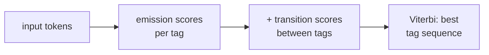

The HMM is a **generative model**: it specifies a joint $p(\mathbf{x}, \mathbf{y})$ by
modeling how labels generate words. This forces two independence assumptions: the current
word depends only on the current label ($B_{yx}$), and the current label depends only on
the previous label ($A_{ij}$). In practice, knowing the whole sentence is invaluable: the
POS tag of "run" depends on whether the next word is a noun or a comma.

A **Conditional Random Field (CRF)** is a discriminative model: it directly parameterizes
$p(\mathbf{y} \mid \mathbf{x})$ without modeling the word distribution, freeing it to
condition on arbitrary features of the full input<FN ns="1, 2" />.

## The linear-chain CRF

The **linear-chain CRF** matches the HMM's factorization structure but uses log-linear
(exponential family) potentials<FN n="1" />:

$$
p(\mathbf{y} \mid \mathbf{x}) = \frac{1}{Z(\mathbf{x})} \exp\!\left( \sum_{t=1}^{T} \sum_k \lambda_k f_k(y_{t-1}, y_t, \mathbf{x}, t) \right),
$$

where $f_k$ are **feature functions** (arbitrary functions of the previous tag, current tag,
the whole sentence, and position), $\lambda_k$ are learned weights, and

$$
Z(\mathbf{x}) = \sum_{\mathbf{y}'} \exp\!\left( \sum_{t,k} \lambda_k f_k(y'_{t-1}, y'_t, \mathbf{x}, t) \right)
$$

is the **partition function**, a sum over all $K^T$ tag sequences.

## Features

A CRF can use any feature. Common ones for POS/NER:

- Is the current word capitalized? (strong signal for proper nouns / entities)
- Does the current word end in "-ing"? (often a verb)
- Is the previous word "Mr."? (suggests a person name follows)
- Is the current word in a gazetteer of known locations?

These features all condition on $\mathbf{x}$, which is why a CRF can extract information
the generative HMM cannot.

To see one feature change a decision, take the token "Apple" with two candidate tags, $O$
and $B$-ORG, whose other scores happen to tie. With no informative feature both tags score
$0$, so $p(B\text{-ORG}) = e^0 / (e^0 + e^0) = 0.5$: a coin flip. Now add the single feature
"current word is capitalized," firing only for $B$-ORG with learned weight $\lambda = 1.5$.
The score of $B$-ORG rises to $1.5$ while $O$ stays at $0$, so

$$
p(B\text{-ORG}) = \frac{e^{1.5}}{e^{1.5} + e^{0}} \approx 0.82,
$$

and $p(O) \approx 0.18$. One feature of $\mathbf{x}$ moved the call from 50/50 to better than
4-to-1, which is precisely the lever the HMM does not have.

## Computing $Z(\mathbf{x})$: the forward algorithm

Direct summation over $K^T$ sequences is exponential. The chain factorization makes
$Z(\mathbf{x})$ decomposable by dynamic programming.

Define the **forward variable** $\alpha_t(j)$ as the sum of the unnormalized scores of
all partial paths $(y_1, \dots, y_t)$ ending in state $j$:

$$
\alpha_1(j) = \exp\!\left( \sum_k \lambda_k f_k(\text{start}, j, \mathbf{x}, 1) \right),
$$

$$
\alpha_t(j) = \sum_{i} \alpha_{t-1}(i) \cdot \exp\!\left( \sum_k \lambda_k f_k(i, j, \mathbf{x}, t) \right).
$$

Then $Z(\mathbf{x}) = \sum_j \alpha_T(j)$.

The partition function runs in $O(TK^2)$, same as Viterbi.

## Training: maximum conditional likelihood

Minimize the negative log-likelihood on the labeled corpus:

$$
\mathcal{L}(\boldsymbol\lambda) = -\sum_{({\mathbf{x}}, {\mathbf{y}}) \in \mathcal{D}} \left[ \text{score}(\mathbf{x}, \mathbf{y}) - \log Z(\mathbf{x}) \right] + \frac{\mu}{2} \|\boldsymbol\lambda\|^2.
$$

The gradient with respect to $\lambda_k$ is:

$$
\frac{\partial \mathcal{L}}{\partial \lambda_k} = \mathbb{E}_{p(\mathbf{y}|\mathbf{x})}\left[\sum_t f_k(y_{t-1}, y_t, \mathbf{x}, t)\right] - \sum_t f_k(y_{t-1}^*, y_t^*, \mathbf{x}, t),
$$

i.e., the **expected feature count** under the model minus the **observed feature count**
under the gold labels. L-BFGS or gradient descent minimizes this efficiently.

## Decoding: Viterbi (same as HMM)

Replace the HMM's $\log B_{j, x_t} + \log A_{ij}$ potential with the CRF's
$\sum_k \lambda_k f_k(i, j, \mathbf{x}, t)$:

$$
v_t(j) = \max_i \bigl[ v_{t-1}(i) + \psi_t(i, j) \bigr], \quad
\psi_t(i, j) = \sum_k \lambda_k f_k(i, j, \mathbf{x}, t).
$$

The Viterbi algorithm is otherwise identical.

## A minimal CRF on toy data

```python-static
import numpy as np
from scipy.special import logsumexp

# Tags: 0=O, 1=B-PER, 2=I-PER
# Features: (bias, word_is_capitalized, prev_is_O, prev_is_B, prev_is_I) -> per (y_prev, y_cur) pair
# For simplicity: score(y_prev, y_cur, x_t) = T_matrix[y_prev, y_cur] + E[y_cur, x_t_feature]

K = 3  # tags

def forward(log_potentials):
    """log_potentials[t, i, j] = log psi_t(i, j). Returns log Z."""
    T = log_potentials.shape[0]
    # alpha[j] = log sum_paths ending in j at step t
    alpha = log_potentials[0, 0, :]  # assume start = tag 0
    for t in range(1, T):
        alpha = logsumexp(alpha[:, None] + log_potentials[t], axis=0)
    return logsumexp(alpha)

def viterbi(log_potentials):
    """Returns the best path."""
    T = log_potentials.shape[0]
    v    = np.full((T, K), -np.inf)
    psi  = np.zeros((T, K), dtype=int)
    v[0] = log_potentials[0, 0, :]
    for t in range(1, T):
        scores = v[t - 1, :, None] + log_potentials[t]   # (K, K)
        psi[t] = scores.argmax(axis=0)
        v[t]   = scores.max(axis=0)
    path = np.zeros(T, dtype=int)
    path[-1] = v[-1].argmax()
    for t in range(T - 2, -1, -1):
        path[t] = psi[t + 1, path[t + 1]]
    return path

# Toy log potentials: favor O->B transition at t=1, B->I at t=2
log_psi = np.array([
    [[0, 2, -10], [-10, -10, -10], [-10, -10, -10]],   # t=1: from start (tag 0=O)
    [[0, -10, -10], [-10, 0, 2], [-10, -10, 0]],         # t=2: B->I strong
    [[0, -10, -10], [-10, 0, -10], [-10, -10, 2]],       # t=3: I->I or I->O
], dtype=float)

log_Z = forward(log_psi)
path  = viterbi(log_psi)
print(f"log Z = {log_Z:.3f}")
print(f"Viterbi path: {[['O','B-PER','I-PER'][y] for y in path]}")
```



## CRF vs HMM: the key difference

- **Model type:** HMM is generative; CRF is discriminative.
- **Conditions on:** HMM sees the current word only; CRF sees the full sentence.
- **Features:** HMM is fixed (emission/transition); CRF allows arbitrary feature functions.
- **Training:** HMM uses MLE counting; CRF uses conditional maximum likelihood (gradient).
- **Decoding:** both use Viterbi (the CRF swaps in feature-weighted potentials).

## Exercises

**Exercise 1.** A two-tag CRF scores token $t$ with one feature firing only for tag $B$-ORG: "word is capitalized", weight $\lambda = 1.5$, plus a transition score that adds $0.5$ to $B$-ORG and $0$ to $O$. The word "Apple" is capitalized. Compute $p(B\text{-ORG})$ at this position.

<details>
<summary>Solution</summary>

**Step 1.** Sum the active feature weights into a score per tag. For $B$-ORG: capitalization feature $1.5$ plus transition $0.5$ gives score $2.0$. For $O$: no feature fires, score $0$.

**Step 2.** The local conditional is a softmax over the two scores:

$$
p(B\text{-ORG}) = \frac{e^{2.0}}{e^{2.0} + e^{0}} = \frac{e^{2.0}}{e^{2.0} + 1}.
$$

**Step 3.** Evaluate: $e^{2.0} \approx 7.389$, so

$$
p(B\text{-ORG}) = \frac{7.389}{7.389 + 1} = \frac{7.389}{8.389} \approx 0.881.
$$

The extra transition score pushed the call from the $0.82$ of the single-feature example up to about $0.88$.

</details>

**Exercise 2.** The partition function is $Z(\mathbf{x}) = \sum_j \alpha_T(j)$. For a CRF where every transition potential $\exp(\sum_k \lambda_k f_k(i, j, \mathbf{x}, t))$ equals $1$ (all feature weights zero), show that $Z(\mathbf{x}) = K^T$, the number of tag sequences.

<details>
<summary>Solution</summary>

**Step 1.** With every potential equal to $1$, the initialization is $\alpha_1(j) = 1$ for all $K$ states, so $\sum_j \alpha_1(j) = K$.

**Step 2.** The recursion becomes $\alpha_t(j) = \sum_i \alpha_{t-1}(i) \cdot 1 = \sum_i \alpha_{t-1}(i)$, the same value for every $j$. If $\sum_i \alpha_{t-1}(i) = K^{t-1}$, then each $\alpha_t(j) = K^{t-1}$ and $\sum_j \alpha_t(j) = K \cdot K^{t-1} = K^{t}$.

**Step 3.** By induction $\sum_j \alpha_T(j) = K^T$, so $Z = K^T$. This is the sanity check on the forward recursion: with uniform potentials the partition function counts all $K^T$ sequences, each contributing weight $1$, which is exactly the brute-force sum the dynamic program replaces.

</details>

**Exercise 3 (code).** Implement the CRF forward algorithm and Viterbi in pure numpy (no scipy). Use a numerically stable log-sum-exp. On the lesson's toy log-potentials, confirm Viterbi decodes the path B-PER, I-PER, I-PER (the highest-scoring sequence at score 6), and that $\log Z$ is at least the score of that best path.

<details>
<summary>Solution</summary>

```python
import numpy as np

K = 3  # tags: 0=O, 1=B-PER, 2=I-PER

def logsumexp(a, axis=None):
    m = np.max(a, axis=axis, keepdims=True)
    out = m + np.log(np.sum(np.exp(a - m), axis=axis, keepdims=True))
    return np.squeeze(out, axis=axis) if axis is not None else out.reshape(())

def forward(log_potentials):
    T = log_potentials.shape[0]
    alpha = log_potentials[0, 0, :]           # start = tag 0
    for t in range(1, T):
        alpha = logsumexp(alpha[:, None] + log_potentials[t], axis=0)
    return float(logsumexp(alpha))

def viterbi(log_potentials):
    T = log_potentials.shape[0]
    v   = np.full((T, K), -np.inf)
    bp  = np.zeros((T, K), dtype=int)
    v[0] = log_potentials[0, 0, :]
    for t in range(1, T):
        scores = v[t - 1, :, None] + log_potentials[t]
        bp[t]  = scores.argmax(axis=0)
        v[t]   = scores.max(axis=0)
    path = np.zeros(T, dtype=int)
    path[-1] = v[-1].argmax()
    for t in range(T - 2, -1, -1):
        path[t] = bp[t + 1, path[t + 1]]
    return path, float(v[-1].max())

log_psi = np.array([
    [[0, 2, -10], [-10, -10, -10], [-10, -10, -10]],
    [[0, -10, -10], [-10, 0, 2], [-10, -10, 0]],
    [[0, -10, -10], [-10, 0, -10], [-10, -10, 2]],
], dtype=float)

path, best_score = viterbi(log_psi)
log_Z = forward(log_psi)

names = ["O", "B-PER", "I-PER"]
assert [names[y] for y in path] == ["B-PER", "I-PER", "I-PER"]
assert best_score == 6.0
assert log_Z >= best_score - 1e-9   # Z sums all paths, so >= the max path score
print("path:", [names[y] for y in path], " best:", best_score, " log Z:", round(log_Z, 3))
```

The toy potentials reward the B-PER then I-PER then I-PER chain (each step adds 2 along that diagonal, total 6). Viterbi takes the max over paths and the forward algorithm takes the log-sum, so $\log Z$ is the soft maximum and never falls below the best single path's score.

</details>

Modern NER systems stack a CRF on top of a pre-trained transformer encoder (BERT+CRF):
the encoder produces contextual embeddings for each token, and the CRF layer enforces
BIO transition constraints during decoding.

<Footnotes>
  <FNItem n="1">**Lafferty, J., McCallum, A., & Pereira, F.** (2001). "Conditional random fields: probabilistic models for segmenting and labeling sequence data". *ICML*. Introduces the linear-chain CRF and its training objective.</FNItem>
  <FNItem n="2">**Jurafsky, D., & Martin, J. H.** (2024). *Speech and Language Processing* (3rd ed. draft). Discriminative sequence labeling with CRFs.</FNItem>
</Footnotes>
