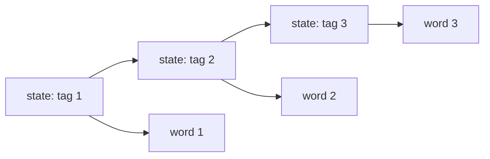

**Sequence labeling** assigns a tag to every token in a sentence. Part-of-speech (POS)
tagging maps each word to its grammatical category (noun, verb, adjective, ...); named
entity recognition (NER) labels spans as Person, Organization, Location, or Other.

Both tasks share a structure: the output is a sequence of the same length as the input,
and adjacent labels are strongly correlated (a noun is likely followed by a verb; an
"I" (inside) tag must follow a "B" (begin) tag of the same entity type). The
**Hidden Markov Model** is the canonical probabilistic model for this structure.

## HMM definition

An HMM over observation sequence $\mathbf{x} = x_1, \dots, x_T$ and hidden state
sequence $\mathbf{y} = y_1, \dots, y_T$ (the tags) has three components:

**Transition probabilities** $A_{ij} = p(y_t = j \mid y_{t-1} = i)$: a $K \times K$
matrix (rows sum to 1) encoding how likely tag $j$ follows tag $i$.

**Emission probabilities** $B_{ik} = p(x_t = k \mid y_t = i)$: a $K \times V$ matrix
encoding how likely word $k$ is emitted from tag $i$.

**Initial probabilities** $\pi_i = p(y_1 = i)$: a length-$K$ vector.

The joint probability of an observation-state sequence pair:

$$
p(\mathbf{x}, \mathbf{y}) = \pi_{y_1} \prod_{t=1}^{T} B_{y_t, x_t} \prod_{t=2}^{T} A_{y_{t-1}, y_t}.
$$

## Training: counting

Given a labeled corpus (sentences with gold POS tags), estimate by MLE:

$$
\hat{A}_{ij} = \frac{c(i \to j)}{\sum_k c(i \to k)}, \qquad
\hat{B}_{ik} = \frac{c(i, k)}{\sum_l c(i, l)}, \qquad
\hat{\pi}_i = \frac{c(\text{starts with } i)}{N_{\text{sentences}}}.
$$

Each count is a simple corpus statistic. Add Laplace smoothing to handle unseen
word-tag pairs.

## Decoding: the Viterbi algorithm

At test time, we want the most probable tag sequence given the words:

$$
\hat{\mathbf{y}} = \arg\max_{\mathbf{y}} p(\mathbf{y} \mid \mathbf{x}) = \arg\max_{\mathbf{y}} p(\mathbf{x}, \mathbf{y}).
$$

Brute force over $K^T$ sequences is exponential. The **Viterbi algorithm** solves this
in $O(TK^2)$ with dynamic programming.

Define $v_t(j) = \max_{y_1, \dots, y_{t-1}} p(y_1, \dots, y_{t-1}, y_t = j, x_1, \dots, x_t)$:
the probability of the best path ending in state $j$ at time $t$.

**Initialization** ($t=1$):
$$v_1(j) = \pi_j \cdot B_{j, x_1}.$$

**Recursion** ($t > 1$):
$$v_t(j) = B_{j, x_t} \cdot \max_i \bigl[ v_{t-1}(i) \cdot A_{ij} \bigr].$$

Store the backpointer $\psi_t(j) = \arg\max_i [v_{t-1}(i) \cdot A_{ij}]$.

**Termination:** $\hat{y}_T = \arg\max_j v_T(j)$. Backtrack through $\psi$ to recover
the full sequence.

## Worked example

Tags: $\{$DT, NN, VB$\}$ (determiner, noun, verb). Words: $\{$the, dog, runs$\}$.

Tiny parameters (illustrative):

$$
\pi = [0.6, 0.3, 0.1], \quad
A = \begin{pmatrix} 0.1 & 0.8 & 0.1 \\ 0.1 & 0.1 & 0.8 \\ 0.5 & 0.4 & 0.1 \end{pmatrix},
$$

$$
B = \begin{pmatrix} 0.9 & 0.05 & 0.05 \\ 0.01 & 0.9 & 0.09 \\ 0.0 & 0.05 & 0.95 \end{pmatrix}.
$$

$t=1$ ("the"): $v_1(\text{DT}) = 0.6 \times 0.9 = 0.54$, $v_1(\text{NN}) = 0.3 \times 0.05 = 0.015$, $v_1(\text{VB}) = 0.1 \times 0.0 = 0.0$.

$t=2$ ("dog"): $v_2(\text{NN}) = 0.9 \times \max[0.54 \times 0.8, 0.015 \times 0.1, 0] = 0.9 \times 0.432 = 0.389$.

$t=3$ ("runs"): $v_3(\text{VB}) = 0.95 \times \max[v_2(\text{DT}) \times 0.1, v_2(\text{NN}) \times 0.8, v_2(\text{VB}) \times 0.1]$.

The Viterbi path recovers DT-NN-VB, the correct tagging.

```python
import numpy as np

# Tags: 0=DT, 1=NN, 2=VB  |  Words: 0=the, 1=dog, 2=runs
pi = np.array([0.6, 0.3, 0.1])
A  = np.array([[0.1, 0.8, 0.1],
               [0.1, 0.1, 0.8],
               [0.5, 0.4, 0.1]])
B  = np.array([[0.9,  0.05, 0.05],
               [0.01, 0.9,  0.09],
               [0.0,  0.05, 0.95]])

sentence = [0, 1, 2]  # the dog runs
K, T = len(pi), len(sentence)

v    = np.zeros((T, K))
psi  = np.zeros((T, K), dtype=int)

v[0] = pi * B[:, sentence[0]]
for t in range(1, T):
    scores = v[t - 1, :, None] * A          # (K_prev, K_next)
    psi[t] = scores.argmax(axis=0)
    v[t]   = scores.max(axis=0) * B[:, sentence[t]]

# Backtrack
path = np.zeros(T, dtype=int)
path[-1] = v[-1].argmax()
for t in range(T - 2, -1, -1):
    path[t] = psi[t + 1, path[t + 1]]

tag_names = ["DT", "NN", "VB"]
word_names = ["the", "dog", "runs"]
print("Viterbi path:", [tag_names[y] for y in path])
print("Viterbi log-prob:", np.log(v[-1, path[-1]]))
```

## BIO labeling for NER

NER uses the **BIO** tag scheme: **B**eginning of an entity span, **I**nside, **O**utside.
The sentence "Apple announced new products" might tag as:

$$
\text{Apple}\ (B\text{-ORG}),\quad \text{announced}\ (O),\quad \text{new}\ (O),\quad \text{products}\ (O).
$$

The HMM transition matrix encodes the BIO constraint: $A_{O, I} = 0$ (can't enter an inside
tag from outside without a begin tag), enforced by setting that entry to zero before normalization.



## HMM limitations

The emission probability $p(x_t \mid y_t)$ conditions only on the current word. It cannot
use surrounding words as features -- "run" and "runs" have independent emission distributions.
The next lesson introduces CRFs, which replace this generative model with a discriminative one
that can use arbitrary features of the full input sentence.
