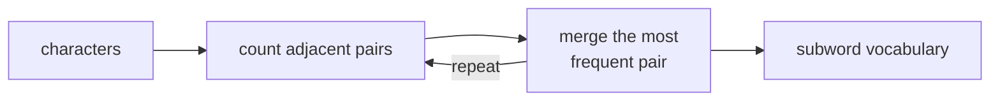

A neural network operates on tensors of floats; text is a sequence of Unicode code points.
**Tokenization** is the deterministic, learned-once function that converts between them. The
choice of tokenizer is permanent: once a model is trained, its tokenizer is frozen, because
the embedding matrix has one row per vocabulary entry.

## Why not words or characters?

**Word-level:** every misspelling, neologism, or rare inflection is out-of-vocabulary (OOV).
Vocabulary size reaches millions; most entries appear too rarely to train good embeddings.

**Character-level:** no OOV problem, but sequences are 5-10x longer. Transformer attention
costs $O(T^2)$ in sequence length, making character-level prohibitively expensive.

**Subword (the winning middle):** frequent words become single tokens (short sequences);
rare words decompose into subword pieces (no OOV). Typical vocabulary: 30K-200K entries<FN n="3" />.

## Byte-pair encoding (BPE)

BPE is a compression algorithm adapted for tokenization<FN n="1" />.

### Training algorithm

Inputs: a text corpus and a target vocabulary size $V$.

```
1. Initialise vocab with all bytes (256 entries for byte-level BPE).
2. Represent every word as a sequence of base vocabulary symbols.
3. Repeat until |vocab| == V:
     a. Count all adjacent symbol pairs across the corpus.
     b. Merge the most-frequent pair (a, b) into a new symbol ab.
     c. Replace every occurrence of (a, b) with ab in the corpus.
4. Output: the vocabulary and the ordered merge table.
```

The merge table is an ordered list of rules. Order matters: encoding new text applies
rules in the same order they were learned.

### Worked example

Corpus (word, frequency):

```
"low"    : 5   →  l o w </w>
"lower"  : 2   →  l o w e r </w>
"newest" : 6   →  n e w e s t </w>
"widest" : 3   →  w i d e s t </w>
```

Pair counts: `(e, s)` appears $6 + 3 = 9$ times (highest). Merge to `es`.
Next: `(es, t)` appears $9$ times. Merge to `est`.
Next: `(est, </w>)` appears $9$ times. Merge to `est</w>`.

After enough merges, "newest" becomes the single token `newest</w>` and
"lower" becomes `low` + `er</w>`.

### Encoding new text

Apply the merge table in order to the character sequence of each new word:

```
"widest" → w i d e s t </w>
apply (e,s)→es:   w i d es t </w>
apply (es,t)→est: w i d est </w>
apply (est,</w>)→est</w>: w i d est</w>
result: ["w", "i", "d", "est</w>"]
```

### BPE implementation

```python
from collections import Counter

def get_pairs(corpus):
    pairs = Counter()
    for word, freq in corpus.items():
        syms = word.split()
        for i in range(len(syms) - 1):
            pairs[(syms[i], syms[i + 1])] += freq
    return pairs

def merge_pair(pair, corpus):
    a, b = pair
    ab = a + b
    new_corpus = {}
    for word, freq in corpus.items():
        syms = word.split()
        out, i = [], 0
        while i < len(syms):
            if i < len(syms) - 1 and syms[i] == a and syms[i + 1] == b:
                out.append(ab); i += 2
            else:
                out.append(syms[i]); i += 1
        new_corpus[" ".join(out)] = freq
    return new_corpus

corpus = {
    "l o w </w>": 5,
    "l o w e r </w>": 2,
    "n e w e s t </w>": 6,
    "w i d e s t </w>": 3,
}
merges = []
for _ in range(8):
    pairs = get_pairs(corpus)
    if not pairs:
        break
    best = max(pairs, key=pairs.get)
    corpus = merge_pair(best, corpus)
    merges.append(best)
    print(f"merge: {best[0]} + {best[1]} -> {best[0]+best[1]}")

print("\nFinal corpus:")
for word, freq in corpus.items():
    print(f"  {word!r}: {freq}")
```

## WordPiece

WordPiece (used by BERT) chooses merges differently: instead of the most-frequent pair,
it picks the pair $(a, b)$ that maximizes:

$$
\frac{c(ab)}{c(a) \cdot c(b)}.
$$

This is the **pointwise mutual information** (PMI) of the pair. Merging high-PMI pairs
tends to produce more linguistically meaningful subwords than pure frequency.

WordPiece represents out-of-vocabulary words by marking internal subword pieces with `##`:
"playing" might tokenize as `["play", "##ing"]`.

## SentencePiece and the unigram model

SentencePiece differs in two ways:

1. It treats whitespace as a regular character (represented as `▁`), so it can handle
   any language without a pre-tokenizer regex.
2. It offers a **unigram language model** variant alongside BPE. The unigram model
   starts with a large vocabulary and prunes entries, keeping those that minimize<FN n="2" />:

$$
\mathcal{L} = -\sum_{s \in \mathcal{C}} \log p(s), \quad p(s) = \sum_{\mathbf{x} \in \text{seg}(s)} \prod_{x_i \in \mathbf{x}} p(x_i),
$$

where $\text{seg}(s)$ is the set of all segmentations of sentence $s$ and $p(x_i)$
is the unigram probability of piece $x_i$. The sum-over-segmentations is computed with
the forward algorithm.



## Vocabulary sizes in practice

| Model | Tokenizer | Vocab size |
|-------|-----------|-----------|
| GPT-2 | byte-level BPE | 50,257 |
| GPT-4 (`cl100k_base`) | byte-level BPE | 100,256 |
| LLaMA-2 | SentencePiece BPE | 32,000 |
| LLaMA-3 | SentencePiece BPE | 128,000 |

Larger vocabularies cover non-Latin scripts more efficiently (a Chinese character
needs 3 bytes; without a specific vocabulary entry it costs 3 tokens). The tradeoff:
each vocabulary entry adds one row to the embedding matrix and the LM head.

The next subsection moves to neural models that consume these token sequences.

<Footnotes>
  <FNItem n="1">**Sennrich, R., Haddow, B., & Birch, A.** (2016). "Neural machine translation of rare words with subword units (BPE)". *ACL*. [arXiv:1508.07909](https://arxiv.org/abs/1508.07909)</FNItem>
  <FNItem n="2">**Kudo, T.** (2018). "Subword regularization: improving NMT models with multiple subword candidates". *ACL*. The unigram-LM tokenizer and its segmentation likelihood. [arXiv:1804.10959](https://arxiv.org/abs/1804.10959)</FNItem>
  <FNItem n="3">**Jurafsky, D., & Martin, J. H.** (2024). *Speech and Language Processing* (3rd ed. draft). Subword tokenization and the BPE algorithm.</FNItem>
</Footnotes>
