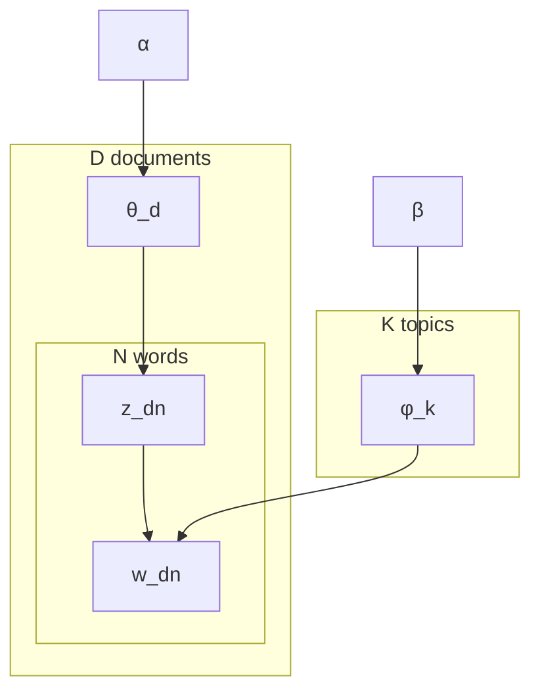

A document is a mixture of topics; each topic is a distribution over words. **Topic models**
discover these latent themes from a corpus without supervision, grouping words that tend to
appear together and assigning each document a mixture of those groups.

The two canonical approaches are **Latent Dirichlet Allocation (LDA)**, a probabilistic
graphical model, and **Non-negative Matrix Factorization (NMF)**, a deterministic matrix
decomposition<FN n="2" />.

## Latent Dirichlet Allocation

### The generative story

LDA assumes documents are generated by the following process<FN n="1" />:

1. For each document $d$, draw a topic mixture $\theta_d \sim \text{Dir}(\alpha)$.
2. For each of the $K$ topics $k$, draw a word distribution $\phi_k \sim \text{Dir}(\beta)$.
3. For each word position $n$ in document $d$:
   a. Draw a topic assignment $z_{dn} \sim \text{Categorical}(\theta_d)$.
   b. Draw a word $w_{dn} \sim \text{Categorical}(\phi_{z_{dn}})$.

The Dirichlet priors $\alpha$ and $\beta$ control sparsity: small $\alpha$ produces
documents that concentrate on few topics; small $\beta$ produces topics that concentrate
on few words.

### Plate notation



Shaded nodes ($w$) are observed; all others are latent.

### Inference: collapsed Gibbs sampling

Exact posterior inference is intractable; the standard approach is **collapsed Gibbs
sampling**, which integrates out $\theta$ and $\phi$ analytically and samples only the
topic assignments $\mathbf{z}$.

The conditional posterior for a single assignment $z_{dn} = k$ (given all others):

$$
p(z_{dn} = k \mid \mathbf{z}_{-dn}, \mathbf{w}) \propto
  \underbrace{\frac{n_{dk}^{-dn} + \alpha}{n_d^{-dn} + K\alpha}}_{\text{document-topic affinity}}
  \cdot
  \underbrace{\frac{n_{kw}^{-dn} + \beta}{n_k^{-dn} + V\beta}}_{\text{topic-word affinity}},
$$

where $n_{dk}^{-dn}$ is the number of words in document $d$ assigned to topic $k$
(excluding position $n$), and $n_{kw}^{-dn}$ is the number of times word $w$ is assigned
to topic $k$ (excluding position $n$).

Each iteration cycles over every word in the corpus and resamples its topic assignment.
After burn-in, the averaged counts estimate $\theta$ and $\phi$.

### Reading the output

After convergence:

- $\phi_k$: distribution over vocabulary for topic $k$. The top-10 words characterize the topic.
- $\theta_d$: distribution over topics for document $d$.

```python-static
import numpy as np
from sklearn.decomposition import LatentDirichletAllocation
from sklearn.feature_extraction.text import CountVectorizer

docs = [
    "The president signed the new healthcare bill into law today.",
    "Stock markets rose sharply on strong earnings reports.",
    "Scientists discover a new species of deep-sea fish.",
    "Senate debates immigration reform and border security funding.",
    "Tech company reports record profits driven by cloud services.",
    "Marine biologists study coral reef bleaching in the Pacific.",
]

vectorizer = CountVectorizer(stop_words="english")
X = vectorizer.fit_transform(docs)
vocab = vectorizer.get_feature_names_out()

lda = LatentDirichletAllocation(n_components=3, random_state=0, max_iter=100)
lda.fit(X)

for k, phi in enumerate(lda.components_):
    top_words = [vocab[i] for i in phi.argsort()[-5:][::-1]]
    print(f"Topic {k}: {', '.join(top_words)}")
```

## Non-negative Matrix Factorization

NMF factorizes the document-term matrix $\mathbf{X} \in \mathbb{R}^{D \times V}_{\ge 0}$
into two non-negative factors:

$$
\mathbf{X} \approx \mathbf{W} \mathbf{H}, \quad \mathbf{W} \in \mathbb{R}^{D \times K}_{\ge 0},\quad \mathbf{H} \in \mathbb{R}^{K \times V}_{\ge 0}.
$$

- $\mathbf{H}_{k,:}$: the word distribution for topic $k$ (analogous to $\phi_k$ in LDA).
- $\mathbf{W}_{d,:}$: the topic weight vector for document $d$ (analogous to $\theta_d$).

Non-negativity forces additive, parts-based decompositions: topics can only combine
positively, which produces interpretable components.

**Objective:** minimize the Frobenius reconstruction error with a multiplicative update:

$$
\min_{\mathbf{W}, \mathbf{H} \ge 0} \|\mathbf{X} - \mathbf{W}\mathbf{H}\|_F^2.
$$

**Multiplicative update rules** (Lee and Seung, 2001):

$$
\mathbf{H} \leftarrow \mathbf{H} \odot \frac{\mathbf{W}^\top \mathbf{X}}{\mathbf{W}^\top \mathbf{W} \mathbf{H}}, \quad
\mathbf{W} \leftarrow \mathbf{W} \odot \frac{\mathbf{X} \mathbf{H}^\top}{\mathbf{W} \mathbf{H} \mathbf{H}^\top}.
$$

Division and multiplication are elementwise. These updates guarantee non-negativity is
preserved and the objective never increases.

```python-static
from sklearn.decomposition import NMF

nmf = NMF(n_components=3, random_state=0, max_iter=500)
W = nmf.fit_transform(X)
H = nmf.components_

for k in range(3):
    top_words = [vocab[i] for i in H[k].argsort()[-5:][::-1]]
    print(f"NMF topic {k}: {', '.join(top_words)}")
```

## LDA vs NMF

| Property | LDA | NMF |
|----------|-----|-----|
| Framework | Probabilistic graphical model | Matrix factorization |
| Inference | MCMC (Gibbs) or variational EM | Multiplicative updates |
| Interpretability | Principled uncertainty | Simpler, faster |
| Topic coherence | Often better | Comparable on short docs |
| Scalability | Slower | Faster |

Both produce interpretable topics when $K$ is in the range 10-100 and documents are
reasonably long. Modern LLMs have largely replaced topic models for semantic search
(embeddings from E2 are more expressive), but topic models remain useful for exploratory
analysis at scale with no labeled data.

<Footnotes>
  <FNItem n="1">**Blei, D. M., Ng, A. Y., & Jordan, M. I.** (2003). "Latent Dirichlet allocation". *JMLR*, 3, 993-1022. The generative model and variational inference for LDA.</FNItem>
  <FNItem n="2">**Jurafsky, D., & Martin, J. H.** (2024). *Speech and Language Processing* (3rd ed. draft). Topic models and vector-space document representations.</FNItem>
</Footnotes>
