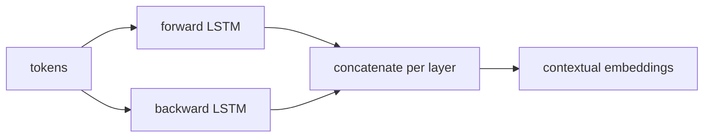

Word2vec assigns a single vector to each word type, regardless of context. "Bank" in "river
bank" and "bank" in "central bank" receive the same embedding. **ELMo** (Embeddings from
Language Models; Peters et al., 2018)<FN n="1" /> produces **contextual embeddings**: the representation
of each token depends on the entire surrounding sentence.

## Bidirectional language model

ELMo's backbone is a **biLM**: two independent language models trained on the same corpus,
one reading left-to-right, one reading right-to-left.

**Forward LM:** $p(x_1, \dots, x_T) = \prod_t p(x_t \mid x_1, \dots, x_{t-1})$.

**Backward LM:** $p(x_1, \dots, x_T) = \prod_t p(x_t \mid x_{t+1}, \dots, x_T)$.

Each LM is an $L$-layer stacked LSTM<FN n="2" />. The joint log-likelihood:

$$
\mathcal{L} = \sum_t \left[ \log p(x_t \mid x_{<t}; \Theta_{\text{fwd}}) + \log p(x_t \mid x_{>t}; \Theta_{\text{bwd}}) \right].
$$

Parameters are partially shared: character-level CNN token embeddings and the softmax
projection are tied; LSTM weights are separate.

## The three layers

After training, each token $x_t$ is associated with $L+1$ vectors per direction:

- Layer 0: the token embedding (from the character CNN, same for both directions).
- Layers 1 to $L$: the hidden state of LSTM layer $\ell$ (forward or backward).

For a 2-layer biLM, each token has 5 vectors: 1 embedding + 2 forward LSTM states + 2
backward LSTM states. ELMo concatenates forward and backward:

$$
\mathbf{r}_t^\ell = [\overrightarrow{h}_t^{\ell}; \overleftarrow{h}_t^{\ell}], \quad \ell = 0, 1, \dots, L.
$$

## ELMo representations

Instead of using just the top layer, ELMo takes a **task-specific weighted sum** of all
layers. For downstream task $k$, the ELMo representation of token $t$ is:

$$
\mathbf{e}_t^{\text{ELMo}} = \gamma^k \sum_{\ell=0}^{L} s_\ell^k\, \mathbf{r}_t^\ell,
$$

where $\mathbf{s}^k = \text{softmax}(\mathbf{w}^k)$ are task-specific layer weights
(learned scalars), and $\gamma^k$ is a task-specific scaling factor. Both are learned
during downstream fine-tuning while the biLM weights are frozen.

**Why layer weighting?** Different layers encode different information:
- Lower layers capture syntax (POS, NER-style surface features).
- Upper layers capture semantics and word sense disambiguation.
Different tasks benefit from different mixes.

## ELMo vs static embeddings

| Property | word2vec / GloVe | ELMo |
|----------|-----------------|------|
| Representation | One vector per word type | One vector per token occurrence |
| Context | None | Full sentence (bidirectional) |
| Polysemy | Single vector blends all senses | Different vectors per context |
| Usage | Fixed at inference | Frozen biLM + task fine-tuning |

ELMo achieved large gains on NER, coreference, SQuAD, and sentiment at its release.

## Conceptual implementation (biLM)

```python-static
import torch
import torch.nn as nn

class BiLM(nn.Module):
    def __init__(self, vocab_size, embed_dim, hidden_dim, n_layers):
        super().__init__()
        self.embed = nn.Embedding(vocab_size, embed_dim)
        self.fwd_lstm = nn.LSTM(embed_dim, hidden_dim, n_layers, batch_first=True)
        self.bwd_lstm = nn.LSTM(embed_dim, hidden_dim, n_layers, batch_first=True)
        self.proj = nn.Linear(hidden_dim, vocab_size)   # shared output projection

    def forward(self, token_ids):
        # token_ids: (B, T)
        emb = self.embed(token_ids)                     # (B, T, E)
        fwd_hs, _ = self.fwd_lstm(emb)                  # (B, T, H)
        bwd_hs, _ = self.bwd_lstm(torch.flip(emb, [1])) # reverse sequence
        bwd_hs    = torch.flip(bwd_hs, [1])              # flip back

        fwd_logits = self.proj(fwd_hs[:, :-1])           # predict next token
        bwd_logits = self.proj(bwd_hs[:, 1:])            # predict prev token

        elmo_reps = torch.cat([fwd_hs, bwd_hs], dim=-1)  # (B, T, 2H)
        return fwd_logits, bwd_logits, elmo_reps
```



## Exercises

**Exercise 1.** A 2-layer biLM gives a token three concatenated layer vectors
$\mathbf{r}^0 = (1, 1)$, $\mathbf{r}^1 = (2, 2)$, $\mathbf{r}^2 = (3, 3)$. The raw
layer logits are $\mathbf{w} = (1, 0, 0)$ and the scale is $\gamma = 2$. Compute the
ELMo representation $\mathbf{e} = \gamma \sum_{\ell} s_\ell\, \mathbf{r}^\ell$ with
$\mathbf{s} = \mathrm{softmax}(\mathbf{w})$, by hand.

<details>
<summary>Solution</summary>

**Step 1.** Softmax the logits. The exponentials are $e^1 = 2.7183$, $e^0 = 1$,
$e^0 = 1$, summing to $Z = 4.7183$. So
$\mathbf{s} = (2.7183, 1, 1)/4.7183 = (0.5761, 0.2119, 0.2119)$, which sums to $1$.

**Step 2.** Form the weighted sum of the layer vectors. Each component is identical,
so work with one:

$$
0.5761 \cdot 1 + 0.2119 \cdot 2 + 0.2119 \cdot 3 = 0.5761 + 0.4238 + 0.6357 = 1.6356.
$$

**Step 3.** Apply the scale $\gamma = 2$: $\mathbf{e} = 2 \cdot (1.6356, 1.6356) =
(3.2712, 3.2712)$. The softmax weights mix the three layers; $\gamma$ then rescales
the whole blend for the downstream task.

</details>

**Exercise 2.** ELMo learns $\mathbf{s}^k$ and $\gamma^k$ per task while the biLM
weights stay frozen. Explain why a sequence-labeling task such as POS tagging might
learn weights $\mathbf{s}$ that favor lower biLM layers, while a word-sense task
might favor upper layers.

<details>
<summary>Solution</summary>

**Step 1.** Recall what the layers encode: lower biLM layers capture syntax and
surface features (part of speech, morphology), upper layers capture semantics and
word-sense disambiguation.

**Step 2.** POS tagging needs syntactic and surface signal at each token. Putting
more softmax mass on the lower layer $\mathbf{r}^1$ surfaces exactly that signal, so
the learned $\mathbf{s}$ shifts weight downward.

**Step 3.** Word-sense disambiguation needs to tell apart senses of the same word
type, which lives in the upper, more semantic layer $\mathbf{r}^2$. The task
therefore learns $\mathbf{s}$ weighted toward the top layer. The per-task weights let
one frozen biLM serve both needs without retraining the backbone.

</details>

**Exercise 3 (code).** Implement the ELMo weighted sum
$\mathbf{e} = \gamma \sum_\ell s_\ell \mathbf{r}^\ell$ with
$\mathbf{s} = \mathrm{softmax}(\mathbf{w})$ in numpy. Verify the weights sum to $1$,
and that when one raw logit dominates, ELMo reduces to that single layer (scaled by
$\gamma$).

<details>
<summary>Solution</summary>

```python
import numpy as np

def softmax(x):
    e = np.exp(x - x.max())
    return e / e.sum()

def elmo(layer_reps, w_raw, gamma):
    """layer_reps: (L+1, T, D) stack of biLM layer vectors."""
    s = softmax(w_raw)                       # (L+1,) layer weights
    mixed = np.tensordot(s, layer_reps, axes=([0], [0]))  # (T, D)
    return gamma * mixed, s

rng = np.random.default_rng(0)
L1, T, D = 3, 4, 5                            # L+1 = 3 layers
reps = rng.normal(0, 1, (L1, T, D))

w_peaked = np.array([0.0, 0.0, 10.0])         # logit dominates top layer
out, s = elmo(reps, w_peaked, gamma=1.0)

assert np.isclose(s.sum(), 1.0)               # softmax normalizes
assert np.allclose(out, reps[2], atol=1e-3)   # collapses to the top layer
print("layer weights:", np.round(s, 4))
```

With one logit far above the others the softmax concentrates on that layer, so the
weighted sum recovers it: ELMo's learned weights interpolate between "use only the
top layer" and "average all layers."

</details>

## The path to BERT

ELMo showed that pretraining deep bidirectional LMs on large corpora produces transferable
representations. Its limitation: the forward and backward models are trained independently
and only concatenated; they never jointly attend to the full context at each layer.

BERT (E3) fixes this with a Transformer encoder trained with **masked language modeling** --
the model predicts randomly masked tokens using bidirectional attention in every layer, not
just at the output.

<Footnotes>
  <FNItem n="1">**Peters, M. E., et al.** (2018). "Deep contextualized word representations". *NAACL*. [arXiv:1802.05365](https://arxiv.org/abs/1802.05365). Introduces ELMo and the task-specific layer weighting.</FNItem>
  <FNItem n="2">**Hochreiter, S., & Schmidhuber, J.** (1997). "Long short-term memory". *Neural Computation*, 9(8), 1735-1780. [doi:10.1162/neco.1997.9.8.1735](https://doi.org/10.1162/neco.1997.9.8.1735). The LSTM backbone of the biLM.</FNItem>
</Footnotes>
