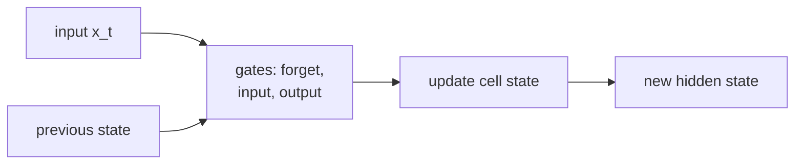

The vanilla RNN multiplies the hidden state by $W_h$ at every step, which either shrinks
gradients exponentially (vanishing) or explodes them. The **Long Short-Term Memory (LSTM)**
introduces a **cell state** $c_t$ that flows through the network with only additive updates --
gradients can travel backward through time without repeated matrix multiplication.

## The LSTM cell

The LSTM (Hochreiter and Schmidhuber, 1997)<FN n="1" /> maintains two vectors per time step:
- $c_t \in \mathbb{R}^m$: the **cell state** (long-term memory).
- $h_t \in \mathbb{R}^m$: the **hidden state** (output passed to the next layer).

Four **gates** control the information flow. All gate activations use the same weight
matrices applied to the concatenated input $[h_{t-1}; x_t] \in \mathbb{R}^{m+d}$:

$$
\begin{aligned}
f_t &= \sigma(W_f [h_{t-1}; x_t] + b_f) & \text{(forget gate)} \\
i_t &= \sigma(W_i [h_{t-1}; x_t] + b_i) & \text{(input gate)} \\
g_t &= \tanh(W_g [h_{t-1}; x_t] + b_g) & \text{(cell candidate)} \\
o_t &= \sigma(W_o [h_{t-1}; x_t] + b_o) & \text{(output gate)}
\end{aligned}
$$

Cell and hidden state updates:

$$
c_t = f_t \odot c_{t-1} + i_t \odot g_t, \qquad h_t = o_t \odot \tanh(c_t).
$$

$\odot$ denotes elementwise multiplication.

## The constant error carousel

The cell update $c_t = f_t \odot c_{t-1} + i_t \odot g_t$ is **additive** in $c_{t-1}$.
The gradient of $c_t$ with respect to $c_{t-1}$ is:

$$
\frac{\partial c_t}{\partial c_{t-1}} = \text{diag}(f_t).
$$

This is a diagonal matrix -- no matrix multiplication through $W_h$. If $f_t \approx 1$
(the gate is open), gradients flow backward unchanged. Hochreiter called this the
**constant error carousel**: errors are "carried" through time at constant scale.

In practice, the forget gate is initialized with a positive bias ($b_f \approx 1$) so that
it starts close to 1, ensuring gradients flow freely at the beginning of training.

## LSTM implementation

```python
import numpy as np

class LSTMCell:
    def __init__(self, d, m, seed=0):
        rng = np.random.default_rng(seed)
        scale = 0.1
        concat_dim = d + m
        # All four gates in one matrix for efficiency
        self.W = rng.normal(0, scale, (4 * m, concat_dim))
        self.b = np.zeros(4 * m)
        self.b[0:m] = 1.0     # forget gate bias init = 1
        self.m = m

    def forward(self, x, h_prev, c_prev):
        """Single LSTM step. Returns (h, c)."""
        m = self.m
        combined = np.concatenate([h_prev, x])
        gates = self.W @ combined + self.b    # (4m,)

        f = self._sigmoid(gates[0    :   m])   # forget
        i = self._sigmoid(gates[m    : 2*m])   # input
        g = np.tanh      (gates[2*m  : 3*m])   # candidate
        o = self._sigmoid(gates[3*m  : 4*m])   # output

        c = f * c_prev + i * g
        h = o * np.tanh(c)
        return h, c, (x, h_prev, c_prev, f, i, g, o, c)

    @staticmethod
    def _sigmoid(x):
        return 1.0 / (1.0 + np.exp(-np.clip(x, -10, 10)))

def run_lstm(cell, xs):
    """xs: (T, d) array. Returns all hidden states (T, m)."""
    m = cell.m
    h, c = np.zeros(m), np.zeros(m)
    hs = []
    for x in xs:
        h, c, _ = cell.forward(x, h, c)
        hs.append(h)
    return np.array(hs)

d, m = 4, 8
cell = LSTMCell(d, m)
xs   = np.random.randn(10, d)  # 10-step sequence
hs   = run_lstm(cell, xs)
print("Hidden states shape:", hs.shape)
print("Last hidden state norm:", np.linalg.norm(hs[-1]))
```

## Gated Recurrent Unit (GRU)

The GRU (Cho et al., 2014)<FN n="2" /> is a simplified LSTM that merges cell and hidden states and
uses two gates instead of four:

$$
\begin{aligned}
r_t &= \sigma(W_r [h_{t-1}; x_t]) & \text{(reset gate)} \\
z_t &= \sigma(W_z [h_{t-1}; x_t]) & \text{(update gate)} \\
\tilde{h}_t &= \tanh(W_h [r_t \odot h_{t-1}; x_t]) & \text{(candidate)} \\
h_t &= (1 - z_t) \odot h_{t-1} + z_t \odot \tilde{h}_t. & \text{(update)}
\end{aligned}
$$

The update gate $z_t$ interpolates between the previous hidden state and the new candidate:
- $z_t \approx 0$: carry the old state forward (remember).
- $z_t \approx 1$: replace with the new candidate (update).

The reset gate $r_t$ modulates how much the previous state influences the candidate.

```python
class GRUCell:
    def __init__(self, d, m, seed=1):
        rng = np.random.default_rng(seed)
        s = 0.1
        cdim = d + m
        self.Wr = rng.normal(0, s, (m, cdim))
        self.Wz = rng.normal(0, s, (m, cdim))
        self.Wh = rng.normal(0, s, (m, cdim))
        self.m  = m

    def forward(self, x, h_prev):
        combined = np.concatenate([h_prev, x])
        r = self._sigmoid(self.Wr @ combined)
        z = self._sigmoid(self.Wz @ combined)
        h_tilde = np.tanh(self.Wh @ np.concatenate([r * h_prev, x]))
        h = (1 - z) * h_prev + z * h_tilde
        return h

    @staticmethod
    def _sigmoid(x):
        return 1.0 / (1.0 + np.exp(-np.clip(x, -10, 10)))

gru = GRUCell(d=4, m=8)
h = np.zeros(8)
for x in xs:
    h = gru.forward(x, h)
print("GRU final hidden norm:", np.linalg.norm(h))
```



## LSTM vs GRU vs vanilla RNN

| | Vanilla RNN | GRU | LSTM |
|--|------------|-----|------|
| Parameters | $d \cdot m + m^2$ | $3(d+m) \cdot m$ | $4(d+m) \cdot m$ |
| Memory | $h_t$ only | $h_t$ only | $h_t$ + $c_t$ |
| Long-range gradients | Vanishes | Good | Excellent |
| Speed | Fastest | Fast | Slower |

## Exercises

**Exercise 1.** Take a one-dimensional LSTM ($m = 1$) at a single step with gate
values $f_t = 0.9$, $i_t = 0.2$, $g_t = 0.5$, $o_t = 0.8$ and previous cell state
$c_{t-1} = 1.0$. Compute $c_t$ and $h_t$ by hand using
$c_t = f_t c_{t-1} + i_t g_t$ and $h_t = o_t \tanh(c_t)$.

<details>
<summary>Solution</summary>

**Step 1.** Update the cell state:
$c_t = 0.9 \cdot 1.0 + 0.2 \cdot 0.5 = 0.9 + 0.1 = 1.0$. The forget gate keeps
$0.9$ of the old cell, the input gate writes $0.1$ of the candidate.

**Step 2.** Squash the cell state: $\tanh(1.0) = 0.7616$.

**Step 3.** Apply the output gate:
$h_t = o_t \tanh(c_t) = 0.8 \cdot 0.7616 = 0.6093$. The hidden state is a gated,
bounded readout of the cell, while the cell itself accumulated additively.

</details>

**Exercise 2.** The gradient of the cell state across one step is
$\partial c_t / \partial c_{t-1} = \mathrm{diag}(f_t)$. Show that the gradient
carried across $T$ steps is $\prod_{k=1}^{T} f_k$ (elementwise), and contrast its
decay with the vanilla RNN's $\prod_k W_h^\top \mathrm{diag}(1 - h_k^2)$.

<details>
<summary>Solution</summary>

**Step 1.** Apply the chain rule along the cell-state path. Because each step
contributes the diagonal factor $\mathrm{diag}(f_k)$,

$$
\frac{\partial c_T}{\partial c_0} = \prod_{k=1}^{T} \mathrm{diag}(f_k) = \mathrm{diag}\!\left(\prod_{k=1}^{T} f_k\right),
$$

a product of diagonal matrices, which is elementwise multiplication of the forget
gates.

**Step 2.** No $W_h$ appears in this product. When $f_k \approx 1$ for all $k$, the
product stays near $1$ and the gradient is preserved across the whole sequence, the
constant error carousel.

**Step 3.** The vanilla RNN instead multiplies by full matrices
$W_h^\top \mathrm{diag}(1 - h_k^2)$ at every step, whose norm shrinks like
$\rho(W_h)^T$ (with the $\tanh$ derivative $1 - h_k^2 < 1$ shrinking it further).
The LSTM replaces that contractive matrix product with a near-identity scalar
product, which is why long-range gradients survive.

</details>

**Exercise 3 (code).** Implement the cell-state gradient path
$\partial c_T / \partial c_0 = \prod_k f_k$ for a constant forget gate, and confirm
that $f = 0.95$ preserves far more gradient over $30$ steps than $f = 0.5$.

<details>
<summary>Solution</summary>

```python
import numpy as np

m, T = 5, 30

def carousel_grad(f_value):
    forgets = np.full((T, m), f_value)   # forget gate at each step
    return np.prod(forgets, axis=0)      # dc_T/dc_0 = elementwise product

g_open = carousel_grad(0.95)             # gate near 1: memory persists
g_half = carousel_grad(0.50)             # gate at 0.5: memory decays fast

assert np.allclose(g_open, 0.95 ** T)    # exact product
assert np.all(g_half < g_open)           # smaller forget gate vanishes faster
print("f=0.95 ->", round(g_open[0], 4),
      "   f=0.50 ->", round(g_half[0], 12))
```

With $f = 0.95$ the surviving gradient is $0.95^{30} \approx 0.215$, while $f = 0.5$
collapses to $0.5^{30} \approx 9.3 \times 10^{-10}$: an open forget gate carries
signal across the sequence, a half-open one destroys it.

</details>

GRU matches LSTM on most benchmarks with fewer parameters; LSTM tends to win on very
long sequences where the separate cell state helps. Both are superseded by Transformers
for most tasks, but appear as components in sequence models and state-space models.

<Footnotes>
  <FNItem n="1">**Hochreiter, S., & Schmidhuber, J.** (1997). "Long short-term memory". *Neural Computation*, 9(8), 1735-1780. [doi:10.1162/neco.1997.9.8.1735](https://doi.org/10.1162/neco.1997.9.8.1735). The cell state and constant error carousel.</FNItem>
  <FNItem n="2">**Cho, K., et al.** (2014). "Learning phrase representations using RNN encoder-decoder for statistical machine translation". *EMNLP*. [arXiv:1406.1078](https://arxiv.org/abs/1406.1078). Introduces the GRU.</FNItem>
</Footnotes>
