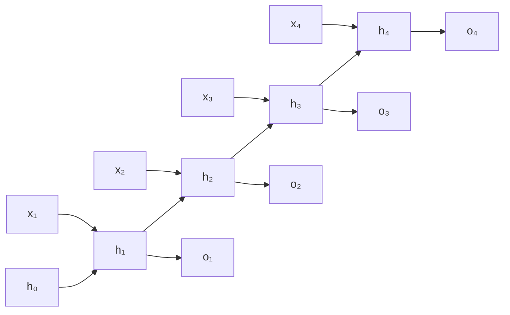

N-gram models fix context length to $n-1$ tokens, discarding everything before that window.
A **Recurrent Neural Network (RNN)** maintains a **hidden state** $h_t$ that summarizes
the entire prefix $x_1, \dots, x_t$ -- in principle, arbitrarily long dependencies are
accessible.

## The RNN recurrence

At each step $t$, the RNN updates its hidden state and produces an output:

$$
h_t = \tanh(W_h h_{t-1} + W_x x_t + b_h), \qquad
o_t = W_o h_t + b_o,
$$

where $x_t \in \mathbb{R}^d$ is the input (word embedding), $h_t \in \mathbb{R}^m$ is the
hidden state, and $o_t \in \mathbb{R}^V$ are unnormalized logits over the vocabulary.

Parameters: $W_h \in \mathbb{R}^{m \times m}$, $W_x \in \mathbb{R}^{m \times d}$,
$W_o \in \mathbb{R}^{V \times m}$, and biases.

## RNN as a language model

Apply softmax to $o_t$ to get $\hat{p}(x_{t+1} \mid x_{\le t})$. The training objective is
cross-entropy on the next token at each position:

$$
\mathcal{L} = -\sum_{t=1}^{T} \log \hat{p}(x_{t+1} \mid x_{\le t}).
$$

The same parameters $W_h, W_x, W_o$ are shared across all time steps -- the RNN "reuses"
itself at every position.

## Unrolling the computational graph

Training requires computing gradients of $\mathcal{L}$ with respect to all parameters.
Unrolling the RNN reveals a chain of $T$ copies of the same computation:



## Backpropagation through time (BPTT)

Apply standard backprop to the unrolled graph. Define
$\delta_t^h = \partial \mathcal{L}/\partial h_t$ as the gradient of the loss with respect
to the hidden state at time $t$.

The gradient flows backward through the recurrence:

$$
\delta_t^h = W_o^\top \frac{\partial \mathcal{L}_t}{\partial o_t} + W_h^\top (\delta_{t+1}^h \odot (1 - h_{t+1}^2)),
$$

where $(1 - h_{t+1}^2)$ is the Jacobian of $\tanh$. The gradient accumulates from the
end of the sequence back to time $t$ by repeatedly multiplying by $W_h^\top$.

## The vanishing-gradient problem

The gradient of the loss at step $T$ with respect to $h_t$ (for $t \ll T$) involves a
product of $T - t$ Jacobians:

$$
\frac{\partial \mathcal{L}_T}{\partial h_t} = \left(\prod_{k=t+1}^{T} W_h^\top \text{diag}(1 - h_k^2)\right) \frac{\partial \mathcal{L}_T}{\partial h_T}.
$$

The spectral radius of $W_h^\top$ and the saturating $\tanh$ derivative interact:

- If the spectral radius $\rho(W_h) < 1$: the product $\to 0$ exponentially. **Gradients
  vanish**, and parameters at early time steps receive near-zero updates. Long-range
  dependencies cannot be learned.
- If $\rho(W_h) > 1$: the product $\to \infty$ exponentially. **Gradients explode**. Fixed
  with gradient clipping: $\nabla \leftarrow \nabla \cdot \min(1, \tau / \|\nabla\|)$.

The vanishing case is the harder structural problem: clipping does not help a gradient of
zero. LSTM and GRU (next lesson) solve this with gated, additive updates.

## Implementation

```python
import numpy as np

class VanillaRNN:
    def __init__(self, V, d, m, seed=0):
        rng = np.random.default_rng(seed)
        scale = 0.1
        self.Wx = rng.normal(0, scale, (m, d))
        self.Wh = rng.normal(0, scale, (m, m))
        self.Wo = rng.normal(0, scale, (V, m))
        self.bh = np.zeros(m)
        self.bo = np.zeros(V)

    def forward(self, xs):
        """xs: list of one-hot vectors (T, V). Returns logits (T, V) and caches."""
        hs, os, caches = [np.zeros(self.Wh.shape[0])], [], []
        for x in xs:
            z  = self.Wh @ hs[-1] + self.Wx @ x + self.bh
            h  = np.tanh(z)
            o  = self.Wo @ h + self.bo
            hs.append(h)
            os.append(o)
            caches.append((x, hs[-2], h, z))
        return np.array(os), caches

    def softmax(self, o):
        e = np.exp(o - o.max())
        return e / e.sum()

def next_token_loss(model, sentence_ids, V):
    xs = np.eye(V)[sentence_ids[:-1]]
    ys = sentence_ids[1:]
    logits, _ = model.forward(xs)
    loss = 0.0
    for t, (logit, y) in enumerate(zip(logits, ys)):
        prob = model.softmax(logit)
        loss -= np.log(prob[y] + 1e-9)
    return loss / len(ys)

# Tiny demo
V, d, m = 8, 4, 6
model = VanillaRNN(V, d, m)
ids   = [0, 1, 2, 3, 2, 1, 0]  # toy token sequence
print(f"Loss: {next_token_loss(model, ids, V):.3f}")
```

Vanilla RNNs are historical: they motivate the gated architectures that actually work.
The next lesson derives LSTM's cell state, which maintains a direct gradient path
over arbitrary lengths.
