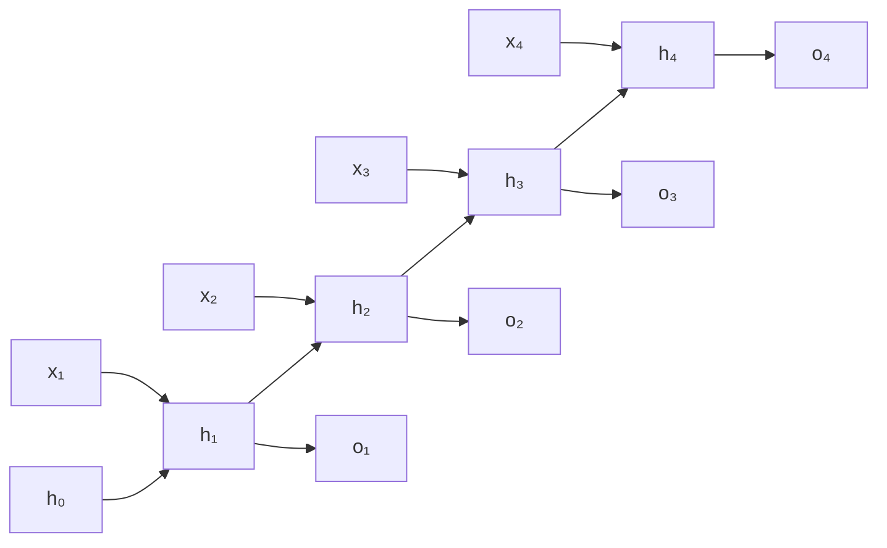

N-gram models fix context length to $n-1$ tokens, discarding everything before that window.
A **Recurrent Neural Network (RNN)** maintains a **hidden state** $h_t$ that summarizes
the entire prefix $x_1, \dots, x_t$ -- in principle, arbitrarily long dependencies are
accessible. The neural language modeling program that RNN-LMs extend begins with Bengio
et al.'s feedforward neural probabilistic LM<FN n="1" />.

## The RNN recurrence

At each step $t$, the RNN updates its hidden state and produces an output:

$$
h_t = \tanh(W_h h_{t-1} + W_x x_t + b_h), \qquad
o_t = W_o h_t + b_o,
$$

where $x_t \in \mathbb{R}^d$ is the input (word embedding), $h_t \in \mathbb{R}^m$ is the
hidden state, and $o_t \in \mathbb{R}^V$ are unnormalized logits over the vocabulary.

Parameters: $W_h \in \mathbb{R}^{m \times m}$, $W_x \in \mathbb{R}^{m \times d}$,
$W_o \in \mathbb{R}^{V \times m}$, and biases.

## RNN as a language model

Apply softmax to $o_t$ to get $\hat{p}(x_{t+1} \mid x_{\le t})$. The training objective is
cross-entropy on the next token at each position:

$$
\mathcal{L} = -\sum_{t=1}^{T} \log \hat{p}(x_{t+1} \mid x_{\le t}).
$$

The same parameters $W_h, W_x, W_o$ are shared across all time steps -- the RNN "reuses"
itself at every position.

## Unrolling the computational graph

Training requires computing gradients of $\mathcal{L}$ with respect to all parameters.
Unrolling the RNN reveals a chain of $T$ copies of the same computation:



## Backpropagation through time (BPTT)

Apply standard backprop to the unrolled graph. Define
$\delta_t^h = \partial \mathcal{L}/\partial h_t$ as the gradient of the loss with respect
to the hidden state at time $t$.

The gradient flows backward through the recurrence:

$$
\delta_t^h = W_o^\top \frac{\partial \mathcal{L}_t}{\partial o_t} + W_h^\top (\delta_{t+1}^h \odot (1 - h_{t+1}^2)),
$$

where $(1 - h_{t+1}^2)$ is the Jacobian of $\tanh$. The gradient accumulates from the
end of the sequence back to time $t$ by repeatedly multiplying by $W_h^\top$.

## The vanishing-gradient problem

The gradient of the loss at step $T$ with respect to $h_t$ (for $t \ll T$) involves a
product of $T - t$ Jacobians:

$$
\frac{\partial \mathcal{L}_T}{\partial h_t} = \left(\prod_{k=t+1}^{T} W_h^\top \text{diag}(1 - h_k^2)\right) \frac{\partial \mathcal{L}_T}{\partial h_T}.
$$

The spectral radius of $W_h^\top$ and the saturating $\tanh$ derivative interact:

- If the spectral radius $\rho(W_h) < 1$: the product $\to 0$ exponentially. **Gradients
  vanish**, and parameters at early time steps receive near-zero updates. Long-range
  dependencies cannot be learned.
- If $\rho(W_h) > 1$: the product $\to \infty$ exponentially. **Gradients explode**. Fixed
  with gradient clipping: $\nabla \leftarrow \nabla \cdot \min(1, \tau / \|\nabla\|)$.

Put numbers on it. The $\tanh$ derivative $1 - h_k^2$ is at most $1$, so the gradient norm
is bounded by $\rho^{\,T-t}$, and the spectral radius alone sets the rate. Span a 50-step
dependency ($t=1$, $T=51$) and watch where the factor lands:

- $\rho = 1.1$ (slightly expansive): $1.1^{50} \approx 117$. Gradients **explode** by two
  orders of magnitude; clipping is needed to keep training stable.
- $\rho = 1.0$ (the boundary): $1.0^{50} = 1$. The gradient is preserved, the only setting
  that carries signal cleanly across 50 steps, and it is measure-zero in practice.
- $\rho = 0.99$ (barely contractive): $0.99^{50} \approx 0.60$. Survivable: the early token
  still feels about $60\%$ of the gradient.
- $\rho = 0.9$: $0.9^{50} \approx 0.0052$. The early token receives half a percent of the
  signal; a 0.1-sized weight update at step 51 reaches step 1 as a $5 \times 10^{-4}$ nudge.

The asymmetry is the point. Exploding gradients are a nuisance with a one-line fix
(clipping), but a vanishing gradient of $0.0052$ is not "explode and rescale": there is
almost no signal left to rescale, and the $\tanh$ saturation only makes it smaller, since
$1 - h_k^2 < 1$ pushes the realistic factor well below $\rho^{\,T-t}$. The vanishing case
is the harder structural problem: clipping does not help a gradient of zero. LSTM and GRU
(next lesson) solve this with gated, additive updates<FN n="2" />.

## Implementation

```python
import numpy as np

class VanillaRNN:
    def __init__(self, V, d, m, seed=0):
        rng = np.random.default_rng(seed)
        scale = 0.1
        self.Wx = rng.normal(0, scale, (m, V))
        self.Wh = rng.normal(0, scale, (m, m))
        self.Wo = rng.normal(0, scale, (V, m))
        self.bh = np.zeros(m)
        self.bo = np.zeros(V)

    def forward(self, xs):
        """xs: list of one-hot vectors (T, V). Returns logits (T, V) and caches."""
        hs, os, caches = [np.zeros(self.Wh.shape[0])], [], []
        for x in xs:
            z  = self.Wh @ hs[-1] + self.Wx @ x + self.bh
            h  = np.tanh(z)
            o  = self.Wo @ h + self.bo
            hs.append(h)
            os.append(o)
            caches.append((x, hs[-2], h, z))
        return np.array(os), caches

    def softmax(self, o):
        e = np.exp(o - o.max())
        return e / e.sum()

def next_token_loss(model, sentence_ids, V):
    xs = np.eye(V)[sentence_ids[:-1]]
    ys = sentence_ids[1:]
    logits, _ = model.forward(xs)
    loss = 0.0
    for t, (logit, y) in enumerate(zip(logits, ys)):
        prob = model.softmax(logit)
        loss -= np.log(prob[y] + 1e-9)
    return loss / len(ys)

# Tiny demo
V, d, m = 8, 4, 6
model = VanillaRNN(V, d, m)
ids   = [0, 1, 2, 3, 2, 1, 0]  # toy token sequence
print(f"Loss: {next_token_loss(model, ids, V):.3f}")
```

## Exercises

**Exercise 1.** A language model assigns probabilities $0.5$, $0.25$, $0.1$ to the
three actual next tokens of a sequence. Compute the average cross-entropy loss (in
nats) and the per-token **perplexity** $\mathrm{PP} = e^{\mathcal{L}}$ by hand.

<details>
<summary>Solution</summary>

**Step 1.** The cross-entropy on each token is $-\log p$. The three negative
log-probabilities (natural log) are $-\log 0.5 = 0.6931$,
$-\log 0.25 = 1.3863$, $-\log 0.1 = 2.3026$.

**Step 2.** Average over the three tokens:

$$
\mathcal{L} = \frac{0.6931 + 1.3863 + 2.3026}{3} = \frac{4.3820}{3} = 1.4607 \text{ nats}.
$$

**Step 3.** Exponentiate to get perplexity:
$\mathrm{PP} = e^{1.4607} = 4.31$. Perplexity reads as the effective branching
factor: this model is as uncertain as a uniform choice among about $4.3$ equally
likely tokens at each step.

</details>

**Exercise 2.** Using the bound $\|\partial \mathcal{L}_T / \partial h_t\| \le
\rho^{\,T-t}$ from the vanishing-gradient analysis, compute the factor $\rho^{\,T-t}$
for a $20$-step dependency ($T - t = 20$) at $\rho = 0.8$ and at $\rho = 1.05$, and
say which case clipping addresses.

<details>
<summary>Solution</summary>

**Step 1.** Contractive case $\rho = 0.8$: $0.8^{20} = 0.0115$. The early token
receives about $1.15\%$ of the gradient signal; this is the vanishing case, and
clipping does nothing for it because there is almost no signal to rescale.

**Step 2.** Expansive case $\rho = 1.05$: $1.05^{20} = 2.653$. The gradient grows
by a factor of about $2.65$ over $20$ steps; this is the exploding case, which
gradient clipping $\nabla \leftarrow \nabla \cdot \min(1, \tau / \|\nabla\|)$ caps
directly.

**Step 3.** Clipping addresses only the $\rho > 1$ (exploding) case. The $\rho < 1$
vanishing case is the harder structural problem, the one LSTM and GRU solve with
additive gated updates.

</details>

**Exercise 3 (code).** The vanishing/exploding behavior comes from the repeated
factor $W_h^\top$. For a diagonal $W_h$ with every diagonal entry equal to $\rho$,
verify that the gradient-norm ratio after $50$ steps equals $\rho^{50}$ exactly, and
that it is monotone increasing in $\rho$.

<details>
<summary>Solution</summary>

```python
import numpy as np

m, n = 4, 50
ratios = []
for rho in [0.9, 1.0, 1.1]:
    W = np.diag(np.full(m, rho))          # spectral radius = rho
    g = np.ones(m)                        # incoming gradient at step T
    prop = np.linalg.matrix_power(W.T, n) @ g
    ratios.append(np.linalg.norm(prop) / np.linalg.norm(g))

assert np.isclose(ratios[0], 0.9 ** 50)   # 0.00515: vanishes
assert np.isclose(ratios[1], 1.0)         # boundary: preserved
assert ratios[0] < ratios[1] < ratios[2]  # monotone in rho
print("ratios:", [round(r, 4) for r in ratios])
```

The ratio is $0.9^{50} \approx 0.0052$ when contractive, exactly $1$ at the
boundary, and $1.1^{50} \approx 117$ when expansive, matching the closed-form factor
and confirming the exponential dependence on the spectral radius.

</details>

Vanilla RNNs are historical: they motivate the gated architectures that actually work.
The next lesson derives LSTM's cell state, which maintains a direct gradient path
over arbitrary lengths.

<Footnotes>
  <FNItem n="1">**Bengio, Y., Ducharme, R., Vincent, P., & Jauvin, C.** (2003). "A neural probabilistic language model". *JMLR*, 3, 1137-1155. The feedforward neural LM that distributed word representations grew from.</FNItem>
  <FNItem n="2">**Hochreiter, S., & Schmidhuber, J.** (1997). "Long short-term memory". *Neural Computation*, 9(8), 1735-1780. [doi:10.1162/neco.1997.9.8.1735](https://doi.org/10.1162/neco.1997.9.8.1735). Analyzes the vanishing gradient and introduces the gated fix.</FNItem>
</Footnotes>
