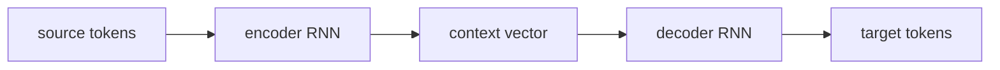

Language generation tasks -- translation, summarization, question answering -- require
mapping a variable-length input sequence to a variable-length output sequence. The
**sequence-to-sequence (seq2seq)** framework (Sutskever et al., 2014<FN n="1" />; Cho et al., 2014<FN n="2" />)
achieves this by pairing an **encoder** that reads the input with a **decoder** that
generates the output one token at a time.

## Encoder-decoder architecture

**Encoder:** an RNN (or LSTM) reads the source sequence $x_1, \dots, x_S$ and produces
a sequence of hidden states $\{h_1^e, \dots, h_S^e\}$ and a final state $h_S^e$.

**Context vector:** the basic seq2seq model passes only the encoder's final hidden state
$c = h_S^e$ to the decoder. This single vector must compress the entire source.

**Decoder:** an RNN initialized with $c$ generates the target sequence $y_1, \dots, y_T$
auto-regressively:

$$
s_t = f(s_{t-1}, y_{t-1}, c), \qquad
p(y_t \mid y_{<t}, \mathbf{x}) = \text{softmax}(W_o s_t).
$$

**Training:** teacher forcing -- feed the gold target token $y_{t-1}$ at each step, not
the model's own prediction.

## The bottleneck problem

Compressing an entire source sentence into a single fixed-size vector $c$ is a bottleneck:
longer sequences are harder to compress, and the gradient must flow through the entire
decoder and back through the entire encoder. For sentences longer than ~30 tokens, BLEU
scores drop sharply.

## Bahdanau attention

**Bahdanau et al. (2015)** replace the fixed context vector with a dynamic one: at each
decoding step $t$, the decoder looks at all encoder hidden states and **attends** to the
most relevant ones.

**Alignment scores:** for each encoder position $j$, compute a scalar score
$e_{tj}$ measuring how relevant $h_j^e$ is to the current decoder state $s_{t-1}$:

$$
e_{tj} = v_a^\top \tanh(W_s s_{t-1} + W_h h_j^e),
$$

where $v_a$, $W_s$, $W_h$ are learned parameters. This is called **additive** (or MLP)
attention.

**Attention weights:** normalize scores to a probability distribution:

$$
\alpha_{tj} = \frac{\exp(e_{tj})}{\sum_{k=1}^{S} \exp(e_{tk})}.
$$

**Context vector:** a weighted sum of encoder states:

$$
c_t = \sum_{j=1}^{S} \alpha_{tj} h_j^e.
$$

**Decoder step:** update with the dynamic context:

$$
s_t = f(s_{t-1}, y_{t-1}, c_t).
$$

The $S \times T$ matrix $\alpha_{tj}$ is the **attention matrix**: it shows which source
positions the decoder focuses on when generating each target token. For translation, this
matrix is nearly diagonal for similar-word-order languages and shows the alignment.

A contrasting pair makes the role of the weights concrete. Take three encoder states
$h_1 = (1,0)$, $h_2 = (0,1)$, $h_3 = (1,1)$ and two alignment-score vectors over them.
The softmax converts each into a weight row, and the context is its weighted sum:

- **Peaked alignment** $e = (0.2, 3.0, 0.1)$ softmaxes to $\alpha \approx (0.054, 0.896,
  0.049)$, almost all mass on position 2, so $c \approx 0.896\,h_2 \approx (0.10, 0.95)$.
  The decoder reads source position 2 and largely ignores the rest.
- **Flat alignment** $e = (0.2, 0.3, 0.1)$ softmaxes to $\alpha \approx (0.332, 0.367,
  0.301)$, near the uniform $1/3$, so $c \approx (0.63, 0.67)$, a blur of all three states.

Same encoder states, same softmax; only the score *spread* differs, and it decides whether
the context is one sharply selected source vector or an averaged smear. A trained model
learns to produce peaked rows that align target words to their source counterparts; with
the random untrained states in the block below, the rows come out near-uniform (every
weight close to $1/5 = 0.2$), which is the flat case before any alignment has been learned.

## Implementation

```python
import numpy as np

def softmax(x):
    e = np.exp(x - x.max())
    return e / e.sum()

class BahdanauAttention:
    def __init__(self, enc_dim, dec_dim, attn_dim, seed=0):
        rng = np.random.default_rng(seed)
        s = 0.1
        self.Ws = rng.normal(0, s, (attn_dim, dec_dim))
        self.Wh = rng.normal(0, s, (attn_dim, enc_dim))
        self.va = rng.normal(0, s, attn_dim)

    def score(self, s_prev, h_enc):
        """s_prev: (dec_dim,), h_enc: (S, enc_dim). Returns (S,) attention weights."""
        energy = np.tanh(
            (self.Ws @ s_prev)[None, :] + h_enc @ self.Wh.T  # (S, attn_dim)
        ) @ self.va                                             # (S,)
        return softmax(energy)

    def context(self, s_prev, h_enc):
        alpha = self.score(s_prev, h_enc)
        return alpha @ h_enc, alpha   # (enc_dim,), (S,)

# Toy seq2seq: encode 5 tokens, decode 4 tokens
S, T, enc_dim, dec_dim, attn_dim = 5, 4, 8, 8, 6
rng = np.random.default_rng(1)

# Random encoder hidden states (normally from a real LSTM)
h_enc = rng.normal(0, 1, (S, enc_dim))

attn   = BahdanauAttention(enc_dim, dec_dim, attn_dim)
alphas = np.zeros((T, S))
s      = rng.normal(0, 1, dec_dim)  # initial decoder state

for t in range(T):
    c, alpha = attn.context(s, h_enc)
    alphas[t] = alpha
    # Normally: s = decoder_lstm_step(s, c, y_{t-1})
    s = rng.normal(0, 1, dec_dim)   # placeholder

# Print attention matrix
print("Attention matrix (rows=decoder steps, cols=encoder positions):")
print(np.round(alphas, 3))
print("\nEach row sums to:", alphas.sum(axis=1).round(4))
```



## Why attention matters

1. **Removes the bottleneck:** the decoder can access any encoder state directly, not just
   the final one.
2. **Provides interpretability:** the attention matrix aligns source and target tokens,
   useful for debugging and for semi-supervised alignment learning.
3. **Enables longer sequences:** BLEU on long translations improved dramatically.
4. **Inspired self-attention:** in the Transformer, queries, keys, and values all come from
   the same sequence. Bahdanau attention between encoder and decoder becomes **cross-attention** in the Transformer decoder.

## Exercises

**Exercise 1.** Three encoder states $h_1 = (1, 0)$, $h_2 = (0, 1)$, $h_3 = (1, 1)$
receive alignment scores $e = (1.0, 2.0, 0.0)$. Compute the attention weights
$\alpha = \mathrm{softmax}(e)$ and the context vector
$c = \sum_j \alpha_j h_j$ by hand.

<details>
<summary>Solution</summary>

**Step 1.** Exponentiate the scores: $e^{1.0} = 2.7183$, $e^{2.0} = 7.3891$,
$e^{0.0} = 1.0$. The normalizer is $Z = 2.7183 + 7.3891 + 1.0 = 11.1074$.

**Step 2.** Divide each by $Z$:

$$
\alpha = \left(\tfrac{2.7183}{11.1074}, \tfrac{7.3891}{11.1074}, \tfrac{1.0}{11.1074}\right) = (0.2447,\ 0.6652,\ 0.0900),
$$

which sums to $1$ as a probability distribution must.

**Step 3.** Take the weighted sum of the encoder states:

$$
c = 0.2447\,(1,0) + 0.6652\,(0,1) + 0.0900\,(1,1) = (0.3348,\ 0.7553).
$$

Most mass sits on $h_2$, so the context leans toward its $(0,1)$ direction; this is
the source position the decoder attends to most at this step.

</details>

**Exercise 2.** The bottleneck of basic seq2seq is one fixed-size context vector
$c = h_S^e$. Argue, using the additive attention equations
$e_{tj} = v_a^\top \tanh(W_s s_{t-1} + W_h h_j^e)$ and
$c_t = \sum_j \alpha_{tj} h_j^e$, why attention removes this bottleneck and why the
gradient to early encoder states is shorter.

<details>
<summary>Solution</summary>

**Step 1.** In basic seq2seq the only path from the source to decoder step $t$ runs
through the single vector $c = h_S^e$, so every source token must be compressed into
$h_S^e$ and re-extracted; capacity is fixed regardless of source length.

**Step 2.** With attention, $c_t = \sum_{j=1}^{S} \alpha_{tj} h_j^e$ is a direct
weighted sum over all encoder states. Each $h_j^e$ contributes to $c_t$ with weight
$\alpha_{tj}$, so the decoder reads any source position directly rather than through
a single summary.

**Step 3.** The gradient $\partial c_t / \partial h_j^e$ includes the term
$\alpha_{tj} I$, a direct edge from the loss at step $t$ to encoder state $j$. This
path does not traverse the $S - j$ encoder recurrence steps, so it avoids the
repeated $W_h$ multiplications that shrink the gradient, shortening the route to
early source tokens.

</details>

**Exercise 3 (code).** Compute softmax attention over $5$ encoder positions for a
peaked score vector and a flat one. Verify each weight row sums to $1$, that the
peaked row concentrates more than $90\%$ of its mass on one position, and that its
context vector lands near that position's encoder state.

<details>
<summary>Solution</summary>

```python
import numpy as np

def softmax(x):
    e = np.exp(x - x.max())
    return e / e.sum()

rng = np.random.default_rng(0)
S = 5
h_enc = rng.normal(0, 1, (S, 3))         # encoder states

e_peak = np.array([0.1, 0.1, 4.0, 0.1, 0.1])   # strongly favors position 2
e_flat = np.array([0.1, 0.2, 0.15, 0.1, 0.05])  # nearly uniform
a_peak = softmax(e_peak)
a_flat = softmax(e_flat)

assert np.isclose(a_peak.sum(), 1.0)
assert np.isclose(a_flat.sum(), 1.0)
assert a_peak.max() > 0.9                 # peaked row concentrates mass
assert a_peak.max() > a_flat.max()        # flatter row spreads it out

c_peak = a_peak @ h_enc                    # context for the peaked row
assert np.linalg.norm(c_peak - h_enc[2]) < 0.3   # close to the attended state
print("peak max:", round(a_peak.max(), 4),
      " flat max:", round(a_flat.max(), 4))
```

The peaked row puts $0.925$ of its weight on position $2$, so its context is within
$0.2$ of $h_2$; the flat row spreads weight near $1/5 = 0.2$ each and produces a blur
of all five states. Only the score spread differs.

</details>

The next subsection builds the full Transformer by replacing RNNs with self-attention,
making the sequence-parallel computation that enables training at LLM scale.

<Footnotes>
  <FNItem n="1">**Sutskever, I., Vinyals, O., & Le, Q. V.** (2014). "Sequence to sequence learning with neural networks". *NeurIPS*. [arXiv:1409.3215](https://arxiv.org/abs/1409.3215). The LSTM encoder-decoder.</FNItem>
  <FNItem n="2">**Cho, K., et al.** (2014). "Learning phrase representations using RNN encoder-decoder for statistical machine translation". *EMNLP*. [arXiv:1406.1078](https://arxiv.org/abs/1406.1078). The RNN encoder-decoder and context vector.</FNItem>
</Footnotes>
