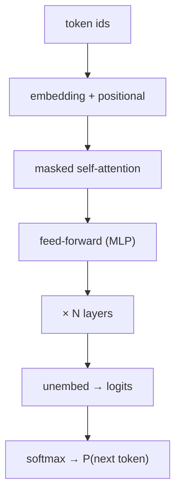

A decoder-only language model maps a sequence of token ids to a distribution
over the next token. Strip away the engineering and three operations remain:
embed tokens into vectors, mix those vectors across positions with masked
self-attention, and project the result back to vocabulary logits. Everything
GPT-style models add (more layers, more heads, better positional encodings) is
a refinement of this skeleton.



## Self-attention is a soft lookup

Each position produces a query $q$, a key $k$, and a value $v$ by linear
projection of its hidden state. The output at a position is a weighted average
of all value vectors, where the weights come from how well that position's
query matches each key:

$$ \mathrm{attn}(Q, K, V) = \mathrm{softmax}\!\left( \frac{Q K^\top}{\sqrt{d_k}} \right) V. $$

The scaling by $\sqrt{d_k}$ keeps the dot products from growing with dimension
and pushing the softmax into a near one-hot regime where gradients vanish. In a
decoder the softmax is masked: position $i$ may only attend to positions $j \le
i$, so the model cannot read the future it is trying to predict.

## Causal masking

The mask adds $-\infty$ to the upper triangle of the score matrix before the
softmax, sending those weights to zero. The result is that row $i$ of the
attention matrix is a distribution over positions $0 \dots i$ only.

## Compute one head

A single head on a short sequence shows the shapes and the masking. The output
rows are convex combinations of the value rows, and the first row attends only
to itself.

```python
import numpy as np

def softmax(z, axis=-1):
    z = z - z.max(axis=axis, keepdims=True)
    e = np.exp(z)
    return e / e.sum(axis=axis, keepdims=True)

rng = np.random.default_rng(0)
T, d = 4, 8                      # sequence length, head dim
Q = rng.normal(size=(T, d))
K = rng.normal(size=(T, d))
V = rng.normal(size=(T, d))

scores = Q @ K.T / np.sqrt(d)    # (T, T)
mask = np.triu(np.ones((T, T)), k=1).astype(bool)
scores[mask] = -np.inf           # causal: no attending to the future

A = softmax(scores, axis=-1)
out = A @ V                      # (T, d)

print("attention row sums:", A.sum(axis=1).round(3))   # all 1.0
print("row 0 weights:", A[0].round(3))                 # mass only on position 0
print("output shape:", out.shape)
```

In production this runs with multiple heads in parallel, a KV cache so previous
keys and values are not recomputed during generation, and a positional scheme
such as RoPE folded into $Q$ and $K$. Those are covered in E4 and E5; the
operation above is the part that does the reasoning.
