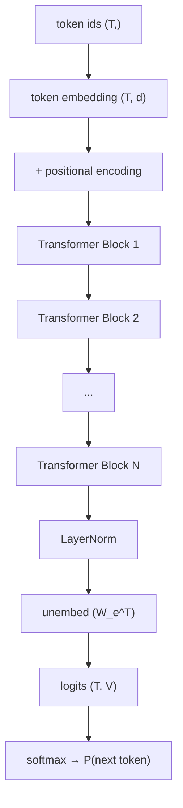

The Transformer was originally designed with both an encoder and a decoder for
machine translation. **Decoder-only** models (the GPT family) discard the encoder entirely:
$N$ stacked transformer blocks with causal masking, optimized by next-token prediction on
text. This minimal design has become the dominant architecture for large language models<FN n="1" />.

## Architecture overview



Three phases:

1. **Embed:** token ids $\to$ $d$-dimensional embeddings via $W_e \in \mathbb{R}^{V \times d}$.
   Add positional encodings.
2. **Transform:** $N$ identical blocks, each with pre-norm, causal self-attention, and FFN.
3. **Unembed:** final LayerNorm, then project to logits:
   $\ell = h_{\text{final}} W_e^\top$, where the embedding matrix $W_e$ is typically
   **weight-tied** to the output projection (halves parameter count).

## Causal masking

Every layer uses a causal (lower-triangular) attention mask: position $t$ attends only to
positions $j \le t$. This ensures the model cannot "see" future tokens when predicting
the next one, making the next-token prediction objective valid.

In practice, attention is implemented with full $T \times T$ matrices and the upper triangle
is set to $-\infty$ before softmax (as in the self-attention lesson), not with sparse
indexing.

## GPT-2 parameter count

GPT-2 small: $d = 768$, $h = 12$ heads, $d_{\text{ff}} = 3072$, $N = 12$ blocks, $V = 50257$.

| Component | Formula | Count |
|-----------|---------|-------|
| Token embedding $W_e$ | $V \times d$ | $38.6$M |
| Positional embedding | $T_{\max} \times d = 1024 \times 768$ | $0.79$M |
| Per-block attention ($Q,K,V,O$) | $4 d^2$ | $2.36$M |
| Per-block FFN | $2 d \cdot d_{\text{ff}} + \text{biases}$ | $4.72$M |
| Per-block LN ($\times 2$) | $4d$ | negligible |
| **Total per block** | | $7.08$M |
| **12 blocks** | | $85.0$M |
| **Total (weight-tied output)** | | $\approx 117$M |

The embedding matrix dominates for small vocab; the FFN blocks dominate for large $d$.

## Training objective

Next-token prediction (causal language modeling):

$$
\mathcal{L} = -\frac{1}{T} \sum_{t=1}^{T} \log p(x_t \mid x_1, \dots, x_{t-1}; \theta).
$$

Every token in a sequence is a training target simultaneously (unlike RNNs, which must
compute one forward pass per position serially). This parallelism is why Transformers
replaced RNNs for large-scale pretraining.

## Forward pass in numpy

```python
import numpy as np

def softmax(x, axis=-1):
    e = np.exp(x - x.max(axis=axis, keepdims=True))
    return e / e.sum(axis=axis, keepdims=True)

def layer_norm(x, g, b, eps=1e-5):
    mu = x.mean(-1, keepdims=True)
    std = x.std(-1, keepdims=True)
    return g * (x - mu) / (std + eps) + b

def causal_attention(Q, K, V):
    T, dk = Q.shape
    scores = Q @ K.T / np.sqrt(dk)
    mask   = np.triu(np.ones((T, T)), k=1).astype(bool)
    scores[mask] = -1e9
    return softmax(scores) @ V

class TinyGPT:
    def __init__(self, V, d, n_heads, d_ff, n_layers, T_max, seed=0):
        rng = np.random.default_rng(seed)
        s = 0.02
        self.We = rng.normal(0, s, (V, d))
        self.Wp = rng.normal(0, s, (T_max, d))
        self.layers = []
        for _ in range(n_layers):
            self.layers.append({
                "Wq": rng.normal(0, s, (d, d)),
                "Wk": rng.normal(0, s, (d, d)),
                "Wv": rng.normal(0, s, (d, d)),
                "Wo": rng.normal(0, s, (d, d)),
                "W1": rng.normal(0, s, (d_ff, d)),
                "W2": rng.normal(0, s, (d, d_ff)),
                "g1": np.ones(d), "b1": np.zeros(d),
                "g2": np.ones(d), "b2": np.zeros(d),
            })
        self.gf = np.ones(d); self.bf = np.zeros(d)
        self.d, self.n_heads = d, n_heads

    def forward(self, ids):
        T = len(ids)
        x = self.We[ids] + self.Wp[:T]    # (T, d)
        h = self.d // self.n_heads
        for layer in self.layers:
            # Pre-norm attention
            xn = layer_norm(x, layer["g1"], layer["b1"])
            Q = xn @ layer["Wq"]; K = xn @ layer["Wk"]; V = xn @ layer["Wv"]
            # Multi-head (simplified: single head for readability)
            attn_out = causal_attention(Q, K, V) @ layer["Wo"]
            x = x + attn_out
            # Pre-norm FFN
            xn = layer_norm(x, layer["g2"], layer["b2"])
            ff = np.maximum(0, xn @ layer["W1"].T) @ layer["W2"].T
            x = x + ff
        x = layer_norm(x, self.gf, self.bf)
        return x @ self.We.T   # (T, V) logits (weight-tied)

    def loss(self, ids):
        logits = self.forward(ids[:-1])
        targets = ids[1:]
        log_probs = np.log(softmax(logits))
        return -log_probs[np.arange(len(targets)), targets].mean()

V, d, h, dff, L, Tmax = 100, 32, 4, 128, 2, 64
model = TinyGPT(V, d, h, dff, L, Tmax)
ids   = np.array([5, 12, 3, 99, 44, 7])
print(f"Loss: {model.loss(ids):.4f}  (random init ≈ {np.log(V):.4f})")
```

Untrained, the loss should be close to $\log V$ (uniform over the vocabulary).

## GPT family progression

| Model | $d$ | $N$ | $V$ | Params | Training tokens |
|-------|-----|-----|-----|--------|----------------|
| GPT-2 (small) | 768 | 12 | 50K | 117M | 40B |
| GPT-3 | 12,288 | 96 | 50K | 175B | 300B |
| LLaMA-2 70B | 8,192 | 80 | 32K | 70B | 2T |
| LLaMA-3 70B | 8,192 | 80 | 128K | 70B | 15T |

The architecture is nearly identical across the family; gains come from scale (parameters
and tokens) and improved data quality. The next lesson introduces encoder-only transformers
(BERT) which use bidirectional attention for understanding tasks rather than generation.

<Footnotes>
  <FNItem n="1">**Radford, A., Wu, J., Child, R., Luan, D., Amodei, D., & Sutskever, I.**
    (2019). "Language models are unsupervised multitask learners (GPT-2)". *OpenAI*.</FNItem>
</Footnotes>
